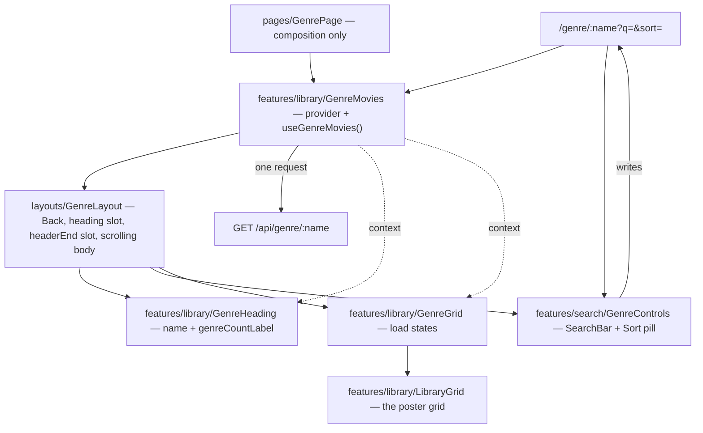

## Problem Statement

Every **Genre row** on the **Browse home** ends in a promise: _"View all 214 →"_.
Pressing it lands on `<h1>Action</h1>` and one line of prose — "Every movie in this
genre lands here." Nothing lands there. `/genre/:name` has been a registered
**placeholder route** since `03-card-carousel`, and it is the last dead end in the
browse-and-discover flow.

That matters more than a missing screen usually would, because a row is capped at
15 cards. A genre holding 214 movies shows fifteen of them and points at the other
199 with a control that goes nowhere. The cap was always deliberate — `HOME_ROW_LIMIT`
exists so the home paints fast — but it was only ever defensible because "View all"
was going to be real. Right now the honest description of the browse home is that
199 of those movies are unreachable by any route in the app: not by scrolling, not
by **Search text** (a search narrows the rows, it does not uncap them), not by any
**Filter dropdown**. They are in the database, they are counted in the row header,
and there is no screen that will show them.

`COMPONENT-SPEC.md:388` specs the screen as **"genre header (SearchBar + Sort
FilterDropdown) + `LibraryGrid`"**, and `page.GenrePage.dc.html` draws it: a Back
pill, the genre name over a count line, a 250px search box, a Sort pill, and a
responsive poster grid. `LibraryGrid` is the one feature in the entire component
spec with no implementation at all — the **Library grid** is, literally, the
unbuilt half of "View all".

Four things make this more than dropping a grid behind a route.

**The header needs data the body loads.** The count line is not a constant. It reads
`shown === all ? "{all} titles" : "{shown} of {all} titles"` (`FamilyFlix.dc.html:490`),
where `shown` is the filtered result and `all` is the **Genre total**. So the header
cannot render until the body's request comes back, and the two are different subtrees:
the header sits in a fixed bar, the grid in a scrolling one. This is the same split
`05-search-filter` hit between `MainLayout`'s header and `HomeRows` — one rung lower,
and this time the header needs the payload rather than just the query.

**No endpoint returns a list and its unfiltered total together.** `GET /api/movies`
returns a bare `Movie[]` and parses only `sort` / `genre` / `limit`. Asking for the
count as well means a second request to `/api/genres`, which is exactly the fan-out
`getHome` was built to avoid — and it would force `features/library` to import
`features/search`'s `useGenreList`, coupling two features so one screen can print a
number.

**The prototype's screens share one state tree, and ours do not.** `sortList()` is
called by both `filteredSorted()` and `genrePageMovies()` (`:317–320`), so the
**Sort order** carries from the home to the genre page for free. Our query lives in
the URL, and `/genre/Action` is a different URL from `/`. Left alone, pressing
"View all" on a library sorted A–Z would silently drop it back to Recently Added —
a visible regression, produced by nothing more than a route change.

**The prototype applies a filter it does not show.** `genrePageMovies()` calls
`passRating(m)` (`:320`) while the genre header has no rating pill anywhere on it.
Ported literally, a **Minimum rating** chosen on the home would keep narrowing a
screen with no control to see it or clear it.

There is also a docs correction riding along. **Sort is not an unbuilt feature.**
`05-search-filter` Q1 ruled it in scope and shipped it: `MOVIE_SORTS` / `MovieSort` /
`DEFAULT_MOVIE_SORT`, all five `ORDER BY` bodies, `?sort=` on `/api/home` and
`/api/movies`, `setSort` in `useLibraryQuery`, and the Sort pill itself (issue #35,
refactored under #41). Commit `813b546` reverted the README row on the premise that
"Sort is its own feature and has not been started", which contradicts both
`05-search-filter.md:47` and the shipped, tested code.

## Solution

Translate `page.GenrePage.dc.html` into the codebase 1:1: a real `/genre/:name`
screen showing **every** movie in one **Genre** as an uncapped **Library grid**,
under a **Genre header** carrying Back, the genre name, its **Genre count label**,
a **Search bar** and the Sort **Filter dropdown**.

**One request answers the whole screen.** A new aggregate, `GET /api/genre/:name`,
returns `GenrePayload { genre, total, movies }` — the genre's **unfiltered** total
beside the narrowed list. `total` comes from `listGenres()`, which is the same number
"View all 214" promised, so "12 of 214 titles" stays honest while a search narrows
the grid. It is a composition of the two browse queries the repository already has:
no new SQL, no new repository primitive. `GET /api/movies` is kept — it is the generic
browse API the CSV exporter will want — but its comment claiming it is "for the genre
page" stops being true and is corrected.

**The query lives in the URL**, as it does on the home: `/genre/:name?q=&sort=`. The
genre travels in the **path**, not as a parameter — it is not a filter here, it is
which screen this is, and every "View all" link and `App.tsx` already spell it that
way. Nothing is held in component state, so Back out of a movie lands on the narrowed
grid with its scroll offset intact.

**The genre page gets its own parser.** `parseGenreQuery` / `toGenreQueryParams` read
and write two parameters, sharing `isMovieSort` with their library-query siblings and
carrying the same round-trip property test. Reusing `parseLibraryQuery` and ignoring
two of its four parameters would build a parser that accepts what its screen cannot
show — which is precisely the bug the rating filter would be.

**The Sort order carries; the Search text does not.** `HomeRows` builds
`/genre/Action?sort=a-z`, omitted at the default, so the order survives the route
change through the link rather than through hidden global state. The search box starts
empty and is relabelled "Search in {genre}" — the prototype clears `genreSearch` on
entry (`:307`), because this is a fresh, narrower search.

**The rating filter does not apply at all.** A deliberate deviation from the
prototype's _behavior_, not its surface, and one `parseLibraryQuery` already wrote the
rule for: "a hand-edited `?rating=7` can never narrow the library behind a pill still
saying 'All ratings' — the URL and the screen must agree." Reproduce the surface;
never port a filter with no control.

**The header/body split is solved with a feature-local context.** `GenreMovies`
exports a `GenreMoviesProvider` that owns the one fetch, the status machine, `retry`
and the optimistic `toggleFavorite`, plus a `useGenreMovies()` hook that the heading
and the grid both read. Calling a hook in both subtrees would mean two requests;
lifting it into `GenrePage` would put data logic in a page.

**The chrome is a second layout.** `GenreLayout` — Back pill, `heading` slot,
`headerEnd` slot, scrolling body with `useRestoredScroll`. The genre header shares
nothing with `MainLayout` (no logo, no gear), and `COMPONENT-SPEC.md:398` says each
page owns its header. Back is `navigate(-1)` with a `/` fallback on a deep link,
extracted from `MoviePage` into `useGoBack` now that there are two consumers — not the
prototype's `goBrowse()`, which discards the home's filters _and_ its restored scroll.

**Two extractions keep single copies of shared behaviour.** The 250ms debounce moves
out of `LibrarySearch` into `useSettledText` and is used by both search boxes —
`LibrarySearch`'s docblock claims the debounce "lives here and nowhere else", and the
extraction is what keeps that sentence true. `useGoBack` does the same for the Back
rule. Both switch their existing call sites over in the same phase.

**One prototype amendment.** The count label is singularised — "1 title", not the
prototype's "1 titles" (`:490`). That is a copy bug rather than a design choice, so
per CLAUDE.md the prototype is amended first (`page.GenrePage.dc.html` and
`FamilyFlix.dc.html`) and the build follows the amended prototype. It is the only
amendment this feature needs.

**And Sort is ticked ✅** in README.md and CLAUDE.md, in its own docs commit correcting
`813b546`'s premise. It clears the feature-done-only-after-refactor bar twice: #35
built it, #41 refactored it, both closed.

## User Stories

### Getting there and back

1. As a parent, I want "View all 214" to open a screen showing all 214 movies, so that
   the promise the row makes is one the app keeps.
2. As a parent, I want every movie in the genre on that screen with no cap, so that the
   199 titles a 15-card row hides are reachable somewhere.
3. As a parent, I want the genre's name in large type at the top, so that I can see at a
   glance which shelf I am standing in front of.
4. As a parent, I want a Back pill in the header, so that leaving is one obvious control
   rather than a browser gesture I have to know about.
5. As a parent, I want Back to return me to the browse home exactly as I left it — same
   filters, same sort, same scroll position — so that browsing feels like stepping back
   rather than starting over.
6. As a parent who opened a genre link directly with no history behind it, I want Back to
   take me to the home screen anyway, so that the control is never a dead button.
7. As a parent, I want a movie's poster card to open its detail page, so that the genre
   page behaves like every other grid of cards in the app.
8. As a parent, I want Back from a movie's detail page to land on the genre grid where I
   left it — same search, same sort, same scroll — so that browsing a long genre is not
   punished by looking at something.
9. As a maintainer, I want the genre name encoded into the path and decoded out of it, so
   that "Science Fiction" survives the round-trip.

### The count line

10. As a parent, I want the count line to read "214 titles" when nothing is narrowing the
    grid, so that I know the size of what I am looking at.
11. As a parent who has typed a search, I want it to read "12 of 214 titles", so that I can
    see both what matched and how much I am not being shown.
12. As a parent, I want that total to be the genre's real total rather than the filtered
    number, so that it agrees with the "View all 214" I just pressed.
13. As a parent looking at a genre holding exactly one movie, I want "1 title" rather than
    "1 titles", so that the app reads like it was written by a person.
14. As a maintainer, I want the count label to be a pure, separately tested function, so
    that its four cases (all / narrowed / singular / zero) are pinned down without
    rendering a screen.

### Searching within a genre

15. As a parent, I want a search box in the genre header, so that I can find a title inside
    a long shelf without scrolling it.
16. As a parent, I want that box labelled "Search in Action", so that it is obvious the
    search is scoped to this genre and not the whole library.
17. As a parent, I want the box to start empty when I arrive, so that a search I ran on the
    home screen does not silently narrow a shelf I just opened.
18. As a parent, I want the grid to follow my typing shortly after I stop, not on every
    keystroke, so that the screen is not thrashing while I type.
19. As a parent, I want the box to keep up with my typing instantly even though the results
    lag slightly, so that the field never feels broken.
20. As a parent, I want clearing the box to bring the whole genre back, so that undoing a
    search is one gesture.
21. As a parent, I want a search to match a movie's title or its synopsis, so that "the one
    about the lighthouse" is findable.
22. As a maintainer, I want the search to reuse the existing `listMovies` search arm
    unchanged, so that "search" means the same thing on every screen.

### Sorting

23. As a parent, I want a Sort pill in the genre header offering the same five orders as the
    home screen, so that I do not have to learn a second vocabulary.
24. As a parent who sorted the home A–Z and then pressed "View all", I want the genre page to
    open A–Z, so that a route change never silently re-shuffles my library.
25. As a parent browsing in the default order, I want the "View all" link to stay a clean URL
    with no query string, so that a link I copy is the plain genre page.
26. As a parent, I want choosing a new sort on the genre page to reorder the grid without
    affecting my search text, so that the two controls do not clobber each other.
27. As a parent, I want the pill to show the order it is actually in, so that it can never
    say one thing while the grid does another.
28. As a maintainer, I want the server to own the ordering rather than the client re-sorting a
    loaded grid, so that order means one thing whatever the screen.

### Sharing and stale links

29. As a parent, I want the URL to carry my search and sort, so that the link I copy opens the
    view I am looking at.
30. As a parent opening such a link, I want the grid to arrive already narrowed and ordered,
    so that an unfiltered library does not flash past first.
31. As a maintainer, I want an unknown or stale parameter in the URL ignored rather than
    rejected, so that an old bookmark still opens.
32. As a maintainer, I want a `?genre=` on this route to mean nothing at all, so that a
    parameter copied from a home URL cannot contradict the path.
33. As a maintainer, I want a hand-edited `?rating=7` to change nothing here, so that the
    screen can never be narrowed by a control it does not display.
34. As a maintainer, I want every search settling to replace rather than push history, so that
    a hundred keystrokes do not cost a hundred presses of Back on the way out.

### Load, failure and empty states

35. As a parent, I want a skeleton grid while the genre first loads, so that the screen has
    shape immediately rather than snapping in from blank.
36. As a parent refining a search, I want the grid already on screen to stay put while the new
    results load, so that the whole page does not flash every time my typing settles.
37. As a parent, I want a clear "Couldn't load this genre" message when the request fails, so
    that a failure reads as a failure rather than an empty shelf.
38. As a parent, I want a Retry button on that failure, so that a blip does not cost me a
    navigation.
39. As a parent who opened a genre that holds nothing, I want "Nothing here — There are no
    movies in Action.", so that I understand the shelf is empty rather than broken.
40. As a parent whose search matched nothing, I want "No matches — Nothing in Action matches
    “lighthouse”.", so that I can see my own term quoted back and spot the typo.
41. As a maintainer, I want those two empty cases worded apart, so that "this genre is empty"
    and "your search missed" are never the same sentence.
42. As a maintainer, I want the empty-genre message to carry no Retry action, so that a screen
    with nothing to retry does not offer to.
43. As a maintainer, I want a genre the library does not hold to answer 200 with an empty
    payload rather than 404, so that a stale bookmark for an emptied genre is a normal
    "nothing here".

### Favorites on the grid

44. As a parent, I want the heart on a poster card to fill the moment I press it, so that the
    app feels immediate.
45. As a parent, I want that heart to revert if the save fails, so that it never claims
    something is saved that isn't.
46. As a maintainer, I want the heart to write through the same endpoint the home screen uses,
    so that a favorite means one thing in one place.

### Layout and reuse

47. As a parent on a wide window, I want the grid to use the width with more columns rather
    than stretching cards, so that a big screen shows more movies.
48. As a parent on a narrow window, I want the grid to reflow to fewer columns without
    clipping, so that the screen is usable at any size.
49. As a maintainer, I want the grid's column width to reuse the exported `CARD_WIDTH` rather
    than a second magic number, so that the grid and the carousels cannot drift apart.
50. As a maintainer, I want the header fixed while only the grid scrolls, so that the search
    and sort controls stay reachable down a 214-card shelf.

### Extractions and docs

51. As a maintainer, I want exactly one debounce implementation in the app, so that the two
    search boxes cannot settle at different speeds.
52. As a maintainer, I want exactly one Back rule in the app, so that a third screen needing
    it copies nothing.
53. As a maintainer, I want the existing `LibrarySearch` and `MoviePage` switched onto the
    extracted units in the same phase, so that no interim second copy exists.
54. As a maintainer, I want Sort ticked ✅ in the feature lists, so that the docs stop
    describing shipped, refactored code as unstarted.
55. As a maintainer, I want `GET /api/movies`' comment corrected, so that it stops claiming to
    serve a page that now has its own endpoint.
56. As a maintainer, I want the "1 titles" copy bug fixed in the prototype before it is fixed
    in the build, so that the prototype stays the spec rather than becoming the thing the code
    disagrees with.

## Implementation Decisions

### Vocabulary

Every new term is already recorded in `docs/ubiquitous-language.md`: **Genre page**,
**Genre header**, **Library grid**, **Genre query**, **Genre count label**,
**Genre total**, **Carried sort**, **Settled text**, plus the updated **View all**,
**Header slot** and **Search text** entries.

### Types

Two additions to the shared browse contracts:

- **`GenreQuery`** — `{ sort: MovieSort; search?: string }`. Two parts where a
  **Library query** has four: the genre travels in the path, and there is no
  **Minimum rating** because there is no control for one.
- **`GenrePayload`** — `{ genre: string; total: number; movies: Movie[] }`. `total` is
  documented as the genre's **unfiltered** count — the number "View all" promised.

Both are exported from the shared types barrel and imported by both build targets.

### Server

- **A new aggregate module** under `server/src/library/genre/`, exposing
  `createGenre(browse): GenreAggregate` with a single method
  `getGenre(name, query?): GenrePayload`. It sits beside `createHome(browse)` and is
  built the same way — a composition over the existing `Browse` slice, not a new
  repository primitive. `total` is `listGenres()` matched by name (0 when the library
  does not hold the genre); `movies` is `listMovies({ ...query, genre: name })` with no
  cap, because this screen _is_ "View all".
- **The repository seam** gains `getGenre(name, query?)` on `LibraryStorage`, wired in
  `createSqliteStorage` beside `getHome`.
- **A new route**, `GET /api/genre/:name`, parsing `q` → `search` and `sort`. It follows
  the conventions `/home` and `/movies` already set: an empty value is the absence of
  the parameter rather than a filter for the empty string; an unknown sort is a 400; a
  genre the library does not hold is a 200 with `{ genre, total: 0, movies: [] }`. The
  route stays thin — parse, call one repository method, serialize.
- **`GET /api/movies` is unchanged in behaviour.** Only its comment changes: it stops
  claiming to be "for the genre page" and is described as the generic browse endpoint
  the exporter will use.
- The genre name travels through unnormalised, matched by the repository the way
  `?genre=` already is.

### URL contract

`/genre/:name?q=&sort=`.

- **`parseGenreQuery`** and **`toGenreQueryParams`** are new pure utils, exact inverses,
  sharing `isMovieSort` with the library-query pair. Every parameter is omitted at its
  default, so a plain genre page is a clean URL. Unknown parameters — including `genre`
  and `rating` — are ignored rather than rejected.
- They are deliberately **not** a parametrised generalisation of `parseLibraryQuery`. A
  single shared parser would make the genre page silently accept a `rating` and a `genre`
  it has no control for.

### Frontend modules

- **`useGenreQuery`** (`features/search/`) — `{ query, setSearch, setSort }`, mirroring
  `useLibraryQuery`: one parameter per setter, every write a `replace`, each omitted at
  its default.
- **`GenreMovies`** (`features/library/`) — the deep module of this feature. Exports
  `GenreMoviesProvider` and `useGenreMovies()`. The provider owns the one fetch, the
  `loading` / `ready` / `error` status machine, `retry`, and the optimistic
  `toggleFavorite`; the hook is what the heading and the grid read. It refetches on a
  settled-query change but keeps the grid on screen through that refetch — the skeleton
  is first-load only, the same discipline `useHomeRows` follows.
- **`GenreHeading`** (`features/library/`) — the genre name over the count line, reading
  the provider.
- **`genreCountLabel`** (`features/library/`) — a pure `(shown, all) => string`, with its
  own test, the same treatment `resumeLabel` got. Singularises.
- **`GenreGrid`** (`features/library/`) — owns every result state: skeleton (12 cards),
  the retryable failure, the two distinct empty cases, and the grid itself.
- **`LibraryGrid`** (`features/library/`) — the responsive poster grid from
  `feat.LibraryGrid.dc.html`, presentational, `{ movies, onOpenMovie, onToggleFavorite }`.
  Its column width reuses the exported `CARD_WIDTH` rather than a second constant.
- **`GenreControls`** (`features/search/`) — the SearchBar (`maxWidth={250}`, placeholder
  "Search in {name}") and the Sort `FilterDropdown` (`menuWidth={220}`), both the
  prototype's numbers. Takes no props and reads the URL itself, exactly as
  `LibrarySearch` and `LibraryFilters` do.
- **`GenreLayout`** (`layouts/`) — Back pill, `heading` slot, `headerEnd` slot, scrolling
  body with `useRestoredScroll`. Structure only; it learns nothing about the library from
  what fills its slots.
- **`GenrePage`** (`pages/`) — composition only: the provider around the layout, with the
  heading, controls and grid in their slots. Default export, as every page is.
- **`fetchGenrePayload(name, query)`** joins `features/library/api`, building its URL
  through `toGenreQueryParams` so the request can only ask for what the header shows.

### Modifications to shipped code

- **`useSettledText`** (`features/search/`) — the 250ms debounce extracted from
  `LibrarySearch`, consumed by both search boxes. `LibrarySearch` switches to it in the
  same phase; its docblock's claim that the debounce lives in one place becomes true again
  rather than false.
- **`useGoBack`** (`hooks/`) — `navigate(-1)` with a `/` fallback when `location.key` is
  the first entry of the session. Extracted from `MoviePage`, which switches to it. A
  global hook because it now has two consumers in two features' worth of screens.
- **`withFavorite`** gains a flat-list sibling in the same module; the existing rows
  variant is expressed in terms of it. One concept, two shapes, one folder.
- **`HomeRows`** builds `/genre/:name?sort=…`, omitting the parameter at the default.
- **`GET /api/movies`'** comment, as above.

### Data flow

### Phasing

1. **The payload, end to end** — types, `createGenre`, the seam, the route. Verifiable
   with `curl` against the seeded db; nothing on screen yet.
2. **The query in the URL** — `parseGenreQuery`, `toGenreQueryParams`, `useGenreQuery`.
   Pure units plus the round-trip property test.
3. **The surface, unwired** — `LibraryGrid` and `GenreLayout` against fixture props, so
   the screen is pixel-correct before any data reaches it.
4. **Real data** — `fetchGenrePayload`, `GenreMovies`, `GenreHeading`, `genreCountLabel`,
   `GenreGrid`, `GenrePage` composed. "View all" opens a real screen with every load state.
5. **The controls and the extractions** — `GenreControls`, the **Carried sort** on "View
   all", and both extractions with their existing call sites switched over.
6. **Docs** — this PRD, the glossary, the dev journal, the prototype amendment, and the
   README/CLAUDE.md rows: Sort ✅ (correcting `813b546`) and the genre page.

## Testing Decisions

A good test here states a fact about **behaviour a user or a caller can observe** — what
comes back from a query, what is on the screen, what is in the URL — and would still pass
if the module were rewritten underneath. It does not assert on the SQL string, on which
subtree holds the provider, on styled-components class names, or on the fact that
`GenreMovies` uses a context rather than props. **Every module in this feature gets tests**,
the same bar `05-search-filter` set.

### Server (prior art: `home.test.ts`, `browse.test.ts`, `routes.test.ts` — real SQLite temp files, nothing mocked)

- **`createGenre`** — returns the genre's every movie with no cap; `total` is the genre's
  **unfiltered** count while a search narrows `movies`; a search narrows the list and leaves
  `total` alone; each sort orders the list; a genre the library does not hold returns
  `{ total: 0, movies: [] }`; a movie tagged with several genres appears under each of them;
  an omitted query is the genre in the default order; the assembled genres/subtitles on each
  returned movie are complete.
- **`getGenre` on the seam** — reaches the aggregate and returns the same payload
  `createGenre` does (guard on the wiring in `createSqliteStorage`).
- **`GET /api/genre/:name`** — serves the payload; parses `q` into `search` and `sort` into
  the order; treats empty values as absent; 400s an unknown sort; 200s an unheld genre with
  an empty payload; decodes a genre name with a space in it; ignores `genre` and `rating`
  parameters entirely.
- **`GET /api/movies`** — its existing tests still pass unchanged (regression guard on the
  comment-only edit).

### Pure modules (prior art: `view.test.ts`, `toGenreRow.test.ts`, `toLibraryQueryParams.test.ts`)

- **`parseGenreQuery`** — both parameters parsed; defaults when absent; empty strings treated
  as absent; an unknown sort falls back to the default rather than throwing; `genre`,
  `rating` and unrelated parameters ignored.
- **`toGenreQueryParams`** — every part omitted at its default, so a default query serializes
  to the empty string; a search with a space or an accent encodes correctly.
- **The round-trip property** — `parse(toParams(q))` equals `q` for every combination, the
  same property test `toLibraryQueryParams` carries.
- **`genreCountLabel`** — "214 titles" when nothing is narrowing; "12 of 214 titles" when
  something is; "1 title" singular; "0 of 214 titles" for a search that missed; the zero-total
  case.
- **`withFavorite`'s flat sibling** — sets the flag on the matching movie only; leaves the
  input array unmutated; an id not in the list is a no-op; the existing rows-variant tests
  still pass.

### Hooks and providers (prior art: `useHomeRows.test.tsx`, `useLibraryQuery.test.tsx`)

- **`useGenreQuery`** — reads the settled query from the URL; each setter writes its own
  parameter and preserves the other; a setter at its default **removes** its parameter; every
  write is `replace`.
- **`GenreMovies` / `useGenreMovies`** — fetches once for a given genre and query, not once per
  consumer; refetches when the settled query changes; **keeps the previous movies and does not
  return to `loading` during that refetch**; shows `loading` on the very first load; a stale
  in-flight response cannot overwrite a newer one; `retry` re-runs a failed load; the optimistic
  `toggleFavorite` fills immediately, trusts the echoed value, and reverts on failure.
- **`useSettledText`** — the value follows every keystroke immediately; the settled value is
  written **once** after the debounce, not per keystroke (fake timers); a new keystroke abandons
  the pending write rather than queuing a second; an external change to the settled value resets
  the field.
- **`useGoBack`** — steps back through history when there is history; navigates to `/` when the
  location is the first entry of the session.

### Components (prior art: `HomeRows.test.tsx`, `MainLayout.test.tsx`, `LibraryFilters.test.tsx` — RTL, user-facing queries)

- **`LibraryGrid`** — renders one card per movie; opening a card reports its id; the heart
  reports the value it wants saved rather than a bare toggle; an empty list renders no cards and
  no chrome of its own.
- **`GenreLayout`** — renders both slots in their places; the Back control is reachable by its
  accessible name and calls back; renders its body unchanged when a slot is omitted.
- **`GenreHeading`** — shows the genre name and the count line from the provider's payload.
- **`GenreGrid`** — the skeleton on first load; the retryable failure message with its Retry
  action; the empty-genre copy with **no** action; the missed-search copy quoting the term;
  the two empty cases are distinguishable; the grid stays on screen through a refetch.
- **`GenreControls`** — the search box is labelled "Search in {genre}" and starts empty on
  entry; typing writes `q` once after the debounce; clearing removes `q`; the Sort pill shows
  the order the URL carries and writing a new one leaves `q` alone.
- **`GenrePage`** — composed end to end against a stubbed fetch: the header and the grid render
  from one request; a genre name with a space round-trips through the path.
- **`HomeRows`** — "View all" navigates to the encoded genre path carrying the current sort, and
  to a clean path at the default sort. Its existing tests still pass.
- **`LibrarySearch`** — its existing behavioural tests pass unchanged after the switch to
  `useSettledText` (regression guard on the extraction).
- **`MoviePage`** — its existing Back tests pass unchanged after the switch to `useGoBack`.

## Out of Scope

- **The rating filter on this screen.** No control, no filter — a deliberate deviation from the
  prototype's behaviour, decided in the design log and recorded in the glossary.
- **A Favorites row or a Favorites page.** Still 🔜 in its own right.
- **Any behavioural change to `GET /api/movies`.** Its comment is corrected and nothing else.
- **Client-side re-sorting of a loaded grid.** The server owns order, as `05` decided.
- **Pagination or virtualisation of the grid.** This screen is "View all"; if a genre ever grows
  large enough to need windowing, that is its own initiative with its own measurements.
- **A shared, parametrised query parser** covering both routes. Explicitly ruled out — see the
  URL contract above.
- **Reworking `MainLayout`.** The genre chrome is a second layout, not a variant of the first.
- **The Continue Watching card variant on this screen.** Poster cards only.
- **Building the Sort feature.** It is shipped; this initiative only corrects the docs that say
  otherwise.

## Further Notes

**Why a second layout rather than a `MainLayout` variant.** The genre header has no logo and no
gear, and its heading is content the body loaded. Bending `MainLayout` into covering both would
make it a component with two unrelated modes, and `COMPONENT-SPEC.md:398` already says each page
owns its header. The shared bits are small enough (Back pill styling, the scrolling body) that
duplication costs less than the conditional would.

**What the context buys.** `GenreMovies` is the reusable answer to "a fixed header and a
scrolling body over one payload" — the shape every later drill-down screen copies: Favorites, a
flat search-results page, a collection. That is the trade being made for three small units where
`HomeRows` is one.

**The cost of carrying the sort.** "View all" now builds a query string, which means a future
control belonging to both screens has to decide, explicitly, whether it carries too. That is a
decision this feature makes visible rather than one it creates — the alternative was a route
change silently resetting the order.

**Design log:** `docs/design-logs/06-genre-page.md`, where all 38 resolved questions live.
**Prototype:** `page.GenrePage.dc.html` and `feat.LibraryGrid.dc.html`, amended for the
singular count label as part of this work.
