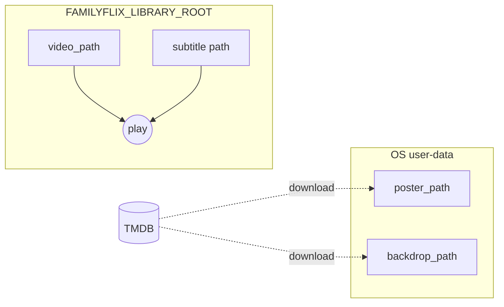

# 01 — Library Core (schema + repository)

## Background

FamilyFlix's foundation feature: the SQLite schema, the `db/` connection +
migration layer, and the `library/` movie repository. Everything else (browse
grid, player, import/export, settings) reads and writes through this layer.

At grill time the server domain folders (`db/`, `library/`, `media/`,
`import-export/`, `routes/`) were empty `.gitkeep` placeholders,
`ubiquitous-language.md` was blank, and no backend deps were installed. This is
genuinely the first backend code. The design prototype in `docs/handoff/` is the
visual/behavioral spec and was mined for the movie data shape.

Two facts from outside the original CLAUDE.md surfaced during grill and reshaped
the model:

- **TMDB as the metadata source.** Rather than hand-entering synopsis, cast,
  director, runtime, genres, posters, and backdrops, FamilyFlix fetches them from
  TMDB on import and caches them in SQLite. Internet is needed only when adding
  movies; browse/playback stay fully offline. Not AI — a metadata lookup — so it
  does not touch the "No AI" rule. Zero cost (TMDB has no daily cap; only a burst
  rate limit, removed as a hard limit in 2019).
- **Library scale ≈ 12 TB at 720p ⇒ ~6,000–12,000 movies.** This makes two things
  true: (1) hand-entry is infeasible, so TMDB is essential, not optional; and
  (2) copying every film into managed storage would mean ~24 TB on disk — a
  non-starter. Films are **referenced in place**, not copied.

## Problem

Define the canonical movie data model, its storage, and the repository API for a
local, offline-first, single-household library of up to ~12,000 movies — such
that browse/search/sort/filter stay fast, watch state can't drift, TMDB metadata
slots in cleanly, and large media is never duplicated on disk.

## Questions and Answers

1. **Scope of "Library core"?** Schema + `db/` + `library/` repository only.
   No routes, no media copy/scan, no Electron this round.
2. **Primary key strategy?** Text UUID (`crypto.randomUUID()`) for stability
   across re-import/backup — not integer autoincrement.
3. **Genres storage?** Normalized junction table — genres are a primary
   browse/filter dimension.
4. **Cast + director storage?** `director` = plain `TEXT` column; `cast` = JSON
   `string[]` column (display-only, never queried).
5. **Subtitles storage?** Normalized child table — subtitles are real file assets
   the player consumes, not display strings.
6. **Rating representation?** Nullable `INTEGER`, 0–10 half-star units
   (10 = 5 stars), `NULL` = unrated (distinct from a literal 0).
7. **Should TMDB write the rating?** Yes — TMDB community score **seeds** the
   rating at import (`round(vote_average)`); maintainer overrides anytime. Uniform
   "TMDB fills everything" beats a special-case personal-only field. Guard:
   `vote_count` below threshold → `NULL`, not a false 0.
8. **Watch state: stored or derived?** Store two facts — `watched` boolean +
   `resume_position_seconds` — and **derive** the three-way status. Avoids drift.
9. **Favorites storage?** `is_favorite` boolean column + partial index, not a
   junction table (no per-user/per-list scoping exists).
10. **Timestamps + recency?** `created_at`/`updated_at` as **UTC ISO-8601** text,
    repo-generated (not `CURRENT_TIMESTAMP`). "Recently Added" = `created_at DESC`,
    `id` tiebreaker. Import-time timestamp now; folder-mtime backfill deferred.
11. **File path columns?** `video_path` NOT NULL; `poster_path`/`backdrop_path`
    nullable. No path-shape CHECK (media layer owns path construction).
12. **Absolute paths or relative to a root?** Relative to a configured
    `FAMILYFLIX_LIBRARY_ROOT` — survives Windows drive-letter reassignment; repo
    still just stores/returns strings, media layer resolves `root + relative`.
13. **"Film" vs "Movie" as the canonical term?** Keep `movie` canonical in code,
    schema, prototype, docs; record `film` as an informal synonym. Switching would
    churn the frozen prototype's vocabulary for no functional gain.
14. **Repository API shape?** Single `createSqliteStorage(dbPath)` factory;
    prepared statements at init; full-model reads; transactional multi-table
    writes; discrete mutators; one parameterized `listMovies(query)`.
15. **Migrations + pragmas?** Hand-rolled `PRAGMA user_version` runner (no lib);
    v1 schema = migration #1; on open set `foreign_keys=ON`, `journal_mode=WAL`,
    `busy_timeout`; verbose gated on `DEBUG_SQL`.
16. **Test strategy?** Real in-memory SQLite (`:memory:`) per test, not a mock —
    exercises the actual SQL, cascades, CHECKs, and row→model assembly.
17. **Media: copy into managed storage, or reference in place?** Reference in
    place (12 TB ⇒ no duplication). **Reverses** CLAUDE.md's managed-copy model.
    Posters/backdrops (TMDB downloads) are the exception — owned in a managed
    image cache. New concern (deferred): missing-file detection.
18. **Multi-edition support (4K / Bluray / Director's Cut)?** Explored an editions
    child table (one card per film, version picker, edition-scoped subtitles,
    `last_played_edition_id`), then **reverted** — the library is one-edition-per-
    film in practice, and the prototype has no editions concept. Multi-edition →
    roadmap. Multiple video files in one folder → import review step flags it,
    maintainer picks one.

## Design

### Schema (v1)

```sql
movies
  id                       TEXT PRIMARY KEY      -- crypto.randomUUID()
  tmdb_id                  INTEGER               -- indexed, NOT unique
  title                    TEXT NOT NULL
  year                     INTEGER
  runtime_minutes          INTEGER
  synopsis                 TEXT
  director                 TEXT
  cast                     TEXT                  -- JSON string[], display-only
  rating                   INTEGER CHECK(rating BETWEEN 0 AND 10)  -- half-star; NULL=unrated
  is_favorite              INTEGER NOT NULL DEFAULT 0
  watched                  INTEGER NOT NULL DEFAULT 0
  resume_position_seconds  INTEGER NOT NULL DEFAULT 0
  video_path               TEXT NOT NULL         -- relative to FAMILYFLIX_LIBRARY_ROOT
  poster_path              TEXT                  -- relative to managed image cache
  backdrop_path            TEXT                  -- relative to managed image cache
  created_at               TEXT NOT NULL         -- UTC ISO-8601, repo-generated
  updated_at               TEXT NOT NULL         -- UTC ISO-8601, repo-generated

genres
  id    TEXT PRIMARY KEY
  name  TEXT UNIQUE NOT NULL                     -- seeded with the 12-genre pool

movie_genres
  movie_id   TEXT NOT NULL REFERENCES movies(id) ON DELETE CASCADE
  genre_id   TEXT NOT NULL REFERENCES genres(id)
  position   INTEGER NOT NULL                    -- preserves genres[0] = primary tag
  PRIMARY KEY (movie_id, genre_id)

subtitles
  id         TEXT PRIMARY KEY
  movie_id   TEXT NOT NULL REFERENCES movies(id) ON DELETE CASCADE
  path       TEXT NOT NULL                       -- relative to FAMILYFLIX_LIBRARY_ROOT
  language   TEXT NOT NULL                       -- human label, e.g. "English"
  position   INTEGER NOT NULL                    -- track order

-- Indexes
INDEX movies(title), movies(year), movies(created_at), movies(rating), movies(tmdb_id)
INDEX movie_genres(genre_id), subtitles(movie_id)
PARTIAL INDEX movies(is_favorite) WHERE is_favorite = 1
```

### Derived status (repo row→model mapping, never stored)

```
watched = 1                  -> 'watched'
resume_position_seconds > 0  -> 'in-progress'
otherwise                    -> 'unwatched'
```

Two operations stay cleanly separable:

- `setResumePosition(id, seconds)` — fires constantly during playback, writes one
  column only.
- `markWatched(id)` — explicit; flips `watched`, by convention zeroes
  `resume_position_seconds`.

### Repository — `server/src/library/`

```ts
export function createSqliteStorage(dbPath: string): LibraryStorage;

interface LibraryStorage {
  // lifecycle (transactional across movies/movie_genres/subtitles)
  addMovie(input: NewMovie): Movie;
  updateMovie(id: string, patch: MoviePatch): Movie;
  deleteMovie(id: string): void;
  // read (assemble full model: genres[], cast[], subtitles[], derived status)
  getMovie(id: string): Movie | null;
  listMovies(query: MovieQuery): Movie[]; // { sort, genre?, minRating?, search?,
  //   favoritesOnly?, inProgressOnly? }
  listGenres(): GenreCount[]; // genres with >= 1 movie, for home rows
  searchMovies(text: string): Movie[];
  // watch
  setResumePosition(id: string, seconds: number): void;
  markWatched(id: string): void;
  markUnwatched(id: string): void;
  // curation
  setFavorite(id: string, value: boolean): void;
  setRating(id: string, units: number | null): void;
}
```

### `db/` — connection + migrations

- `createSqliteStorage` opens `better-sqlite3`, sets pragmas
  (`foreign_keys=ON`, `journal_mode=WAL`, `busy_timeout`), runs pending
  migrations keyed on `PRAGMA user_version`, then prepares statements.
- Migrations: ordered `{ version, up(db) }` list, each in a transaction; v1 schema
  (above) is migration #1, including the 12-genre seed.
- `verbose: DEBUG_SQL === '1' ? console.info : undefined` (the one sanctioned,
  gated `console.*`).

### Conventions locked

- ✅ **UUID** ids — re-import/backup stable. ❌ integer autoincrement — not stable
  across wipe-and-reimport.
- ✅ **Normalize what you query, denormalize what you only display** — genres =
  junction; cast = JSON column.
- ✅ **TMDB seeds rating** (`round(vote_average)`, `vote_count`-low → NULL).
  ❌ personal-only rating — needless special case.
- ✅ **UTC ISO-8601 in storage, `de-DE` / `Europe/Berlin` at display.**
  ❌ Berlin-local timestamps — DST repeat/gap breaks ordering.
- ✅ **Reference media in place, relative to `FAMILYFLIX_LIBRARY_ROOT`.**
  ❌ copy into managed storage — ~24 TB. ❌ absolute paths — drive-letter fragile.
- ✅ **Derived three-way status.** ❌ stored status — drifts against resume/watched.

### Asset model



Films + subtitles referenced in place; posters + backdrops downloaded from TMDB
into a managed image cache (owned copies, needed offline).

## Implementation Plan

1. **Thinnest slice:** `db/` connection + `user_version` migration runner + v1
   schema migration (movies + genres + seed) + pragmas. `createSqliteStorage`
   opens `:memory:`, migrates, closes. One test: a fresh DB has `user_version=1`
   and the 12 seeded genres.
2. **Movie write + read round-trip:** `addMovie` (transactional insert across
   movies/movie_genres/subtitles) + `getMovie` (assemble genres ordered, cast
   parsed, subtitles, derived status). Tests cover round-trip + status truth
   table + rating boundaries/CHECK.
3. **Browse query:** `listMovies(query)` across every sort + genre/rating/search/
   favorites/in-progress filter; `listGenres()` for home rows.
4. **Mutators:** `setResumePosition`, `markWatched`/`markUnwatched`, `setFavorite`,
   `setRating`, `updateMovie`, `deleteMovie` (assert cascade to subtitles +
   movie_genres).

## Trade-offs

**Easier:**

- Indexed browse/search/sort/filter at ~10k rows; one parameterized query path.
- TMDB metadata slots into existing columns; `tmdb_id` enables future refetch.
- No media duplication — only ~10 GB of cached images against 12 TB of film.
- Watch state can't contradict itself; player writes one column constantly.
- Re-import/backup portability via UUIDs and library-root-relative paths.

**Harder / accepted:**

- Referenced films can go **missing** (moved/renamed/drive unplugged) — needs a
  media-layer existence check + "file not found" state (deferred).
- Absolute-edition precision lost: one file per film only (multi-edition deferred).
- Cast isn't queryable (JSON) — acceptable, nothing queries it.

**Out of scope (this round):**

- HTTP routes, media copy/scan, Electron wiring.
- TMDB _fetching_ itself (token-strip → title+year search → review step;
  throttled, resumable, offline-graceful; genre-vocabulary mapping). Media/
  metadata-layer feature.
- Missing-file detection; folder-mtime recency backfill; multi-edition support.

## Downstream doc amendments (not done here)

CLAUDE.md needs updating to reflect: (1) reference-in-place media model (reverses
the managed-copy section), (2) `FAMILYFLIX_LIBRARY_ROOT` + the image-cache var,
(3) TMDB as a metadata source (the "metadata entered manually" line). The
prototype/DESIGN_BRIEF will need a TMDB match-confirm affordance in the import
review. Flagged, not edited as part of this log.
