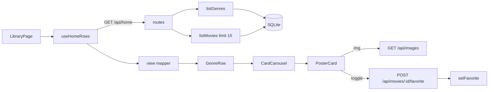

# 02 — Browse Grid (genre-rows home screen)

## Background

`browse-grid` is the **first frontend feature** in FamilyFlix. At grill time
`src/` held only the Nx welcome scaffold (`app.tsx`, `nx-welcome.tsx`,
`main.tsx`) — no `tokens/`, `primitives/`, `components/`, `features/`, `pages/`,
or router. The backend `library` seam is **done** (see
[01-library-core](./01-library-core.md)): `createSqliteStorage` exposes
`listMovies(query)`, `listGenres()`, `searchMovies()`, and `setFavorite()`, all
typed and tested, returning fully-assembled `Movie` models. `server/src/routes/`
is an empty `.gitkeep`, and `src/` is forbidden from touching SQLite directly.

The design prototype's `page.LibraryPage.dc.html` is the spec: a header
(SearchBar + 3 FilterDropdowns + gear) → Continue Watching row → Favorites row →
`GenreRow ×n` (title + "View all {count}" → `CardCarousel` of `PosterCard`s) →
no-results state → back-to-top FAB. In the CLAUDE.md feature list, most of those
rows/controls are **separate 🔜 features** from "Browse grid — genre rows of
poster cards."

## Problem

Render the genre-rows browse home against real SQLite data, as the first
frontend feature — which forces standing up the frontend foundation (tokens,
theme, primitives), the first HTTP route layer, and routing — without absorbing
the five neighbouring features (search/filter, sort, Continue Watching,
Favorites row, FAB) the prototype draws on the same screen.

## Questions and Answers

1. **Do the frontend foundations get built here?** Yes — scoped strictly to the
   poster-card render path. `tokens/` + `ThemeProvider` + reset, only the
   primitives `PosterCard` transitively needs, and `PosterCard`. Header/player/
   form-only primitives deferred.
2. **Screen boundary — whole `LibraryPage` or just genre rows?** The
   `LibraryPage` shell **+** genre-rows body. Continue Watching row, Favorites
   row, and FAB deferred to their own features. Prototype stays the goal.
3. **How does the grid get data?** Real HTTP. Stand up `server/src/routes/`
   (thin: parse → call domain → return JSON); frontend fetches over
   `VITE_API_BASE_URL`. ❌ throwaway fixtures/mock seam. ❌ full REST suite.
4. **Any TMDB work now?** No. The library-core schema **is** the TMDB cache;
   browse-grid is a pure offline SQLite read and touches no TMDB key. TMDB
   fetch + genre-vocabulary mapping belongs to the media/metadata layer behind
   Add-movie / Bulk-import (an unowned feature-list gap — flagged). TMDB columns
   grow later via migration #2 when the writer is built.
5. **Which genres, order, cap, in-row sort?** All populated genres
   (`listGenres()`, ≥1 movie), alphabetical, 15 cards/row, recently-added within
   a row, header count from `listGenres()`. Requires adding `limit` to the
   browse seam.
6. **Posters — no image cache populated yet?** Real `` from `posterPath`
   via a static image route, with a deterministic hashed-id gradient fallback +
   title overlay. Gradient everywhere today until import runs — expected.
   ❌ gradient-only. ❌ bundled fake placeholder images.
7. **Where do card / "View all" clicks go when destinations don't exist?** Real
   `react-router-dom` v6 routes now; `MoviePage`/`GenrePage`/Settings render
   minimal placeholder pages showing the routed param. ❌ no-router. ❌ disabled
   clicks.
8. **Does the card favorite heart work?** Yes — wired through `setFavorite` with
   optimistic toggle. Favorites feature stays 🔜 (mark-from-card delivered; row +
   mark-from-detail remain). ❌ inert heart. ❌ hidden heart.
9. **Loading / empty / error states?** Skeleton on load, dedicated
   empty-library message (distinct from the prototype's search-miss copy),
   minimal retry-able error — both reusing the prototype's centered message
   layout. Search-miss "Nothing here" left for the search feature.
10. **`rating` mapping + unrated on the card?** `percent = units * 10`; unrated
    (`null`) → 0 stars (flagged: visually identical to a real 0 on the card).
11. **`progress` mapping + unknown runtime?** `progress =
resumeSeconds / (runtimeMinutes*60) * 100`, clamped; null runtime → nominal
    low sliver while keeping in-progress state.
12. **Header treatment?** Partial header — bar chrome + logo + gear (→ Settings
    placeholder). No `SearchBar`/`FilterDropdown` (dead controls owned by other
    features). ❌ full inert header. ❌ no header.
13. **One aggregated request or one per row?** Single aggregate `GET /api/home`
    → `[{ genre, count, movies }]`; handler calls `listGenres()` then loops
    `listMovies` server-side. Generic `GET /api/movies?genre=&limit=` retained
    for GenrePage. ❌ N+1 over generic endpoints.

## Design

### Frontend layers introduced (scoped to the card render path)

```
src/
├── tokens/            ← colors, spacing, typography, radius, breakpoints (from tokens.css)
├── styles/            ← global reset + ThemeProvider theme
├── primitives/        ← StarRating, StatusBadge, ProgressBar, Icon/{IconBase, HeartIcon, HeartOutlineIcon}
├── components/        ← PosterCard
├── features/
│   └── library/       ← CardCarousel, GenreRow, useHomeRows hook, view(movie) mapper
├── pages/             ← LibraryPage (real) + MoviePage/GenrePage/SettingsPage (placeholders)
├── types/             ← PosterCardMovie (promoted), HomeRow
└── utils/             ← gradientFromId (pure, tested), toProgressPercent, toRatingPercent
```

Deferred primitives/molecules (other features own them): `Button`, `TextField`,
`Textarea`, `Chip`, `Toggle`, `IconButton`, `SearchBar`, `FilterDropdown`,
`ContinueCard`, `Fab`, etc.

### Backend additions

```ts
// src/types — extend the browse query with a cap
interface MovieQuery {
  // ...existing...
  limit?: number; // NEW — pushed into SQL as `LIMIT ?`
}
```

Routes (`server/src/routes/`, thin — parse → domain → JSON):

```
GET  /api/home                       -> [{ genre: string; count: number; movies: Movie[] }]
                                        (listGenres() then listMovies({genre, sort:'recently-added', limit:15}))
GET  /api/movies?genre=&sort=&limit= -> Movie[]   (generic; for GenrePage later)
POST /api/movies/:id/favorite        -> { value }; calls setFavorite
GET  /api/images/*                   -> static serve of the managed image cache (posterPath -> URL)
```

### View-model mapping (`Movie` → `PosterCardMovie`, pure + tested)

```ts
interface PosterCardMovie {
  id: string;
  title: string;
  posterUrl: string | null; // `${API}/api/images/${posterPath}` or null -> gradient
  g1: string;
  g2: string; // gradientFromId(id) fallback
  rating: number; // units*10 (0..100); unrated null -> 0
  watched: boolean;
  progress: number; // seconds/(runtime*60)*100 clamped; null runtime -> nominal sliver
  favorite: boolean;
}
```

- `rating = (units ?? 0) * 10` — ✅ unrated → 0 stars (flagged). ❌ distinct
  unrated card treatment (not in prototype).
- `progress` — ✅ percent of runtime, clamped; null runtime → nominal sliver
  keeping in-progress. ❌ hide bar. ❌ full/empty lie.
- `g1/g2 = gradientFromId(id)` (hash → hue). ❌ stored gradient columns.

### Data flow



### States (reuse prototype's centered `--color-text-faint` message layout)

- **loading** → skeleton genre rows (rarely flashes against local SQLite)
- **empty library** (`listGenres() == []`) → "Your library is empty" (NOT the
  prototype's search-miss copy)
- **error** → minimal retryable "Couldn't load your library. Retry."
- search-miss "Nothing here" → ❌ left for the search feature

### Routing (`react-router-dom` v6)

`/` → `LibraryPage` (real). `/movie/:id`, `/genre/:name`, `/settings` →
placeholder pages echoing the param. `onOpen` → `/movie/:id`; "View all" →
`/genre/:name`; gear → `/settings`.

## Implementation Plan

1. **Thinnest slice — one real card end to end.** `tokens/` + `ThemeProvider` +
   reset; `PosterCard` + its primitives (`StarRating`, `StatusBadge`,
   `ProgressBar`, `HeartIcon`/`HeartOutlineIcon`); `PosterCardMovie` type +
   `view` mapper + `gradientFromId`/percent utils (tested). Render one card from
   a hardcoded model in a harness. No network.
2. **Backend seam.** Add `limit` to `MovieQuery`/`listMovies` (+ test); routes
   `GET /api/home`, `GET /api/movies`, static `GET /api/images/*`.
3. **Rows + page.** `CardCarousel` (arrows, overflow), `GenreRow`, `LibraryPage`
   shell + partial header; `useHomeRows` fetches `/api/home` and maps. Skeleton /
   empty / error states.
4. **Routing + interactivity.** `react-router-dom` v6, placeholder pages, card
   `onOpen` + "View all" navigation, gear → settings; `POST .../favorite` with
   optimistic toggle.

## Trade-offs

**Easier:**

- One aggregate fetch → one loading transition; thin routes stay "parse → domain
  → return."
- Real poster path exists from day one; lights up automatically when import
  populates the cache — no card rework.
- `limit` in SQL keeps rows at 15, not thousands assembled per genre at ~12k
  scale.
- Real routes/navigation verifiable now; destination features drop in behind
  stable URLs.

**Harder / accepted:**

- Screen is not a pixel-match of `page.LibraryPage` until later features land
  (no search/filter/sort controls, no Continue/Favorites rows, no FAB).
- Touches "done" library-core (`MovieQuery.limit`).
- Unrated vs literal-0 indistinguishable on the card; null-runtime progress is a
  nominal sliver — both flagged for the detail/edit grill.

**Out of scope (this round):**

- Search / filter / sort, Continue Watching row, Favorites row, back-to-top FAB.
- Favorites feature completion (row + mark-from-detail) — **card-half delivered**
  here; Favorites stays 🔜.
- TMDB fetch + cache + genre-vocabulary mapping (our 12 seeded vs TMDB's 19) —
  media/metadata layer behind Add-movie / Bulk-import; **unowned in the feature
  list — flagged**. TMDB columns via migration #2 when the writer is built.
- Global store/context — deferred until a second feature shares state.
- Electron shell / server-as-utility-process (dev: Vite ↔ Express on :3001).
