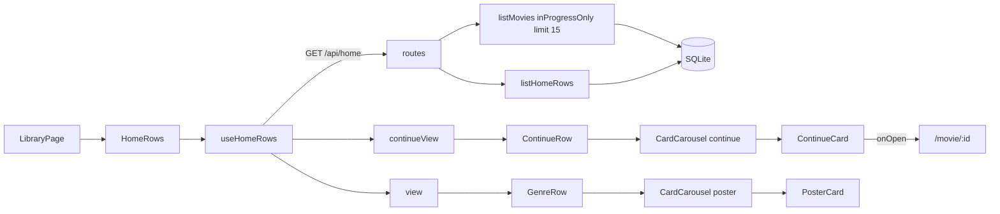

# 03 — Card Carousel (the `continue` variant + Continue Watching row)

## Background

`CardCarousel` already exists and ships working for `variant="poster"` — paged
left/right arrows, auto-hide at both edges and when the row doesn't overflow,
native wheel/trackpad scroll never intercepted. It was built during
[02-browse-grid](./02-browse-grid.md) as the scroller inside `GenreRow`.

Two of the three things CLAUDE.md lists under "Card carousel" are therefore
already done:

- **the 15-card cap** — `HOME_ROW_LIMIT = 15` in `server/src/library/home/home.ts`,
  pushed into SQL as `LIMIT`, with the row's `count` still reporting the genre's
  true total
- **"View all" → genre page** — `GenreRow` renders `View all {row.count}` against
  a real `/genre/:name` route

What remains is the third: `CardCarousel.tsx:105-113` renders `null` for
`variant === 'continue'`, because `mol.ContinueCard` was never built. The
variant's geometry is already in place and correct (`ARROW_TOP.continue = 0.48`,
`ITEM_WIDTH.continue = 1.55`) — only the card is missing.

The data the row needs already exists in the model: `Movie.resumePositionSeconds`,
`Movie.runtimeMinutes`, and `MovieQuery.inProgressOnly` (library-core, tested).
Nothing **writes** a resume position yet — the player is 🔜.

## Problem

Close out the card carousel by making the `continue` variant render a real card,
without shipping a variant that nothing mounts. The only consumer of
`mol.ContinueCard` in the prototype is the Continue Watching row on
`page.LibraryPage`, which CLAUDE.md lists as a **separate 🔜 feature**.

## Questions and Answers

1. **Scope — carousel only, carousel + Continue row, or + Favorites row too?**
   Carousel **+ Continue Watching row**. ❌ carousel-only: a `variant` prop with an
   unmounted branch is dead code that rots, and the feature can't honestly be
   marked ✅ when nothing renders it. ❌ + Favorites: Favorites is its own listed
   feature with a second surface (mark-from-detail) whose page doesn't exist yet —
   building it here means half-building it.
2. **The row will be permanently empty until the player ships — does that change
   the scope?** No. It degrades to hidden, which is the prototype's own behaviour
   (`showContinue: continueList.length > 0`). Verified against a seeded DB.
3. **How does `CardCarousel` carry two different card shapes?** ✅ A discriminated
   union on the props, keyed on `variant`. ❌ one item type with a union'd `movie`
   (forces a runtime narrow inside the component and leaves `onToggleFavorite`
   optional-and-sometimes-ignored — a quiet lie). ❌ opaque items / children
   (deletes `variant` from the spec'd prop interface — a redesign, not a
   translation — and pushes the tile geometry onto every caller, when that
   geometry is genuinely the carousel's business).
4. **Which rung is `ContinueCard`?** Molecule — `src/components/ContinueCard/`,
   per COMPONENT-SPEC. `movie` + `onOpen`, no domain knowledge.
5. **What's in `ContinueCardMovie`?** The prototype's `data-props`
   (`title, g1, g2, resumeLabel, progress`) **plus `id`** — `CardCarousel` keys on
   `item.movie.id` and the open handler needs it.
6. **Does the continue tile show real artwork?** No — gradient-only, 1:1 with the
   prototype. COMPONENT-SPEC annotates _PosterCard's_ gradient as "placeholder art;
   swap for real `posterUrl`" and pointedly does not say so for ContinueCard; there
   is no image slot in `mol.ContinueCard` at all. `Movie.backdropPath` exists and a
   16:10 tile would take it happily — **flagged as a prototype amendment**, not
   improvised here.
7. **Where is `resumeLabel` built?** In the mapper, passed in as a finished
   string — what `data-props` declares, and it keeps the molecule logic-free.
   ❌ assembled inside the card from raw seconds.
8. **What does the label do when `runtimeMinutes` is null?** Drops the second
   half: `Resume · 1:13`, not `Resume · 1:13 of --`. Not invented — it is the
   prototype's own detail-page `playLabel` (`FamilyFlix.dc.html:426`).
9. **Progress percent?** Reuse the existing `toProgressPercent`, which already
   handles the unknown-runtime nominal sliver.
10. **How does the row get its data — extend `/api/home` or a new endpoint?**
    ✅ Extend the home aggregate. ❌ a separate `/api/continue`: `useHomeRows`
    justifies itself on "one aggregate fetch means one loading transition", and a
    second fetch would put a second loading state on the same screen and pop the
    row in above genre rows that had already painted.
11. **What order does the Continue row use?** `recently-added`, with the cap at 15.
    The _correct_ order is most-recently-watched, which needs an `updated_at`-backed
    sort `MovieSort` doesn't have. ❌ adding a sort with no writer behind it —
    revisit when the player reports positions.
    > **Answered by [09-continue-watching](./09-continue-watching.md) (issues
    > #76–#79).** The revisit happened without waiting for the player. A nullable
    > `last_watched_at` column is stamped by `setResumePosition` and `markWatched`
    > — so the writer exists the moment playback reports anything — and the
    > repository gained a `last-watched` order over it, pinned by `getHome` for the
    > continue section alone. It is deliberately **not** a `MovieSort`: `ListSort`
    > is one member wider, so the order is reachable from `listMovies` and never
    > from a URL or the Sort menu. The cap stays 15 and now keeps the right
    > fifteen, the `ORDER BY` running before the `LIMIT`.
12. **Where does the row component live?** `features/library/ContinueRow/`, the
    structural twin of `GenreRow`. ❌ inlined into `LibraryPage` (pages are
    composition only).
13. **Who renders it, given `GenreRows` owns the load states?** `GenreRows` is
    renamed **`HomeRows`** and renders the Continue section above the genre rows.
    The load states and the continue payload come from the same fetch, so splitting
    them into siblings under `LibraryPage` would need two hooks or a shared context.
    `HomeRows` also lines up with `useHomeRows` / `HomeRow` / `listHomeRows` /
    `/api/home`.
14. **Does the empty-library check still hold?** No — **bug found**. A movie with
    no genre tags produces no genre row, so an untagged in-progress movie would
    render "Your library is empty" directly above a populated Continue Watching
    row. The check becomes `rows.length === 0 && continueWatching.length === 0`.
15. **Is there a favorite heart on a continue tile?** No — none in the prototype.
    The row is read-only; no optimistic state, unlike `toggleFavorite`.
16. **Where does a continue tile click go — detail or player?** Detail,
    `/movie/:id`, same as a poster card. The prototype's `open` is
    `openDetail(m.id)`.
17. **How is the row verified with nothing writing resume positions?** A throwaway
    seed script in the scratchpad, opening the real DB through `createSqliteStorage`.
    ❌ a committed seeder — it has no home in the folder structure and would be its
    own feature.

## Design

### The prototype's `view()` is not ported

`FamilyFlix.dc.html:268-277` returns one fat object carrying `card`,
`continueCard`, `starWrap`, `posterStyle`, `open`, and `toggleFav` at once, which
every consumer picks from. That is the container's simulation shortcut, not the UI
surface, so per CLAUDE.md ("1:1 means the UI surface, not the fake behavior") it is
not translated. It also means the prototype offers **no guidance** on typing the two
card shapes — it sidesteps the question by carrying both. Hence Q3.

### Props — discriminated union (`features/library/CardCarousel/CardCarousel.tsx`)

```ts
export interface PosterCarouselItem {
  movie: PosterCardMovie;
  onOpen: () => void;
  onToggleFavorite: () => void;
}

export interface ContinueCarouselItem {
  movie: ContinueCardMovie;
  onOpen: () => void; // no favorite affordance on a continue tile
}

export type CardCarouselProps =
  | { variant?: 'poster'; items: PosterCarouselItem[] }
  | { variant: 'continue'; items: ContinueCarouselItem[] };
```

Illegal states become unrepresentable: continue items cannot reach a poster row,
and no favorite handler can attach to a tile that has no heart. The existing
exported `CarouselItem` is renamed `PosterCarouselItem` (touches `GenreRow`).

Accepted cost: `variant` becomes load-bearing for type narrowing, so a third card
shape means a third union arm rather than a new map entry — and `ARROW_TOP` /
`ITEM_WIDTH` stay keyed by variant while the types branch separately, so the two
must be kept in sync by hand.

### View model (`src/types/viewModels.ts`, beside `PosterCardMovie`)

```ts
export interface ContinueCardMovie {
  id: string;
  title: string;
  g1: string;
  g2: string; // gradientFromId(id) — no artwork on this tile (Q6)
  resumeLabel: string; // "Resume · 1:13 of 1:55" — pre-built (Q7)
  progress: number; // toProgressPercent(...) — 0..100
}
```

### New pure units

```
src/utils/formatClock/            ← mirrors the prototype's fmtClock (FamilyFlix.dc.html:260):
  formatClock.ts                    floor, clamp at 0, `h:mm:ss` when >= 1h else `m:ss`
  formatClock.test.ts
src/features/library/continueView/  ← Movie -> ContinueCardMovie, sibling of view()
  continueView.ts
  continueView.test.ts
```

### Backend — the home aggregate grows named sections

**Amends [02-browse-grid](./02-browse-grid.md) §Design**, which specified
`GET /api/home -> [{ genre, count, movies }]` (a bare array):

```ts
// src/types/browse.ts
export interface HomePayload {
  continueWatching: Movie[]; // inProgressOnly, recently-added, LIMIT 15
  rows: HomeRow[]; // unchanged
}
```

```
GET /api/home -> HomePayload
                 listMovies({ inProgressOnly: true, sort: 'recently-added', limit: 15 })
                 + the existing per-genre rows
```

Named sections rather than a bare array is what lets the Favorites row slot in
later (`favorites: Movie[]`) without a second rewrite. Breaking change to
`fetchHomePayload` in `features/library/api/api.ts`.

### Components

```
src/components/ContinueCard/          ← molecule; 16:10 gradient tile, scrim, title,
  ContinueCard.tsx                       resume label, 4px accent progress track,
  ContinueCard.test.tsx                  play badge top-right. Added to components barrel.
  ContinueCard.styles.ts

src/features/library/ContinueRow/     ← organism; twin of GenreRow
  ContinueRow.tsx                        serif 24px "Continue Watching",
  ContinueRow.test.tsx                   padding 0 space-6, margin-bottom space-7,
  ContinueRow.styles.ts                  then CardCarousel variant="continue".
                                         Renders nothing when empty.

src/features/library/GenreRows/  ->  src/features/library/HomeRows/   (rename, Q13)
```

### Data flow



## Implementation Plan

1. **Thinnest slice — one real continue tile.** `formatClock` (+ test),
   `ContinueCardMovie` type, `continueView` mapper (+ test), `ContinueCard`
   (+ test) rendered from a hardcoded model. No network, no carousel.
2. **Wire the variant.** Split `CardCarouselProps` into the discriminated union,
   rename `CarouselItem` → `PosterCarouselItem` (update `GenreRow`), render
   `ContinueCard` in the `continue` branch. Fix the stale "16:9" comment at
   `CardCarousel.tsx:41` — the tile is 16:10. Carousel test for the continue variant.
3. **Backend seam.** `HomePayload` type; `createHome` gains the in-progress query;
   `GET /api/home` returns the object. Repository tests against real `:memory:`
   SQLite, per 01/02 convention.
4. **Row on the screen.** `ContinueRow`; `useHomeRows` returns `continueWatching`;
   `GenreRows` → `HomeRows` renders Continue above the genre rows; empty check
   becomes `rows.length === 0 && continueWatching.length === 0`. Seed the DB from
   the scratchpad and eyeball against `page.LibraryPage`.

## Trade-offs

**Easier:**

- The `continue` variant stops being dead code — it ships with a real consumer.
- One aggregate fetch still means one loading transition; the Favorites row now has
  an obvious slot in `HomePayload` with no further reshaping.
- Illegal item/variant combinations are a compile error, not a runtime narrow.
- `ContinueCard` is a plain molecule — no logic to move when the player lands.

**Harder / accepted:**

- `variant` is now load-bearing for type narrowing; a third card shape costs a
  union arm, and the geometry maps must be kept in sync with the types by hand.
- Breaking change to `/api/home`'s shape, amending a decision from 02.
- A rename (`GenreRows` → `HomeRows`) touching a folder, three files, and
  `LibraryPage`.
- The row is correct but permanently empty in real use until the player writes
  resume positions — only verifiable via a seeded DB.
- `recently-added` is the wrong ordering for a resume row; it is the closest
  honest option until an `updated_at` sort has a writer.

**Out of scope (this round):**

- **Favorites row** — its own listed feature, and its second surface
  (mark-from-detail) has no page yet.
- **Real artwork on the continue tile** — `backdropPath` exists, but the prototype
  has no image slot; amend the prototype first (Q6).
- **A `recently-watched` / `updated_at` sort** — no writer until the player (Q11).
- **A committed seed script** — throwaway in the scratchpad only (Q17).
- **Player, watch tracking, resume writes** — separate 🔜 features; this row only
  reads what they will eventually write.
