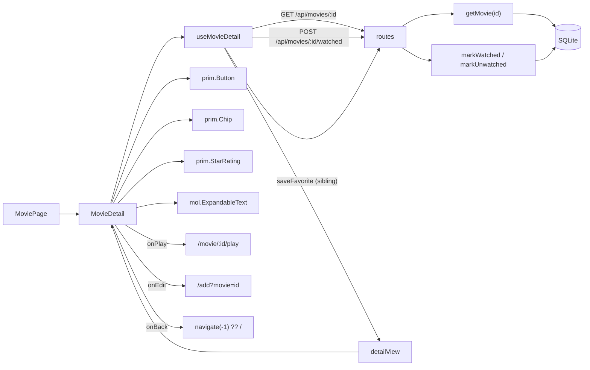

# 04 — Movie Detail Page

## Background

`/movie/:id` has been a real route since [02-browse-grid](./02-browse-grid.md) —
`MoviePage.tsx` echoes the routed id and documents itself as a placeholder, so
every card on the browse home has an honest destination. Both card types already
link to it: `PosterCard` from every **Genre row**, and `ContinueCard` from the
**Continue Watching row** ([03-card-carousel](./03-card-carousel.md), which fixed
that the continue tile opens the movie, not the player).

The prototype screen is `docs/handoff/page.MoviePage.dc.html`, with its model
built in `FamilyFlix.dc.html:418-434` (`detail`, `tsType: MovieDetailModel`).

Everything the page displays already exists on the canonical record —
`Movie.synopsis`, `director`, `cast[]`, `rating`, `runtimeMinutes`,
`backdropPath`, `genres[]`, `watched`, `resumePositionSeconds`, `status` — and
`getMovie(id)` is already on the `LibraryStorage` seam, returning the fully
assembled model or `null`. What is missing is a route to reach it, a mapper, and
the screen.

**Governing principle established this session (applies beyond this feature):**
the prototype always wins on the visual surface; our naming, patterns, and
structure govern the code. Every conflict below resolves that way.

## Problem

Build the **Movie detail page** as a 1:1 translation of the prototype, against
real data — when three of the five affordances it renders (Playback, Favorites,
Edit/delete) are separate 🔜 features, and when the seed populates none of the
fields below the fold.

## Questions and Answers

1. **Scope — read-only page, or the buttons work?** ✅ Full visual surface;
   **favorite** and **watched** real; **Play** and **Edit** navigate to
   placeholder routes; **Delete** deferred. ❌ read-only: the action row is the
   visual anchor above the fold, and favorite/watched already work on the card
   the user just clicked — a read-only detail page is a regression from it.
   ❌ Delete: the prototype never implemented it (`onClick` → `onToggleEditMenu`,
   i.e. it only closes the menu) and no confirm dialog is designed anywhere in
   the handoff. Shipping it would mean porting the simulation on the one control
   whose non-effect a user cannot verify.
2. **Does the seed grow?** ✅ Add `synopsis`, `director`, `cast` to
   `SEED_MOVIES`, with deliberately varied synopsis lengths (several overflowing
   4 lines, at least one not) so `ExpandableText`'s toggle is observable.
   ❌ `posterPath`/`backdropPath`: a stored path with no file behind it 404s
   through `/api/images/`, and the seed's docblock already refuses them for that
   reason. Without this the whole lower two-thirds renders blank on every movie —
   the same "no UI work on it can be checked by looking" argument CLAUDE.md uses
   to justify the seed existing at all.
3. **How does the page get its movie?** ✅ New `GET /api/movies/:id` → 200 full
   `Movie` / 404 unknown. ❌ hand it down through router state from the card
   click: dies on reload (normal in an Electron shell), and home rows are capped
   at 15 per genre so most of the library was never in the payload — a page that
   only renders when you arrived by clicking is a modal wearing a URL. ❌ an id
   filter on `MovieQuery`: duplicates `getMovie` and returns an array to unwrap.
4. **Is "no such movie" distinct from "load failed"?** ✅ Four states —
   `loading | ready | not-found | error`. The distinction earns itself on the
   **affordance**, not the copy: a failure gets **Retry**, a 404 gets **Back to
   library**, because Retry on a 404 is a button that can never work. Extends the
   `HomeRows` convention, which already treats "library is empty" as its own
   situation rather than a failure.
5. **`MainLayout` or the prototype's chrome-less screen?** ✅ Drop `MainLayout`.
   COMPONENT-SPEC §6 already ruled it ("each page owns its header rather than
   sharing a `MainLayout` chrome"); the ⋯ button's fixed slot
   (`top:24px; right:24px`) is exactly where `MainLayout` puts the gear; and the
   translucent `backdrop-filter: blur(10px)` treatment is only legible floating
   over artwork. Accepted: no Settings route from this page — Back is the
   designed escape hatch and returns to a screen that has the gear.
6. **Which feature folder?** ✅ New `src/features/movie-detail/`, mirroring
   `features/library/`'s shape. ❌ fold into `features/library/`: that folder is
   the _browse home's_ domain, and adding a second screen's endpoint, view model,
   and mutation turns it into the catch-all CLAUDE.md's "no generic
   `services/`/`lib/`" rule exists to prevent.
7. **Who owns `saveFavorite`, which already lives in `features/library/api/`?**
   ✅ Import it from the sibling, with a comment marking it for re-homing when
   the Favorites feature lands (CLAUDE.md already assigns that feature both
   surfaces — "mark from card and detail" — so both call sites move together,
   once). ❌ duplicate: two copies of the subtle echo-reconcile contract is two
   places to diverge on failure behavior. ❌ hoist to a new `src/api/`: organizes
   by I/O purity, the exact thing CLAUDE.md rules out server-side, and it is not
   analogous to `server/src/db/` (one shared connection vs. per-domain calls that
   merely travel over HTTP).
8. **Do we wire `backdropPath` / `posterPath` behind the gradient?** ✅ Yes, with
   gradient fallback; overlays (topTag, title) render **only** on the fallback,
   per `PosterCard.tsx:112`. This does not contradict 03's refusal to give
   `ContinueCard` artwork: `mol.ContinueCard` has **no image slot**, whereas the
   hero **is** one — a full-bleed art area under a three-stop scrim, and a scrim
   exists to keep text legible over _photography_. Over a flat gradient it is
   decoration; the prototype drew one because it stands in for a backdrop it
   could not supply. ❌ backdrop → poster → gradient: a 2:3 poster stretched
   across a 62%-height hero crops badly and blurs; the gradient is deterministic,
   shares the poster tile's stops, and reads as designed.
9. **What renders for absent fields?** ✅ Meta line assembles from surviving
   segments with separators generated **between survivors** (never `• • ★`);
   runtime drops zero units ("42m", "2h" — not "0h 42m"/"2h 0m", which is what
   the prototype's expression yields, never having been fed an edge case); no
   synopsis → no `ExpandableText` at all (an empty clamped box with no toggle
   reads as a bug); credits show "—" for a missing one and the row goes only when
   **both** are missing. ❌ hide each credit independently: they are a
   side-by-side pair, so hiding one makes the other jump across the page between
   movies.
10. **Unrated vs. zero stars** — the ambiguity `ubiquitous-language.md` flagged
    _for this grill_. ✅ Unrated hides the star segment entirely, treated as a
    missing meta segment per Q9. With `showValue` an unrated movie prints
    **"0.0"** — the household asserting it scored the film zero, the opposite of
    "nobody has rated this". ❌ empty stars + the word "Unrated": copy the
    prototype does not contain, and it belongs with the 🔜 **Ratings** feature
    that adds the interactive picker — an "unrated, tap to rate" state wants the
    affordance that acts on it. **`PosterCard` stays unchanged** (unrated still
    reads as 0 stars there): its star row is fixed furniture in a fixed-height
    tile, so dropping it would make cards in a row uneven, whereas the detail
    meta line already drops segments. Resolved for detail, still open for the card.
11. **`markWatched` zeroes the resume position — accept it?** ✅ Accept; use the
    dedicated mutators. A movie at _Resume · 52:00_, marked watched then unmarked,
    returns as **Play** from 0:00, and the prototype designs this control as
    reversible ("Watched — click to unmark"). ❌ `updateMovie(id, {watched})` to
    dodge it (it applies no side-effect conventions, and `inProgressOnly` is
    `watched = 0 AND resume > 0`, so the flag alone already removes the movie from
    the row): that gives this page **different watched semantics than every other
    caller** to escape a convention the repository documents in its own interface.
    If the convention is wrong it is wrong for everyone. **Flagged for the
    watch-tracking grill.**
12. **Where do Play and Edit go?** ✅ `pages/PlayerPage` at `/movie/:id/play` and
    `pages/AddMoviePage` at `/add`, both placeholders following the existing
    `MoviePage` precedent; Edit navigates to `/add?movie=<id>`. COMPONENT-SPEC §6
    lists no `/edit` route — the prototype's `editMovie()` pre-fills the form and
    jumps to the add screen with `addContext:'edit'`. ❌ inventing
    `/movie/:id/edit`: a route the spec does not list, decided mid-build. The
    query param is provisional and the movie-form grill owns the real contract.
    Play writes **nothing** — only the player writes playback state.
13. **Back to where?** ✅ `navigate(-1)`, falling back to `/` when
    `location.key === 'default'`. The faithful translation of the prototype's
    `detailReturn` flag, which is a hand-rolled history stack for the only two
    origins it had; React Router's real stack covers those plus search, Favorites,
    Continue, and future collections. ❌ hardcode `navigate('/')`: breaks the
    exact case `detailReturn` was written for — a parent browsing "Action", opening
    a movie, and losing their scrolled place in the row.
14. **Does the router choice depend on Electron?** No — `navigate(-1)` and
    `location.key === 'default'` behave identically under `BrowserRouter`,
    `HashRouter`, and `MemoryRouter`. Under `MemoryRouter` the fallback rarely
    fires in production (no URL to start on) but stays correct in dev and tests.
    **Flagged for the Electron shell grill:** `BrowserRouter` breaks on a
    `file://` reload; the options are `HashRouter`, serving the renderer over the
    bundled Express process, or `MemoryRouter` at the cost of deep links, Alt+←,
    and the mouse back-button.
15. **With Delete deferred, the ⋯ menu has one item — ship it?** ✅ Ship one item;
    Delete lands beside it with its own feature. ❌ port Delete as the prototype
    has it (a red destructive row that closes the menu and does nothing).
    ❌ a disabled Delete row: permanently greyed with nothing to explain it, and
    it reads as "this movie can't be deleted" rather than "not built yet".
16. **Which shared components does this slice build?** ✅ Build `prim.Button`,
    `prim.Chip`, `mol.ExpandableText`, `MoreIcon`, `CheckIcon`. ✅ Keep local: the
    Back pill, the ⋯ trigger, and the two 58px circular toggles. ❌ build
    `prim.IconButton` now: its spec'd surface (size default 46, `ghost|outline`,
    no shape prop) was written against call sites that do not exist yet (back
    arrows on MovieForm/SettingsPage/ImportFlow), and none of this page's four
    buttons match it — the circles are 58px round with an accent-soft pressed
    fill, the pill and ⋯ are 44px translucent-over-artwork. No rule is breached:
    "never build a one-off styled `<div>` when a primitive exists" is about
    primitives that _already exist_. Flagged for `request-refactor-plan` once
    three real screens can be compared.
17. **`MovieDetailModel` — finished strings or nullable values?** ✅ Nullable
    fields; `MovieDetail` filters and interleaves separators. The meta line cannot
    collapse to one string because `StarRating` sits _in the middle_ of it. The
    `resumeLabel` precedent ("so the molecule stays logic-free") does not transfer
    — that kept a **molecule** pure, and `MovieDetail` is a feature organism, the
    rung that owns logic; three bullets is not business logic. ❌ a discriminated
    segment array (`{kind:'text'} | {kind:'rating'}`): purist, marginally better
    tested, but abstraction with no payoff for three fixed slots, and the model
    stops describing a movie. The mapper still owns every **decision**, each
    unit-tested.
18. **What scrolls, now that `MainLayout` is gone?** ✅ An inner scroll container
    (`height: 100vh; overflow-y: auto; position: relative`), matching both the
    prototype's geometry and `MainLayout`'s own inner-scrolling `Body`. ❌ document
    scroll: 62% would resolve against **content** height, so the hero would resize
    with synopsis length — a movie with a two-line synopsis and one with ten lines
    would get different heroes.

## Design

### Types — `src/types/viewModels.ts`

```ts
/** The view model the Movie detail page renders from, built by detailView(). */
export interface MovieDetailModel {
  id: string;
  title: string;
  backdropUrl: string | null; // → gradient when null
  posterUrl: string | null; // → gradient + overlays when null
  g1: string;
  g2: string;
  topTag: string | null; // "Action · 2018" — fallback overlay only
  year: number | null;
  runtimeLabel: string | null; // "2h 8m" | "42m" | "2h"
  ratingPercent: number | null; // null = Unrated → no stars
  genres: string[];
  synopsis: string | null; // null → no ExpandableText
  director: string | null; // null → "—"
  castText: string | null; // null → "—"
  hasCredits: boolean; // false → whole credits row omitted
  isWatched: boolean;
  isFavorite: boolean;
  playLabel: string; // "Play" | "Resume · 52:00"
}
```

### Server — `server/src/routes/index.ts`

```
GET  /api/movies/:id            -> 200 Movie | 404 { error }
POST /api/movies/:id/watched    -> { value: boolean }  (echoes what was stored)
```

Both stay thin parse-call-serialize handlers. `watched` dispatches to
`markWatched` / `markUnwatched` (Q11); the echo lets the optimistic toggle
reconcile against what actually persisted, exactly as the favorite route does.

### Files

```
src/features/movie-detail/
  MovieDetail/          MovieDetail.tsx | .test.tsx | .styles.ts
                        The organism. Owns the four load states, the ⋯ menu's
                        open state, and separator interleaving.
  useMovieDetail/       useMovieDetail.ts | .test.ts
                        Load by id + optimistic watched/favorite toggles.
  detailView/           detailView.ts | .test.ts
                        Movie -> MovieDetailModel. Owns every decision in Q9/Q10.
  api/                  api.ts | .test.ts
                        fetchMovie, saveWatched. saveFavorite imported from
                        features/library/api/api.ts (Q7 — re-home with Favorites).

src/primitives/Button/  Chip/  Icon/MoreIcon.tsx  Icon/CheckIcon.tsx
src/components/ExpandableText/

src/pages/MoviePage/MoviePage.tsx        composition only; no MainLayout
src/pages/PlayerPage/PlayerPage.tsx      placeholder  /movie/:id/play
src/pages/AddMoviePage/AddMoviePage.tsx  placeholder  /add?movie=<id>
server/src/db/seed/seed.ts               + synopsis, director, cast
```

### Data flow



## Implementation Plan

1. **Thinnest slice — the real movie on the real route.** `GET /api/movies/:id`
   (repository tests against `:memory:` SQLite, per 01/02/03 convention);
   `MovieDetailModel`; `detailView` (+ test — runtime wording edges, unrated,
   backdrop URL resolution, `hasCredits`, `playLabel`); `fetchMovie`;
   `useMovieDetail` with the four states; `MovieDetail` rendering hero + poster +
   title + meta line + skeleton/error/not-found; `MoviePage` composition-only with
   `MainLayout` dropped and the inner scroll container in place.
2. **The lower half.** Extend `SEED_MOVIES` with synopsis/director/cast and
   re-seed; `prim.Chip` (+ test) for the genre tags; `mol.ExpandableText`
   (+ test — measures while clamped, toggle only when overflowing); the credits
   row with its "—" and both-missing rules.
3. **Primary actions.** `prim.Button` (+ test) and `CheckIcon`; the Play/Resume
   button → `pages/PlayerPage` placeholder; `POST /api/movies/:id/watched` and the
   watched toggle; the favorite toggle via the sibling `saveFavorite`. Both
   toggles optimistic, reverting on failure and reconciling against the echo.
4. **Chrome.** The Back pill (`navigate(-1)` + `location.key` fallback); `MoreIcon`
   and the ⋯ menu — one item, real `<button>`s, `aria-haspopup`/`aria-expanded`,
   Escape + outside pointerdown + activation close, focus returned to the trigger;
   `pages/AddMoviePage` placeholder at `/add?movie=<id>`.

## Trade-offs

**Easier:**

- The browse home's cards finally land somewhere real; `/movie/:id` stops being a
  placeholder without a single link changing.
- `prim.Button`, `prim.Chip`, and `mol.ExpandableText` are three of the most
  reused pieces in the handoff — every remaining screen needs at least one.
- `detailView` concentrates every "what if this field is missing" rule in one
  pure, tested function, so the component has no conditionals worth arguing about.
- The four-state hook and the `watched` route are the shapes the player, the form,
  and search will all reuse.
- Wiring `backdropPath` now means the TMDB importer lights the hero up with no
  frontend change.

**Harder / accepted:**

- First route without `MainLayout` — the app now has two chrome models, and the
  player and import screens will follow this one.
- A cross-feature import (`saveFavorite`) that is deliberately temporary.
- Four hand-styled buttons that probably want to be `prim.IconButton` later.
- Marking watched still destroys the resume position (Q11) — correct per the
  documented convention, wrong for "I've seen this before", and unfixable here.
- The backdrop/poster code paths ship untested against real files until the
  importer exists — the same bargain `PosterCard.posterUrl` already took.
- Re-seeding re-mints every movie id, so gradients shift and any open `/movie/:id`
  404s. Pre-existing, but this is the first screen where it is visible.

**Out of scope (this round):**

- **Delete movie** — never implemented in the prototype, no confirm dialog
  designed (Q1, Q15).
- **The player** — Play navigates to a placeholder and writes nothing (Q12).
- **The Add/Edit form** — Edit navigates to a placeholder; `?movie=<id>` is
  provisional and the movie-form grill owns the real contract (Q12).
- **`prim.IconButton`** — defer until three real call sites exist (Q16).
- **Interactive rating** — the 🔜 Ratings feature owns the picker and the explicit
  "Unrated" affordance (Q10).
- **Changing `PosterCard`'s unrated rendering** — resolved for detail only; the
  card's fixed-height tile is a different constraint (Q10).
- **Migrating `HomeRows`' hand-rolled `RetryButton` to `prim.Button`** — a change
  to shipped, tested code for no user-visible gain; refactor fodder (Q16).
- **The Electron router decision** — `navigate(-1)` is router-agnostic; the shell
  grill picks (Q14).
