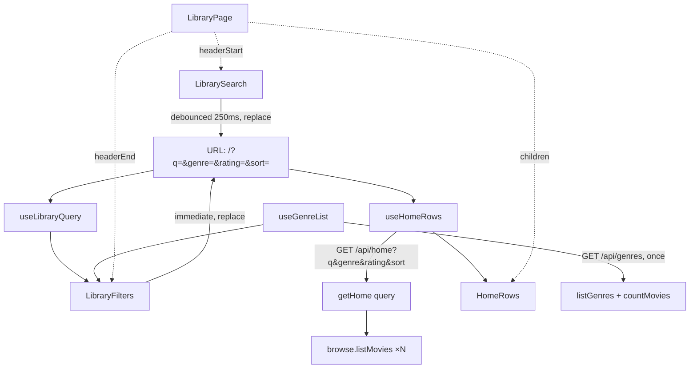

# 05 — Search + Filter + Sort (the browse-home header controls)

## Background

The browse home ships (`02-browse-grid`, `03-card-carousel`): `MainLayout`
renders a **deliberately partial** header — logo + gear only — over `HomeRows`,
which paints the Continue Watching row and one `GenreRow` per populated genre
from a single `GET /api/home`.

Two earlier decisions pointed directly here and are now cashed in:

- `02-browse-grid` Q12 — no `SearchBar` / `FilterDropdown` in the header, "dead
  controls owned by other features".
- `02-browse-grid` Q9 — the search-miss "Nothing here" copy was "left for the
  search feature". `HomeRows`' docblock says the same thing in code.

The server was built ready for this: `MovieQuery` already carries `search`,
`genre`, `minRating`, `sort` and `limit`, and `browse.listMovies` already
builds the SQL for all of them. `GET /api/movies` parses only `sort`, `genre`
and `limit`; `GET /api/home` parses nothing.

`components/Menu` (from `04-movie-detail`) already owns the popup dismissal
contract — Escape, outside pointerdown, select-to-close, focus back to the
trigger — and its docblock names "a filter dropdown" as an intended client.

`CLAUDE.md` lists **Search + filter** and **Sort** as two separate 🔜 features.

## Problem

Translate the prototype's four header controls — search box, Genre, rating and
Sort dropdowns (`mol.SearchBar`, `mol.FilterDropdown` ×3 in
`page.LibraryPage.dc.html`) — into the codebase 1:1.

The hard parts are not the controls:

1. The prototype does **not** switch the home to a flat grid when you search. It
   re-filters and re-sorts the whole library, then rebuilds the _same genre
   rows_ from the result (`FamilyFlix.dc.html:319–329`). Our rows arrive capped
   at 15 per genre, so that cannot be reproduced from the loaded payload.
2. Header and body are two different subtrees. The controls live in
   `MainLayout`'s header; the results live in `HomeRows`. `pages/` is
   composition-only, so the query state has to reach both without the page
   holding it.

## Questions and Answers

1. **Is Sort in scope, given `CLAUDE.md` lists it separately?** ✅ Yes — one
   initiative. In the prototype they are one header strip, one piece of state
   (`openDrop` is a single slot, so opening Sort closes Genre) and one pipeline:
   `filteredSorted()` applies rating + search, then `sortList()`, and the genre
   rows come out of that. ❌ Splitting: ships a header with two of three
   dropdowns, then re-opens the same route, the same hook and the same empty
   state a week later. The third dropdown costs a config table, not a build.
2. **Client-side over the loaded payload, or a server round-trip?** ✅ Server,
   through `/api/home`. Rows arrive capped at `HOME_ROW_LIMIT` (15), so
   filtering what we already hold would search 15 of a genre's 40 movies and
   silently miss the rest. ❌ Client-side. ❌ Fetching the whole library
   uncapped to filter locally — that discards the cap the home aggregate exists
   to enforce.
3. **Extend `/api/home` or move the home to `/api/movies`?** ✅ Extend
   `/api/home`. The screen stays genre rows under every filter, and rows are
   what the aggregate builds. ❌ `/api/movies` — it returns a flat list; the
   page would have to re-group it into rows, re-deriving each genre's true
   total client-side.
4. **Is the Continue Watching row filtered too?** ✅ Yes — prototype
   `continueList = this.filteredSorted().filter(progress)`. Same filters, same
   sort, same cap.
5. **Does a row's `count` shrink when filtered?** ❌ No. The prototype takes
   `count` from the unfiltered library (`:329`), so "View all 24" stays the
   genre's true total while the row shows the 3 that matched. Our `HomeRow.count`
   already comes from `listGenres()` — no change needed.
6. **Rows that match nothing?** Dropped (prototype `.filter(r => r.movies.length
   > 0)`). With a genre filter active, only that one row renders (`:327`).
7. **What does search match?** ✅ Title **or** synopsis **or** genre name — the
   prototype's semantics (`:319`). Our `buildListQuery` is `m.title LIKE ?`
   today. For parents, typing "comedy" or a half-remembered plot fragment
   should work. ❌ Title-only: more predictable, but it is a redesign of
   behaviour the prototype already fixed. Known limit: SQLite `LIKE` is
   case-insensitive for ASCII only.
8. **Where does the query live — component state, context, or the URL?** ✅ The
   URL (`?q=&genre=&rating=&sort=` on `/`). It is what lets `LibraryPage` stay
   pure composition: the header controls and `HomeRows` each read the location
   independently, so nothing has to be lifted into the page. It also makes Back
   from a movie return to the _filtered_ view, and `useRestoredScroll` — keyed
   by history entry — hands back the scroll offset belonging to it. ❌ Component
   state in `LibraryPage`: `LibraryPage` unmounts on navigation, so Back would
   drop the filter and restore a scroll offset measured against a list that no
   longer exists. ❌ A context provider: a second mechanism to do what the
   router already does.
9. **Push or replace?** ✅ `replace: true`. Typing must not stack 14 history
   entries between the home and the movie you opened. Consequence: each write
   mints a fresh history key, so `useRestoredScroll` starts the changed view at
   the top — which is the right place, since the list has been reshuffled.
10. **Where does the debounce live?** ✅ In `LibrarySearch`: local input state
    for instant typing, a 250ms debounced URL write. Everything downstream
    treats the URL as _the settled query_ and knows nothing about debouncing.
    This is also what keeps `useHomeRows` (in `features/library`) free of any
    import from `features/search` — it reads `useSearchParams`, which is
    app-level state, not a sibling feature's module. ❌ Debouncing inside
    `useHomeRows`: it would have to know which field changed, or lag a dropdown
    click by 250ms too.
11. **Do the genre dropdown's counts respect the other filters?** ❌ No — the
    prototype computes them from `rawMovies` unconditionally. The list must not
    shrink under you while you use it.
12. **So where does the genre list come from?** ✅ A second endpoint,
    `GET /api/genres` → `{ total, genres }`, fetched once per mount. Different
    lifetime from `/home`, which refetches per query change. ❌ Adding `genres`
    to `HomePayload`: two consumers in two subtrees would need a shared-payload
    provider — the context ruled out in Q8 — and the unfiltered list would be
    re-sent on every keystroke.
13. **Why does `total` need a query?** Because the "All Genres" count is a count
    of _movies_, and summing genre counts double-counts anything tagged twice.
    Adds `countMovies(): number` to the browse slice.
14. **Dropdown ordering?** Count descending, alphabetical tiebreak (prototype
    `:409`). ⚠️ Our home _rows_ are alphabetical (`listGenres` is
    `ORDER BY g.name`) where the prototype orders them count-desc (`:328`) —
    a pre-existing divergence from `02-browse-grid` Q5. Out of scope here;
    follow-up issue.
15. **Which rating cut-offs?** `All ratings` / `4+ stars` / `3+ stars` /
    `2+ stars` (prototype `ratingDefs`). Ratings are stored in 0–10 half-star
    units, so those are `minRating` 8 / 6 / 4. Unrated (`null`) is excluded
    whenever a minimum is set — `m.rating >= ?` already does this, and
    `MovieQuery` already documents it.
16. **URL parameter values?** `sort` uses the `MovieSort` slugs already on the
    wire; `rating` is the numeric minimum in stored units. Every parameter is
    **omitted at its default**, so an unfiltered home is a clean `/`.
17. **Same parameter names in the app URL and the API?** ✅ Yes — `q`, `genre`,
    `rating`, `sort` in both. The route keeps translating to domain names
    (`q`→`search`, `rating`→`minRating`) at the boundary that already translates.
    ❌ `q` in the app and `search` in the API: a mapping that buys nothing.
18. **Build `FilterDropdown` on `Menu`?** ✅ Yes. `Menu` already owns exactly the
    contract this needs, and taking it also gives "only one dropdown open at a
    time" for free — the prototype's single `openDrop` slot — without any
    coordinating state. Consequence: the prototype's `open` / `onToggle` props
    are **dropped**; `Menu` owns open state. ❌ A bespoke panel: a second,
    divergent implementation of dismissal, the half that is easy to
    half-implement.
19. **What does `Menu` need to gain?** `MenuItem` gets `selected` (accent +
    600 weight + `aria-current="true"`) and `trailing` (the right-floated count).
    `Panel` gets `max-height: 340px; overflow-y: auto` for a 12-genre list —
    inert for the 4-item edit menu. `menuWidth` rides in through a
    styled-components component selector on `Panel`, so `Menu` needs no prop
    for it.
20. **Promote `Menu` to the full ARIA menu pattern?** ❌ Not here. `role="menu"`
    implies arrow-key navigation we have not built; `aria-current` is valid and
    meaningful without promising it. Deliberate follow-up.
21. **How does the rating dropdown stay accessible with no visible caption?**
    `label` is always required and always forms the accessible name
    (`"Minimum rating: 3+ stars"`); `showLabel={false}` hides it visually and
    `leadingStar` puts the prototype's ★ in its place. ❌ An `aria-label` prop
    the caller can forget.
22. **Does `TextField` take the prototype's `icon` enum?** ❌ No — an
    `icon?: ReactNode` slot. COMPONENT-SPEC §3a says the inlined icons are an
    authoring shortcut and each must be lifted into its own component in code.
    `mono` / `rounded` / `height` and the `folder` / `sheet` icons arrive with
    MovieForm and ImportFlow; building them now is three unused props and two
    unused icons.
23. **How do the controls reach the header without domain logic in
    `MainLayout`?** ✅ Two optional slots, `headerStart` and `headerEnd`, with
    the existing `Spacer` between them. The prototype puts the search bar
    _before_ the header's flex spacer and the three dropdowns _after_ it, so a
    single slot cannot reproduce it. Every other page is unchanged.
24. **One header component or two?** Two — `LibrarySearch` and `LibraryFilters`.
    Forced by Q23: the strip is split by the spacer, so it is not one node.
25. **Which feature folder?** `features/search/`. `CLAUDE.md`'s folder structure
    reserves it for "search-as-you-type, filters", which outranks
    COMPONENT-SPEC's `features/library/LibraryHeader` suggestion.
26. **Who owns the "Nothing here" state?** `HomeRows`, which already owns the
    load / empty / error states and whose docblock already anticipates this
    case. It reads `q` from the URL for the copy — no import from
    `features/search`.
27. **What does that copy say when only a filter narrowed the list?** The
    prototype's string always interpolates `lib.search`, which renders empty
    quotes when `q` is empty. ⚠️ **Deviation:** filter-only misses read "No
    movies match these filters. Try a different genre or rating."
28. **Does the skeleton reappear on every query change?** ❌ No — that flashes
    the whole screen every 250ms of typing. Skeleton on first load only;
    afterwards the current rows stay on screen until the new ones arrive. The
    prototype is synchronous and has no opinion here.
29. **Does the GenrePage header come too?** ❌ No. `GenrePage` is still a
    placeholder with no grid to filter. `SearchBar`, `FilterDropdown` and the
    `Menu` extensions are built so it can reuse them; `SearchBar`'s `grow`
    prop lands with its only caller.
30. **Does `/api/movies` gain `q` / `rating`?** ❌ Not yet — nothing calls it
    with those until GenrePage is built.
31. **`/`-to-focus, a clear ✕, an `aria-live` result count, filters persisted
    across restarts?** ❌ All out. None are in the prototype; each would be
    inventing design at build time.

## Design

### Types — `src/types/browse.ts`

```ts
/** The browse home's query: the filters and sort the header composes. */
export interface HomeQuery {
  sort: MovieSort;
  search?: string;
  genre?: string;
  minRating?: number;
}

/** The genre dropdown's options — unfiltered, so the list never shrinks. */
export interface GenreListPayload {
  total: number;
  genres: GenreCount[];
}
```

### Types — `src/types/viewModels.ts`

```ts
/** One row of a `FilterDropdown` menu. */
export interface FilterOption {
  label: string;
  count?: number;
  selected: boolean;
  onSelect: () => void;
}
```

### Server

| File                                  | Change                                                                                                                                      |
| ------------------------------------- | ------------------------------------------------------------------------------------------------------------------------------------------- |
| `server/src/library/browse/browse.ts` | `search` matches title **or** synopsis **or** genre name; add `countMovies(): number`                                                       |
| `server/src/library/home/home.ts`     | `getHome(query: HomeQuery)` — threads the query into both `listMovies` calls; drops rows with no movies; `count` still the unfiltered total |
| `server/src/library/index.ts`         | `LibraryStorage.getHome` signature; expose `countMovies`                                                                                    |
| `server/src/routes/index.ts`          | `/home` parses `q` / `genre` / `rating` / `sort`; new `GET /api/genres`                                                                     |

`getHome` stays a composition over `browse.listMovies` — no new SQL, no new
repository primitive, as `createHome`'s docblock promises. One query per genre
plus one for Continue is ~13 statements against a local SQLite file.

### Frontend

```
src/primitives/
├── TextField/          value, placeholder?, icon?: ReactNode, onChange, aria-label
└── Icon/SearchIcon.tsx

src/components/
├── SearchBar/          value, placeholder?, onChange, maxWidth? (default 460)
├── FilterDropdown/     label, showLabel?, value, options, leadingStar?, menuWidth?
└── Menu/               + MenuItem `selected` / `trailing`; Panel max-height

src/layouts/MainLayout/ + headerStart?: ReactNode, headerEnd?: ReactNode

src/features/search/
├── parseLibraryQuery/  URLSearchParams → HomeQuery (defaults, validation)
├── useLibraryQuery/    useSearchParams + parse; setters write replace:true
├── genreOptions/       GenreCount[] → FilterOption[] (count desc, alpha tiebreak)
├── api/                fetchGenreList()
├── useGenreList/       loads /api/genres once
├── LibrarySearch/      header start — local state + 250ms debounced URL write
└── LibraryFilters/     header end — genre, rating, sort dropdowns

src/features/library/
├── api/                fetchHomePayload(query: HomeQuery)
├── useHomeRows/        reads the URL; refetches on change; keeps rows while loading
└── HomeRows/           + the no-results state
```

`parseLibraryQuery` is the one place a stale or hand-edited URL is made safe:
unknown sort → default, non-numeric rating → dropped.

### Data flow



### Result states — `HomeRows`

| Condition                    | Render                                                                             |
| ---------------------------- | ---------------------------------------------------------------------------------- |
| First load                   | Skeleton rows (unchanged)                                                          |
| Refetch after a query change | Current rows stay — no skeleton flash                                              |
| Empty, no query active       | "Your library is empty" (unchanged)                                                |
| Empty, `q` non-empty         | "Nothing here" / "No movies match “{q}”. Try a different search or genre."         |
| Empty, filters only          | "Nothing here" / "No movies match these filters. Try a different genre or rating." |

## Implementation Plan

1. **Search, end to end.** `browse.search` widened to synopsis + genre;
   `getHome(query)` with `search` only; `/home` parses `q`; `TextField` +
   `SearchIcon` + `SearchBar`; `parseLibraryQuery` + `useLibraryQuery` (q only);
   `MainLayout` header slots; `LibrarySearch`; `useHomeRows` reads the URL and
   holds rows during refetch; both no-results messages. Thinnest path that puts
   a working control on the screen.
2. **Sort.** `MenuItem` `selected` / `trailing`, `Panel` scroll, `menuWidth`;
   `FilterDropdown`; `LibraryFilters` with the sort dropdown only; `sort`
   through the query and the route. Sort needs no new endpoint, so
   `FilterDropdown` lands against the simplest option list.
3. **Genre filter.** `countMovies`; `GET /api/genres`; `fetchGenreList` +
   `useGenreList`; `genreOptions`; the Genre dropdown; `genre` through the
   query; empty-row dropping and single-row narrowing.
4. **Rating filter.** The rating cut-off table, `leadingStar` + `showLabel`,
   `rating` → `minRating`. Smallest slice — everything it needs exists.
5. **Docs.** Feature-list ticks, dev-journal, the two follow-up issues (row
   ordering; `Menu` ARIA promotion).

## Trade-offs

**Easier.** The query is a URL, so it is shareable-by-Back, restorable, and
inspectable — and `LibraryPage` never grows a line of logic. Building
`FilterDropdown` on `Menu` means dismissal behaviour has exactly one
implementation, and the GenrePage header later is composition, not new
components. Filtering on the server keeps one source of truth for what "matches"
means, so the cap, the sort and the search can never disagree between screens.

**Harder.** Every query change is a round-trip; on a local SQLite file that is
sub-millisecond, but the debounce is now load-bearing and lives in a component
rather than the data layer. `getHome` runs one query per genre, so a library
with many genres pays a statement each — acceptable now, and the seam to batch
is one function. `replace: true` mints a history key per settled query, which
resets scroll to the top on every change; that is the right behaviour for a
reshuffled list but it is a consequence, not a design goal.

**Ruled out of scope.** The GenrePage header (no grid to filter yet), the
Favorites row (its own 🔜 feature, with a second surface on a page that does not
exist), `/api/movies` gaining the new parameters (no caller), promoting `Menu`
to the full ARIA menu pattern (arrow-key navigation is its own piece of work),
and correcting home-row ordering to the prototype's count-desc (a pre-existing
`02-browse-grid` divergence, not this feature's to change silently).
