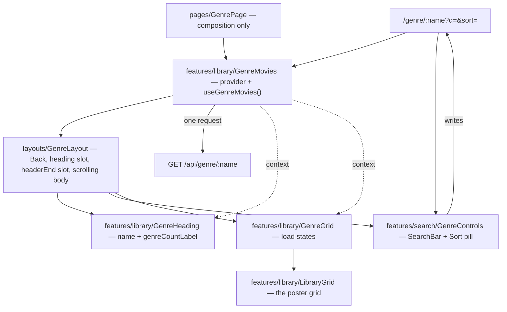

# 06 — The Genre page (`/genre/:name`)

## Background

`/genre/:name` has been a registered **placeholder route** since
`03-card-carousel`: every `GenreRow`'s "View all {count}" navigates to it
(`HomeRows.tsx:129`), and `pages/GenrePage/GenrePage.tsx` answers with
`<h1>{name}</h1>` and one line of prose. It is the last dead end in the
browse-and-discover flow.

`COMPONENT-SPEC.md:388` specs the screen as **"genre header (SearchBar + Sort
FilterDropdown) + `LibraryGrid`"**, and `page.GenrePage.dc.html` confirms it:
a Back pill, the genre name over a count line, a 250px search box, a Sort pill,
and a responsive poster grid (`feat.LibraryGrid.dc.html`). `LibraryGrid` is the
one feature in the component spec with no implementation at all.

**Sort is not an unbuilt feature.** `05-search-filter` Q1 ruled it in scope and
shipped it: `MOVIE_SORTS` / `MovieSort` / `DEFAULT_MOVIE_SORT`
(`src/types/browse.ts`), all five `ORDER BY` bodies (`browse.ts:12`), `?sort=`
on `/api/home` and `/api/movies`, `setSort` in `useLibraryQuery`, and the Sort
pill itself (`sortOptions.ts`, issue #35, `1e1591f`), refactored under #41.
Commit `813b546` reverted the README row on the premise that "Sort is its own
feature and has not been started", which contradicts `05-search-filter.md:47`
and the shipped code. That row is corrected as part of this initiative.

What _is_ unbuilt is sort's **second surface** — the genre header — which is
why this log carries the sort decisions only the genre page can settle.

## Problem

Translate `page.GenrePage.dc.html` into the codebase 1:1. Four things make it
more than a grid:

1. **The header needs data the body loads.** The count line is
   `shown === all ? "{all} titles" : "{shown} of {all} titles"`
   (`FamilyFlix.dc.html:490`). `shown` is the filtered result; `all` is the
   genre's unfiltered total. The header sits in a fixed bar and the grid in a
   scrolling one, so they are two subtrees over one payload — the same split
   `05` hit, one rung lower.
2. **The prototype's screens share one state tree.** `sortList()` is called by
   both `filteredSorted()` and `genrePageMovies()` (`:317–320`), so sort
   carries between screens for free. Our query lives in the URL, and
   `/genre/Action` is a different URL from `/`.
3. **The prototype applies a filter it does not show.** `genrePageMovies()`
   calls `passRating(m)` (`:320`) while the genre header has no rating pill.
4. **No endpoint returns a list and its unfiltered total together.**
   `GET /api/movies` returns `Movie[]` and parses only `sort` / `genre` /
   `limit`.

## Questions and Answers

### Scope

1. **Is the subject "sort" or "the genre page"?** ✅ The genre page. Sort's
   vocabulary, SQL, URL contract and pill are shipped and refactored; a
   grill-me would describe existing code. ❌ Grilling sort in isolation —
   re-decides decisions already encoded in tested code.
2. **Does Sort get ticked ✅ in README/CLAUDE.md?** ✅ Yes, in its own docs
   commit correcting `813b546`'s premise. It clears the
   feature-done-only-after-refactor bar twice: #35 built it, #41 refactored it,
   both closed.
3. **Initiative name?** ✅ `genre-page`. ❌ `browse-grid` (the home, done),
   ❌ `search-filter` (closed).
4. **Its own PRD?** ✅ Yes — `docs/PRDs/06-genre-page.md`. It adds a route, a
   layout, an endpoint and a repository aggregate.

### The query

5. **Where does the genre page's query live?** ✅ The URL:
   `/genre/:name?q=&sort=`. Same rule as the home — no component state, so Back
   out of a movie lands on the narrowed grid.
6. **Genre as path or query param?** ✅ Path. Already shipped in every "View
   all" link and in `App.tsx`. The genre is not a filter here; it is which
   screen this is.
7. **Does sort carry over from the home?** ✅ Yes — through the link.
   `HomeRows` builds `/genre/Action?sort=a-z`, omitted at the default. The
   prototype shares the state; letting a route change silently reset the order
   is a visible regression. ❌ Reading a "global" sort from somewhere outside
   the URL — that is the simulation, not the surface.
8. **Does the search text carry over?** ❌ No. The prototype clears
   `genreSearch` on entry (`:307`) and relabels the box "Search in {genre}" —
   it is a fresh, narrower search.
9. **Does the rating filter carry over, or apply?** ❌ No — a deliberate
   deviation from the prototype's _behavior_, not its surface. The genre header
   has no rating pill, and `parseLibraryQuery` already records the rule: "a
   hand-edited `?rating=7` can never narrow the library behind a pill still
   saying 'All ratings' — the URL and the screen must agree." Reproduce the
   surface; never port a filter with no control.
10. **Does `?genre=` mean anything on this route?** ❌ No. Ignored.
11. **Unknown or stale parameters?** ✅ Ignored, never rejected — an old
    bookmark still opens. Same rule as `parseLibraryQuery`.
12. **Its own parser and serializer?** ✅ `parseGenreQuery` +
    `toGenreQueryParams` in `src/utils/`, sharing `isMovieSort`, with the same
    round-trip property test `toLibraryQueryParams` has. ❌ Reusing
    `parseLibraryQuery` and ignoring two of its four parameters — a parser that
    accepts what its screen cannot show is how Q9 goes wrong later.

### The backend

13. **Which endpoint?** ✅ A new aggregate, `GET /api/genre/:name?q=&sort=`.
14. **Why not `GET /api/movies`?** Because the header needs the genre's
    unfiltered total beside the narrowed list. ❌ Two requests (`/movies` +
    `/genres`) — that is the fan-out `getHome` exists to avoid, and it forces
    `features/library` to import `features/search`'s `useGenreList`.
15. **Payload shape?** ✅ `GenrePayload { genre, total, movies }`.
16. **Where does the aggregate live?** ✅ `server/src/library/genre/genre.ts`,
    `createGenre(browse)` beside `createHome(browse)` — a composition of the
    two existing browse queries, no new SQL, no new repository primitive.
17. **What does `total` mean?** ✅ The genre's **unfiltered** total, from
    `listGenres()` — the same number "View all 214" promised, so "12 of 214
    titles" stays honest while a search narrows the grid.
18. **A genre the library does not hold?** ✅ `{ genre, total: 0, movies: [] }`
    with a 200. ❌ 404 — `/home` already records why: a stale bookmark for an
    emptied genre is a normal "nothing here".
19. **An unknown sort?** ✅ 400, matching `/home` and `/movies`. An empty value
    is no sort at all.
20. **A row cap?** ❌ None. This screen _is_ "View all".
21. **What does the search match?** ✅ `listMovies`'s existing `search` arm
    unchanged. Its genre clause is inert once the list is scoped to one genre,
    so there is nothing to special-case.
22. **Fate of `GET /api/movies`?** ✅ Kept — it is the generic browse API the
    CSV exporter will want — but its comment claims it is "for the genre page",
    which stops being true. Corrected in the same commit.
23. **Repository seam?** ✅ `LibraryStorage.getGenre(name, query)`, beside
    `getHome`.

### The frontend

24. **Where does the chrome live?** ✅ A second layout,
    `src/layouts/GenreLayout/`. The genre header shares nothing with
    `MainLayout` — no logo, no gear — and `COMPONENT-SPEC.md:398` says each page
    owns its header. Structure only: Back pill, `heading` slot, `headerEnd`
    slot, scrolling body. ❌ Styling the chrome inside the page (`pages/` is
    composition-only) or inside a feature (chrome is not domain UI).
25. **What does Back do?** ✅ `navigate(-1)` with a `/` fallback on a deep link
    — the `NO_HISTORY` pattern from `MoviePage.tsx:34`. ❌ The prototype's
    `goBrowse()`: it discards the home's filters _and_ its restored scroll.
    Two consumers now, so it is extracted to `src/hooks/useGoBack/` and
    `MoviePage` switches to it.
26. **Scroll restoration?** ✅ `useRestoredScroll` on the layout's body, as
    `MainLayout` does — Back out of a movie lands where the grid was left.
27. **The grid?** ✅ `src/features/library/LibraryGrid/`, named and placed per
    `COMPONENT-SPEC.md:364`. Presentational. Reuses the exported `CARD_WIDTH`
    from `CardCarousel.styles.ts` rather than a second magic number.
28. **Two subtrees, one payload — how?** ✅ A feature-local context:
    `src/features/library/GenreMovies/`, exporting `GenreMoviesProvider` and
    `useGenreMovies()`. The provider owns the fetch, the status machine,
    `retry` and the optimistic `toggleFavorite`. ❌ Calling the hook in both —
    two fetches. ❌ Lifting it into `GenrePage` — data logic in a page. ❌ One
    monolithic organism rendering header and body — it would have to own the
    chrome and the scroll container too.
29. **The count label?** ✅ A pure util,
    `src/features/library/genreCountLabel/`, with its own test — the same
    treatment `resumeLabel` got.
30. **The header controls?** ✅ `src/features/search/GenreControls/` — the
    SearchBar (`maxWidth={250}`, placeholder `Search in {name}`) and the Sort
    `FilterDropdown` (`menuWidth={220}`), both the prototype's numbers. They
    take no props and read the URL themselves, exactly as `LibrarySearch` and
    `LibraryFilters` do.
31. **The query hook?** ✅ `src/features/search/useGenreQuery/`, mirroring
    `useLibraryQuery`: one parameter per setter, every write a `replace`, each
    omitted at its default.
32. **The 250ms debounce?** ✅ Extracted to
    `src/features/search/useSettledText/` and used by both `LibrarySearch` and
    `GenreControls`. ❌ A second copy — `LibrarySearch`'s docblock claims the
    debounce "lives here and nowhere else"; the extraction keeps that true.
33. **`withFavorite`?** ✅ Gains a flat-list sibling in the same module; the
    rows variant maps over it. One concept, two shapes, one folder.

### States and copy

34. **Loading?** ✅ A skeleton grid (12 cards), **first load only** — a refetch
    after the typing settles keeps the grid on screen. Same discipline as
    `HomeRows`.
35. **Failure?** ✅ `LoadMessage` — "Couldn't load this genre" / "Something went
    wrong reading your movies." — with a Retry action.
36. **How many ways of coming back with nothing?** ✅ Two, worded apart,
    extending `HomeRows`' rule. `total === 0`: "Nothing here" / "There are no
    movies in {name}." — no action, nothing to retry. `total > 0` with a search
    that missed: the prototype's copy verbatim, "No matches" / "Nothing in
    {name} matches “{search}”."
37. **Count label wording?** ✅ Singularised — "1 title", not the prototype's
    "1 titles" (`:490`). A copy bug, not a design choice, so per CLAUDE.md the
    **prototype is amended first** (`page.GenrePage.dc.html` and
    `FamilyFlix.dc.html`) and the build follows the amended prototype. The only
    amendment this feature needs.
38. **Card interactions?** ✅ Identical to the home: click opens `/movie/:id`;
    the heart toggles optimistically through the provider and reverts on
    failure. Poster cards only — no Continue cards on this screen.

## Design

### Types (`src/types/browse.ts`)

```ts
/** The genre page's query. The genre itself travels in the path, not here. */
export interface GenreQuery {
  sort: MovieSort;
  /** @see MovieQuery.search */
  search?: string;
}

/** What `GET /api/genre/:name` answers with: the genre's true total + the list. */
export interface GenrePayload {
  genre: string;
  /** The genre's **unfiltered** movie count — the number "View all" promised. */
  total: number;
  movies: Movie[];
}
```

### Server

```ts
// server/src/library/genre/genre.ts
export interface GenreAggregate {
  getGenre(name: string, query?: GenreQuery): GenrePayload;
}
export function createGenre(browse: Browse): GenreAggregate;
```

`getGenre` = `listGenres()` for the total (0 for a genre the library does not
hold) + `listMovies({ ...query, genre: name })` for the list. No cap.

`GET /api/genre/:name` parses `q` → `search` and `sort` (400 on an unknown
sort). `GET /api/movies` keeps its behavior; only its comment changes.

### Frontend



### Files

| Path                                    | What                                              |
| --------------------------------------- | ------------------------------------------------- |
| `src/types/browse.ts`                   | `GenreQuery`, `GenrePayload`                      |
| `src/utils/parseGenreQuery/`            | URL → `GenreQuery` (+ test)                       |
| `src/utils/toGenreQueryParams/`         | `GenreQuery` → URL (+ test)                       |
| `server/src/library/genre/genre.ts`     | `createGenre` aggregate (+ test)                  |
| `server/src/library/index.ts`           | `getGenre` on `LibraryStorage`                    |
| `server/src/routes/index.ts`            | `GET /api/genre/:name`; correct `/movies` comment |
| `src/features/library/api/api.ts`       | `fetchGenrePayload(name, query)`                  |
| `src/features/library/GenreMovies/`     | provider + `useGenreMovies()`                     |
| `src/features/library/GenreHeading/`    | name + count line                                 |
| `src/features/library/genreCountLabel/` | pure label (+ test)                               |
| `src/features/library/GenreGrid/`       | skeleton / error / two misses / grid              |
| `src/features/library/LibraryGrid/`     | the responsive poster grid                        |
| `src/features/library/withFavorite/`    | flat-list sibling                                 |
| `src/features/library/HomeRows/`        | "View all" carries the sort                       |
| `src/features/search/useGenreQuery/`    | `{ query, setSearch, setSort }`                   |
| `src/features/search/GenreControls/`    | SearchBar + Sort pill                             |
| `src/features/search/useSettledText/`   | the one debounce, shared                          |
| `src/features/search/LibrarySearch/`    | switches to `useSettledText`                      |
| `src/layouts/GenreLayout/`              | the genre chrome                                  |
| `src/hooks/useGoBack/`                  | history-or-`/`; `MoviePage` switches to it        |
| `src/pages/GenrePage/GenrePage.tsx`     | composition only                                  |
| `docs/handoff/*.dc.html`                | singularise the count label                       |

## Implementation Plan

1. **The payload, end to end.** `GenreQuery` / `GenrePayload`, `createGenre`,
   `getGenre` on the seam, `GET /api/genre/:name`. Verifiable with `curl`
   against the seeded db; nothing on screen yet.
2. **The query in the URL.** `parseGenreQuery`, `toGenreQueryParams`,
   `useGenreQuery`. Pure units + round-trip test.
3. **The surface, unwired.** `LibraryGrid` and `GenreLayout` against fixture
   props — the screen is pixel-correct before any data reaches it.
4. **Real data.** `fetchGenrePayload`, `GenreMovies`, `GenreHeading`,
   `genreCountLabel`, `GenreGrid`, and `GenrePage` composed. "View all" now
   opens a real screen with every load state.
5. **The controls.** `GenreControls`, the carried sort on "View all", and the
   two extractions (`useSettledText`, `useGoBack`) with their existing call
   sites switched over.
6. **Docs.** PRD, glossary, dev journal, the prototype amendment, and the
   README/CLAUDE.md rows: Sort ✅ (correcting `813b546`) and the genre page.

## Trade-offs

**Easier.** A second layout plus a per-route query parser is the shape every
later drill-down screen copies — Favorites, a flat search-results page, a
collection. `GenreMovies` is the reusable answer to "a fixed header and a
scrolling body over one payload". Extracting `useSettledText` and `useGoBack`
means the app keeps exactly one debounce and one Back rule as screens multiply.

**Harder.** Three small units (`GenreMovies`, `GenreHeading`, `GenreGrid`) where
`HomeRows` is one, and a context to read before following the data. That is the
price of the header needing what the body loaded. Carrying the sort on the link
also means "View all" now builds a query string, so a future control belonging
to both screens has to decide, explicitly, whether it carries too.

**Ruled out of scope.** The rating filter on this screen (Q9 — no control, no
filter). A Favorites row or page. Any change to `GET /api/movies` beyond its
comment. Client-side re-sorting of a loaded grid — the server owns order, as
`05` decided.
