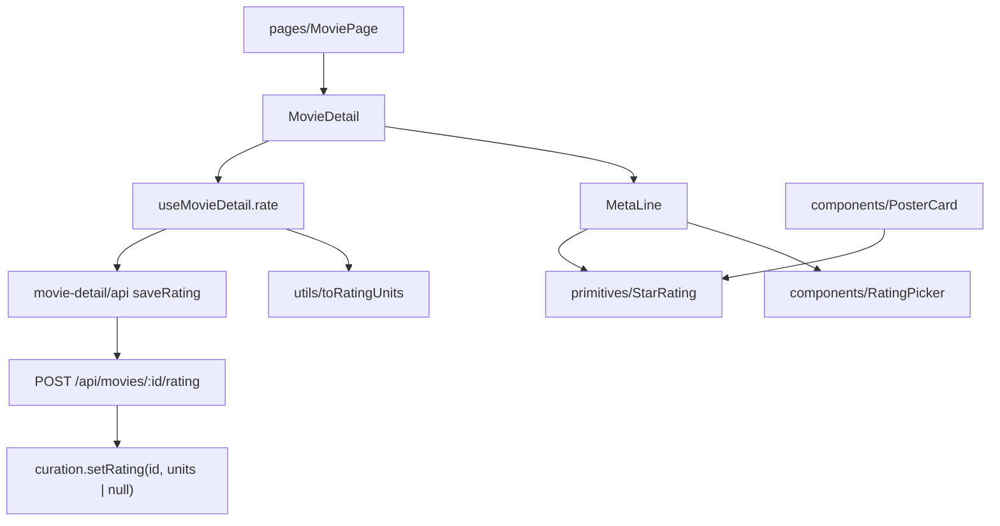

# 07 — Ratings (the write half)

## Background

**Ratings display already ships.** `prim.StarRating` is translated
(`src/primitives/StarRating/`), it renders on every **Poster card**
(`PosterCard.tsx:131`, 13px) and on the **Movie detail page**'s **Meta line**
(`MetaLine.tsx:60`, 20px, `showValue`). `05-search-filter` shipped the
**Minimum rating** pill and the `highest-rated` **Sort order**. `01-library-core`
shipped the column (`rating INTEGER CHECK(rating BETWEEN 0 AND 10)`, `NULL` =
**Unrated**), the `curation` slice, and `storage.setRating(id, units | null)`
(`server/src/library/curation/curation.ts:22`).

What does **not** exist is any way to _set_ a rating. There is no route, no
client call, and no control — `mol.RatingPicker.dc.html` is one of the few
prototype files with no implementation.

Two earlier logs deliberately left this here:

- `04-movie-detail` Q10 hid the star **Meta segment** entirely when a movie is
  **Unrated**, explicitly _pending_ this feature: "an 'unrated, tap to rate'
  state wants the affordance that acts on it" (`04-movie-detail.md:110`).
- `02-browse-grid` Q10 mapped **Unrated** to 0 stars on the card and flagged it
  as "visually identical to a real 0" (`02-browse-grid.md:65`);
  `ubiquitous-language.md:265` records it as **still open**, to be
  "revisit[ed] with the **Ratings** feature".

Both are this log's inheritance, not new questions.

## Problem

Translate `mol.RatingPicker.dc.html` into the codebase 1:1 and give it a call
site. Three things make it more than a molecule:

1. **The prototype's only picker is in `feat.MovieForm`** — a 🔜, unscheduled
   maintainer screen. Building `components/RatingPicker/` against it means
   shipping a component with zero call sites, and it means a **Rating** is
   unreachable from the parent-facing app that README files it under.
2. **The picker cannot express our domain.** It is `value: number` where
   `val > 0 ? '4.0 / 5' : 'Not rated'` — it conflates a literal `0` with
   **Unrated**, a distinction `01-library-core` Q6 made load-bearing. It also
   has no way to clear a rating at all.
3. **Its hit areas are keyboard-dead** — ten bare `<div onClick>` overlays
   (`mol.RatingPicker.dc.html:20–28`).

## Questions and Answers

### Scope

1. **What is left of "Ratings" given display ships?** ✅ Three things: the
   `RatingPicker` molecule, the write path behind it, and the **Unrated**-on-a-
   card question `ubiquitous-language.md:265` deferred to this feature.
   ❌ Re-grilling star display — it is shipped, tested and refactored.
2. **Where can a Rating be set?** ✅ The **Movie detail page** — an amendment to
   the prototype, raised here per `CLAUDE.md` ("raise it in the grill-me session
   and amend the prototype first"). Three reasons: README/CLAUDE.md file Ratings
   under **Browse & discover (parent-facing)**, and a parent-facing feature
   reachable only through the maintainer's Add-Movie form contradicts its own
   placement; `setFavorite` and `setRating` are siblings in one `curation` slice
   described as "the two single-column household signals", and **Favorite** is
   settable from this page; and a molecule with no call site is speculative work
   this codebase otherwise refuses. ❌ MovieForm only — defers the whole feature
   behind an unscheduled one. ❌ Both now — MovieForm does not exist to build
   into.
3. **Where on the page — a new row, or the actions row beside ✓ and ♥?**
   ✅ **In place: the Meta line's rating segment becomes the picker.** Smallest
   possible amendment — same position, same size, gains hover and click.
   ❌ A separate row: a rated movie then shows its stars twice on one screen,
   which reads as a bug. ❌ The primary-actions row: 44px icon-button furniture,
   and a five-star strip unbalances it — and it would still leave the **Meta
   line**'s duplicate stars to delete.
4. **Does a `features/ratings/` folder appear?** ❌ No. A **Rating** is a
   household signal owned by the screen that shows it, exactly like
   **Favorite**; the work lands in `features/movie-detail/`.

### The Unrated retraction

5. **`04-movie-detail` Q10 omits the rating segment when Unrated. If the segment
   is now the input, an Unrated movie has nothing to click.** ✅ **Retract it.**
   **Unrated** renders five empty, clickable stars labelled `Not rated`. Q10's
   reason was that empty stars printing `0.0` sound like a verdict; once the
   stars are visibly an _input_ labelled `Not rated`, they read as an
   invitation. Q10 named this exact successor (`:110`), so this is the deferred
   half arriving, not a reversal. ❌ Keeping the omission — the movies most in
   need of a rating are precisely the ones with no control to rate them.
6. **Does `metaSegments`' interleaving survive?** ✅ Yes. `year` and
   `runtimeLabel` stay nullable, so the no-dangling-separator machinery still
   earns its place; only the rating segment stops being omissible.
7. **Resolve `02-browse-grid` Q10: an Unrated card reads `★★★★★ 0.0`.** ✅ Keep
   the five empty stars — the star row is fixed furniture in a fixed-height
   tile, which is why Q10 deferred rather than solved — but **omit the numeric
   value** when **Unrated**. **Unrated** reads `★★★★★`; a literal `0` reads
   `★★★★★ 0.0`. ❌ Hiding the row (uneven cards). ❌ The word "Unrated" on a
   210px tile (copy the prototype does not contain).
8. **Can a Rating be set from a Poster card?** ❌ No. The prototype gives the
   card a heart only, and ten **Half-star segments** on a 210px tile is a
   mis-click hazard on the screen the parents use most.

### The molecule

9. **Percent or 0–10 units?** ✅ Percent — `components/` know nothing about the
   domain (CLAUDE.md), `StarRating` already takes percent, and the view models
   already carry percent. ❌ Units — pushes domain vocabulary one rung too low.
10. **Value type?** ✅ `number | null`, `null` = **Unrated**. The prototype's
    `val > 0` test re-derives a distinction the record already makes.
    `StarRating.rating` is widened the same way (Q7 needs it).
11. **Can it clear back to Unrated?** ✅ Yes — clicking the **Half-star
    segment** that already holds the current value emits `null`. The same
    "click it again to turn it off" grammar as the heart and the watched tick,
    zero new pixels, and it is the only undo for a mis-click. ❌ A visible
    "Clear" button (copy and pixels the prototype does not have). ❌ No clearing
    (a mis-click is then permanent until MovieForm ships).
12. **Can it set a literal `0`?** ❌ No — its smallest click is half a star. `0`
    arrives only from a TMDB-seeded import. When a person clears they mean
    **Unrated**, the same asymmetry **Minimum rating** already documents.
13. **Sizing.** ✅ A `size` prop, default `30` (the prototype's, which MovieForm
    will take); the **Meta line** passes `20`. Gap and hit-area widths scale off
    `size`, as `StarRating`'s letter-spacing already does.
14. **Value label — the picker says `4.0 / 5`, the shipped Meta line says
    `4.0`.** ✅ The picker keeps `4.0 / 5` / `Not rated` at every call site.
    Once the stars are clickable the `/ 5` earns its place, and one label rule
    means no variant prop. The **Poster card** keeps `StarRating`'s bare `4.0`.
15. **Hover preview?** ✅ 1:1 — hovering a segment previews that fill, leaving
    the strip restores the stored value. The **Rating preview** is local state
    in the molecule, never lifted.
16. **The prototype's hit areas are keyboard-dead.** ✅ Render them as
    `<button type="button">` with `aria-label` (`Rate 3½ stars`, or
    `Clear rating` on the current value's segment), `onFocus` mirroring
    `onMouseEnter` so a keyboard user sees the same **Rating preview**, and
    `role="group"` + `aria-label="Your rating"` on the strip. Identical pixels,
    real semantics — the trade `prim.Toggle` already made with `role="switch"`.

### The write path

17. **Route shape?** ✅ `POST /api/movies/:id/rating`, body
    `{ value: number | null }`, echoing `{ value }` — the third sibling of
    `/favorite` and `/watched`, same conventions. 404 on an unknown id. `null`
    is validated explicitly (`typeof null !== 'number'`); anything not `null`
    and not an integer `0–10` is a 400, as an off-scale `?rating=` already is.
18. **Why not `PATCH /movies/:id` through `updateMovie`?** ✅ Because `setRating`
    is a documented dedicated mutator and both existing single-signal writes
    have dedicated routes. `updateMovie` is the _form's_ path and arrives with
    movie-form.
19. **Where does `saveRating` live?** ✅ `features/movie-detail/api/api.ts`,
    beside `saveWatched`. ❌ `features/library/api` — the picker has no browse
    call site, so it need not repeat `saveFavorite`'s split-home compromise
    (`useMovieDetail.ts:5–8`).
20. **Reuse `useOptimisticSave`?** ❌ No — it is boolean-only by explicit design,
    and its own comment names this arrival: "a save with more than two values …
    has to be told what to put back". ✅ `useMovieDetail.rate()` hand-rolls the
    same bargain its two existing writes do, keeping the previous
    `ratingPercent` to restore. Three hand-rolled optimistic writes in one hook
    is then real duplication — **filed as a refactor candidate**
    (`useOptimisticEdit(previous, apply, save)`), not generalised mid-build.
21. **Does rating bump `updated_at`?** ❌ No — a plain single-column write like
    `setFavorite`. `recently-added` orders by `created_at`, so rating a movie
    never reshuffles the shelf. Already built this way.
22. **Does the browse grid see the new rating?** ✅ On its next load, exactly as
    **Favorite** and watched behave today. No cross-screen store is introduced.
23. **Snackbar on a refused save?** ❌ No — the snackbar system is its own 🔜
    feature. The revert is the feedback, as it is for the heart and the tick.
24. **Who may rate / does TMDB change?** ✅ No gating (single household profile,
    a **Rating** is the household score) and no change to seeding, which stays
    with import-export.

## Design

### Amendments to the prototype (before `build`)

- `docs/handoff/page.MoviePage.dc.html` — the **Meta line**'s
  `dc-import name="prim.StarRating"` becomes `mol.RatingPicker` at `size=20`,
  wired to `detail.onRate`, and is no longer conditional on a rating existing.
- `docs/handoff/COMPONENT-SPEC.md` — `RatingPicker` gains the `size` prop and
  the `number | null` value; `StarRating` gains `number | null`; the
  `page.MoviePage` row lists RatingPicker instead of StarRating.

### Type signatures

```ts
// src/components/RatingPicker/RatingPicker.tsx
export interface RatingPickerProps {
  /** Fill as a 0–100 percent; `null` is Unrated. */
  value: number | null;
  /** Star glyph size in px. */
  size?: number; // default 30
  /** A half-star segment was chosen, or `null` to clear back to Unrated. */
  onChange: (value: number | null) => void;
}

// src/primitives/StarRating/StarRating.tsx  (widened)
rating: number | null; // null → empty stars, and no numeric value

// src/types/viewModels.ts  (widened)
interface PosterCardMovie {
  rating: number | null; /* … */
}

// src/utils/toRatingPercent/toRatingPercent.ts  (widened)
export function toRatingPercent(rating: number | null): number | null;

// src/utils/toRatingUnits/toRatingUnits.ts  (new — the inverse)
export function toRatingUnits(percent: number | null): number | null;

// src/features/movie-detail/api/api.ts
export async function saveRating(
  id: string,
  units: number | null
): Promise<number | null>;

// src/features/movie-detail/useMovieDetail/useMovieDetail.ts
rate: (percent: number | null) => void;
```

### Where things live

```
src/
├── primitives/StarRating/           ← widened to number | null
├── components/RatingPicker/         ← NEW  .tsx / .test.tsx / .styles.ts
│                                       (+ one line in components/index.ts)
├── utils/toRatingUnits/             ← NEW  .ts / .test.ts (+ utils/index.ts)
├── utils/toRatingPercent/           ← returns number | null
├── types/viewModels.ts              ← PosterCardMovie.rating: number | null
└── features/
    ├── library/view/view.ts         ← stops flattening null → 0
    └── movie-detail/
        ├── MetaLine/                ← renders RatingPicker, always present
        ├── api/api.ts               ← + saveRating
        ├── detailView/detailView.ts ← the null special-case collapses
        └── useMovieDetail/          ← + rate()
server/src/routes/index.ts           ← + POST /movies/:id/rating
```



### Chosen vs. rejected

- ✅ Picker on the **Movie detail page**, in the **Meta line**'s own slot.
  ❌ MovieForm only; ❌ a new row; ❌ the primary-actions row.
- ✅ `number | null` through the molecule, the primitive and the view model.
  ❌ `0` standing in for **Unrated**.
- ✅ Click-the-current-segment to clear. ❌ A "Clear" button; ❌ no clearing.
- ✅ A dedicated `POST …/rating` route. ❌ `PATCH /movies/:id`.
- ✅ Hand-rolled optimistic write + a refactor issue. ❌ Generalising
  `useOptimisticSave` speculatively.

## Implementation Plan

1. **Thinnest end-to-end slice — one rating, saved.**
   `POST /api/movies/:id/rating` (+ route tests), `saveRating`, `toRatingUnits`
   (+ test), and `useMovieDetail.rate()` wired to a `RatingPicker` rendered in
   the **Meta line** at its stored value. Rated movies only; **Unrated** still
   omits the segment. Clicking a star persists and survives a reload.
2. **The molecule in full.** `components/RatingPicker/` to prototype pixels:
   `size`, ten `<button>` **Half-star segments** with `aria-label`s, hover +
   focus **Rating preview**, `4.0 / 5` / `Not rated` label,
   click-the-current-segment-to-clear → `null`.
3. **The Unrated retraction.** Widen `StarRating.rating` and `toRatingPercent`
   to `number | null`; `detailView`'s special case collapses; the **Meta
   line**'s rating segment becomes unconditional; `MetaLine` tests updated for
   the always-present segment.
4. **The Poster card resolution.** `PosterCardMovie.rating: number | null`,
   `view()` stops flattening, `StarRating` omits the numeric value when `null`.
5. **Prototype + docs.** Amend `page.MoviePage.dc.html` and
   `COMPONENT-SPEC.md`; tick Ratings in README/CLAUDE.md only after the refactor
   issue closes (per `feature-done-only-after-refactor`).

## Trade-offs

**Easier.** A **Rating** becomes a one-click household signal on the same screen
as its two siblings, so all three curation writes share one page, one optimistic
bargain and one route convention. `RatingPicker` lands fully built and tested,
so MovieForm consumes it later with no rating work of its own. `number | null`
end-to-end means **Unrated** stops being re-derived at four different rungs.

**Harder.** The prototype now has an amendment to keep in step — the first one
this project has taken, so `page.MoviePage.dc.html` and the implementation must
be changed together or the "prototype is the spec" rule quietly rots.
`useMovieDetail` grows a third hand-rolled optimistic write before the
abstraction that would fold them exists.

**Out of scope.** Rating from a **Poster card** (mis-click hazard, not in the
prototype). Setting a literal `0`. A snackbar on failure (its own 🔜 feature).
TMDB seeding (import-export). `updateMovie`/MovieForm's rating field. Any
cross-screen cache that would let a card restyle itself without a reload.
