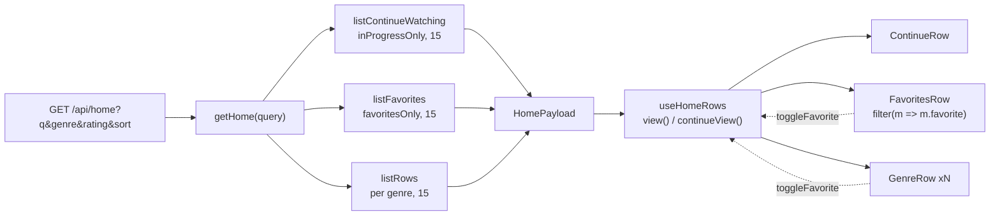

# 08 — Favorites (the row)

## Background

**Almost all of Favorites already ships.** The feature was built sideways across
five earlier initiatives, and only one piece was ever left out.

Shipped, and not re-opened here:

- **Storage.** `is_favorite INTEGER NOT NULL DEFAULT 0` plus a partial index
  (`migrations.ts:44`, `:79`), and `setFavorite(id, value)` in the `curation`
  slice beside `setRating` (`curation.ts:16`) — `01-library-core`.
- **The write path.** `POST /api/movies/:id/favorite` as a **Single-signal
  write** through `writeSignal` (`routes/index.ts:358`), with `saveFavorite`
  over `postValue` on the client (`features/library/api/api.ts`).
- **The query.** `favoritesOnly` on `MovieQuery`, honoured by
  `browse.listMovies` (`browse.ts:65`) — built in `02-browse-grid`, and
  **never called by anything**. It was put there for this row.
- **Both browse hearts.** `PosterCard`'s corner heart, `withFavorite` /
  `withFavoriteInList`, and `useOptimisticSave` wiring it on the home rows
  (`useHomeRows.ts:115`) and the genre grid (`useGenreQuery.ts` / `GenreMovies`).
- **The detail heart.** `MovieDetail.tsx:179` through `useOptimisticEdit`
  (`07-ratings`), which is why `MovieDetailModel.isFavorite` exists.

`RowSection` was written knowing this log was coming: _"the prototype has a
third of them coming (Favorites, 22px with a leading icon)"_
(`RowSection.tsx:30`).

So CLAUDE.md's "mark from card and detail" is **done**. What does not exist is
the **Favorites row** the glossary already names (`ubiquitous-language.md:26`) —
the shelf that `favoritesOnly` was built for.

## Problem

Translate the prototype's Favorites section
(`page.LibraryPage.dc.html:181–219`) 1:1: a shelf between **Continue Watching**
and the genre rows, a 22px serif heading with an accent heart beside it, and a
poster `CardCarousel` of the household's favorites, hidden entirely when there
are none.

Two things make it more than "render one more row":

1. **It cannot be derived on the client.** The prototype's `favoritesList` is
   `filteredSorted().filter(m => favorites.includes(m.id)).slice(0,15)`
   (`FamilyFlix.dc.html:406`) — trivial, because the prototype holds the whole
   library in memory. Ours does not: genre rows arrive capped at 15 by the
   server, and an **untagged** movie earns no genre row at all. Filtering what
   is already loaded would silently omit favorites.
2. **Un-favoriting from the row is a destructive optimistic edit.** The card
   must leave the shelf, but `useOptimisticSave` reverts by calling
   `apply(id, !value)` — if `apply` removed the movie, a refused save would have
   nothing to put back.

## Questions and Answers

### Scope

1. **What is actually left of Favorites?** ✅ One thing: the row. The column,
   the route, the client call, the query flag, the molecule's heart, the detail
   heart and the optimistic plumbing all ship.
   ❌ Re-grilling the heart on the card or the detail page — shipped, tested,
   refactored.
2. **Any new primitive, molecule, util or endpoint?** ✅ None. `HeartIcon`,
   `CardCarousel`, `PosterCard`, `RowSection`, `view()`, `withFavoriteInList`,
   `useOptimisticSave` and `POST /:id/favorite` all exist. The additions are one
   payload section, one feature component, one `RowSection` prop, and wiring.

### The section

3. **Client-derived or a server-built section?** ✅ A `favorites` section on
   `HomePayload`. ❌ Deriving from loaded rows — the 15-cap and untagged
   favorites make it wrong, not merely inelegant (Problem §1).
4. **Where is it built, and does it need SQL?** ✅ `createHome`
   (`server/src/library/home/home.ts`), no new SQL: `listFavorites` is the
   structural twin of `listContinueWatching` (`home.ts:87`) —
   `browse.listMovies({ ...query, favoritesOnly: true, limit: HOME_ROW_LIMIT })`.
   The home aggregate's own rule is that every section is a composition of the
   two existing browse queries; this keeps it true.
   ❌ A `/api/favorites` endpoint — a second request for one screen is exactly
   what `/home` was built to avoid.
5. **Does the row obey the header's query?** ✅ All four parts — `search`,
   `genre`, `minRating`, `sort` — by spreading `...query` first, as continue
   does. Matches the prototype's `filteredSorted()`, and preserves the invariant
   `getHome` exists for: the top of the screen cannot disagree with the rest of
   it.
6. **Cap?** ✅ `HOME_ROW_LIMIT` (15), the same cap every home section takes.
7. **Payload key and order?** ✅ `favorites: Movie[]`, declared
   `continueWatching, favorites, rows` — the on-screen order.
   ❌ The prototype's `favoritesList` / `showFavorites` — template plumbing, not
   domain terms; `showFavorites` is `favorites.length > 0` computed at render.

### The row's behavior

8. **Does un-favoriting remove the card immediately?** ✅ Yes — by **filtering a
   kept list**, never by removing from state. The hook keeps every movie the
   payload sent and flips flags on it with `withFavoriteInList`; `FavoritesRow`
   renders `movies.filter((m) => m.favorite)`. The card leaves at once (a
   "Favorites" shelf holding a non-favorite is a lie), and a refused save flips
   the flag back and returns it.
   ❌ Splicing the movie out of the hook's state — see Problem §2: the revert
   would have nothing to restore.
9. **Must a heart toggled here move the same movie's heart in its genre row?**
   ✅ Yes, in one `setData`: `withFavorite(rows, …)` **and**
   `withFavoriteInList(favorites, …)`. A favorite is in the shelf _and_ in every
   genre row it is tagged with; those cards are one movie and must never
   disagree — the rule `withFavorite`'s docblock already states across rows, now
   applied across sections.
10. **Does the row get a "View all"?** ✅ No — the prototype has none, and
    `docs/handoff/` has no Favorites page. **Recorded gap:** favorites past the
    15th are then unreachable. Per CLAUDE.md that is a prototype amendment, not
    an improvisation mid-build; filed as a follow-up, not built here.
11. **Empty row?** ✅ Renders `null` — no heading, no empty shelf. The same "a
    row with nothing on it is not a row" rule `ContinueRow` follows, and what
    the prototype's `showFavorites` guard does.

### Chrome

12. **How does the heart get into the heading?** ✅ `RowSection` gains an
    optional `icon?: ReactNode` slot; `Title` becomes
    `inline-flex; align-items: center; gap: 10px`. Inline-level, so `Header`'s
    existing `align-items: baseline` still lines a genre row's "View all" up
    with its heading.
13. **Who owns the icon's accent color?** ✅ `FavoritesRow.styles.ts`.
    `RowSection`'s docblock commits it to being **domain-blind**; it must not
    know its icon is a heart or that hearts are accent-coloured. The prototype's
    `margin-top: 2px` optical nudge rides along in the same wrapper.
    ❌ Colouring inside `RowSection` — breaks the promise that made it shared.
14. **Is the icon announced?** ✅ No — `<HeartIcon size={20} />` with no `title`,
    so `IconBase` renders it `aria-hidden`. The heading text "Favorites" already
    names the region through `RowSection`'s `aria-labelledby`.
15. **Heading size?** ✅ 22 — a genre row's size, not Continue Watching's 24.
    Straight from `page.LibraryPage.dc.html:196`.

### The screen

16. **Where does it sit?** ✅ Between `ContinueRow` and the genre rows in
    `HomeRows`.
17. **Does the "Your library is empty" guard change?** ✅ Yes. It currently reads
    `rows.length === 0 && continueWatching.length === 0` (`HomeRows.tsx:87`). A
    **watched, untagged** favorite earns no genre row and no continue tile, so
    the screen would print "Your library is empty" above a populated Favorites
    row. `favorites.length === 0` joins the guard.
18. **A Favorites skeleton while loading?** ✅ No — `LoadingRows`' three skeleton
    sections already stand in for the whole body, and the prototype has no
    favorites-shaped placeholder.

## Design

### Server

```ts
// src/types/browse.ts — HomePayload gains one section
export interface HomePayload {
  continueWatching: Movie[];
  favorites: Movie[];
  rows: HomeRow[];
}

// server/src/library/home/home.ts — twin of listContinueWatching
function listFavorites(query: LibraryQuery): Movie[] {
  return browse.listMovies({
    ...query,
    favoritesOnly: true,
    limit: HOME_ROW_LIMIT,
  });
}
```

`GET /api/home` needs **no change** — it already forwards the whole
`LibraryQuery` to `storage.getHome(query)`.

### Client

```ts
// features/library/home/useHomeRows — sections and the shared edit
interface HomeSections {
  rows: GenreRowModel[];
  continueWatching: ContinueCardMovie[];
  favorites: PosterCardMovie[]; // mapped through view(), like a genre row's
}

// one setData, both sections — a movie's cards must never disagree
setData((current) =>
  current === null
    ? current
    : {
        ...current,
        rows: withFavorite(current.rows, id, favorite),
        favorites: withFavoriteInList(current.favorites, id, favorite),
      }
);
```

```ts
// features/library/home/FavoritesRow/FavoritesRow.tsx
export interface FavoritesRowProps {
  movies: PosterCardMovie[];
  onOpenMovie?: (id: string) => void;
  onToggleFavorite?: (id: string, favorite: boolean) => void;
}
```

```ts
// features/library/home/RowSection/RowSection.tsx — one new prop
/** An optional mark shown before the heading text — the Favorites heart. */
icon?: ReactNode;
```

**Files**

| Path                                                                           | Change                           |
| ------------------------------------------------------------------------------ | -------------------------------- |
| `src/types/browse.ts`                                                          | `HomePayload.favorites`          |
| `server/src/library/home/home.ts` (+ `.test.ts`)                               | `listFavorites`                  |
| `server/src/routes/routes.test.ts`                                             | payload shape                    |
| `src/features/library/home/useHomeRows/useHomeRows.ts`                         | section + shared `applyFavorite` |
| `src/features/library/home/RowSection/RowSection.{tsx,styles.ts}`              | `icon` slot                      |
| `src/features/library/home/FavoritesRow/FavoritesRow.{tsx,test.tsx,styles.ts}` | **new**                          |
| `src/features/library/home/HomeRows/HomeRows.tsx`                              | render + empty guard             |



## Implementation Plan

1. **The section, end to end.** `HomePayload.favorites`, `listFavorites` in
   `createHome`, `useHomeRows` mapping it through `view()`, and a bare
   `RowSection` + `CardCarousel` rendering it in `HomeRows`. Thinnest path that
   puts a real favorite on screen from the real database — the seed already
   marks three (`seed.ts:171`, `:297`, `:343`).
2. **The chrome.** `RowSection`'s `icon` slot, `FavoritesRow` as its own
   component with the accent heart, `null` when empty.
3. **The shared edit.** `applyFavorite` across both sections, plus the
   `filter(m => m.favorite)` that makes an un-favorited card leave and a refused
   save bring it back.
4. **The guard.** `favorites.length === 0` in the empty-library check.

## Trade-offs

**Easier.** Every section of the home is now one composition over
`browse.listMovies` with a different flag — a fourth shelf costs one function.
`favoritesOnly` finally has a caller, so a flag with no call site stops being
dead weight. `RowSection` gets the icon slot its docblock promised, so nothing
about it had to be reopened.

**Harder.** The Favorites row is the first place where one optimistic edit has
to reach two sections of the same payload; `applyFavorite` is correspondingly
less obvious than the single-section version it replaces. And the row's rendered
contents are now a _derived_ view of hook state (`filter`), not the state itself
— the price of making the revert possible.

**Out of scope.** A Favorites page behind "View all" (Q10) — no prototype, so
favorites past the 15th stay unreachable until the prototype is amended. A
Favorites filter pill in the header, and any per-person favorites: FamilyFlix is
one shared household profile.
