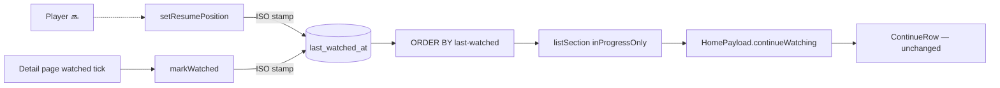

# 09 — Continue Watching row (ordering the resume shelf)

## Background

CLAUDE.md lists **Continue Watching row** as 🔜, but the row itself already
ships. [03-card-carousel](./03-card-carousel.md) built and mounted it end to
end:

- `src/components/ContinueCard/` — the 16:10 gradient tile, scrim, title,
  **Resume label**, 4px accent track, play badge
- `src/features/library/home/ContinueRow/` — 24px serif heading via `RowSection`,
  hidden entirely when empty
- `src/features/library/home/continueView/` — `Movie` → `ContinueCardMovie`
- `CardCarousel variant="continue"`, `HomePayload.continueWatching`, and
  `HomeRows` rendering it above the Favorites shelf

Diffed against `docs/handoff/page.LibraryPage.dc.html:157-179`, that translation
is 1:1 and complete. Nothing on this screen is missing.

What is missing is the one thing 03 deferred. Its **Q11** reads:

> **What order does the Continue row use?** `recently-added`, with the cap at 15.
> The _correct_ order is most-recently-watched, which needs an `updated_at`-backed
> sort `MovieSort` doesn't have. ❌ adding a sort with no writer behind it —
> revisit when the player reports positions.

That revisit is this entry. The player has still not shipped —
`src/pages/PlayerPage/PlayerPage.tsx` is a stub and `Watch.setResumePosition`
has no HTTP route and no caller — so the shelf is filled only by the dev seed.
The ordering defect is real regardless of who eventually writes the positions: a
resume queue ordered by when a film was **added to the library** is answering a
different question from the one the shelf asks.

## Problem

Order the Continue Watching row most-recently-watched-first, without inventing a
user-facing sort the prototype's five-option Sort menu cannot name, and without
pulling resume writes — a separate 🔜 feature — into this round.

## Questions and Answers

1. **Scope, given the row already ships?** ✅ **Ordering only.** Backend-only;
   resume writes stay with Watch tracking. ❌ ordering + the write path
   (`POST /api/movies/:id/resume` plus a shared `saveResume`): a route and an
   `api/` module with zero callers until the player lands, which is the dead-code
   shape 03 rejected in the first place. ❌ docs-only, ticking the row ✅ and
   folding the order into Watch tracking: the defect is in the shelf's own
   contract, not in playback, and it is fixable now.
2. **Reuse `updated_at`, or add a column?** ✅ **A new `last_watched_at`.**
   ❌ `updated_at`: `updateMovie` bumps it on **any** edit, so favoriting or
   re-rating a film would shove it to the front of the resume queue. Ordering by
   "when did anything about this record change" is not ordering by "when did we
   last watch it".
3. **Which mutators stamp it?** ✅ **`setResumePosition` and `markWatched`.** The
   column records when the movie was last watched, and finishing it is watching
   it. ❌ `markUnwatched` — un-marking is not watching, and it leaves the resume
   position at 0, so the movie cannot re-enter the row anyway. ❌ `updateMovie` —
   same reason as Q2; a general metadata edit must never reshuffle the queue.
4. **Is it on the `Movie` read model?** ✅ **Yes** — `lastWatchedAt: string | null`,
   assembled in `read.ts` beside `createdAt`/`updatedAt`. ❌ storage-only:
   writable-but-unreadable is a smell, and those two timestamps are the direct
   precedent for a field on the record that no screen renders.
5. **On `MoviePatch`?** ✅ **No.** Maintained by the dedicated watch mutators,
   exactly as `updated_at` is. Same reason as Q3.
6. **On `NewMovie`?** ✅ **Yes, optional.** It is what lets the dev seed stagger
   its stamps (Q15), and it outlives the seed: bulk import will carry watch
   history in from the spreadsheet. `watched` and `resumePositionSeconds` are
   already on `NewMovie` for the same reason.
7. **Does the continue section obey the header's Sort order?** ✅ **No — it pins
   `last-watched`.** Its filters still narrow it exactly as
   [05-search-filter](./05-search-filter.md) Q4 decided. A filter answers _which_
   movies are on the shelf; the resume queue's order is part of what the shelf
   **means** — "what you were watching last" — not a browsing preference.
   `getHome` already overrides part of the caller's query per section
   (`inProgressOnly`, `favoritesOnly`, `genre`, `limit`); the sort is one more
   addition of the same kind. ❌ obeying `a-z`, which in a 15-capped shelf buries
   last night's film behind the alphabet.
   **Accepted asymmetry:** the Favorites shelf keeps obeying the sort. Nothing
   about a shelf of favorites implies an intrinsic order; a resume queue has one.
8. **Does `last-watched` join `MOVIE_SORTS`?** ✅ **No.** That list is the wire's
   and the dropdown's vocabulary — the prototype's Sort menu has exactly five
   options, and 05's rule is that a sort a URL can name must be one a control can
   show. A wider `ListSort` types the repository instead (see Design). The route
   still validates against `MOVIE_SORTS`, so `last-watched` can never arrive from
   a hand-edited URL.
9. **Sorted in SQL, or re-sorted in `getHome`?** ✅ **SQL.** ❌ re-sorting the
   returned array: the 15-cap is a SQL `LIMIT` applied after the `ORDER BY`, so
   sorting afterwards takes the 15 most recently _added_ and then orders those —
   the wrong fifteen, silently.
10. **The `ORDER BY` body?** ✅
    `m.last_watched_at IS NULL, m.last_watched_at DESC, m.created_at DESC, m.id`.
    Nulls last via the leading `IS NULL` key — the idiom `year` and
    `highest-rated` already use — and the tiebreak is `recently-added`'s exact
    body, so an unstamped library orders precisely as it does today.
11. **Backfill existing rows?** ✅ **No — NULL everywhere.** ❌ backfilling from
    `updated_at`: it invents a watch time we never recorded and scrambles the
    queue on first launch with fiction.
12. **Index it?** ✅ A **partial index**,
    `ON movies(last_watched_at) WHERE last_watched_at IS NOT NULL` — the shape
    `idx_movies_is_favorite` already set.
13. **Migration shape?** ✅ **Migration #2**, the first since the initial schema;
    the `PRAGMA user_version` runner in `db/index.ts` already handles it.
    ❌ editing `V1_SCHEMA`: every existing dev database would silently lack the
    column.
14. **Who generates the timestamp?** ✅ **`new Date().toISOString()`** in the
    mutators, matching `write.ts`. ❌ SQLite `datetime('now')` — it yields
    `YYYY-MM-DD HH:MM:SS`, and CLAUDE.md requires ISO strings.
15. **Does the dev seed change?** ✅ **Yes** — its in-progress fixtures get
    explicit, staggered `lastWatchedAt` stamps. Without them every stamp is NULL,
    the row falls to the `created_at` tiebreak, and the change is invisible in
    the running app until the player ships — verifiable by test only.
16. **Does any frontend file change?** ✅ **None.** `ContinueCard`,
    `continueView`, `ContinueRow`, `HomeRows` and `useHomeRows` are untouched;
    the row simply arrives in a different order. Zero pixels move.
17. **A "remove from Continue Watching" control?** ✅ **No** — there is none in
    the prototype. The existing exit is the detail page's watched tick, which
    zeroes the resume position. Adding one is a prototype amendment, not a
    translation.
18. **Which docs move?** `home.ts`'s contract comment (every section is built
    from the one query — now true of its _filters_, not of the continue section's
    order), `browse.ts`'s `MOVIE_SORTS` doc, 03's Q11 marked answered here, and
    the glossary (**Last watched at**; **Continue Watching row** and **Sort
    order** amended).
19. **Where do the tests go?** `watch.test.ts` (both mutators stamp,
    `markUnwatched` does not), `read.test.ts` (round-trip), `browse.test.ts` (the
    order, nulls-last, the tiebreak), `home.test.ts` (continue comes back
    last-watched-first while the caller's sort is something else, and the other
    two sections still obey it), `seed.test.ts` (fixtures carry stamps). Real
    `:memory:` SQLite, per the 01/02 convention.

## Design

### The column — `server/src/db/migrations.ts`

```sql
-- migration #2
ALTER TABLE movies ADD COLUMN last_watched_at TEXT;
CREATE INDEX idx_movies_last_watched_at
  ON movies(last_watched_at) WHERE last_watched_at IS NOT NULL;
```

Nullable, no default, no backfill. NULL means "never watched, as far as we
recorded" — distinct from a stamp, and it sorts last.

### Types — `src/types/`

```ts
// movie.ts
export interface Movie {
  // …
  /** ISO stamp of when the movie was last watched, or `null` if never. */
  lastWatchedAt: string | null;
}

// write.ts — NewMovie only; deliberately NOT on MoviePatch (Q5)
export interface NewMovie {
  // …
  lastWatchedAt?: string;
}

// browse.ts
/** The five orders the wire and the Sort dropdown share. Unchanged. */
export const MOVIE_SORTS = [
  /* … */
] as const;
export type MovieSort = (typeof MOVIE_SORTS)[number];

/**
 * What `listMovies` can order by — one member wider than the wire's
 * vocabulary. `last-watched` is the Continue Watching row's own order; no
 * control names it and the route never accepts it.
 */
export type ListSort = MovieSort | 'last-watched';

export interface MovieQuery {
  sort: ListSort; // was MovieSort
  // …
}
```

`LibraryQuery.sort` stays `MovieSort` — it is what the URL carries.

### Repository — `server/src/library/`

```ts
// browse/browse.ts
const ORDER_BY: Record<ListSort, string> = {
  // …
  'last-watched':
    'm.last_watched_at IS NULL, m.last_watched_at DESC, m.created_at DESC, m.id',
};
```

```sql
-- watch/watch.ts — both statements gain the stamp; markUnwatched is unchanged
UPDATE movies SET resume_position_seconds = ?, last_watched_at = ? WHERE id = ?
UPDATE movies SET watched = 1, resume_position_seconds = 0, last_watched_at = ? WHERE id = ?
```

### The home aggregate — `server/src/library/home/home.ts`

`listSection` was shared across the two flat sections eleven commits ago
(`30e9b02`). It gains the sort beside the flag — both are "what makes this
section that section":

```ts
function listSection(
  query: LibraryQuery,
  only: SectionFlag,
  sort: ListSort
): Movie[] {
  return browse.listMovies({ ...query, [only]: true, sort, limit: HOME_ROW_LIMIT });
}

continueWatching: listSection(query, 'inProgressOnly', 'last-watched'),
favorites:        listSection(query, 'favoritesOnly',  query.sort),
```



### Not built

❌ `POST /api/movies/:id/resume` · ❌ `saveResume` · ❌ a `last-watched` option in
the Sort dropdown · ❌ any frontend change at all.

## Implementation Plan

1. **The column and the record.** Migration #2 + partial index;
   `Movie.lastWatchedAt`; `read.ts` assembly; `NewMovie.lastWatchedAt` written by
   `addMovie`. Round-trip test against `:memory:` SQLite. Nothing orders by it
   yet.
2. **The writers.** `setResumePosition` and `markWatched` stamp
   `new Date().toISOString()`; `markUnwatched` does not. Tests for all three.
3. **The order.** `ListSort`, `MovieQuery.sort` widened, the `ORDER_BY` entry.
   `browse.test.ts` covers nulls-last and the `created_at`/`id` tiebreak. Still
   unreachable from any caller.
4. **The shelf uses it.** `listSection` takes the sort; `getHome` pins
   `last-watched` for `continueWatching` only. `home.test.ts` asserts the
   continue section ignores a caller's `a-z` while the favorites section obeys
   it, and that filters still narrow both.
5. **Visible in dev.** Staggered `lastWatchedAt` stamps on the seed's in-progress
   fixtures; `seed.test.ts`; eyeball the browse home against `page.LibraryPage`.

## Trade-offs

**Easier:**

- The shelf answers its own question. When the player lands it calls
  `setResumePosition` and the row orders itself with no further work.
- No dead route, no dead `api/` module, no dropdown option nothing can select.
- The 15-cap keeps picking the right fifteen, because the order is in the SQL.
- `MOVIE_SORTS` stays exactly the five the prototype's menu draws, so the URL
  parser, the route guard and the dropdown keep reading one list.

**Harder / accepted:**

- A second sort vocabulary exists. `MovieSort` (wire) vs `ListSort` (repository)
  is one more distinction to hold, and the `ORDER_BY` record must stay exhaustive
  over the wider one.
- The continue section no longer obeys the header's Sort, and the Favorites shelf
  still does. That asymmetry is deliberate (Q7) and will read as an inconsistency
  to anyone comparing the two `listSection` calls without this log.
- A schema migration on a live dev database — the first since #1, so the
  `user_version` runner gets its first real exercise.
- Until the player ships, the whole change is observable only through the seed
  and the tests.

**Out of scope (this round):**

- **Resume writes** — `POST /api/movies/:id/resume`, a `saveResume` wire call,
  and the player that would call them. Watch tracking's, as 03 said.
- **A `last-watched` Sort option** — the prototype's menu has five; adding a
  sixth is a prototype amendment.
- **"Remove from Continue Watching"** — not in the prototype (Q17).
- **Real artwork on the continue tile** — still open from 03 Q6, still a
  prototype amendment.
