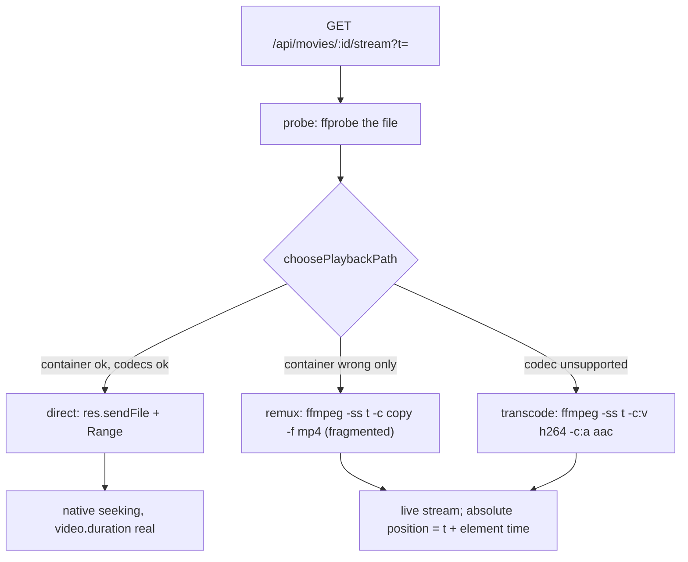

# 10 — Built-in video player (and the watch writes it owns)

## Background

`src/pages/PlayerPage/PlayerPage.tsx` is a stub that echoes the routed movie
id. `Watch.setResumePosition` / `markWatched` / `markUnwatched` exist in
`server/src/library/watch/watch.ts` and are covered by tests, but **no route
exposes the resume write and nothing calls it** — `04-movie-detail.md` Q12
settled that "Play writes nothing; only the player writes playback state", and
`09-continue-watching.md` deferred `POST /api/movies/:id/resume` plus a shared
`saveResume` on the grounds that both would be dead code until the player
landed. This entry is that landing.

`server/src/media/` is still an empty `.gitkeep`. `/api/images` is
`express.static(mediaPath)`; **video has no equivalent** — nothing in the app
can currently deliver a byte of a movie file.

The prototype is `docs/handoff/feat.PlayerControls.dc.html`, which
COMPONENT-SPEC §6 maps to `pages/PlayerPage` as "full player surface +
subtitle overlay (player is one self-contained screen)". Its player state lives
in `FamilyFlix.dc.html` (`playing`, `currentTime`, `subsOn`, `muted`,
`volume`, `controlsVisible`, a 3s idle timer at line 221).

## Problem

Two goals at once, and they pull in different directions:

1. **Translate the prototype 1:1** — the chrome is entirely bespoke (back pill,
   serif title, scrubber + knob, ±10s, volume slider, CC pill, fullscreen, 3s
   autohide, a styled subtitle box that is _not_ `::cue`).
2. **Play all types of movies** — including the format the family folder
   actually holds.

Goal 2 collides with a hard constraint. Electron's Chromium plays **MP4/WebM**
containing **H.264 / VP8 / VP9 / AV1 + AAC / MP3 / Opus / Vorbis / FLAC**. It
does not demux `.mkv` or `.avi` **at all**, and does not decode **AC-3 / DTS**
or reliably **HEVC**. A typical file in the folder is MKV with H.264 + AC-3 —
none of which plays. No uploaded file changes that: the decoder is compiled
into the binary. So the prototype's `uploadCodec()` (line 287, appending a
canned row) is a simulation in exactly the sense CLAUDE.md's "never port the
simulation" rule warns about, and the mechanism behind it has to be redesigned
rather than transcribed.

## Questions and Answers

1. **What does this initiative cover?** ✅ **Player + the watch writes it
   owns** — resume-on-open, position ticks, mark-watched-on-finish. Ticks both
   🔜 _Built-in video player_ and 🔜 _Watch tracking_, since the read side
   (badges, `ContinueCard`, the resume shelf) already ships and the player is
   the only thing that can write a position. ❌ the Settings shell and the
   CodecManager UI — their own initiative, though the codec _mechanism_ is
   designed here because the stream route depends on it. ❌ Electron: the player
   is built against HTTP, so it behaves identically under `npm run dev` and in
   the packaged shell.

2. **Playback engine?** ✅ **A plain `<video>` element driven by our own
   `usePlayback` hook.** CLAUDE.md left this open ("video.js (or react-player —
   finalised during player feature design)"); the answer is neither, and
   **CLAUDE.md's tech-stack line is amended** to say so. The chrome is 100%
   ours, so a vendor skin is only something to defeat; the subtitle box is ours
   too, so video.js's native-cue rendering is the one thing the prototype
   specifically does not do; and jsdom can drive a bare element while it cannot
   drive video.js. Zero new runtime dependencies. ❌ **video.js** — ~180KB gz,
   a DOM and skin fought for the length of the build, an API jsdom can't
   exercise. ❌ **react-player** — an abstraction over YouTube/Vimeo embeds; for
   a local file it is a thinner `<video>` with less control.

3. **How do arbitrary formats reach the element?** ✅ **An FFmpeg pipeline in a
   new `server/src/playback/` domain** — `ffprobe` the file, then choose a
   **playback path** (see Design). ❌ **swapping Electron's `libffmpeg` for a
   full build** — buys AC-3 and some HEVC, but Chromium still refuses to demux
   MKV and AVI regardless of the ffmpeg build, so the commonest file still
   fails; also fragile across Electron upgrades. ❌ **embedding libmpv** — plays
   everything with no transcoding, but renders to a native surface the styled
   chrome and subtitle box cannot sit over, which forfeits goal 1. ❌
   **ffmpeg.wasm / WebCodecs** — far too slow for 1080p in software on the
   machine my parents use.

4. **Seeking on the remux/transcode paths?** ⚠️ **Superseded in part by
   Q19.** The endpoint, the restart and the re-anchoring all stand. What did
   not: the "somewhere other than the element" this answer rests on was the
   movie record's `runtimeMinutes`, and Q19 replaced it with the **Playback
   read**, which is why the sentence below now names the probe. ✅ **One endpoint,
   `GET /api/movies/:id/stream?t=<seconds>`, with a server-side restart.** The
   direct path seeks natively via Range. On the stream paths the response is a
   live stream — `video.duration` is unknown and byte ranges do not exist — so a
   scrubber drag re-points `video.src` at a new `t`, ffmpeg starts at `-ss t`,
   and the hook re-anchors: **absolute position = `t` + element time**. This
   works precisely _because_ the scrubber is ours and takes duration from
   somewhere other than the element — which Q19 settles is the probe, not the
   movie record. ❌ **HLS + hls.js** — smoother scrubbing inside a transcode, at
   the cost of a client dependency, a segment and temp-directory lifecycle, and
   cleanup on crash; kept as the escape hatch if restart-seeking proves janky.
   ❌ **no seeking outside the direct path** —
   most of the family's films are MKV, so most would have a dead scrubber.

5. **Where does FFmpeg come from, and what becomes of the "Add a codec pack"
   drop zone?** ✅ **Bundle a default build; the drop zone replaces that
   binary.** The installer ships FFmpeg so nothing ever fails to play on my
   parents' machine. CodecManager (later) becomes a **truthful probed report** —
   Chromium's native set ∪ what `ffmpeg -decoders` reports for the resolved
   binary — and its dashed zone installs or replaces that binary, which is the
   one thing genuinely uploadable that genuinely changes what plays. Rows,
   ext chips, status pills, remove button and geometry stay 1:1; **only the
   drop-zone copy changes**, which is a prototype amendment (below), not an
   improvisation. ❌ **not bundling** — the most literal reading, but the app
   ships unable to play MKV and my parents are the ones who hit it. ❌ **bundle
   only, drop the upload surface** — discards the screen and the stated goal.
   The installer that would do the bundling is the Electron initiative's, which
   is not this one, so **what resolves the binary in the meantime is Q20**.

6. **How are subtitles parsed, delivered and rendered?** ✅ **The server
   normalises any format to a cue list; we render it ourselves.**
   `GET /api/movies/:id/subtitles/:subtitleId` returns `{ start, end, text }[]`;
   `parseSrt` / `parseVtt` / `parseAss` / `parseSub` are pure functions with
   their own tests; the player fetches once and renders through a pure
   `cueAt(cues, seconds)` into the prototype's styled box. This sidesteps a real
   trap: a native `<track>` is timed against **element** time, which is offset
   by `t` after every transcode seek, so cues would desync by exactly the seek
   distance. ❌ **server-converted WebVTT + `<track>` + `cuechange`** — less
   code, but needs a re-shifted refetch on every seek, and `::cue` styling
   cannot reach the prototype's box anyway, so we would hide the native track
   and render our own regardless: the cost paid twice. ❌ **converting at import
   time** — rewrites the family's files into a format only we use, and helps
   only after the importer ships, which is after this. Worth revisiting later as
   a cache.

7. **Are subtitles on by default?** ✅ **No — default off.** The prototype's
   `playMovie()` sets `subsOn:true`, but that is prototype convenience so the
   subtitle box is visible in the screenshot. The product decision lives in
   `page.SettingsPage`, where "Turn on automatically" ships as a **disabled**
   toggle and auto-on subtitles are 🧭 roadmap. Shipping them on would
   implement the roadmap item by accident.

8. **Which track, when CC is pressed?** ✅ **`preferredSubtitle(subtitles,
defaultLanguage)`** — a pure function, falling back to `position` order until
   the Settings default-language dropdown ships, at which point it feeds the
   same function. ❌ **a track picker on the CC button** — the prototype draws a
   plain toggle; a picker is a prototype amendment, not something to smuggle in.

9. **Resume prompt on open?** ✅ **Resume silently** at
   `resumePositionSeconds`, matching `playMovie()`'s
   `eff(m)==='progress' ? … : 0`. ❌ a "Resume / Start over" dialog — new UI the
   prototype does not draw.

10. **How often does the position get written?** ✅ **Every 10s of playback,
    plus on pause, seek-settle and exit**, coalesced so nothing is written
    unless the position moved ≥5s since the last write. Exit uses `fetch` with
    `keepalive`. CLAUDE.md requires reporting "during playback, not just on
    close"; one `UPDATE` per 10s is free for SQLite.

11. **Does opening the player write anything?** ✅ **No — nothing before the
    first tick.** `setResumePosition` stamps `last_watched_at`
    (`09-continue-watching.md` Q3), so an immediate write would let opening a
    movie and backing out three seconds later reorder the Continue Watching
    shelf. The shelf means "what you were watching last", and three seconds is
    not watching.

12. **What counts as finished?** ✅ **`ended`, or position ≥ 95% of duration on
    exit** — credits should not leave a film forever in-progress. Dispatches to
    the existing `POST /api/movies/:id/watched`, so `markWatched` zeroes the
    resume position as `04-movie-detail.md` Q11 already accepted.

13. **New routes?** ⚠️ **Superseded by Q19** — this answer named two reads
    and one write; Q19 adds `GET /api/movies/:id/playback`, so what shipped is
    **three reads and one write**. ✅ **One write** — `POST /api/movies/:id/resume` `{ value }`,
    through the existing `writeSignal` helper so it inherits 404-before-write
    and the echo an optimistic control reconciles against. Watched reuses the
    route that already exists. Plus the reads: `stream` and `subtitles` — and
    **`playback`, which Q19 adds**, making it three rather than two.

14. **Where does `saveWatched` live now?** ✅ **Promoted to
    `src/api/saveWatched/`.** CLAUDE.md's `api/` rule says a wire call moves up
    "when a second feature asks for it", and names `saveWatched` as having one
    caller and staying put "if and when that changes". The player is that
    change. `saveResume` (the name `09-continue-watching.md` used) has one
    caller and therefore **stays in `features/player/api/`** — the same rule,
    read the other way.

15. **What behaviour may be added around an unchanged surface?** ✅ **Keyboard
    map** (Space/K play-pause, ←/→ ±10s, ↑/↓ volume, M mute, C captions, F
    fullscreen, Esc exit), ✅ **fullscreen wired** to the button the prototype
    draws but leaves inert (`title="Fullscreen"`, no handler), ✅ **volume and
    muted persisted in `localStorage`** — a per-machine UI preference, not
    library data, so the DB is the wrong home — and ✅ **drag-to-seek** on a
    scrubber the prototype only lets you click, which for a two-hour film is a
    genuine gap. None of these move a pixel. ❌ **hover-preview time on the
    scrubber** — that is new UI, and so a prototype amendment.

16. **What about states the prototype does not draw?** ✅ **Two, both reusing
    the big-play circle's geometry** rather than inventing an element:
    **buffering** (a transcode takes a second or two to start, and a frozen
    black screen reads as a crash) and **unavailable** with two copies,
    `missing-file` and `cannot-play`. Recorded below as prototype amendments to
    make **before** the build, per CLAUDE.md's "amend the prototype first" rule.

17. **Do the scrubber and the volume slider share a component?** ✅ **They share
    logic, not pixels** — one `useDragScalar` hook, two separate styled
    surfaces. ❌ a shared `Slider` primitive — the two differ in height, knob,
    and colour, and forcing them together would mean a primitive with a prop for
    every difference.

18. **Path safety?** ✅ **Paths are resolved from the database, never from the
    URL** — the URL carries a movie id and a subtitle id — and the resolved path
    is verified to stay under `FAMILYFLIX_MEDIA_PATH` before anything is opened.

### Settled during `write-a-prd` (issue 82)

Three questions this log left standing, answered while the PRD was written. They
amend Q4, Q5 and Q13 above rather than sitting beside them, and the two that
were genuinely overturned carry a ⚠️ at their head rather than a footnote at the
bottom of the file — a reader who stops at Q13 must not leave believing the
shipped API has two reads on it.

Which is which matters. **Q19 supersedes**: Q4's duration source and Q13's route
list were answers that turned out to be wrong, and are marked ⚠️ above. **Q20
does not supersede** — Q5 named the installer and the drop zone and then said in
its own last sentence that "what resolves the binary in the meantime is Q20", so
Q20 fills a gap Q5 deliberately left open rather than replacing anything Q5
decided. Q5 stands as written.

19. **Where does the scrubber's duration actually come from?** ✅ **A third read,
    `GET /api/movies/:id/playback` → `{ path, durationSeconds }`**, fetched once
    on open. Q4 said "the movie record", and that has no answer for a film whose
    `runtimeMinutes` is `null` — a real state the library already models and
    `toRuntimeSeconds` already has a rule for. The probe is run for the stream
    anyway and knows the true duration, which is **better than the record even
    when the record has one**: `runtimeMinutes` is rounded metadata, and a
    scrubber built on it disagrees with the file by up to thirty seconds at the
    end. The same response hands over the chosen **playback path**, which is what
    tells `usePlayback` whether to re-anchor at all — so the client stops having
    to infer from a stream's behaviour what the server already decided.
    ❌ **falling back to `video.duration` on direct play only** — no new route,
    but the same film then behaves differently depending on its container, and
    the one rule worth keeping is that the element is never asked. ❌
    **elapsed-only with a dead scrubber** — honest, and it would mirror
    `NOMINAL_SLIVER_PERCENT`'s precedent, but it makes a two-hour film unseekable
    over a blank metadata field.

20. **What resolves the FFmpeg binary before an installer exists?** ✅
    **`FAMILYFLIX_FFMPEG_PATH`, then `PATH`, then absent** — and **absent is a
    first-class state, not an error**. Q5 settled that the installer bundles a
    build and the drop zone replaces it; Electron is out of scope here, so
    neither of those exists yet and something has to answer in the meantime. The
    env var is the slot the installer will later fill and the one an uploaded
    component will occupy, so nothing about the resolution order changes when
    packaging lands. With no component at all, **direct play still works**, remux
    and transcode answer the `cannot-play` notice from Q16, and `capabilities`
    reports Chromium's native set alone — which is the truth, and the whole point
    of Q5's "truthful probed report". ❌ **requiring it on `PATH`** — no
    resolution logic and no absent state, but the app hard-fails on a machine
    without it and `capabilities` has nothing honest to say. ❌ **vendoring a
    build into the repo now** — matches the shipped app exactly, at ~80MB of
    binary in git history, and pre-empts a packaging decision that is not this
    initiative's to make.

21. **What does the player play in development?** ✅ **A small silent H.264/AAC
    MP4, checked in and copied under the seed's reserved prefix.** The seed's own
    doc comment says nothing on disk backs its paths, "which is fine because
    nothing plays a seed movie" — a sentence this initiative makes false. Without
    a file every seeded movie renders the `missing-file` notice, and the player
    becomes the one feature in the app that cannot be checked by looking at it,
    which is the exact failure the seed exists to prevent. The fixture is
    prefix-scoped and idempotent like the rest of the seed, and is deleted with
    it when bulk import ships. Pointing `FAMILYFLIX_MEDIA_PATH` at a real folder
    of the family's films stays the way to exercise remux and transcode against
    actual MKVs. ❌ **leaving the seed alone** — realistic, but only on my
    machine, and only for as long as that folder is where I left it.

## Design

### Playback paths



| Path            | When                                           | Cost                         |
| --------------- | ---------------------------------------------- | ---------------------------- |
| **Direct play** | MP4/WebM, Chromium-supported codecs            | `sendFile` + Range           |
| **Remux**       | Only the container is wrong (MKV, H.264 + AAC) | `-c copy`, I/O-bound         |
| **Transcode**   | Codec unsupported (HEVC, XviD, AC-3, DTS)      | re-encode, HW when available |

`choosePlaybackPath` is **pure** — probe in, decision + argv out — so the whole
policy is unit-testable without spawning anything.

### Types — `src/types/`

```ts
/** One timed subtitle line, as the server normalises every format into. */
export interface Cue {
  start: number; // seconds, absolute
  end: number;
  text: string;
}

/** Which of the three routes to the element a movie takes. */
export type PlaybackPath = 'direct' | 'remux' | 'transcode';
```

### Backend — `server/src/playback/` (a new domain)

CLAUDE.md sanctions this explicitly: backend logic that fits none of `library/`,
`media/`, `import-export/` "is a sign a new domain folder is needed". Subtitle
_detection_ stays in `media/`; subtitle _parsing_ exists to feed the player and
belongs here.

```
server/src/playback/
├── ffmpegBinary/        env var, then PATH, then absent (Q20)
├── probe/               ffprobe wrapper -> MediaProbe
├── choosePlaybackPath/  pure: MediaProbe -> PlaybackPath + argv
├── streamMovie/         sendFile or spawn; kills the child on client disconnect
├── capabilities/        Chromium-native ∪ `ffmpeg -decoders`, for CodecManager
├── parseSrt/  parseVtt/  parseAss/  parseSub/
├── parseSubtitle/       dispatch on extension
└── index.ts
```

### Routes — `server/src/routes/index.ts`

`createApiRouter(storage, mediaPath, playback)` — the domain is injected the way
`storage` already is.

```
GET  /api/movies/:id/playback                -> { path, durationSeconds }   (Q19)
GET  /api/movies/:id/stream?t=<seconds>
GET  /api/movies/:id/subtitles/:subtitleId   -> Cue[]
POST /api/movies/:id/resume  { value: seconds }   (via writeSignal)
```

### Frontend — `src/features/player/`

```
Player/                 organism: owns the hooks, renders the rest
PlayerControls/         top + bottom chrome (the COMPONENT-SPEC name)
PlayerScrubber/         scrubber, knob, mono times
VolumeSlider/
SubtitleOverlay/        the styled cue box
PlayerNotice/           buffering + unavailable
usePlayback/            element state <-> React state, offset re-anchoring
useWatchReporter/       tick, coalesce, finish
useControlsVisibility/  3s idle, hidden cursor
usePlayerKeys/
useDragScalar/          shared drag logic: scrubber + volume
cueAt/                  pure, tested
preferredSubtitle/      pure, tested
api/                    fetchPlayback, fetchSubtitleCues, saveResume
```

`pages/PlayerPage/PlayerPage.tsx` stays composition-only: read `:id`, render
`<Player />`. `src/api/saveWatched/` is the promotion from Q14.

### Prototype amendments (make first, then build)

1. `feat.CodecManager.dc.html` — drop-zone copy `.dll · .so · .pak` → the
   playback component. Geometry unchanged.
2. `feat.PlayerControls.dc.html` — a **buffering** state and an **unavailable**
   state, both in the existing 96px big-play circle.

### Not built

The Settings shell, the CodecManager UI, the subtitle track picker, hover-preview
on the scrubber, HLS, embedded (in-container) subtitle track extraction.

## Implementation Plan

1. **Thinnest end-to-end slice: direct play.**
   `GET /api/movies/:id/stream` with `sendFile` + Range and the under-media-root
   path check; the seed's MP4 fixture (Q21); a `<video>` in `Player/` pointed at
   it; `PlayerPage` renders it. A seeded movie plays with browser-default
   controls. No chrome yet.
2. **The chrome, 1:1.** `PlayerControls`, `PlayerScrubber`, `VolumeSlider`,
   `useDragScalar`, `useControlsVisibility`, `usePlayback`, and the `playback`
   read the scrubber takes its duration from — the prototype's surface, driven by
   real element state, against a direct-play file. `stubMediaElement` lands here.
3. **Watch writes.** `POST /api/movies/:id/resume`, `useWatchReporter`,
   `saveResume`, `saveWatched` promoted to `src/api/`. Resume-on-open, 10s
   coalesced ticks, finish at `ended`/95%. Continue Watching now orders itself
   from real playback for the first time.
4. **Subtitles.** The four parsers + `parseSubtitle`, the cue route, `cueAt`,
   `preferredSubtitle`, `SubtitleOverlay`, the CC toggle.
5. **FFmpeg pipeline.** `ffmpegBinary`, `probe`, `choosePlaybackPath`,
   `streamMovie` remux + transcode, `?t=` restart and the hook's re-anchoring,
   `PlayerNotice` buffering + unavailable. An MKV plays.
6. **Polish.** `usePlayerKeys`, fullscreen, volume persistence, `capabilities`
   (the read the CodecManager initiative will consume).

## Trade-offs

**Easier.** Custom chrome is free rather than fought for, because there is no
vendor skin. The transcode-seek design falls out of a decision already made —
the scrubber never asking the element how long the film is — instead of needing a
manifest format. The two hardest pieces of policy (`choosePlaybackPath`, the
subtitle parsers) are pure functions, so the risky logic is the cheap logic to
test. The CodecManager stops being a fiction and becomes a live report of what
the machine can actually do.

**Harder.** We own the media element's edge cases — buffering, stalls,
`readyState`, autoplay policy — that a library would have absorbed. FFmpeg is a
real native dependency with a real installer size, and a spawned child process
must be killed on client disconnect or a family movie night leaves transcodes
running. Transcoding a 1080p HEVC film in software is CPU-hungry; hardware
encoders are used when available, but "available" varies by machine and is not
something tests can pin.

**Ruled out of scope.** HLS (revisit if restart-seeking is janky); embedded
subtitle tracks inside MKV, since the data model stores external subtitle files;
image-based subtitles (PGS/VOBSUB), which cannot become text cues at all; the
Settings shell and the CodecManager UI; Electron.
