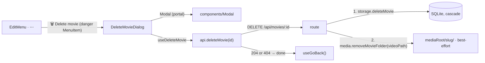

# 12 — Delete a movie

> **Initiative:** `delete-movie`
> **PRD:** [#114](https://github.com/carlos-rezai/FamilyFlix/issues/114) · `docs/PRDs/12-delete-movie.md`
> **Plan:** `docs/PRDs/12-delete-movie-plan.md` — five phases, filed as issues 115–120
> **Shipped:** issues 115–119, 2026-09-12, the four buildable slices driven by
> `issue-loop`. What the build actually did is in `docs/dev-journal.md`; the
> refactor it left is `docs/refactor-plans/12-delete-movie-refactor.md`, issue 121.

This log is the `grill-me` session that settled the feature before the PRD was
written, run against the prototype and the code as they stood on 2026-09-12. It
is an immutable snapshot of that moment.

## Background

Delete has been deferred twice, both times for the same reason.

`docs/design-logs/04-movie-detail.md` Q1 and Q15 built the ⋯ **Edit menu** with
one item, because the prototype's `🗑 Delete movie` row
(`docs/handoff/page.MoviePage.dc.html`) is wired to `detail.onToggleEditMenu` —
it closes the menu and does nothing — and no confirmation is designed anywhere
in `docs/handoff/`. `EditMenu`'s docblock records the refusal: it would not ship
"a red row that closes the menu and does nothing, or a permanently greyed one
that reads as 'this movie can't be deleted'". `11-add-movie.md` Q1 then scoped
the form to Add + Edit and listed "Delete (and the media cleanup that belongs
with it)" under _Not built_.

What exists today:

- `LibraryStorage.deleteMovie(id)` (`server/src/library/write/write.ts`) —
  one `DELETE FROM movies`, with `ON DELETE CASCADE` clearing `movie_genres` and
  `subtitles`. Tested. **No route calls it.**
- `Media.openFolder(storedPath)` and `Media.removeFolder(folder)`
  (`server/src/media/createMedia/`) — the folder a **Stored path** lives in, and
  the recursive removal the form's rollback uses. `removeFile` swallows its own
  failure because it runs after a commit; `removeFolder` does not, because it was
  written for a rollback where nothing has committed yet.
- `movieOr404` — what every per-movie route does first.
- `prim.Button`'s `danger` variant — implemented in the prototype's `renderVals`
  (`bg transparent, color danger, border, hover border danger`) and shipped in
  `src/primitives/Button/Button.styles.ts`, but absent from the prototype's
  `data-props` enum. **No screen in the prototype uses it.** It is the
  prototype's own provision for a destructive confirmation that was never drawn.
- `mol.Modal` — COMPONENT-SPEC names it as a _pattern_ ("scrimmed centred card +
  title/subtitle/icon/close"; props `open`, `title`, `subtitle`, `icon`,
  `onClose`, children) and says `feat.ExportModal` uses the shell directly. There
  is no `mol.Modal.dc.html`; the shell's every pixel is in
  `feat.ExportModal.dc.html`.
- `Menu` / `MenuItem` — the dismissal contract, the roving tabindex, `glyph`,
  `selected`, `trailing`. No destructive tone.
- `useGoBack` — the app's one Back rule.

## Problem

Ship Delete as a 1:1 translation of the prototype, when the prototype's only
Delete control is a row that does nothing and the prototype draws no
confirmation. CLAUDE.md's rule for this case is explicit: _"If a feature needs
something the prototype doesn't cover, that's a sign the prototype needs
revisiting before building, not a license to improvise the design ad hoc."_ So
the question is not whether to design a dialog, but whether one can be
**composed from the prototype's existing vocabulary** — and it can, from three
pieces the prototype already has and never put together.

## Questions and Answers

### Scope

1. **Is Edit part of this initiative?** ❌ No — it shipped with `movie-form`
   (`11-add-movie.md`; issues 98–107). The feature table ticks both _Add_ and
   _Edit_. This log is Delete alone.

2. **Delete without a confirmation, since that is literally what the prototype
   draws?** ❌ No. The row's `onToggleEditMenu` is the simulation's placeholder
   for a thing it never built, not a design decision that a single click in an
   overflow menu should remove a film and its gigabytes. Porting it would be
   porting the one control whose non-effect a user cannot verify — log 04's
   reason for not shipping it, unchanged.

3. **Then what confirms it?** ✅ **A dialog built from the prototype's own Modal
   pattern**, with a `danger` `prim.Button` as its confirming action. Every
   visual value comes from `feat.ExportModal.dc.html` (the shell) and
   `prim.Button.dc.html` (the `danger` variant's own `renderVals`); the only
   thing new is the copy. This is the "revisit the prototype first" path: the
   prototype is amended with the composition (Q4), and the build translates the
   amended prototype.

4. **What exactly is amended in `docs/handoff/`?** ✅ Four things, as one
   `docs:` commit before any code:
   - `mol.Modal.dc.html` — **new**, the shell lifted verbatim from
     `feat.ExportModal`'s idle state: scrim (`fixed inset 0`, z 90,
     `--color-scrim`, `blur(4px)`, `ffFade .18s`, padding 24), card (520 wide,
     `max-width 100%`, `surface-2`, border, `radius-lg`,
     `0 30px 80px rgba(0,0,0,.6)`, `ffPop .2s`), header (padding `28px 28px 0`,
     flex gap 14: a 44px `radius 12` tile on `accent-soft` / `accent-line`
     holding the icon, a serif 600 24px title, a 14px `text-faint` subtitle, a
     34px ✕), and a body slot padded `22px 28px 28px`. Props exactly as
     COMPONENT-SPEC already lists them.
   - `feat.DeleteMovieDialog.dc.html` — **new**: `mol.Modal` + one 15px
     `text-dim` paragraph + an action row (`gap 12`) of `prim.Button`
     `danger`/`md` and `secondary`/`md`, in the same [confirm][Cancel] order as
     ExportModal's [Export][Cancel].
   - `prim.Button.dc.html` — `danger` added to the `variant` enum its
     `renderVals` already implements.
   - `page.MoviePage.dc.html` — the Delete row's `onClick` becomes
     `detail.onDelete`; `FamilyFlix.dc.html` gets `deleteOpen`, opens the dialog,
     and on confirm drops the movie and returns to browse. COMPONENT-SPEC gains
     the two rows.
     ❌ Amending nothing and describing the dialog only in this log: the build
     skill translates prototype files, and a dialog that exists only in prose is
     exactly the ad-hoc improvisation the rule forbids.

### The row

5. **How does the Delete row get its red?** ✅ **`MenuItem` grows a `danger`
   boolean.** The prototype's row is `color: #c97a6a` (the `danger` token) with a
   hover of `rgba(201,122,106,.12)`; the `.12` stays a literal, on
   `RemoveButton.styles.ts`'s precedent ("written literally because the
   prototype writes it inline and there is no token behind it"). ❌ a `tone` enum:
   there is exactly one destructive row in the app's four menus and no third
   tone anywhere in the prototype. ❌ a `dangerSoft` token: it would be the third
   danger tint (`.1`, `.12`, and the tile's would be a fourth) and none of them
   is a token in `tokens.css`.

6. **Is 🗑 an icon atom?** ❌ No — ✅ `glyph="🗑"`, the same literal-glyph
   precedent as `MenuItem`'s `✎` and `RemoveButton`'s `✕` (11-add-movie Q10).
   The dialog's icon tile shows the same glyph, so Delete has one symbol across
   the feature.

7. **Does the dialog's icon tile turn red?** ❌ No. The tile is the Modal
   pattern's own chrome (`accent-soft` / `accent-line`) — a brand tile, not a
   semantic one, exactly as ExportModal's download icon sits on it. The
   destructive meaning lives where the prototype puts it: the `danger` row that
   opened the dialog and the `danger` button that confirms it. Colouring the
   tile would need `dangerSoft` and `dangerLine` tokens the prototype does not
   have (Q5).

### The dialog

8. **What does it say?** ✅ Composed to ExportModal's rhythm — title, one-line
   subtitle, one body paragraph, two buttons:

   > **Delete “{title}”?**
   > This can’t be undone.
   >
   > The movie leaves your library, and the video, poster and subtitles
   > FamilyFlix copied are deleted. The original files are not touched.
   >
   > [ Delete movie ] [ Cancel ]

   The body's second sentence is the one fact the **Maintainer** actually needs:
   under **Managed copy** the family folder is never read or written, so deleting
   here never touches it. A dialog that said only "are you sure?" would leave the
   one real question unanswered.

9. **What does `Modal` own?** ✅ The dismissal contract, on `Menu`'s argument
   that it is "the half that is easy to half-implement": Escape, a press on the
   scrim, and the ✕ all call `onClose`; focus moves to the card (`tabIndex=-1`)
   on open and returns to the previously focused element on close; Tab and
   Shift+Tab wrap inside the card; `role="dialog"`, `aria-modal="true"`,
   `aria-labelledby` the title. It renders nothing when `open` is false — a
   mount, so `ffPop` runs, on `Fab`'s note that prop-driven entrances are
   unreliable. It renders through `createPortal` to `document.body`, because a
   scrim inside `MoviePage`'s scroll container would scroll with it (the
   prototype's `position: absolute` is relative to its phone frame; ours is the
   viewport). ❌ a native `<dialog>`: jsdom does not implement `showModal()`, and
   the app's pattern from `Menu` onward is a bespoke contract it can test.
   ❌ scroll-locking the page behind: not in the prototype, and ExportModal will
   have the same scrim.

10. **Where does focus land on open?** ✅ The card itself, not a button. For a
    destructive dialog that is the safe default — Enter on open does nothing,
    and the Maintainer must Tab to a choice — and it is the one rule that serves
    ExportModal too, so `Modal` does not need to know which of its children is
    the dangerous one.

11. **The ✕ — `RemoveButton`?** ❌ No: ExportModal's ✕ is 34px on an 8px corner
    hovering `surface-3` / `text-dim`, while `RemoveButton` is 32px / 7px hovering
    the danger colour, and a dialog's close is not a removal. ✅ A local styled
    button in `Modal.styles.ts`, labelled "Close" — the same call `EditMenu`
    made for its ⋯ trigger.

12. **Who owns the open state?** ✅ `EditMenu`, which has the row. It gains
    `title` beside `movieId` (the dialog's heading needs it), holds
    `deleteOpen`, and renders `<DeleteMovieDialog>` beside `CornerMenu`; the
    portal takes the dialog out of the fixed corner slot. `MenuItem` already
    closes the menu before `onSelect` runs, so the menu is gone and focus is
    back on the ⋯ trigger by the time the dialog takes it — which is where
    `Modal` will return it on Cancel.

13. **What happens while the request is in flight?** ✅ The confirming button is
    `disabled` and reads **Deleting…** — the form's "Adding…" (11-add-movie Q17),
    a prop the prototype's Button already declares. Cancel, ✕ and Escape stay
    live; dismissing does not cancel the request. A success after a dismissal
    still navigates (Q14), because the movie is gone and its page has nothing
    left to show. A failure re-enables the button and nothing else — the form's
    precedent (`useMovieForm`: "the prototype designs no error state on this
    screen"). ❌ a snackbar: the system is 🔜 and the flow raises none.

14. **After a successful delete, where does the page go?** ✅ **`useGoBack`** —
    a step through history, the app's one Back rule: the genre shelf or the
    filtered, scrolled browse home the Maintainer came from, remounted and so
    refetched without the movie. ❌ `navigate('/')`: that is the prototype's
    `goBrowse()`, and `useGoBack`'s docblock already says why it is not ours.
    The deleted movie's entry stays in the forward stack; stepping forward onto
    it lands on `MovieDetail`'s existing `not-found` state ("That movie isn’t
    here — it may have been removed from your library"), which was written for
    precisely this.

15. **Does a 404 from the route count as failure?** ❌ No — ✅ **gone is gone.**
    `deleteMovie` on the client resolves on `204` and on `404` alike: the goal
    of Delete is that the movie is not in the library, and `404` says it is not.
    Treating it as failure would leave a stale page whose only working button
    re-asks a question the server has already answered.

### The wire

16. **Route shape?** ✅ `DELETE /api/movies/:id` → `204 No Content`; `404` for an
    unknown id via `movieOr404`, consistent with `PATCH` and every per-movie
    write. ❌ `200 {}`: there is nothing to echo, and the single-signal routes
    echo because a client reconciles on the echo — a delete reconciles on
    absence.

17. **Row first, or bytes first?** ✅ **Row first, then bytes, best-effort.** The
    library is the source of truth: a row that survives with its files gone is a
    ghost the family can open and fail on, while files that survive with their
    row gone are stranded bytes nobody can reach — a cost, not a bug. The
    ordering and the swallow are `removeFile`'s own contract, quoted: "Losing an
    edit that already succeeded is the wrong trade against one stranded file."

18. **Which `Media` call removes the files?** ✅ A new **`removeMovieFolder(storedPath)`**:
    the **Movie folder** a **Stored path** names, and everything in it; nothing
    for a path that escapes the root; failure swallowed. ❌ `openFolder` +
    `removeFolder`: `openFolder` answers `null` for a file that is not there —
    correct for an edit, where a missing video means "reserve a fresh folder",
    but a movie whose video was removed by hand would then keep its poster and
    subtitles on disk forever. Delete wants the folder the path _names_, whether
    or not the file is still in it. And `removeFolder` throws on a locked file,
    which is right for a rollback and wrong after a commit (Q17). A third
    removal with its own contract, beside two that already differ from each
    other for stated reasons.

19. **Where does the client call live?** ✅ `features/movie-detail/api/api.ts`,
    beside `saveRating`: one caller, so it stays with the feature (CLAUDE.md's
    `api/` rule). It moves up to `src/api/` if and when bulk import's review
    step or a second surface deletes.

### Not in scope

20. **Delete from the poster card, the browse grid, or a keyboard shortcut?**
    ❌ The prototype's only Delete is the detail page's ⋯ menu.

21. **Undo, a "Deleted _title_" snackbar, a trash/restore?** ❌ Not designed; the
    snackbar system is a separate 🔜 feature and the prototype raises none here.
    The dialog's "This can’t be undone" is true and stays true.

22. **Deleting the row from the family folder (the Library root)?** ❌ Never —
    the app has never read it and never will (Managed copy). The dialog says so.

## Design

### The composition



### Backend

`server/src/media/createMedia/` — `Media` gains:

```ts
/**
 * Remove the Movie folder a Stored path names, and everything in it — the
 * cleanup after a deleted movie, which runs *after* the row is gone and so
 * swallows its own failure. A path that escapes the root, or names a folder
 * that is already gone, is nothing to do.
 */
removeMovieFolder(storedPath: string): void;
```

`server/src/routes/index.ts`:

```ts
router.delete('/movies/:id', (req, res) => {
  const movie = movieOr404(storage, req.params.id, res);
  if (movie === null) return;
  storage.deleteMovie(movie.id);
  media.removeMovieFolder(movie.videoPath);
  res.status(204).end();
});
```

### Frontend

```
src/components/
├── Modal/                         ← new (mol.Modal): scrim, card, header, body slot,
│                                     portal, Escape/scrim/✕ → onClose, focus in/out,
│                                     Tab containment; renders nothing when closed
└── Menu/                          ← MenuItem + `danger?: boolean`

src/features/movie-detail/
├── EditMenu/                      ← + title prop, the danger row, `deleteOpen`
├── DeleteMovieDialog/             ← new: Modal + copy + Delete/Cancel
├── useDeleteMovie/                ← new: { deleting, deleteMovie }; goBack on done
└── api/                           ← + deleteMovie(id): Promise<void>  (204 | 404 → resolve)
```

```ts
export interface ModalProps {
  open: boolean;
  title: string;
  subtitle?: string;
  /** Sits in the header tile; the tile is omitted when absent. */
  icon?: ReactNode;
  onClose: () => void;
  children: ReactNode;
}

export interface DeleteMovieDialogProps {
  movieId: string;
  title: string;
  open: boolean;
  onClose: () => void;
}

export interface EditMenuProps {
  movieId: string;
  title: string;
}
```

### Prototype amendment (`docs/handoff/`, one `docs:` commit, first)

`mol.Modal.dc.html` (new), `feat.DeleteMovieDialog.dc.html` (new),
`prim.Button.dc.html` (`danger` in the enum), `page.MoviePage.dc.html` +
`FamilyFlix.dc.html` (the row opens the dialog; confirm drops the movie and
returns to browse), `COMPONENT-SPEC.md` (the two rows).

## Implementation Plan

1. **Amend the prototype.** The four files above. Nothing in `src/` yet — the
   build has something to translate.
2. **Thinnest end-to-end slice.** `DELETE /api/movies/:id` (row only, `204` /
   `404`) → `api.deleteMovie` → `Modal` (shell + the dismissal contract) →
   `DeleteMovieDialog` + `useDeleteMovie` → `MenuItem`'s `danger` + the row in
   `EditMenu`. A movie deleted from its page is gone from the browse home.
3. **The bytes.** `Media.removeMovieFolder`; the route calls it after the row.
   A deleted movie's folder is gone from the managed media directory.
4. **The edges.** `Deleting…`, `404` counts as done, failure re-enables, Tab
   containment and focus return, the forward-stack landing on `not-found`.

## Trade-offs

**Easier.** Nothing is designed from scratch: the shell is ExportModal's, the
button is the prototype's own unused variant, the row's colours are already in
`page.MoviePage`. `Modal` lands a molecule the 🔜 Export feature needs anyway.
The server side is three existing units and one new method. Every navigation
and error rule is one the app already has (`useGoBack`, `not-found`, the form's
silent failure), so Delete adds no new UI state to the app.

**Harder.** Files are removed best-effort after the row commits, so a locked
file (Windows will refuse to unlink a video the stream route still has open, if
the family navigated here mid-stream) leaves a stranded folder that nothing yet
surfaces — the 🔜 Storage section's "space used" is the first place it could.
The deleted movie's page stays in the browser's forward history and answers
`not-found`. Modal's focus containment is bespoke and must be right — a
half-implemented trap is worse than none — which is the cost of not having
`<dialog>` under jsdom.

**Ruled out of scope.** Undo, a snackbar, a trash; delete from any surface but
the ⋯ menu; a red icon tile and the tokens it would need; touching the family's
own folder; scroll-locking behind the scrim.
