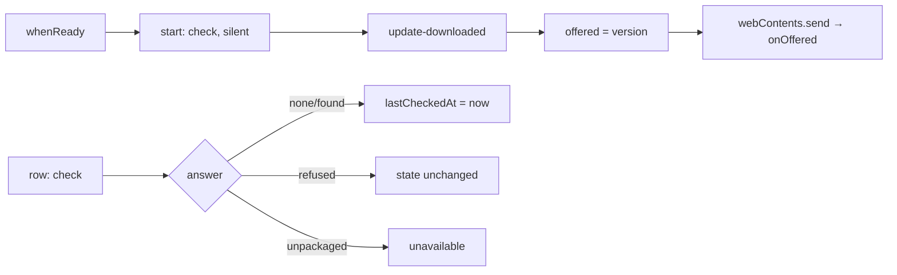

# 17 — Software update

> **Initiative:** `software-update`
> **PRD:** to follow this log — and to follow the **Electron desktop shell**
> **Plan:** to follow the PRD

This log is the `grill-me` session that settled the feature before the PRD was
written, run against the prototype and the code as they stood on 2026-09-19,
the day the **Playback component upload** initiative closed (#157). It is an
immutable snapshot of that moment. The session ran alone, with every
recommendation accepted in advance by the maintainer, whose instructions were
the scope — _translate the prototype 1:1 into the codebase, in its naming,
conventions, patterns and architecture_ — and one reference: Horizon's own
in-app auto-update (`carlos-rezai/Horizon`, design log 13, PRD 13), which this
feature was expected to be "almost identical" to. Q1 is where that expectation
was tested, and Q7 and Q24 are where it broke.

## Background

`page.SettingsPage.dc.html` draws the About card as **two** rows: a **Software
update** row over a hairline over the brand row. The build shipped the brand
row alone. Log 15 Q21 said why — _"it is the Electron initiative's
(`autoUpdater`) and the Snackbar system's, and the idle copy `You're up to
date` would be a lie with no updater behind it"_ — on log 13 Q2's standing rule
that a control whose mechanism does not exist is not drawn. `AboutSection`'s
own doc comment says it in one line: _"the card does not say You're up to date
with no updater to know it."_

What the prototype draws, in three faces of one row:

| state           | line                                                   | button                           |
| --------------- | ------------------------------------------------------ | -------------------------------- |
| `updateOffered` | _Version 1.1.0 is available to install._ in the accent | **Update now**, primary          |
| `updating`      | _Downloading and installing…_ in the dim ink           | `Updating…`, disabled            |
| `updateIdle`    | _You're up to date._ + `lastCheckedLabel`, faint       | **Check for updates**, secondary |

And what the container simulates (`FamilyFlix.dc.html`): `offerUpdate()` fires
1.6s after launch and pushes an **info** Snackbar — title _Update available_,
message _FamilyFlix 1.1.0 is ready to install._, action _Update now_,
dismissible; `runUpdate()` dismisses it, flips `updating`, and 1.7s later lands
on the new version with a **success** Snackbar _FamilyFlix updated to 1.1.0._
at 5000ms; `checkForUpdates()` stamps `lastChecked` and either offers or pushes
a **success** _You're on the latest version._ at 4000ms. CLAUDE.md's rule is to
reproduce the surface and never the simulation, and the simulation is doing a
lot of work here — Q6, Q18 and Q25 are each a place where the real mechanism
puts that copy somewhere the container never could.

`COMPONENT-SPEC.md` ties the two halves together in its `mol.Snackbar` row:
four semantic variants, _"the stack/queue/auto-dismiss timers live in the
container … in code this becomes a `SnackbarProvider` + `useSnackbar()`
context"_, the convention that actionable snackbars persist and confirmations
auto-dismiss at 5s, and — flatly — _"Used by the software-update flow (Settings
→ About)"_.

What exists to build on:

- `src/features/settings/AboutSection/` — the brand row, the **App version** in
  mono, the tagline; `Card` with `margin-bottom: 0` because it is the last
  group on the page.
- `__APP_VERSION__` (`src/types/appVersion.d.ts`) — `package.json`'s `version`
  baked in by Vite's `define`, _"so the About card and the installer can never
  disagree"_. It reads `0.0.0` until packaging sets one.
- `primitives/Button` — four variants, and a `:disabled` face already styled
  `surface-3` + `border` + `textFaint`, which is pixel-for-pixel the
  prototype's `Updating…` button.
- `primitives/Icon/UploadIcon` — `M12 16V4m0 0L8 8m4-4l4 4M5 20h14`, byte for
  byte the path in the prototype's update-row tile. Built for the **Component
  drop zone**; reusable here unchanged.
- `tokens/colors` — `info`, `success`, `warning`, `danger`, all present and
  used by nothing.
- `features/player/volumePreference/` — the project's one existing
  `localStorage` unit, and the precedent Q25 leans on.
- `createPlayback(mediaPath, slot)` / `createImporter(...)` — the
  injected-domain shape Q29 copies onto the main process.

What does **not** exist: `electron/` holds a `.gitkeep` and nothing else. There
is no `electron` dependency, no `preload`, no `main.ts`, no installer, no
`window.familyflix`.

## Problem

How does FamilyFlix learn that a new version exists, tell whoever is looking,
and install it — in an app that is offline-first, has one maintainer and two
users who must never be asked to administer software, and whose desktop shell
has not been built yet?

## Questions and Answers

### Scope and sequencing

1. **Does this initiative build the Electron shell?** ✅ **No.** There is no
   `electron/` code, no dependency, no preload and no packaged app, and
   `autoUpdater` needs all four. Log 15 Q21 already said _"update cannot exist
   without Electron"_. The shell is its own 🔜 Foundation item with its own
   design space — the server as a utility process, `userData` paths, single
   instance, the dev-vs-packaged renderer, the window and its menu — and
   Horizon kept them apart as its logs 10 and 13. **This log is complete and
   the PRD waits**: the shell's initiative comes first, the installer after it.
   What the shell must expose is Q12, stated here so the shell's own grill can
   carry it. ❌ Folding a "minimal shell" into this initiative: there is no
   minimal shell — the small version is the one that skips the decisions the
   shell's grill exists to make.

2. **Does it include the Snackbar system?** ✅ **Yes.** COMPONENT-SPEC names
   the software-update flow as the Snackbar's consumer, log 15 held the update
   row back on "the Snackbar system", and a Snackbar built as its own
   initiative would be a component with no caller — the thing this project
   refuses to build. Horizon's log 13 made the Snackbar its phase 1 for the
   same reason. This initiative ticks **two** 🔜 lines.

3. **Does it include the installer?** ✅ **No** — "Desktop packaging" is its
   own line, and it is a prerequisite rather than a part. But the **Release
   feed** — the `publish` block, the `repository` field, the tag-triggered
   workflow — is update infrastructure rather than build infrastructure and
   belongs here (Q26, Q27).

### The mechanism

4. **Updater and feed?** ✅ `electron-updater` against **GitHub Releases**.
   `carlos-rezai/FamilyFlix` is public, so no `GH_TOKEN` is needed at runtime
   and no secret ships inside the installer. ❌ A self-hosted feed — a server
   to pay for and keep up, in an app whose whole argument is that there isn't
   one.

5. **When does it check?** ✅ **Once per launch**, on `whenReady`, and again
   whenever the button is pressed. ❌ A polling interval: the family opens
   FamilyFlix to watch a film, and a long session is a long film, not a long
   sit at the library screen.

6. **Auto-download on?** ✅ **On**, `electron-updater`'s default — and this
   settles a word. On our surface **offered** always means _the bytes are
   already on this disk_. The prototype's own copy agrees twice: "available to
   **install**", "ready to **install**". A release that has been _found_ but
   not yet downloaded is not a face anything draws (Q12's `'found'`).

7. **A toggle for auto-download, as Horizon has?** ✅ **No.** The prototype
   does not draw one, and refusing it removes an entire layer: no
   `electron-store`, no preference IPC, no new `settings` row, nothing to
   migrate. Horizon has one because Horizon's grill asked for one; ours asked
   the opposite question and got the opposite answer. This is the first place
   "almost identical to Horizon" stops being true.

8. **`autoInstallOnAppQuit`?** ✅ **Left on** (the default), and worth saying
   out loud because it is the product argument: it is **the family's** update
   path. They close FamilyFlix, it updates, and they are never asked anything.
   **Update now** therefore means only _install it now instead of at the next
   quit_ — which is what makes it safe for the offer snackbar to reach them at
   all (Q24).

9. **A check that fails?** ✅ **Split by who asked.** The startup check fails
   **silently** — the Settings page's standing rule is `null` until it lands,
   `null` still if it never does, and nothing drawn while so. A check the
   maintainer **pressed** gets an answer, because a press deserves one (Q23).
   And **`lastCheckedAt` advances only on a check that got an answer** — _Last
   checked_ must never be able to mean _last tried_.

10. **An unpackaged app (dev Electron)?** ✅ The row draws — the bridge is
    there — the startup check does not run, and a press answers _"Updates are
    only available in the installed app."_ as an info snackbar. Horizon's
    `dev-unavailable`, kept, because the alternative is a button that silently
    does nothing on the one machine the app is developed on.

11. **Code signing?** ✅ **Not this initiative's.** Unsigned to begin with and
    `verifyUpdateCodeSignature: false`, so an unsigned NSIS update is accepted;
    a self-signed certificate in Trusted Root is packaging's call, as it was
    Horizon's. ❌ An EV certificate — a yearly bill in a project whose
    constraint is zero cost.

### The seam

12. **What shape is the bridge?** ✅ **Push and pull.** Push alone has a bug:
    `update-downloaded` fires once, so leaving Settings and coming back would
    redraw an offered update as idle. The main process holds the state and the
    renderer reads it on mount — the `useCapabilities` rule.

    ```ts
    current(): Promise<UpdateStatus>;            // read on mount
    onOffered(cb: (version: string) => void): () => void;
    check(): Promise<UpdateCheck>;               // 'none' | 'found' | 'refused' | 'unavailable'
    install(): void;                             // quit, install, relaunch
    ```

    `'found'` — a release exists and is downloading — draws **no new face**:
    the row returns to idle with its label advanced, and the offer arrives on
    its own when the bytes land.

13. **What is the global called, and who owns it?** ✅ `window.familyflix`,
    owned and declared by the **Electron shell** initiative (it will carry the
    API base URL before it carries anything else); this initiative adds one
    member, `updates`. The contract itself is `src/types/update.ts` and both
    sides import it — `src/types/` is already the place the frontend and the
    server share rather than redefine, and the main process is one more reader.

### The row

14. **Where does the feature live?** ✅ A new feature folder,
    `src/features/software-update/`, whose organism `AboutSection` mounts — the
    `LibrarySection` → `ExportModal` precedent, the one place a Settings
    section composes another feature's organism. ❌ Building it inside
    `settings/`: the update domain is not the Settings hub's; it merely has a
    row there, the way Export merely has one.

15. **The About card's geometry?** ✅ Back to the prototype: the card becomes
    `overflow: hidden` with **no padding**, the update row insets itself at the
    prototype's `18px 20px`, a **full-bleed** hairline follows, then the brand
    row at `16px 20px`. `section.styles.ts`'s `Divider` carries 22px margins
    and is the wrong rule here — the bleed hairline is local to this card, the
    way the card's own flex already is.

16. **And when there is no bridge — a browser, `npm run dev`?** ✅ The organism
    returns `null`, **and it owns the hairline under it**, so its absence takes
    the rule with it and the About card renders exactly as it does today. ❌ A
    `hasUpdateBridge()` predicate the section consults: two things to keep in
    step where one will do.

17. **The faces?** ✅ One pure unit, `updateFace/` — the `zoneFace` precedent,
    taking `now` as an argument the way every pure unit here takes its world:

    | face       | line                                               | button                            |
    | ---------- | -------------------------------------------------- | --------------------------------- |
    | offered    | `Version 1.1.0 is available to install.` (accent)  | **Update now** · primary          |
    | installing | `Installing and restarting…` (dim)                 | `Updating…` · disabled            |
    | checking   | `You're up to date.` + the label (faint)           | `Checking…` · disabled            |
    | idle       | `You're up to date. Last checked just now` (faint) | **Check for updates** · secondary |

    The disabled `Checking…` is designed in this session — the prototype does
    not draw a checking state — but it is the prototype's **own idiom**, which
    already answers a pressed button with a disabled present-progressive label.
    Nothing new is styled: `Button`'s `:disabled` face _is_ the prototype's
    `Updating…` button.

18. **Is _Downloading and installing…_ true?** ✅ **No — amend the prototype.**
    With auto-download on (Q6) the bytes landed before the button existed;
    pressing it installs and relaunches. The line becomes **_Installing and
    restarting…_**, which also tells the family what is about to happen to the
    window they are looking at. This is log 16's precedent (#151, _the
    prototype amended_): raise it in the grill, amend the handoff first, then
    build to the amended prototype.

19. **Does the row ever show a version other than the offered one?** ✅ No. The
    **App version** in the brand row is `__APP_VERSION__` — what is running.
    The **Offered version** comes from the updater's event and lives only in
    the row's line and the offer snackbar. Two numbers, two sources, never
    interchanged.

### The snackbars

20. **The molecule?** ✅ `components/Snackbar/`, 1:1 with `mol.Snackbar.dc.html`:
    the 360px card on `surface-2`, the 4px accent bar, one glyph per variant,
    the optional bold title, the optional bordered action button, the ✕, and
    the `ffSnackIn` entrance. All four status tokens already exist. The
    prototype already carries `role="status"` and an `aria-label="Dismiss"`;
    both kept, with `role="alert"` for `warning` and `error` so a refusal
    interrupts and a confirmation does not.

21. **Where do the queue and the timers live?** ✅ `src/App/SnackbarProvider/`
    and `src/App/useSnackbar/`. CLAUDE.md defines `App/` as _"the router and
    the app-level providers every page renders inside"_, and a notification
    queue is app furniture, not domain logic. ❌ `hooks/`, whose rule is "used
    across 2+ features" and which would be a lie on day one. ❌ `components/`:
    timers, a portal and a stack are not a composed primitive.

22. **Auto-dismiss?** ✅ **One rule**, COMPONENT-SPEC's: a snackbar with an
    **action persists** until actioned or dismissed; everything else **dies at
    5s**. The container's 4000 on one of its two confirmations is a simulation
    inconsistency and is amended to 5000 rather than copied.

23. **Who pushes what?** ✅ **Split by who is mounted.**
    - `SoftwareUpdateRow` — Settings only — pushes the **answers to a press**:
      _You're on the latest version._ (success), _FamilyFlix couldn't check for
      updates._ (error), _Updates are only available in the installed app._
      (info). A `'found'` press pushes nothing; the offer is coming.
    - `SoftwareUpdateNotice` — headless, mounted once in `App` — pushes the
      **Update offer** and the congratulation (Q25).

    Two subscribers to one broadcast, each owning its own half. ❌ A shared
    update context: there is no state to keep in step — both derive from the
    same events and the same `current()`.

24. **Does the family see the offer?** ✅ **Yes** — app-level, once per launch,
    dismissible, persisting until actioned, exactly as the container does it at
    1.6s. It is safe precisely because of Q8: with `autoInstallOnAppQuit` on,
    the offer is only ever _skip the wait_, never _administer this software_.
    ❌ Suppressing it outside Settings, which would leave the Snackbar with
    nothing to do and would make the row — the thing sitting next to the button
    that would have told them — the only way to learn anything.

25. **The _FamilyFlix updated to 1.1.0._ snackbar?** ✅ **Kept, and made
    honest.** It cannot fire in the session that installs — that process dies
    mid-sentence. It fires on the **first launch after the running version
    changed**, from a `seenVersion/` in `localStorage`: the `volumePreference`
    precedent, which already bets on `localStorage` surviving in the packaged
    app. It never fires on a fresh install, where there is no previous version
    to have changed from. ❌ Dropping it (Horizon's answer): it is the one
    moment the app can say the update worked, and the prototype writes the
    line.

### Release

26. **How does a release happen?** ✅ `npm version patch|minor|major` →
    `git push --follow-tags` → `.github/workflows/release.yml` on `v*`,
    `windows-latest`, `electron-builder --publish always`, authenticated with
    the workflow's own `GITHUB_TOKEN`. ❌ Channels or prereleases — one user,
    one channel.

27. **Config?** ✅ `repository` added to `package.json`;
    `publish: { provider: 'github', owner: 'carlos-rezai', repo: 'FamilyFlix' }`
    added to packaging's `electron-builder` config when it exists.

28. **An offline machine?** ✅ Not an error state. The check fails, silently
    (Q9), and nothing in the app waits on it — the window opens, the library
    renders, the film plays.

### Shape and proof

29. **How is the main-process half testable?** ✅ As an injected domain:
    `createUpdates({ updater, isPackaged, now, onOffered })` returning the
    bridge's members, exactly as `createPlayback(mediaPath, slot)` and
    `createImporter(...)` are — `main.ts` wires IPC to it and owns no logic,
    the way the router owns none. The whole state machine — the startup check,
    the remembered offer, the four check outcomes, the dev refusal — is
    unit-tested without launching Electron.

30. **And the renderer half?** ✅ `src/test-support/fakeUpdateBridge/` — the
    double that installs a controllable `window.familyflix.updates` and hands
    the test its listeners, beside `fakeResponse` and `stubDownload`. The
    bridge is read in exactly one place, `updateBridge/`, so a browser's
    `undefined` is answered once rather than at every call site.

31. **What gets ticked, and when?** ✅ **Software update** ✅ and **Snackbar
    system** ✅ in README and CLAUDE.md, plus COMPONENT-SPEC's `mol.Snackbar`
    and `page.SettingsPage` rows — all of it **after the refactor**, not when
    the build issues close.

## Design

### The contract — `src/types/update.ts`

```ts
/** What a pressed check can come back with. */
export type UpdateCheck =
  | 'none' // the feed answered and this is the latest
  | 'found' // a release exists and is downloading; the offer follows
  | 'refused' // the feed could not be reached, or would not answer
  | 'unavailable'; // an unpackaged app has no updater

/** What the main process knows, and the row reads on mount. */
export interface UpdateStatus {
  /** The version downloaded and ready to install; `null` when there is none. */
  offered: string | null;
  /** ISO stamp of the last check that got an answer; `null` until one does. */
  lastCheckedAt: string | null;
}

/** `window.familyflix.updates` — the shell owns the global, this owns the member. */
export interface UpdateBridge {
  current(): Promise<UpdateStatus>;
  onOffered(listener: (version: string) => void): () => void;
  check(): Promise<UpdateCheck>;
  install(): void;
}
```

### The main process

```
electron/
├── main.ts                 ← the shell's; wires IPC to createUpdates, nothing more
├── preload.ts              ← the shell's; exposes window.familyflix.updates
└── updates/
    ├── channels.ts         ← the four IPC channel names, flat (the tokens/ exception)
    └── createUpdates/      ← createUpdates(deps): Updates — the injected domain
```

```ts
export interface UpdatesDeps {
  updater: {
    autoDownload: boolean;
    checkForUpdates(): Promise<{ updateInfo: { version: string } } | null>;
    quitAndInstall(): void;
    on(
      event: 'update-downloaded',
      listener: (info: { version: string }) => void
    ): void;
  };
  isPackaged: boolean;
  now(): Date;
  /** Called when a release finishes downloading, however the check began. */
  onOffered(version: string): void;
}

export interface Updates {
  /** The once-per-launch check. Never rejects; a refusal is silence. */
  start(): Promise<void>;
  current(): UpdateStatus;
  check(): Promise<UpdateCheck>;
  install(): void;
}
```



### The renderer

```
src/components/Snackbar/              ← the molecule, 1:1, four variants
src/App/
├── SnackbarProvider/                 ← the portal stack, the queue, the 5s rule
└── useSnackbar/                      ← notify(notice): id · dismiss(id)
src/features/software-update/
├── SoftwareUpdateRow/                ← the About card's row + its hairline; owns the hook
├── SoftwareUpdateNotice/             ← headless, in App: the offer and the congratulation
├── useSoftwareUpdate/                ← the read on mount, the subscription, check, install
├── updateFace/                       ← pure: status + busy + now → the line and the button
├── seenVersion/                      ← localStorage: the version this machine last ran
└── updateBridge/                     ← the one place window.familyflix?.updates is read
src/features/settings/AboutSection/   ← the card reopened: the row, the bleed rule, the brand row
src/test-support/fakeUpdateBridge/
```

```ts
// updateBridge — null in a browser, and that is a state, not an error
export function updateBridge(): UpdateBridge | null;

// useSoftwareUpdate — never rejects; `status` is null until current() lands
export interface SoftwareUpdate {
  status: UpdateStatus | null;
  busy: 'checking' | 'installing' | null;
  check: () => Promise<UpdateCheck>;
  install: () => void;
}

// updateFace
export interface UpdateFace {
  line: string;
  tone: 'offer' | 'dim' | 'faint';
  button: {
    label: string;
    variant: 'primary' | 'secondary';
    disabled: boolean;
  };
}
export function updateFace(
  status: UpdateStatus,
  busy: 'checking' | 'installing' | null,
  now: Date
): UpdateFace;

// Snackbar — the molecule
export type SnackbarVariant = 'info' | 'success' | 'warning' | 'error';
export interface SnackbarProps {
  variant: SnackbarVariant;
  title?: string;
  message: string;
  actionLabel?: string;
  onAction?: () => void;
  dismissible?: boolean;
  onDismiss?: () => void;
}

// useSnackbar
export interface Notice {
  variant: SnackbarVariant;
  title?: string;
  message: string;
  action?: { label: string; onClick: () => void };
  /** ms. Omitted: 5000 with no action, forever with one. */
  duration?: number;
}
```

**_Last checked_**, inside `updateFace`: `just now` under a minute, then
`N minutes ago`, `N hours ago`, `N days ago`. Absent entirely when
`lastCheckedAt` is `null` — the prototype's own empty `lastCheckedLabel`, which
is how the row says _no check has answered yet_ without drawing a fourth face.

**The copy**, in one place so it cannot drift:

| moment                       | variant | title            | message                                            | action                   |
| ---------------------------- | ------- | ---------------- | -------------------------------------------------- | ------------------------ |
| a release is ready           | info    | Update available | `FamilyFlix 1.1.0 is ready to install.`            | **Update now**, persists |
| first launch after an update | success | —                | `FamilyFlix updated to 1.1.0.`                     | —                        |
| pressed check, nothing new   | success | —                | `You're on the latest version.`                    | —                        |
| pressed check, refused       | error   | —                | `FamilyFlix couldn't check for updates.`           | —                        |
| pressed check, unpackaged    | info    | —                | `Updates are only available in the installed app.` | —                        |

### Prototype amendments (make first, then build)

1. `page.SettingsPage.dc.html` — the `updating` line becomes **_Installing and
   restarting…_** (Q18). Geometry and every other word unchanged.
2. `FamilyFlix.dc.html` — `checkForUpdates()`'s confirmation duration `4000` →
   `5000`, so one rule covers both confirmations (Q22).

### Not built

An auto-download toggle or any preference store; `electron-store`; a download
progress bar or percentage; release channels; a "what's new" or release-notes
face; an update check on a timer; rollback; a snackbar suppressed by route; a
confirm before **Update now**; an error face on the row (a refusal is a
snackbar, and the row stays honest); signing (packaging's); the installer
itself (packaging's); the shell (its own initiative).

## Implementation Plan

> Gated: every phase below needs the **Electron desktop shell** initiative, and
> phase 4 needs the **Desktop packaging** one. Phase 1 is the thinnest
> end-to-end path _through the shell that exists by then_.

1. **The bridge, end to end.** `src/types/update.ts`; `electron/updates/` with
   `channels.ts` and `createUpdates/`; `main.ts`'s startup check and its IPC;
   `preload.ts`'s `window.familyflix.updates`; `updateBridge/`,
   `useSoftwareUpdate/`, `updateFace/`, `SoftwareUpdateRow/` and the About
   card's geometry. The thinnest slice that works: the maintainer opens
   Settings in the installed app, reads _You're up to date_, presses the button
   and watches _Last checked just now_ appear.
2. **The Snackbar system.** `components/Snackbar/` 1:1, `App/SnackbarProvider/`
   with the portal stack and the 5s rule, `App/useSnackbar/`, the host mounted
   in `App`; the row's three pressed-check answers pushed through it. The first
   thing that proves the queue: press the button with the network off.
3. **The offer and the congratulation.** `SoftwareUpdateNotice/` mounted in
   `App`, `seenVersion/`, the offer snackbar at launch with **Update now**
   wired to `install()` from either surface, and the success line on the next
   launch.
4. **The release feed.** `repository`, the `publish` block,
   `.github/workflows/release.yml`, and the `npm version` → `--follow-tags`
   flow written down. Proof is one real cycle on the family machine: 0.1.0
   launches, offers 0.1.1, installs it, and says so on the way back up.
5. **Docs and refactor.** COMPONENT-SPEC's `mol.Snackbar` and
   `page.SettingsPage` rows, the glossary, CLAUDE.md's folder map and feature
   list, README's tree, the two feature ticks (Q31), the journal; then the
   refactor pass.

## Trade-offs

**Easier.** Refusing the auto-download toggle (Q7) deletes a whole layer — no
preference store, no IPC for it, no migration, no second place the truth could
live. Auto-download plus `autoInstallOnAppQuit` means the family's update path
needs no UI at all, so every surface this initiative builds is a convenience
rather than a requirement, which is the right amount of weight for a screen two
people will never open. `current()` on mount makes the row correct across
remounts for the price of one extra IPC. The bridge read in one unit means a
browser's `undefined` is answered once. And the Snackbar arrives with a caller,
and arrives designed — four variants against four tokens that have sat unused
since the theme was written.

**Harder.** The whole initiative is gated on a shell that does not exist, and
this log will be read months after it was written — Q12 is the part that has to
survive that, because the shell's grill has to carry a member it did not
design. `localStorage` is now load-bearing for one snackbar (Q25); it was
already load-bearing for the volume, but that failure is silent and this one is
a missing congratulation nobody will report. The row has a `checking` face the
prototype's author never drew. And an unsigned NSIS update (Q11) means the
first real update on a machine that is not the maintainer's will meet
SmartScreen — acceptable for a two-user household, and packaging's problem to
improve.

**Ruled out of scope.** The Electron shell and the installer; signing; download
progress; release notes; channels; rollback; a preference of any kind; an
update check that runs more than once a launch; and the Back-to-top FAB, which
shares a rung with the Snackbar and nothing else.
