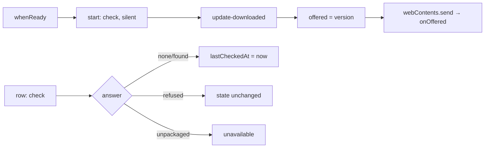
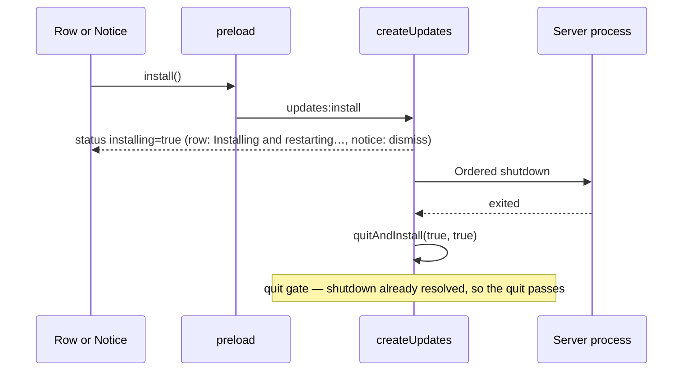

# 17 — Software update

> **Initiative:** `software-update`
> **PRD:** to follow this log — and to follow the **Electron desktop shell**
> **Plan:** to follow the PRD

This log is the `grill-me` session that settled the feature before the PRD was
written, run against the prototype and the code as they stood on 2026-09-19,
the day the **Playback component upload** initiative closed (#157). It is an
immutable snapshot of that moment. The session ran alone, with every
recommendation accepted in advance by the maintainer, whose instructions were
the scope — _translate the prototype 1:1 into the codebase, in its naming,
conventions, patterns and architecture_ — and one reference: Horizon's own
in-app auto-update (`carlos-rezai/Horizon`, design log 13, PRD 13), which this
feature was expected to be "almost identical" to. Q1 is where that expectation
was tested, and Q7 and Q24 are where it broke.

## Background

`page.SettingsPage.dc.html` draws the About card as **two** rows: a **Software
update** row over a hairline over the brand row. The build shipped the brand
row alone. Log 15 Q21 said why — _"it is the Electron initiative's
(`autoUpdater`) and the Snackbar system's, and the idle copy `You're up to
date` would be a lie with no updater behind it"_ — on log 13 Q2's standing rule
that a control whose mechanism does not exist is not drawn. `AboutSection`'s
own doc comment says it in one line: _"the card does not say You're up to date
with no updater to know it."_

What the prototype draws, in three faces of one row:

| state           | line                                                   | button                           |
| --------------- | ------------------------------------------------------ | -------------------------------- |
| `updateOffered` | _Version 1.1.0 is available to install._ in the accent | **Update now**, primary          |
| `updating`      | _Downloading and installing…_ in the dim ink           | `Updating…`, disabled            |
| `updateIdle`    | _You're up to date._ + `lastCheckedLabel`, faint       | **Check for updates**, secondary |

And what the container simulates (`FamilyFlix.dc.html`): `offerUpdate()` fires
1.6s after launch and pushes an **info** Snackbar — title _Update available_,
message _FamilyFlix 1.1.0 is ready to install._, action _Update now_,
dismissible; `runUpdate()` dismisses it, flips `updating`, and 1.7s later lands
on the new version with a **success** Snackbar _FamilyFlix updated to 1.1.0._
at 5000ms; `checkForUpdates()` stamps `lastChecked` and either offers or pushes
a **success** _You're on the latest version._ at 4000ms. CLAUDE.md's rule is to
reproduce the surface and never the simulation, and the simulation is doing a
lot of work here — Q6, Q18 and Q25 are each a place where the real mechanism
puts that copy somewhere the container never could.

`COMPONENT-SPEC.md` ties the two halves together in its `mol.Snackbar` row:
four semantic variants, _"the stack/queue/auto-dismiss timers live in the
container … in code this becomes a `SnackbarProvider` + `useSnackbar()`
context"_, the convention that actionable snackbars persist and confirmations
auto-dismiss at 5s, and — flatly — _"Used by the software-update flow (Settings
→ About)"_.

What exists to build on:

- `src/features/settings/AboutSection/` — the brand row, the **App version** in
  mono, the tagline; `Card` with `margin-bottom: 0` because it is the last
  group on the page.
- `__APP_VERSION__` (`src/types/appVersion.d.ts`) — `package.json`'s `version`
  baked in by Vite's `define`, _"so the About card and the installer can never
  disagree"_. It reads `0.0.0` until packaging sets one.
- `primitives/Button` — four variants, and a `:disabled` face already styled
  `surface-3` + `border` + `textFaint`, which is pixel-for-pixel the
  prototype's `Updating…` button.
- `primitives/Icon/UploadIcon` — `M12 16V4m0 0L8 8m4-4l4 4M5 20h14`, byte for
  byte the path in the prototype's update-row tile. Built for the **Component
  drop zone**; reusable here unchanged.
- `tokens/colors` — `info`, `success`, `warning`, `danger`, all present and
  used by nothing.
- `features/player/volumePreference/` — the project's one existing
  `localStorage` unit, and the precedent Q25 leans on.
- `createPlayback(mediaPath, slot)` / `createImporter(...)` — the
  injected-domain shape Q29 copies onto the main process.

What does **not** exist: `electron/` holds a `.gitkeep` and nothing else. There
is no `electron` dependency, no `preload`, no `main.ts`, no installer, no
`window.familyflix`.

## Problem

How does FamilyFlix learn that a new version exists, tell whoever is looking,
and install it — in an app that is offline-first, has one maintainer and two
users who must never be asked to administer software, and whose desktop shell
has not been built yet?

## Questions and Answers

### Scope and sequencing

1. **Does this initiative build the Electron shell?** ✅ **No.** There is no
   `electron/` code, no dependency, no preload and no packaged app, and
   `autoUpdater` needs all four. Log 15 Q21 already said _"update cannot exist
   without Electron"_. The shell is its own 🔜 Foundation item with its own
   design space — the server as a utility process, `userData` paths, single
   instance, the dev-vs-packaged renderer, the window and its menu — and
   Horizon kept them apart as its logs 10 and 13. **This log is complete and
   the PRD waits**: the shell's initiative comes first, the installer after it.
   What the shell must expose is Q12, stated here so the shell's own grill can
   carry it. ❌ Folding a "minimal shell" into this initiative: there is no
   minimal shell — the small version is the one that skips the decisions the
   shell's grill exists to make.

2. **Does it include the Snackbar system?** ✅ **Yes.** COMPONENT-SPEC names
   the software-update flow as the Snackbar's consumer, log 15 held the update
   row back on "the Snackbar system", and a Snackbar built as its own
   initiative would be a component with no caller — the thing this project
   refuses to build. Horizon's log 13 made the Snackbar its phase 1 for the
   same reason. This initiative ticks **two** 🔜 lines.

3. **Does it include the installer?** ✅ **No** — "Desktop packaging" is its
   own line, and it is a prerequisite rather than a part. But the **Release
   feed** — the `publish` block, the `repository` field, the tag-triggered
   workflow — is update infrastructure rather than build infrastructure and
   belongs here (Q26, Q27).

### The mechanism

4. **Updater and feed?** ✅ `electron-updater` against **GitHub Releases**.
   `carlos-rezai/FamilyFlix` is public, so no `GH_TOKEN` is needed at runtime
   and no secret ships inside the installer. ❌ A self-hosted feed — a server
   to pay for and keep up, in an app whose whole argument is that there isn't
   one.

5. **When does it check?** ✅ **Once per launch**, on `whenReady`, and again
   whenever the button is pressed. ❌ A polling interval: the family opens
   FamilyFlix to watch a film, and a long session is a long film, not a long
   sit at the library screen.

6. **Auto-download on?** ✅ **On**, `electron-updater`'s default — and this
   settles a word. On our surface **offered** always means _the bytes are
   already on this disk_. The prototype's own copy agrees twice: "available to
   **install**", "ready to **install**". A release that has been _found_ but
   not yet downloaded is not a face anything draws (Q12's `'found'`).

7. **A toggle for auto-download, as Horizon has?** ✅ **No.** The prototype
   does not draw one, and refusing it removes an entire layer: no
   `electron-store`, no preference IPC, no new `settings` row, nothing to
   migrate. Horizon has one because Horizon's grill asked for one; ours asked
   the opposite question and got the opposite answer. This is the first place
   "almost identical to Horizon" stops being true.

8. **`autoInstallOnAppQuit`?** ✅ **Left on** (the default), and worth saying
   out loud because it is the product argument: it is **the family's** update
   path. They close FamilyFlix, it updates, and they are never asked anything.
   **Update now** therefore means only _install it now instead of at the next
   quit_ — which is what makes it safe for the offer snackbar to reach them at
   all (Q24).

9. **A check that fails?** ✅ **Split by who asked.** The startup check fails
   **silently** — the Settings page's standing rule is `null` until it lands,
   `null` still if it never does, and nothing drawn while so. A check the
   maintainer **pressed** gets an answer, because a press deserves one (Q23).
   And **`lastCheckedAt` advances only on a check that got an answer** — _Last
   checked_ must never be able to mean _last tried_.

10. **An unpackaged app (dev Electron)?** ✅ The row draws — the bridge is
    there — the startup check does not run, and a press answers _"Updates are
    only available in the installed app."_ as an info snackbar. Horizon's
    `dev-unavailable`, kept, because the alternative is a button that silently
    does nothing on the one machine the app is developed on.

11. **Code signing?** ⚠️ **The self-signed option is settled by
    `25-desktop-packaging` Q21** — unsigned, and no root certificate. ✅ **Not
    this initiative's.** Unsigned to begin with and
    `verifyUpdateCodeSignature: false`, so an unsigned NSIS update is accepted;
    a self-signed certificate in Trusted Root is packaging's call, as it was
    Horizon's. ❌ An EV certificate — a yearly bill in a project whose
    constraint is zero cost.

### The seam

12. **What shape is the bridge?** ⚠️ **`onOffered` is superseded by Q37** — the
    push is the whole status, `onStatus`, with `installing` in it. ✅ **Push and pull.** Push alone has a bug:
    `update-downloaded` fires once, so leaving Settings and coming back would
    redraw an offered update as idle. The main process holds the state and the
    renderer reads it on mount — the `useCapabilities` rule.

    ```ts
    current(): Promise<UpdateStatus>;            // read on mount
    onOffered(cb: (version: string) => void): () => void;
    check(): Promise<UpdateCheck>;               // 'none' | 'found' | 'refused' | 'unavailable'
    install(): void;                             // quit, install, relaunch
    ```

    `'found'` — a release exists and is downloading — draws **no new face**:
    the row returns to idle with its label advanced, and the offer arrives on
    its own when the bytes land.

13. **What is the global called, and who owns it?** ⚠️ **The parenthetical is
    superseded by `24-electron-shell` Q4** — the preload never carries an API
    base URL. ✅ `window.familyflix`,
    owned and declared by the **Electron shell** initiative (it will carry the
    API base URL before it carries anything else); this initiative adds one
    member, `updates`. The contract itself is `src/types/update.ts` and both
    sides import it — `src/types/` is already the place the frontend and the
    server share rather than redefine, and the main process is one more reader.

### The row

14. **Where does the feature live?** ✅ A new feature folder,
    `src/features/software-update/`, whose organism `AboutSection` mounts — the
    `LibrarySection` → `ExportModal` precedent, the one place a Settings
    section composes another feature's organism. ❌ Building it inside
    `settings/`: the update domain is not the Settings hub's; it merely has a
    row there, the way Export merely has one.

15. **The About card's geometry?** ✅ Back to the prototype: the card becomes
    `overflow: hidden` with **no padding**, the update row insets itself at the
    prototype's `18px 20px`, a **full-bleed** hairline follows, then the brand
    row at `16px 20px`. `section.styles.ts`'s `Divider` carries 22px margins
    and is the wrong rule here — the bleed hairline is local to this card, the
    way the card's own flex already is.

16. **And when there is no bridge — a browser, `npm run dev`?** ✅ The organism
    returns `null`, **and it owns the hairline under it**, so its absence takes
    the rule with it and the About card renders exactly as it does today. ❌ A
    `hasUpdateBridge()` predicate the section consults: two things to keep in
    step where one will do.

17. **The faces?** ⚠️ **The disabled button and the checking face are
    restated by Q44–Q45** — `Button size="md" disabled`, both drawn in the
    prototype first. ✅ One pure unit, `updateFace/` — the `zoneFace` precedent,
    taking `now` as an argument the way every pure unit here takes its world:

    | face       | line                                               | button                            |
    | ---------- | -------------------------------------------------- | --------------------------------- |
    | offered    | `Version 1.1.0 is available to install.` (accent)  | **Update now** · primary          |
    | installing | `Installing and restarting…` (dim)                 | `Updating…` · disabled            |
    | checking   | `You're up to date.` + the label (faint)           | `Checking…` · disabled            |
    | idle       | `You're up to date. Last checked just now` (faint) | **Check for updates** · secondary |

    The disabled `Checking…` is designed in this session — the prototype does
    not draw a checking state — but it is the prototype's **own idiom**, which
    already answers a pressed button with a disabled present-progressive label.
    Nothing new is styled: `Button`'s `:disabled` face _is_ the prototype's
    `Updating…` button.

18. **Is _Downloading and installing…_ true?** ✅ **No — amend the prototype.**
    With auto-download on (Q6) the bytes landed before the button existed;
    pressing it installs and relaunches. The line becomes **_Installing and
    restarting…_**, which also tells the family what is about to happen to the
    window they are looking at. This is log 16's precedent (#151, _the
    prototype amended_): raise it in the grill, amend the handoff first, then
    build to the amended prototype.

19. **Does the row ever show a version other than the offered one?** ✅ No. The
    **App version** in the brand row is `__APP_VERSION__` — what is running.
    The **Offered version** comes from the updater's event and lives only in
    the row's line and the offer snackbar. Two numbers, two sources, never
    interchanged.

### The snackbars

20. **The molecule?** ✅ `components/Snackbar/`, 1:1 with `mol.Snackbar.dc.html`:
    the 360px card on `surface-2`, the 4px accent bar, one glyph per variant,
    the optional bold title, the optional bordered action button, the ✕, and
    the `ffSnackIn` entrance. All four status tokens already exist. The
    prototype already carries `role="status"` and an `aria-label="Dismiss"`;
    both kept, with `role="alert"` for `warning` and `error` so a refusal
    interrupts and a confirmation does not.

21. **Where do the queue and the timers live?** ✅ `src/App/SnackbarProvider/`
    and `src/App/useSnackbar/`. CLAUDE.md defines `App/` as _"the router and
    the app-level providers every page renders inside"_, and a notification
    queue is app furniture, not domain logic. ❌ `hooks/`, whose rule is "used
    across 2+ features" and which would be a lie on day one. ❌ `components/`:
    timers, a portal and a stack are not a composed primitive.

22. **Auto-dismiss?** ✅ **One rule**, COMPONENT-SPEC's: a snackbar with an
    **action persists** until actioned or dismissed; everything else **dies at
    5s**. The container's 4000 on one of its two confirmations is a simulation
    inconsistency and is amended to 5000 rather than copied.

23. **Who pushes what?** ⚠️ **The notice also retracts its offer when the row
    installs — Q37, Q55.** ✅ **Split by who is mounted.**
    - `SoftwareUpdateRow` — Settings only — pushes the **answers to a press**:
      _You're on the latest version._ (success), _FamilyFlix couldn't check for
      updates._ (error), _Updates are only available in the installed app._
      (info). A `'found'` press pushes nothing; the offer is coming.
    - `SoftwareUpdateNotice` — headless, mounted once in `App` — pushes the
      **Update offer** and the congratulation (Q25).

    Two subscribers to one broadcast, each owning its own half. ❌ A shared
    update context: there is no state to keep in step — both derive from the
    same events and the same `current()`.

24. **Does the family see the offer?** ✅ **Yes** — app-level, once per launch,
    dismissible, persisting until actioned, exactly as the container does it at
    1.6s. It is safe precisely because of Q8: with `autoInstallOnAppQuit` on,
    the offer is only ever _skip the wait_, never _administer this software_.
    ❌ Suppressing it outside Settings, which would leave the Snackbar with
    nothing to do and would make the row — the thing sitting next to the button
    that would have told them — the only way to learn anything.

25. **The _FamilyFlix updated to 1.1.0._ snackbar?** ✅ **Kept, and made
    honest.** It cannot fire in the session that installs — that process dies
    mid-sentence. It fires on the **first launch after the running version
    changed**, from a `seenVersion/` in `localStorage`: the `volumePreference`
    precedent, which already bets on `localStorage` surviving in the packaged
    app. It never fires on a fresh install, where there is no previous version
    to have changed from. ❌ Dropping it (Horizon's answer): it is the one
    moment the app can say the update worked, and the prototype writes the
    line.

### Release

26. **How does a release happen?** ⚠️ **To a draft Release, smoked, then
    published by hand — Q48, Q50–Q53.** ✅ `npm version patch|minor|major` →
    `git push --follow-tags` → `.github/workflows/release.yml` on `v*`,
    `windows-latest`, `electron-builder --publish always`, authenticated with
    the workflow's own `GITHUB_TOKEN`. ❌ Channels or prereleases — one user,
    one channel.

27. **Config?** ✅ `repository` added to `package.json`;
    `publish: { provider: 'github', owner: 'carlos-rezai', repo: 'FamilyFlix' }`
    added to packaging's `electron-builder` config when it exists.

28. **An offline machine?** ✅ Not an error state. The check fails, silently
    (Q9), and nothing in the app waits on it — the window opens, the library
    renders, the film plays.

### Shape and proof

29. **How is the main-process half testable?** ⚠️ **The dependencies and the
    folder are restated by Q40** — `electron/createUpdates/`, an `UpdatesWorld`. ✅ As an injected domain:
    `createUpdates({ updater, isPackaged, now, onOffered })` returning the
    bridge's members, exactly as `createPlayback(mediaPath, slot)` and
    `createImporter(...)` are — `main.ts` wires IPC to it and owns no logic,
    the way the router owns none. The whole state machine — the startup check,
    the remembered offer, the four check outcomes, the dev refusal — is
    unit-tested without launching Electron.

30. **And the renderer half?** ✅ `src/test-support/fakeUpdateBridge/` — the
    double that installs a controllable `window.familyflix.updates` and hands
    the test its listeners, beside `fakeResponse` and `stubDownload`. The
    bridge is read in exactly one place, `updateBridge/`, so a browser's
    `undefined` is answered once rather than at every call site.

31. **What gets ticked, and when?** ✅ **Software update** ✅ and **Snackbar
    system** ✅ in README and CLAUDE.md, plus COMPONENT-SPEC's `mol.Snackbar`
    and `page.SettingsPage` rows — all of it **after the refactor**, not when
    the build issues close.

### Build order

32. **Doesn't the Snackbar have to be built first?** ✅ **Yes — the plan below
    was reordered for it**, after the maintainer asked. Two things had been
    under-weighted. The row's four faces are self-contained, which is why the
    bridge looked like the thinner first slice — but two of the four **Update
    check** outcomes, `refused` and `unavailable`, have nowhere to go except a
    **Snackbar**, so a bridge-first phase 1 would ship a **Check for updates**
    button that does nothing visible with the network down: exactly what Q9
    ruled out. And the Snackbar is the one part of this initiative that needs
    no Electron at all, so putting it first is what stops the only unblocked
    phase from waiting behind a gate it does not share. This does not reopen
    Q2: the Snackbar is still this initiative's, still arrives with a caller,
    and the caller is one phase behind it rather than one phase ahead.

## Design

### The contract — `src/types/update.ts`

> ⚠️ **Superseded by the second session's contract** (Q36, Q37).

```ts
/** What a pressed check can come back with. */
export type UpdateCheck =
  | 'none' // the feed answered and this is the latest
  | 'found' // a release exists and is downloading; the offer follows
  | 'refused' // the feed could not be reached, or would not answer
  | 'unavailable'; // an unpackaged app has no updater

/** What the main process knows, and the row reads on mount. */
export interface UpdateStatus {
  /** The version downloaded and ready to install; `null` when there is none. */
  offered: string | null;
  /** ISO stamp of the last check that got an answer; `null` until one does. */
  lastCheckedAt: string | null;
}

/** `window.familyflix.updates` — the shell owns the global, this owns the member. */
export interface UpdateBridge {
  current(): Promise<UpdateStatus>;
  onOffered(listener: (version: string) => void): () => void;
  check(): Promise<UpdateCheck>;
  install(): void;
}
```

### The main process

> ⚠️ **Superseded by the second session** (Q34, Q36, Q38, Q40).

```
electron/
├── main.ts                 ← the shell's; wires IPC to createUpdates, nothing more
├── preload.ts              ← the shell's; exposes window.familyflix.updates
└── updates/
    ├── channels.ts         ← the four IPC channel names, flat (the tokens/ exception)
    └── createUpdates/      ← createUpdates(deps): Updates — the injected domain
```

```ts
export interface UpdatesDeps {
  updater: {
    autoDownload: boolean;
    checkForUpdates(): Promise<{ updateInfo: { version: string } } | null>;
    quitAndInstall(): void;
    on(
      event: 'update-downloaded',
      listener: (info: { version: string }) => void
    ): void;
  };
  isPackaged: boolean;
  now(): Date;
  /** Called when a release finishes downloading, however the check began. */
  onOffered(version: string): void;
}

export interface Updates {
  /** The once-per-launch check. Never rejects; a refusal is silence. */
  start(): Promise<void>;
  current(): UpdateStatus;
  check(): Promise<UpdateCheck>;
  install(): void;
}
```


```mermaid
flowchart LR
  A[whenReady] --> B[start: check, silent]
  B --> C[update-downloaded]
  C --> D[offered = version]
  D --> E[webContents.send → onOffered]
  F[row: check] --> G{answer}
  G -- none/found --> H[lastCheckedAt = now]
  G -- refused --> I[state unchanged]
  G -- unpackaged --> J[unavailable]
```

### The renderer

```
src/components/Snackbar/              ← the molecule, 1:1, four variants
src/App/
├── SnackbarProvider/                 ← the portal stack, the queue, the 5s rule
└── useSnackbar/                      ← notify(notice): id · dismiss(id)
src/features/software-update/
├── SoftwareUpdateRow/                ← the About card's row + its hairline; owns the hook
├── SoftwareUpdateNotice/             ← headless, in App: the offer and the congratulation
├── useSoftwareUpdate/                ← the read on mount, the subscription, check, install
├── updateFace/                       ← pure: status + busy + now → the line and the button
├── seenVersion/                      ← localStorage: the version this machine last ran
└── updateBridge/                     ← the one place window.familyflix?.updates is read
src/features/settings/AboutSection/   ← the card reopened: the row, the bleed rule, the brand row
src/test-support/fakeUpdateBridge/
```

```ts
// updateBridge — null in a browser, and that is a state, not an error
export function updateBridge(): UpdateBridge | null;

// useSoftwareUpdate — never rejects; `status` is null until current() lands
export interface SoftwareUpdate {
  status: UpdateStatus | null;
  busy: 'checking' | 'installing' | null;
  check: () => Promise<UpdateCheck>;
  install: () => void;
}

// updateFace
export interface UpdateFace {
  line: string;
  tone: 'offer' | 'dim' | 'faint';
  button: {
    label: string;
    variant: 'primary' | 'secondary';
    disabled: boolean;
  };
}
export function updateFace(
  status: UpdateStatus,
  busy: 'checking' | 'installing' | null,
  now: Date
): UpdateFace;

// Snackbar — the molecule
export type SnackbarVariant = 'info' | 'success' | 'warning' | 'error';
export interface SnackbarProps {
  variant: SnackbarVariant;
  title?: string;
  message: string;
  actionLabel?: string;
  onAction?: () => void;
  dismissible?: boolean;
  onDismiss?: () => void;
}

// useSnackbar
export interface Notice {
  variant: SnackbarVariant;
  title?: string;
  message: string;
  action?: { label: string; onClick: () => void };
  /** ms. Omitted: 5000 with no action, forever with one. */
  duration?: number;
}
```

**_Last checked_**, inside `updateFace`: `just now` under a minute, then
`N minutes ago`, `N hours ago`, `N days ago`. Absent entirely when
`lastCheckedAt` is `null` — the prototype's own empty `lastCheckedLabel`, which
is how the row says _no check has answered yet_ without drawing a fourth face.

**The copy**, in one place so it cannot drift:

| moment                       | variant | title            | message                                            | action                   |
| ---------------------------- | ------- | ---------------- | -------------------------------------------------- | ------------------------ |
| a release is ready           | info    | Update available | `FamilyFlix 1.1.0 is ready to install.`            | **Update now**, persists |
| first launch after an update | success | —                | `FamilyFlix updated to 1.1.0.`                     | —                        |
| pressed check, nothing new   | success | —                | `You're on the latest version.`                    | —                        |
| pressed check, refused       | error   | —                | `FamilyFlix couldn't check for updates.`           | —                        |
| pressed check, unpackaged    | info    | —                | `Updates are only available in the installed app.` | —                        |

### Prototype amendments (make first, then build)

1. `page.SettingsPage.dc.html` — the `updating` line becomes **_Installing and
   restarting…_** (Q18). Geometry and every other word unchanged.
2. `FamilyFlix.dc.html` — `checkForUpdates()`'s confirmation duration `4000` →
   `5000`, so one rule covers both confirmations (Q22).

### Not built

An auto-download toggle or any preference store; `electron-store`; a download
progress bar or percentage; release channels; a "what's new" or release-notes
face; an update check on a timer; rollback; a snackbar suppressed by route; a
confirm before **Update now**; an error face on the row (a refusal is a
snackbar, and the row stays honest); signing (packaging's); the installer
itself (packaging's); the shell (its own initiative).

## Implementation Plan

> ⚠️ **Superseded by the second session's plan.** Phase 1 shipped as log 18;
> phase 4's proof cycle cannot start from 0.1.0 (Q47).

> Gated unevenly, which is what sets the order (Q32): **phase 1 needs nothing
> that does not already exist**, phases 2 and 3 need the **Electron desktop
> shell** initiative, and phase 4 needs the **Desktop packaging** one.

1. **The Snackbar system.** `components/Snackbar/` 1:1 with the molecule,
   `App/SnackbarProvider/` with the portal stack, the queue and the 5s rule,
   `App/useSnackbar/`, the host mounted in `App`. The only phase with no shell
   under it, so it is the only one buildable today; its caller arrives in
   phase 2, inside this same initiative. Proven by its own tests: a notice with
   an action outlives 5s, one without does not, and the stack orders
   newest-nearest-the-corner.
2. **The bridge and the row, fully voiced.** `src/types/update.ts`;
   `electron/updates/` with `channels.ts` and `createUpdates/`; `main.ts`'s
   startup check and its IPC; `preload.ts`'s `window.familyflix.updates`;
   `updateBridge/`, `useSoftwareUpdate/`, `updateFace/`, `SoftwareUpdateRow/`
   and the About card's geometry — **and the row's three pressed-check answers
   pushed through phase 1's stack**, because a check that is refused has
   nowhere else to speak. The slice that works: the maintainer opens Settings
   in the installed app, reads _You're up to date_, presses the button and
   watches _Last checked just now_ appear — then pulls the network out and
   presses again, and is told so.
3. **The offer and the congratulation.** `SoftwareUpdateNotice/` mounted in
   `App`, `seenVersion/`, the offer snackbar at launch with **Update now**
   wired to `install()` from either surface, and the success line on the next
   launch.
4. **The release feed.** `repository`, the `publish` block,
   `.github/workflows/release.yml`, and the `npm version` → `--follow-tags`
   flow written down. Proof is one real cycle on the family machine: 0.1.0
   launches, offers 0.1.1, installs it, and says so on the way back up.
5. **Docs and refactor.** COMPONENT-SPEC's `mol.Snackbar` and
   `page.SettingsPage` rows, the glossary, CLAUDE.md's folder map and feature
   list, README's tree, the two feature ticks (Q31), the journal; then the
   refactor pass.

## Trade-offs

**Easier.** Refusing the auto-download toggle (Q7) deletes a whole layer — no
preference store, no IPC for it, no migration, no second place the truth could
live. Auto-download plus `autoInstallOnAppQuit` means the family's update path
needs no UI at all, so every surface this initiative builds is a convenience
rather than a requirement, which is the right amount of weight for a screen two
people will never open. `current()` on mount makes the row correct across
remounts for the price of one extra IPC. The bridge read in one unit means a
browser's `undefined` is answered once. And the Snackbar arrives with a caller,
and arrives designed — four variants against four tokens that have sat unused
since the theme was written.

**Harder.** Everything but phase 1 is gated on a shell that does not exist, and
this log will be read months after it was written — Q12 is the part that has to
survive that, because the shell's grill has to carry a member it did not
design. `localStorage` is now load-bearing for one snackbar (Q25); it was
already load-bearing for the volume, but that failure is silent and this one is
a missing congratulation nobody will report. The row has a `checking` face the
prototype's author never drew. And an unsigned NSIS update (Q11) means the
first real update on a machine that is not the maintainer's will meet
SmartScreen — acceptable for a two-user household, and packaging's problem to
improve.

**Ruled out of scope.** The Electron shell and the installer; signing; download
progress; release notes; channels; rollback; a preference of any kind; an
update check that runs more than once a launch; and the Back-to-top FAB, which
shares a rung with the Snackbar and nothing else.

---

# Second session — 2026-10-04, after the shell and the packaging

> Run against the code at `639c78c`, the day **Desktop packaging** was ticked
> with its Package smoke unproven. Like the first, it ran alone, with every
> recommendation accepted in advance and the same scope: _translate the
> prototype 1:1 into the codebase, in its naming, conventions, patterns and
> architecture_. The first session's answers stand except where a ⚠️ pointer
> above sends the reader here. Questions are numbered on from Q32.

## Background

When the first session ran, three things this feature stands on did not exist.
All three do now, and each one built a little differently from how log 17
pictured it:

- **The Snackbar system** shipped as its own initiative (log 18). The API is
  `notify(notice): number` / `dismiss(id)`, and `SnackbarNotice` is
  `{ variant, title?, message, action?: { label, onClick } }`. There is **no
  `duration`** (log 18 Q24) and no `dismissible`. Pressing an action takes the
  notice off before it runs (Q25). The stack does not dedupe, so the
  StrictMode guard is the caller's job (Q28). Log 17's phase 1 is done.
- **The Electron shell** (log 24): `electron/main.ts` is a composition root
  over small injected units (`serverHandle`, `quitAfterShutdown`,
  `shellDialogs`, `shellLog`, …), each a top-level folder with a `…World`
  dependency interface. The window is sandboxed with **no preload**. Log 24 Q4
  gave the preload and `window.familyflix` to this step. Quitting goes
  through the **quit gate**, which holds `before-quit` until the server's
  **Ordered shutdown** (cancel runs, close the listener, close the database)
  is over or 5 s pass. `shellMode` is `'dev' | 'start' | 'installed'`.
  `buildElectron.mjs` emits two CJS bundles, `main.js` and `server.js`.
- **Desktop packaging** (log 25): `electron-builder` through
  `packageApp.mjs`, one-click per-user NSIS, unsigned, and `package.json` at
  **0.1.0** with `dependencies: {}` held by a guard. `builderConfig.json`
  carries **`"publish": null`** (`b03a0e1`), because without it
  `electron-builder` infers a GitHub feed off the remote and writes
  `app-update.yml` into the layout. The asar holds four files. The Package
  smoke (`docs/release-checklist.md`) passed step 1 only: in Windows Sandbox
  the installed window painted nothing, and that was never diagnosed (dev
  journal, 2026-10-04).

What the prototype still says. `page.SettingsPage.dc.html`'s `updating` face
still reads _Downloading and installing…_. `FamilyFlix.dc.html`'s
`checkForUpdates()` still says `duration: 4000`. **Neither amendment was
made** — the one log 17 kept (amendment 1) or the one log 18 Q35 inherited
(amendment 2). The `Updating…` button is a raw `<button>`: 42px tall,
`0 22px` padding, a 9px radius and 14px text. The two buttons beside it are
`prim.Button size="md"`: 50px, `0 26px`, 10px and 16px.

`carlos-rezai/FamilyFlix` is public. `.github/` does not exist.

## Problem

Fit log 17's design onto the shell and installer that actually shipped. That
means:

- Settle what log 24 and log 25 handed to this step: the preload, the global
  and the `publish` block.
- Find where the first session's sketches no longer fit: the bridge's push,
  the dependencies, `quitAndInstall` against the quit gate, the first
  Release, and the button.
- Turn the release ritual into something a workflow can run.

## Questions and Answers

### Where this lives

33. **A new log, or this one?** ✅ **This one, appended**, numbered on from
    Q32, with ⚠️ pointers on each first-session answer it supersedes. That
    follows log 25's precedent of pointers on log 17 Q11 and log 24 Q19.
    Logs 18, 24 and 25 all point here as "log 17". ❌ A log 26: two documents
    for one feature, and the first would still read as current.

### The preload and the global

34. **What is the preload?** ✅ **`electron/preload.ts`, flat beside
    `main.ts`, and wiring only.** It calls
    `contextBridge.exposeInMainWorld('familyflix', { updates })` over
    `ipcRenderer`. Each member passes one channel through and holds no state.
    Like `main.ts`, it has no suite: there is nothing in it that is not
    Electron, and it is proven by the smoke. A sandboxed preload may
    `require('electron')` and nothing else, so it is a **third CJS bundle**,
    `electron/dist/preload.js`, `electron` external, emitted by
    `buildElectron.mjs` beside the other two (its suite asserts three). The
    asar's `files` gain it, which makes five, and the guard follows.
    `openWindow`'s `webPreferences` gain `preload: join(__dirname,
'preload.js')` and keep `sandbox`, `contextIsolation` and
    `nodeIntegration: false` exactly as log 24 Q21 set them. ❌ A
    `preload/` folder unit with a test: a test of `contextBridge` is a test
    of a mock of it.

35. **Where is `window.familyflix` typed?** ✅ **`src/types/familyflix.d.ts`**,
    the `appVersion.d.ts` precedent: a global defined outside the renderer
    (by Vite's `define` there, by the preload here), declared once:
    `interface Window { familyflix?: { updates: UpdateBridge } }`. It is
    **optional** because a browser has none, which is the state
    `updateBridge/` answers once (Q30). It is included in
    `tsconfig.electron.json` beside `shell.ts`. ❌ A cast at the read site:
    every reader would repeat it, and the project forbids `any`.

36. **Where do the IPC channel names live?** ✅ **In `src/types/update.ts`,
    as `UPDATE_CHANNELS`**, beside the contract they carry. That is the
    `shell.ts` precedent: one file that both sides of a seam import.
    `export.ts`'s `EXPORT_FORMATS` already puts `as const` values in
    `types/`. ❌ Log 17's `electron/updates/channels.ts`: `electron/` has no
    category folders. It is one top-level folder per unit, and a list of four
    strings is not a unit.

### The bridge, restated

37. **Is `onOffered` still the right push?** ✅ **No. It becomes `onStatus`,
    and `installing` moves into `UpdateStatus`.** Two surfaces can install:
    the row's **Update now** and the offer snackbar's. Log 18 Q25 named the
    case where the snackbar must be retracted because the maintainer
    installed from the row. An `onOffered` push cannot tell
    `SoftwareUpdateNotice` that the row did that. With main pushing the
    **whole status** on every change, both subscribers derive from one
    stream:
    - the row draws _Installing and restarting…_ whichever surface was
      pressed;
    - the notice `dismiss`es its offer when `installing` turns true;
    - a launch check that answers while Settings is open advances _Last
      checked_ there too.

    `checking` stays local to `useSoftwareUpdate`, because only the row can
    start a pressed check. ❌ A second push, `onInstalling`: two channels for
    one state.

### Install against the quit gate

38. **What does `install()` do now that quitting is ordered?** ✅ **It pushes
    `installing`, awaits the Ordered shutdown, then calls
    `quitAndInstall(true, true)`** (silent, relaunch after).
    `electron-updater`'s `quitAndInstall` spawns the NSIS installer
    **before** it calls `app.quit()`. Run bare, it would start the installer
    while the quit gate is still waiting on the **Server process**. The
    one-click installer's app-running check would then find FamilyFlix
    processes running and kill them, and the server is a utility process of
    the same exe, possibly holding the database mid-write. With the shutdown
    done first, the gate's own `shutdown` resolves at once (`serverHandle`
    answers an exited child immediately), and the quit goes straight
    through. **The family's path needs nothing:** `autoInstallOnAppQuit`
    installs on Electron's `quit` event, and the gate already orders that
    after the shutdown.

39. **A run in flight when Update now is pressed?** ✅ **Cancelled by the
    Ordered shutdown, exactly as closing the window would cancel it.** An
    Import rolls its current folder back, and an Enrichment keeps what it
    already fetched. No confirm: log 17's _Not built_ already lists "a
    confirm before **Update now**", and the button is the maintainer's.

### The main-process unit

40. **Is `createUpdates` still log 17 Q29's shape?** ✅ **The idea, with new
    dependencies, and flat.** It lives at `electron/createUpdates/`, a
    top-level unit like `serverHandle/`, and its dependencies are an
    `UpdatesWorld`, the shell's naming (`ServerHandleWorld`,
    `QuitGateWorld`, `DialogWorld`):
    - `enabled` replaces `isPackaged`, and main passes
      `mode === 'installed'`, so an `electron:start` run, unpackaged in the
      installed shape, answers `unavailable` like `electron:dev`.
    - `shutdown()` is `serverHandle.shutdown` with `SHUTDOWN_MS` bound by
      main (Q38).
    - `onStatus` replaces `onOffered` (Q37).
    - `log` is the **Shell log**'s `main` writer (Q41).

    ❌ `electron/updates/createUpdates/`: the nesting log 17 drew before
    `electron/` had a shape.

41. **The updater's errors and its log?** ✅ **An `error` listener is always
    registered, and `updater.logger` writes to the Shell log.** An `error`
    event with no listener throws in main. That covers an unreachable feed, a
    failed download and a 404 on a repo with no Release, and any of them
    would take the app down for a network blip. Each logs one `[main]` line
    and is otherwise silent (Q9). `info`, `warn` and `error` go to the log,
    and `debug` is dropped. On the parents' machine the log is the only
    window the maintainer has into why an update never came.

42. **How does a check read _none_ from _found_?** ✅ **By the result's
    `isUpdateAvailable`**, never by comparing version strings in our code.
    A `null` result from an enabled updater, or a rejection, is `refused`.

43. **How does `electron-updater` ship, with `dependencies: {}` guarded?**
    ✅ **As a devDependency, bundled into `main.js` by esbuild**, the way
    every server dependency is bundled into `server.js` (log 25 Q9). The
    guard stays as it is. The first packaged check is the proof. ❌ A
    runtime dependency: it would put a `node_modules` tree back in the
    **Packaged layout** for one package.

### The prototype, again

44. **Is `Button`'s disabled face really the `Updating…` button?** ✅ **In
    colour, yes. In size, no — and the prototype is amended, not copied.**
    Log 17 Q17 called it pixel-for-pixel. The fill, border and ink match
    `prim.Button`'s own disabled face. The raw button, though, is 42px tall
    at 14px text, while the **Update now** and **Check for updates** it
    replaces are `md`, 50px at 16px. Copied, the row would shrink by 8px for
    the length of the install. The amendment makes it
    `prim.Button variant="primary" size="md" disabled label="Updating…"`. In
    code that is `Button size="md" disabled`, with nothing local styled.
    ❌ A one-off 42px button in the feature: CLAUDE.md forbids it when the
    primitive exists.

45. **The `checking` face log 17 designed in session: build it, or draw it
    first?** ✅ **Draw it first.** _If a feature needs something the
    prototype doesn't cover, the prototype needs revisiting before building_.
    The amendment adds a fourth `sc-if` to the row: the idle line, with its
    label, over a disabled `Checking…` `prim.Button size="md"`. It also adds
    `checking` to `FamilyFlix.dc.html`'s `checkForUpdates()` so the
    simulation passes through it.

46. **And the two amendments that were never made?** ✅ **All four are
    phase 1's first commit**, before any code reads them: _Installing and
    restarting…_ (Q18), `4000` → `5000` (Q22, log 18 Q35), the `Updating…`
    button (Q44), and the checking face (Q45).

### The first Release

47. **Can 0.1.0 be offered 0.1.1, as log 17's proof cycle says?** ✅ **No —
    0.1.0 can never update.** It was built with `"publish": null`, so it
    carries no `app-update.yml` and its updater has no feed to ask. The
    **first Release is `v0.2.0`**, made with `npm version minor` because this
    is a feature. It is the first Installer that names the feed, and it is
    installed by hand like any first install. The proof cycle becomes
    **0.2.0 installed → 0.2.1 published → offered, installed, congratulated**.
    0.1.0 is never published.

48. **Does a tag publish straight to the family?** ✅ **No: to a draft.**
    `publish.releaseType: 'draft'`. The workflow uploads the Installer,
    `latest.yml` and the blockmap to a **draft** Release, and
    `electron-updater` does not read drafts. The maintainer downloads the
    draft's Installer and runs the **Package smoke** against it. **Publishing
    the draft is the release.** That is how the checklist's _"A release is
    ticked against this list, every time"_ becomes a gate a machine respects.
    ❌ `releaseType: 'release'`: the parents' machine would fetch an Installer
    nobody had installed.

49. **The Sandbox window that painted nothing?** ✅ **A gate on the first
    publish, not on the build — and packaging's to fix.** It is filed as a
    `desktop-packaging` fix issue. It is diagnosed with the two checks the
    journal names: `--disable-gpu`, and a Sandbox `.wsb` with
    `<vGPU>Disable</vGPU>`. If it turns out to be the Sandbox's virtual GPU,
    the `.wsb` becomes part of the checklist. Phases 1–2 do not wait on it;
    phase 3's first publish does, because Q48 makes the smoke the release.

### The release, mechanised

50. **What runs on a tag?** ✅ `.github/workflows/release.yml`, on
    `push: tags: ['v*']`, `windows-latest`, `permissions: contents: write`:
    `npm ci` → `npm run typecheck` → `node_modules/.bin/vitest run` →
    `node electron/scripts/packageApp.mjs --publish`, with
    `GH_TOKEN: ${{ secrets.GITHUB_TOKEN }}`. Log 25 Q24 kept the typecheck
    and tests out of `packageApp` because _"that is the commit gate's job,
    and step 9's CI"_. This is that CI. ❌ CI on every push to `main`: not
    asked for, and the commit gate already runs locally.

51. **How does `packageApp` learn to publish?** ✅ **A `--publish` flag**
    passes `publish: 'always'`. The default stays `'never'`, so a local
    `electron:package` uploads nothing. `builderConfig.json`'s `null`
    becomes `{ "provider": "github", "owner": "carlos-rezai", "repo":
"FamilyFlix", "releaseType": "draft" }`. The guard's _names no release
    feed_ leaf becomes _names the release feed_: provider `github`, and
    owner/repo equal to `package.json`'s new `repository`. A local package
    now writes `app-update.yml` too, which is correct: the Installer names
    the feed it has. `win.verifyUpdateCodeSignature: false` is written into
    the config and guarded, because log 17 Q11 and log 25 Q21 both lean on
    it, and a stated flag cannot drift with a default.

52. **What does `npm version` write?** ✅ **`.npmrc` sets
    `message=chore: [release] v%s`**, so the ritual is
    `npm version minor|patch` → `git push --follow-tags`, and the
    commit-msg typecheck runs on that commit like any other. A release is
    not an issue, so this one commit shape drops the `issue #<n>` clause.
    CLAUDE.md's _Commit Messages_ gains the line. ❌ Hand-typed tags: the tag
    and the version must agree, and `npm version` makes them agree by
    construction.

53. **Where is the ritual written down?** ✅ **`docs/release-checklist.md`**,
    as that file already promises. It gains three things:
    - a _Publish_ section: bump, push, watch the workflow, smoke the draft's
      Installer, publish the draft;
    - an _Update round-trip_ section: from the previous version, the offer
      snackbar, **Update now**, _Installing and restarting…_, the relaunch,
      _FamilyFlix updated to …_, the About card's version; then the quit
      path on the next version; then **Check for updates** with the network
      off;
    - the Sandbox `.wsb` if Q49 needs it.

    ❌ A second list.

### Small rulings

54. **Does _Last checked 3 minutes ago_ tick?** ✅ **No.** `updateFace`
    computes the label from `now` at render. A row left open goes stale by
    minutes, and the next render puts it right. ❌ A one-minute interval:
    a timer kept alive for a screen nobody reads that closely.

55. **The offer once per launch, under StrictMode?** ✅ **Once per renderer
    load, held by a ref** in `SoftwareUpdateNotice`. It pushes when
    `current()` lands with `offered` set, or when `onStatus` first brings
    one. A renderer crash that `reloadOnce` reloads offers again, which is
    accepted. The ref also holds the notice's id, which Q37's retraction
    needs.

56. **The Seen version in a browser?** ✅ **Never read or written.**
    `SoftwareUpdateNotice` does nothing when `updateBridge()` is `null`, so
    `npm run dev` never congratulates anyone. Under the shell it runs in
    every mode. An unpackaged run that crosses an `npm version` says so,
    which is harmless and true.

57. **Glossary drift?** ✅ Two corrections for the ubiquitous-language pass.
    The **Release feed** is no longer "the only network FamilyFlix ever
    makes", because **TMDB** came first (log 23). The **App version** has
    read `0.1.0` since log 25 Q23.

58. **Ticks?** ✅ Unchanged from Q31, minus the Snackbar (log 18 Q36):
    **Software update** ✅ in README and CLAUDE.md and COMPONENT-SPEC's
    `page.SettingsPage` row, **after the refactor**. CLAUDE.md's build-order
    chain then has no step left, and says so.

## Design (second session)

### The contract — `src/types/update.ts` (supersedes the first)

```ts
/** The four IPC channels between the preload and main. */
export const UPDATE_CHANNELS = {
  current: 'updates:current', // invoke → UpdateStatus
  check: 'updates:check', // invoke → UpdateCheck
  install: 'updates:install', // send
  status: 'updates:status', // main → renderer, every change
} as const;

export type UpdateCheck = 'none' | 'found' | 'refused' | 'unavailable';

export interface UpdateStatus {
  /** The version downloaded and ready to install; `null` when there is none. */
  offered: string | null;
  /** ISO stamp of the last check that got an answer; `null` until one does. */
  lastCheckedAt: string | null;
  /** True from the moment either surface presses Update now. */
  installing: boolean;
}

export interface UpdateBridge {
  current(): Promise<UpdateStatus>;
  onStatus(listener: (status: UpdateStatus) => void): () => void;
  check(): Promise<UpdateCheck>;
  install(): void;
}
```

```ts
// src/types/familyflix.d.ts — the global the preload defines
import type { UpdateBridge } from './update';
declare global {
  interface Window {
    familyflix?: { updates: UpdateBridge };
  }
}
export {};
```

### The main process

```
electron/
├── main.ts            ← + the updater wired: createUpdates, three ipcMain handlers, the status send, start() after the window
├── preload.ts         ← new, flat, wiring: contextBridge → window.familyflix.updates
└── createUpdates/     ← new: createUpdates(world): Updates
```

```ts
/** The part of electron-updater's `autoUpdater` the unit uses. */
export interface Updater {
  autoDownload: boolean;
  autoInstallOnAppQuit: boolean;
  logger: {
    info(message: string): void;
    warn(message: string): void;
    error(message: string): void;
  } | null;
  checkForUpdates(): Promise<{
    isUpdateAvailable: boolean;
    updateInfo: { version: string };
  } | null>;
  quitAndInstall(isSilent: boolean, isForceRunAfter: boolean): void;
  on(
    event: 'update-downloaded',
    listener: (info: { version: string }) => void
  ): unknown;
  on(event: 'error', listener: (error: Error) => void): unknown;
}

export interface UpdatesWorld {
  updater: Updater;
  /** `shellMode === 'installed'`. */
  enabled: boolean;
  now(): Date;
  /** The Ordered shutdown, its budget bound by main. */
  shutdown(): Promise<void>;
  /** Every status change, for `webContents.send(UPDATE_CHANNELS.status)`. */
  onStatus(status: UpdateStatus): void;
  /** The Shell log's `[main]` writer. */
  log(text: string): void;
}

export interface Updates {
  /** The once-per-launch check: never rejects, silent when refused. */
  start(): Promise<void>;
  current(): UpdateStatus;
  check(): Promise<UpdateCheck>;
  /** installing → shutdown → quitAndInstall(true, true); a no-op with no offer. */
  install(): Promise<void>;
}
```


```mermaid
sequenceDiagram
  participant R as Row or Notice
  participant P as preload
  participant M as createUpdates
  participant S as Server process
  R->>P: install()
  P->>M: updates:install
  M-->>R: status installing=true (row: Installing and restarting…, notice: dismiss)
  M->>S: Ordered shutdown
  S-->>M: exited
  M->>M: quitAndInstall(true, true)
  Note over M: quit gate — shutdown already resolved, so the quit passes
```

### The renderer (as the first session, except)

- `useSoftwareUpdate` → `{ status: UpdateStatus | null; checking: boolean;
check(): Promise<UpdateCheck>; install(): void }`. `busy` is gone:
  installing is `status.installing`.
- `updateFace(status, checking, now)`, with four faces as Q17, plus Q44's
  button: every disabled face is `Button size="md" disabled`.
- `SoftwareUpdateNotice` subscribes to `onStatus`. It pushes the offer once
  (Q55), retracts it on `installing` (Q37), and congratulates off
  `seenVersion/` (Q56).
- `fakeUpdateBridge` gains `emit(status)` in place of `offer(version)`.

### Release

```yaml
# .github/workflows/release.yml
on:
  push:
    tags: ['v*']
permissions:
  contents: write
jobs:
  release:
    runs-on: windows-latest
    steps:
      - uses: actions/checkout@v4
      - uses: actions/setup-node@v4
        with:
          node-version: 22
          cache: npm
      - run: npm ci
      - run: npm run typecheck
      - run: node node_modules/vitest/vitest.mjs run
      - run: node electron/scripts/packageApp.mjs --publish
        env:
          GH_TOKEN: ${{ secrets.GITHUB_TOKEN }}
```

`package.json` gains `"repository": "github:carlos-rezai/FamilyFlix"`.
`.npmrc` gains `message=chore: [release] v%s`. `builderConfig.json`: the
`publish` block (Q51) and `win.verifyUpdateCodeSignature: false`.

### Prototype amendments (phase 1's first commit)

1. `page.SettingsPage.dc.html` — `updating` line → _Installing and
   restarting…_ (Q18).
2. `page.SettingsPage.dc.html` — the raw `Updating…` button →
   `prim.Button size="md" disabled` (Q44).
3. `page.SettingsPage.dc.html` — a `checking` face: the idle line over a
   disabled `Checking…` (Q45). `FamilyFlix.dc.html` — `checking` in state and
   in `checkForUpdates()`.
4. `FamilyFlix.dc.html` — `checkForUpdates()`'s `duration: 4000` → `5000`
   (Q22).

## Implementation Plan (supersedes the first)

> Phase 1 of the first plan (the Snackbar) shipped as log 18. Phases 1–2
> below need nothing that does not exist. Phase 3's **publish** waits on the
> Sandbox fix (Q49), which is a `desktop-packaging` issue.

1. **The bridge and the row, fully voiced.** The four prototype amendments
   first. Then:
   - `src/types/update.ts`, `familyflix.d.ts`;
   - `electron/createUpdates/` (start, current, check, the four outcomes, the
     error listener, the logger);
   - `preload.ts`, the third bundle, the asar's fifth file and `main.ts`'s
     wiring;
   - `updateBridge/`, `useSoftwareUpdate/`, `updateFace/`,
     `SoftwareUpdateRow/` and the About card's geometry (Q15–Q16), with
     `fakeUpdateBridge/`;
   - the three pressed-check answers through `useSnackbar()`.

   Proof: the suites, then an `electron:start` run, where pressing **Check
   for updates** answers _Updates are only available in the installed app._

2. **Install and the offer.** `install()` over the Ordered shutdown (Q38),
   `SoftwareUpdateNotice/` in `App`, the offer once (Q55) and retracted on
   `installing` (Q37), `seenVersion/` and the congratulation. Proof: the
   suites, both surfaces driven through `fakeUpdateBridge`.
3. **The release feed** — HITL at its end. The `publish` block and its guard,
   `verifyUpdateCodeSignature`, `repository`, `packageApp --publish`,
   `release.yml`, `.npmrc`, and the checklist's two new sections. Then, once
   the Sandbox fix is in: `npm version minor` → v0.2.0 → draft → smoke →
   publish → installed by hand; `npm version patch` → v0.2.1 → draft →
   smoke → publish → the round-trip on the 0.2.0 install (Q47, Q53).
4. **Docs and refactor.** CLAUDE.md (folder map: `preload.ts`,
   `createUpdates/`, `features/software-update/`, `.github/`; _Commit
   Messages_' release line; the build-order chain closed), README, the
   COMPONENT-SPEC row, the glossary, the journal; then the refactor, then
   the tick (Q58).

## Trade-offs (second session)

**Easier.** One status stream means the two surfaces cannot disagree, and the
snackbar's retraction comes for free. Putting the shutdown ahead of
`quitAndInstall` means an update cannot interrupt a database write, and the
family's quit path needed no new code at all. Draft Releases turn the
checklist from a promise into a gate. `UPDATE_CHANNELS` in `types/` keeps the
preload and main from spelling a channel twice.

**Harder.** The first updatable version has to be installed by hand on the
parents' machine, because 0.1.0 never will be updated. Every release now
needs a person: smoke the draft, then publish it. That is the point, but it
means a release cannot happen from a phone. CI on `windows-latest` runs the
whole suite on a machine that has never run it, so the first tag may find
environment assumptions the commit gate never met. Bundling `electron-updater`
into `main.js` is unproven until the first packaged check.

**Ruled out of scope (added to the first session's list).** CI on pushes to
`main`; a ticking _Last checked_; a confirm or a run-in-flight warning before
**Update now**; a version-string comparison of our own; publishing 0.1.0;
diagnosing the Sandbox paint inside this initiative (packaging's, Q49).
