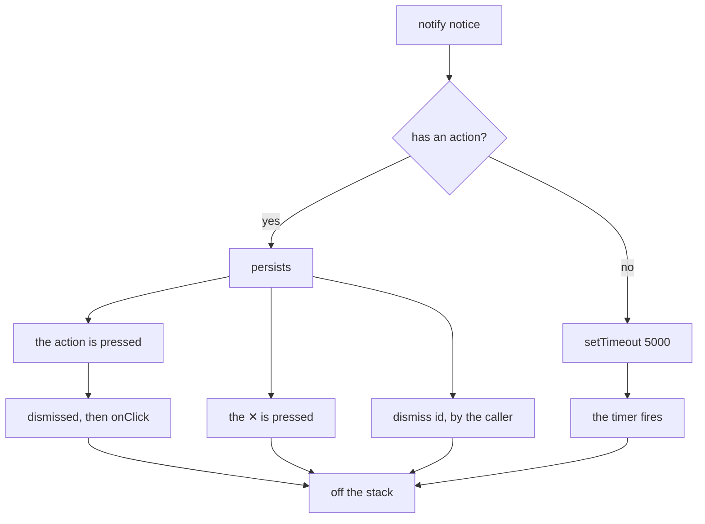

# 18 — Snackbar system

> **Initiative:** `snackbar`
> **PRD:** to follow this log
> **Plan:** to follow the PRD

This log is the `grill-me` session that settled the feature before the PRD was
written, run against the prototype and the code as they stood on 2026-09-19,
the day log 17 closed. It is an immutable snapshot of that moment. The session
ran alone, with every recommendation accepted in advance by the maintainer,
whose standing instruction is the scope — _translate the prototype 1:1 into the
codebase, in its naming, conventions, patterns and architecture_.

It exists because log 17 ended by reordering itself: Q32 put the **Snackbar
system** ahead of the bridge it was written for, and the feature lists were
rewritten into a five-step chain with the Snackbar as step 1 — the only
buildable thing in the app today. A slice that runs first, alone, and under no
Electron gate is a slice with its own grill.

## Background

`mol.Snackbar.dc.html` is the transient bottom-right card: a 360px panel on
`surface-2`, a 4px accent bar down its left edge, one glyph per variant, an
optional bold title over a dim message, an optional bordered action button, a
✕, and the `ffSnackIn` entrance. Four variants — `info` `success` `warning`
`error` — off the four status tokens, all of which exist in `tokens/colors.ts`
already, as does `ffSnackIn` in `GlobalStyle`.

`FamilyFlix.dc.html` draws the other half: a fixed bottom-right
`column-reverse` column at `z-index: 200`, `pointer-events: none` with each
card re-enabling its own, fed by `pushSnack` / `dismissSnack` over a
`snackbars` array and a `_snackSeq` counter, with `setTimeout` per notice.

COMPONENT-SPEC ties the two together and names the split: _"the stack/queue/
auto-dismiss timers live in the container … in code this becomes a
`SnackbarProvider` + `useSnackbar()` context"_, plus the convention —
actionable snackbars persist, confirmations die at 5s.

Log 17 already grilled most of this from the consumer's end (Q20–Q25): the
molecule 1:1, the queue in `App/`, the one timing rule, who pushes what, and
the copy table for all five moments. **This log does not reopen any of it.** It
settles what a standalone build has to answer that a phase inside another
initiative did not: whether it may be built at all with its caller still gated,
where the units sit relative to `App.tsx`, and the handful of shapes log 17
sketched from the outside and which look different from inside.

## Problem

Build a notification system whose only designed caller is three initiatives
away, without either (a) building a speculative component — the thing this
project refuses — or (b) inventing callers by reopening six logs that each
rejected a snackbar on their own merits.

## Questions and Answers

### Scope

1. **Is the Snackbar its own initiative now, or still log 17's phase 1?** ✅
   **Its own** — `18-snackbar.md`, initiative `snackbar`, its own PRD, issues,
   build and refactor. Log 17's phase 1 is struck; its plan starts at the
   bridge. Nothing else about log 17 moves: the copy table, the two pushers,
   the once-per-launch rule and the congratulation all stay there, because they
   are the update flow's and arrive with it.

2. **Doesn't that revive log 17 Q2 — "a Snackbar built as its own initiative
   would be a component with no caller, the thing this project refuses to
   build"?** ✅ **It is answered rather than ignored.** What Q2 refused was a
   _speculative_ component: one built before anything had said what it is for.
   That is no longer the state of the world — log 17 designed the consumer in
   full, down to five rows of fixed copy, which variant each takes, which one
   persists, and which id gets dismissed when **Update now** is pressed. The
   Snackbar is specified by a named consumer. What is missing is Electron, and
   Electron has nothing to do with the Snackbar.
   Q32 is the ruling this log builds on: two of the four **Update check**
   outcomes have nowhere to go but a Snackbar, so the bridge cannot go first;
   and the Snackbar is the one part needing no shell, so making it wait behind
   a gate it does not share buys nothing. ❌ Holding the whole chain until
   Electron lands: that is a gate three initiatives long over a component whose
   design is finished.

3. **Then does it ship a caller — retrofitted into an existing screen?** ❌
   **No, and nothing existing changes.** Six logs refused a snackbar before
   this one, and every refusal is **double-grounded** — the system is 🔜 _and_
   the prototype draws none there:
   - 07 Q23, a refused rating save — _"the revert is the feedback"_
   - 11 and 12 Q21, add and delete — _"the prototype raises none here"_
   - 13, a backgrounded run — still 🧭 Roadmap
   - 14, export done — _"the done face is the confirmation"_
   - 15 Q15, a refused language save — _"the prototype draws none here"_
   - 16 Q13, a replaced component — _"the route answers the new report and the
     screen redraws from it"_

   Only the first half of each has changed. The prototype still draws no
   snackbar on any of those paths, and **the prototype is the spec**. A
   retrofit would be redesigning six settled screens to give a seventh
   something to do. ❌ Reopening any of them.

4. **So the build ships with no caller at all. What proves it works?** ✅ **Its
   own tests, and they are the whole proof until step 5.** A notice with an
   action outlives 5s; one without does not; the stack orders newest nearest
   the corner; the ✕ and the action both take one off; every timer dies with
   the provider. Stated plainly in Trade-offs rather than glossed: this is the
   one slice in FamilyFlix that ships unexercised by a screen, and it is the
   price of Q32's ordering.

5. **Does it include the Back-to-top FAB?** ❌ No. Step 2, its own prototype
   file (`mol.Fab.dc.html`), its own log. Two unblocked slices are not one
   initiative because they are both unblocked.

### The molecule

6. **Where, and what shape?** ✅ `src/components/Snackbar/` — `Snackbar.tsx`,
   `Snackbar.test.tsx`, `Snackbar.styles.ts`, re-exported from the
   `components/` barrel with its props type. A composed, domain-free block: it
   knows nothing about updates, and would draw a notice about anything.

7. **The props?** ✅ **1:1 with the prototype's `data-props`**, flat and in its
   order — CLAUDE.md's rule is that the `data-props` _is_ the prop interface.
   ❌ Nesting the action as `{ label, onClick }` here to match the stack's
   notice: the molecule mirrors the prototype, and the two shapes differ on
   purpose (Q22).

8. **All four variants, when the copy table uses three?** ✅ **All four.**
   `warning` is in the prototype's enum with its own glyph and its own token;
   shipping three of four would be a deviation from the spec dressed up as
   restraint, and the variant a caller reaches for first is not ours to guess.

9. **Roles?** ✅ log 17 Q20 kept: `role="status"` for `info` and `success`,
   `role="alert"` for `warning` and `error` — a refusal interrupts, a
   confirmation waits its turn. The prototype's flat `role="status"` is
   amended by variant, and its `aria-label="Dismiss"` on the ✕ is kept as
   written.

10. **The four glyphs?** ✅ Four new files in `primitives/Icon/`, on `IconBase`
    at the prototype's 20px, decorative so `aria-hidden` (the variant is
    carried by the role, not by the picture): **`InfoIcon`** (circled `i`),
    **`CheckCircleIcon`** (circled tick), **`WarningIcon`** (triangle + bang),
    **`CrossCircleIcon`** (circled ✕) — paths copied from the prototype's SVG.
    Named for what they draw, because a primitive knows nothing about the
    domain; the molecule is where a variant becomes a picture. ❌ Reusing
    `CheckIcon`: that is the bare tick of the watched toggle, a different
    shape. ❌ Inline SVG inside the molecule: every glyph in this app is an
    Icon atom. No tests — `Icon/` is flat and untested but for the three that
    earned one.

11. **The ✕?** ✅ The molecule's own button in its styles — 28px, `transparent`
    → `surface-3` on hover, `text-faint` → `text-dim`, `aria-label="Dismiss"`,
    exactly the prototype. ❌ The `RemoveButton` primitive: that atom is the
    Movie form's destructive ✕ — it names itself _Remove `<thing>`_ and turns
    the danger colour on hover. This one dismisses a notice and destroys
    nothing. `Modal`'s own `CloseButton` is the precedent for a dialog-shaped
    thing drawing its own.

12. **Does the molecule own any timing?** ❌ **Never.** It has no idea it is
    transient — no timer, no `useEffect`, no auto-anything. It is handed props
    and draws them, and the thing that unmounts it is the stack. This is the
    line COMPONENT-SPEC draws, and it is what makes the molecule testable by
    rendering it.

13. **Animation?** ✅ `ffSnackIn` on entry, already in `GlobalStyle` from the
    tokens translation — `.26s ease`, opacity plus an 18px rise. ❌ An exit
    animation: the prototype removes the node, and `mol.Fab`'s spec note
    already warns that a prop-driven entrance across re-renders is unreliable —
    mount and unmount instead.

14. **`prefers-reduced-motion`?** ❌ **Not here.** Nothing in the app or the
    prototype honours it today — `ffFade`, `ffPop`, `ffBar`, `ffSpin` and the
    Skeleton's pulse all run unconditionally. One component is the wrong place
    to start a convention that belongs to `GlobalStyle` and to every animation
    at once. Noted in Trade-offs as a real gap, not an oversight.

### The stack

15. **Where do the queue and the timers live?** ✅ log 17 Q21 kept:
    `src/App/SnackbarProvider/` and `src/App/useSnackbar/`. CLAUDE.md defines
    `App/` as _"the router and the app-level providers every page renders
    inside"_, and a notification queue is app furniture. ❌ `hooks/`, whose
    rule is "used across 2+ features" and which would be a lie on day one. ❌
    `components/`: timers, a queue and a fixed stack are not a composed
    primitive.

16. **Does `App.tsx` move into `src/App/App/` now that `App/` has folders in
    it?** ❌ **No.** `src/App/` is already App's own folder — `App.tsx` and
    `App.test.tsx` co-located, which is what the one-folder-per-unit rule asks
    for — and it is simultaneously the category the two new units join. The
    churn would touch `main.tsx`, the tests and every import, for a nesting
    nobody reads. ✅ And **no barrel**: the four category barrels are
    `primitives/`, `components/`, `utils/` and `tokens/`, so these are imported
    by path — `@/App/useSnackbar/useSnackbar` — on `api/`'s and
    `test-support/`'s precedent.

17. **Which unit owns the context object?** ✅ **`useSnackbar/`.** It exports
    the context, the hook and the notice type; `SnackbarProvider` imports the
    context and supplies its value. One direction, provider → hook, so a
    consumer never pulls the provider module (and its styles) in behind the
    hook, and the hook can be tested with nothing but a `Provider` around it.

18. **A portal, like `Modal`?** ❌ **No portal.** `Modal` portals because it
    mounts deep inside a page, where a scrim would scroll with a container and
    a card would lose to a stacking context. The provider sits directly inside
    `App`, above the routes: `position: fixed` there has nothing to escape, and
    `#root` carries no transform. One less indirection, and one less jsdom
    concern.

19. **Is the stack mounted when it is empty?** ✅ **Always mounted**, even with
    nothing in it — a deviation from the prototype's `sc-if hasSnackbars`,
    which is invisible either way (an empty flex column paints nothing) and is
    there because the simulation re-renders a whole app from one state object.
    The reason to keep the node: a live region that already exists when content
    is inserted into it is announced far more reliably than one that appears
    carrying its content.

20. **Geometry?** ✅ 1:1: `position: fixed`, `right: 24px`, `bottom: 24px`,
    `z-index: 200`, `display: flex`, `flex-direction: column-reverse`,
    `gap: 12px`, `align-items: flex-end`, `pointer-events: none`, with each
    card's wrapper restoring `pointer-events: auto`. 200 clears `Modal`'s scrim
    at 90 and the header chrome at 40 — an **Update offer** that lands while
    the Export dialog is open is still readable and still pressable.

21. **Order?** ✅ **Newest nearest the corner.** Notices are appended to the
    array — DOM order is oldest-first — and `column-reverse` puts the last one
    at the bottom. Proven with the `comesBefore` test-support helper rather
    than by asserting a CSS property.

22. **What does a caller hand `notify`, and what is it called?** ✅ A
    **`SnackbarNotice`**, not log 17's `Notice` — **Player notice** is already
    a glossary term for the message in the big-play circle, and two Notices in
    one glossary is the ambiguity this project runs a whole skill to avoid. The
    house style is compound and qualified anyway (`ImportProblemDetail`,
    `PlaybackComponentInfo`). The action nests here, where the molecule's is
    flat, because a label with no handler is meaningless to a queue that must
    wire the dismissal to it.

23. **Does `SnackbarNotice` carry `dismissible`?** ❌ **No** — every notice the
    app raises can be dismissed, and the stack always draws the ✕. The molecule
    keeps the prop because its `data-props` is its prop interface and the
    prototype declares it. This is the one place where _1:1 fidelity_ and _no
    knob without a caller_ disagree, and the prototype wins, because it is the
    spec and the molecule is the thing being translated.

24. **`duration?` on the notice, as log 17 sketched?** ❌ **Dropped.** **One
    rule, no knob**: a notice **with an action persists** until actioned or
    dismissed; one **without dies at 5s**. That is COMPONENT-SPEC's convention
    and log 17 Q22's ruling, and once it is the rule, a per-notice override is
    a second rule with no caller asking for it — the same sin as a component
    with no caller, one size down. The copy table's five moments are all
    covered by the rule. An amendment to log 17's interface sketch, made here
    because the interface is this initiative's.

25. **Does pressing the action dismiss the notice?** ✅ **Yes — the stack
    dismisses it, then calls `onClick`.** The prototype's container does this by
    hand (`runUpdate` dismisses the offer by the id it stashed), which works but
    makes every future actionable caller remember a step. One rule in one place
    instead. `dismiss(id)` stays public for the other case — retracting a notice
    nobody pressed, which is exactly what the update flow needs when the
    maintainer installs from the Settings row while the offer is still up.

26. **A cap, a dedupe, or coalescing?** ❌ **None of the three.** No designed
    caller can flood it — the update offer fires once per launch, and the row's
    button disables itself while a check is in flight — and two presses that
    each got an answer honestly produce two answers. A cap would be a policy
    with no failing case, and dedupe would make the second answer silent, which
    is the trap log 16 Q13 named.

27. **What does `useSnackbar` do outside a provider?** ✅ **Throws**, naming
    itself in the message. The provider is mounted in `App`, so a consumer
    outside it is a wiring mistake; a no-op would hide it, and the missing
    snackbar would be blamed on the feature that pushed it.

28. **Are `notify` and `dismiss` stable across renders?** ✅ **Permanently.**
    Both update through functional `setState` and close over no state, so the
    context value is memoised once and never changes identity. An effect that
    depends on `notify` therefore never re-fires — which is precisely what lets
    the update flow push its offer once per launch. StrictMode's double-invoked
    effects remain the **caller's** guard, not the stack's: two `notify` calls
    are two notices, because the stack does not dedupe (Q26).

29. **The timers?** ✅ One `setTimeout` per notice without an action, held in a
    ref keyed by id; cleared when the notice goes by the ✕, by its action or by
    `dismiss`, and every outstanding one cleared when the provider unmounts. A
    timer that fires against a gone notice is harmless — the filter finds
    nothing — but a test that leaks one is not.

30. **Ids?** ✅ A `useRef` counter, monotonically increasing, `number` — the
    prototype's `_snackSeq`. ❌ `crypto.randomUUID` (absent in older jsdom, and
    a uniqueness this does not need). ❌ `useId` (per component, not per
    notice).

31. **Does anything go in `src/types/`?** ❌ **No `snackbar.ts`.**
    `src/types/` is the contract the frontend and the server both import, and
    no route will ever see a snackbar. `SnackbarVariant` and `SnackbarProps`
    come off the molecule through the `components/` barrel — `ModalProps`'
    precedent — and `SnackbarNotice` off `useSnackbar`.

32. **A test double in `test-support/`?** ❌ **No.** A future caller's test
    wraps the real `SnackbarProvider` and asserts the words on screen; a fake
    would assert that a fake had been called. `test-support/` earns a unit when
    something cannot be run in a test — a bridge, a download, a video element —
    and a queue of React state can.

33. **What happens to a notice raised while the player is fullscreen?** ✅
    **Nothing is seen until fullscreen exits**, and that is accepted. The stack
    is outside the element that went fullscreen, so the compositor will not
    draw it; an actionable notice persists and is waiting on the other side,
    and a 5s confirmation about something the family did not do is no loss. ❌
    Suppressing or re-parenting by route — log 17's "Not built" already ruled
    out a snackbar suppressed by route, and re-parenting into the fullscreen
    element would put app furniture inside a feature.

### Wiring and closing

34. **Where is the provider mounted?** ✅ In `App`, inside `ThemeProvider` —
    `ThemeProvider` › `GlobalStyle` › `SnackbarProvider` › `Routes` — so the
    stack's styled components read the same theme every screen does, and a
    notice outlives any route change. The provider renders `{children}` and
    then the stack.

35. **Prototype amendments?** ✅ **One, inherited**: log 17's amendment 2 —
    `FamilyFlix.dc.html`'s `checkForUpdates()` confirmation `duration: 4000` →
    `5000` — moves to this initiative, because it is the Snackbar's timing rule
    that it makes consistent. Log 17 keeps its amendment 1 (the Settings row's
    _Installing and restarting…_ copy). Made before the build, as the rule says.

36. **What gets ticked, and when?** ✅ **Snackbar system** ✅ in README and
    CLAUDE.md's feature lists, and COMPONENT-SPEC's `mol.Snackbar` row — all of
    it **after this initiative's refactor**, not when the build issues close.
    Log 17 Q31 keeps the **Software update** tick; it no longer ticks two lines.
    The build-order chain in CLAUDE.md loses step 1, and the remaining four
    keep their numbers and their gates.

## Design

### The units

```
src/primitives/Icon/
├── InfoIcon.tsx                  ← circled i
├── CheckCircleIcon.tsx           ← circled tick
├── WarningIcon.tsx               ← triangle + bang
└── CrossCircleIcon.tsx           ← circled ✕
src/components/Snackbar/          ← the molecule, 1:1, four variants, no timing
├── Snackbar.tsx
├── Snackbar.test.tsx
└── Snackbar.styles.ts
src/App/
├── App.tsx                       ← ThemeProvider › GlobalStyle › SnackbarProvider › Routes
├── SnackbarProvider/             ← the stack, the queue, the timers, the one rule
│   ├── SnackbarProvider.tsx
│   ├── SnackbarProvider.test.tsx
│   └── SnackbarProvider.styles.ts
└── useSnackbar/                  ← the context, the hook, SnackbarNotice
    ├── useSnackbar.ts
    └── useSnackbar.test.tsx
```

### The contract

```ts
// components/Snackbar/Snackbar.tsx — 1:1 with mol.Snackbar.dc.html
export type SnackbarVariant = 'info' | 'success' | 'warning' | 'error';

export interface SnackbarProps {
  variant: SnackbarVariant;
  /** The optional bold line above the message. */
  title?: string;
  message: string;
  /** With a label, the bordered button under the message. */
  actionLabel?: string;
  onAction?: () => void;
  /** The ✕. Default true; the stack never passes false. */
  dismissible?: boolean;
  onDismiss?: () => void;
}

// App/useSnackbar/useSnackbar.ts
export interface SnackbarNotice {
  variant: SnackbarVariant;
  title?: string;
  message: string;
  /** Present: the notice persists until actioned or dismissed. Absent: 5s. */
  action?: { label: string; onClick: () => void };
}

export interface Snackbars {
  /** Raises a notice; answers the id it can be retracted by. */
  notify: (notice: SnackbarNotice) => number;
  /** Takes one off early — a notice nobody pressed. */
  dismiss: (id: number) => void;
}

/** Throws outside a SnackbarProvider: a consumer out there is a wiring bug. */
export function useSnackbar(): Snackbars;
```

### The one timing rule



### Chosen and rejected

✅ Its own initiative, its caller one step behind rather than one ahead
✅ Four variants, the prototype's enum entire
✅ The molecule presentational to the last prop — no timer, no state
✅ `App/SnackbarProvider/` + `App/useSnackbar/`, no barrel, imported by path
✅ One rule: an action persists, everything else dies at 5s
✅ The action dismisses its own notice, then runs
✅ The stack always mounted, so a live region precedes its content
✅ `role="status"` for info/success, `role="alert"` for warning/error

❌ Retrofitting a caller into any of the six screens that refused one
❌ `duration` on a notice — one rule, no knob
❌ A cap, a dedupe, or coalescing
❌ A portal, a `types/snackbar.ts`, a `test-support/` double
❌ An exit animation, `prefers-reduced-motion`, Escape-to-dismiss
❌ Moving `App.tsx` into a folder of its own

## Implementation Plan

1. **The molecule.** The four glyphs in `primitives/Icon/`, then
   `components/Snackbar/` 1:1 with `mol.Snackbar.dc.html` — the card, the
   accent bar, the glyph, the optional title, the message, the optional action,
   the ✕, `ffSnackIn`, the role by variant — and the barrel entry. Proven by
   rendering it: four variants draw four glyphs and two roles; no title draws
   no title; no `actionLabel` draws no button; the ✕ asks `onDismiss`, and is
   absent when `dismissible` is false.
2. **The stack.** `App/useSnackbar/` (the context, the hook, `SnackbarNotice`,
   the throw), `App/SnackbarProvider/` (the fixed column, the queue, the
   counter, the timers, the dismiss-then-run action), and the provider mounted
   in `App`. Proven by the rule: a notice with an action outlives 5s, one
   without does not, the newest sits nearest the corner, the action takes its
   own notice off before running, `dismiss(id)` retracts, and unmounting clears
   every timer. Plus the prototype amendment (Q35).
3. **The refactor, then the ticks.** `request-refactor-plan` → `refactor`, then
   README, CLAUDE.md and COMPONENT-SPEC's `mol.Snackbar` row.

## Trade-offs

**Easier.** Every future "something happened away from where you are looking"
has one answer and one call — `notify({ variant, message })` — with no timing
decision left to the caller. The update flow's phase 2 becomes the row and the
bridge alone, which is the half that actually needs Electron. And the molecule
being inert makes the whole system testable in two files: one that renders a
card, one that runs a queue.

**Harder.** This ships unexercised by a screen — the one slice in FamilyFlix
whose proof is entirely its own tests until step 5 lands. Q4 accepts that
knowingly; the mitigation is that the tests assert the _rule_ rather than the
implementation, so the first real caller cannot quietly find a different system
than the one described here. A second cost: `prefers-reduced-motion` stays
unhonoured, now across six animations rather than five, and the day that is
fixed it will be fixed in `GlobalStyle` for all of them at once.

**Ruled out of scope.** A caller retrofitted into ratings, add, delete, import,
export or the codec manager; the Back-to-top FAB; per-notice durations; a stack
cap, dedupe or coalescing; an exit animation; reduced-motion; Escape-to-dismiss;
hover-to-pause; a portal; a snackbar suppressed or re-parented by route; undo
inside a notice; a snackbar for a backgrounded import (🧭 Roadmap); and every
word of the update copy table, which stays log 17's and arrives with its row.
