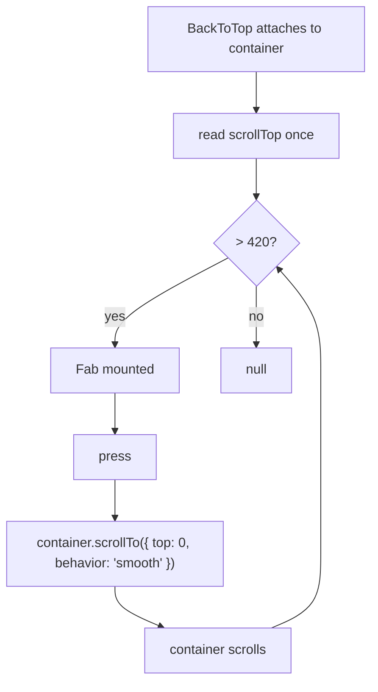

# 19 — Back-to-top FAB

> **Initiative:** `back-to-top`
> **PRD:** to follow this log
> **Plan:** to follow the PRD

This log is the `grill-me` session that settled the feature before the PRD was
written, run against the prototype and the code as they stood on 2026-09-21,
two days after log 18's refactor closed. It is an immutable snapshot of that
moment. The session ran alone, with every recommendation accepted in advance
by the maintainer, whose standing instruction is the scope — _translate the
prototype 1:1 into the codebase, in its naming, conventions, patterns and
architecture_ — and whose sketch of the shape was three rungs deep: a **Fab**
molecule over the app's button primitive, and a **Back-to-top** control made
of the Fab.

It exists because the build order in CLAUDE.md names this step 2 of the four
that are left, and the last renderer-only slice before the Electron shell:
nothing under it, nothing above it, its own prototype file (log 18 Q5).

## Background

`mol.Fab.dc.html` is the whole of the molecule: one `<button>` at
`position: absolute; right: 28px; bottom: 28px; z-index: 60`, a `size`px
circle on `--color-accent` with the near-black ink `#1a1109`, no border, the
shadow `0 8px 28px rgba(217,122,78,.42)`, and a hover that goes to
`--color-accent-hover` and lifts — `translateY(-2px) scale(1.05)`. Two glyphs
behind an `icon` enum: an arrow up at 24px and a plus at 26px, both stroke
2.2, round caps. Four `data-props` — `icon`, `label`, `size`, `onClick` — and
a `renderVals` that defaults the label to _Back to top_.

`page.LibraryPage.dc.html` draws the other half in twelve lines: the page holds
a ref to its scrolling body and an `onScroll`, keeps `showFab` as
`scrollTop > 420`, mounts `mol.Fab` only while that is true, and on click calls
`scrollTo({ top: 0, behavior: 'smooth' })` on the body. No other page file
mounts a Fab, and `FamilyFlix.dc.html` never mentions one.

COMPONENT-SPEC names the target — `components/Fab/`, _reusable floating action
button — fixed bottom-right, circular, accent, elevated_ — and draws the line:
**presentational**, it does not own visibility, the page mounts it
conditionally; and a warning that a prop-driven entrance is unreliable across
re-renders, so mount and unmount it instead. Log 18 Q13 already leaned on
that warning for the Snackbar's exit.

The codebase has been expecting it. `MainLayout.Root` carries
`position: relative` under the comment _"a positioning context for the
back-to-top FAB"_, written in the search initiative's build; `MainLayout`'s
docblock ends _"The back-to-top FAB still lands with the feature that owns
it"_, a placeholder sentence from the same build that no grill ever examined.
And `IconButton` is the app's round icon-only button — the gear, the carousel
arrows, the heart, the ⋯, the detail page's circles — extended by five
`styled(IconButton)` faces that each add a call site's chrome without widening
the primitive.

## Problem

Translate a 52px circle and twelve lines of page state into a codebase where
the page they belong to was split three ways — chrome to `MainLayout`, rows to
`HomeRows`, composition to `LibraryPage` — without the layout learning a
domain, the page growing logic, or a feature being invented to hold something
that knows nothing about movies.

## Questions and Answers

### Scope

1. **Is this its own initiative?** ✅ **Yes** — `19-back-to-top-fab.md`,
   initiative `back-to-top`, its own PRD, issues, build and refactor. Log 18
   Q5 said so in advance: _"Two unblocked slices are not one initiative because
   they are both unblocked."_

2. **Which screens get it?** ✅ **The browse home only.** `page.LibraryPage`
   is the one prototype file that mounts a Fab; `page.GenrePage`,
   `page.MoviePage` and `page.SettingsPage` draw none, and the prototype is
   the spec. ❌ `GenreLayout`, even though a 214-card shelf is the longer
   scroll — if that is wanted it is a grill and a prototype amendment first,
   not a prop today.

3. **Anything else in the slice?** ❌ **Nothing.** No snackbar, no shell, no
   `plus`-FAB screen. The slice is two components, two glyphs and one line in
   the layout.

### The molecule

4. **Where, and what shape?** ✅ `src/components/Fab/` — `Fab.tsx`,
   `Fab.test.tsx`, `Fab.styles.ts`, re-exported from the `components/` barrel
   with `FabProps`. A composed, domain-free block: it does not know what it
   floats over or why.

5. **Built on which button?** ✅ **`styled(IconButton)`.** The maintainer's
   sketch said _"the fab component which consists of our button component"_;
   the primitive that fits is `IconButton`, not `Button`, and this is the one
   place the instruction was read rather than followed literally. `Button`'s
   `label` is visible text and its sizes are heights with side padding — a
   52px accent circle around a glyph would fight every rule in it and need a
   new size, a new variant and a way to hide its text. `IconButton` already
   owns the square, the centring, the pill corner, `type="button"` and the
   accessible name; the Fab is that primitive wearing a face — position, fill,
   shadow, lift — exactly as `FavoriteButton`, the carousel `Arrow`,
   `MoreButton`, `CircleToggle` and `ChromeIconButton` are. ❌ A bare
   `styled.button`: the thing the primitive exists to end. ❌ Widening
   `IconButton` with an `accent` variant: its docblock refuses a third face
   for a single call site, and this is one.

6. **The props?** ✅ **1:1 with the prototype's `data-props`, in its order:**
   `icon?: 'arrow-up' | 'plus'` (default `'arrow-up'`), `label: string`,
   `size?: number` (default 52), `onClick: () => void`. **One deviation, on
   `label`:** required rather than defaulted to _Back to top_. A default that
   is right for one icon and wrong for the other is not a default, and
   `IconButton` requires a name for the same reason — an icon-only button
   without one announces as "button". The type is the prototype's; only the
   preview convenience is dropped, as COMPONENT-SPEC §226 dropped
   `IconButton`'s seven-name list.

7. **Both icons, when only `arrow-up` has a caller?** ✅ **Both** — the
   Snackbar Q8 rule: shipping half the prototype's enum would be a deviation
   from the spec dressed up as restraint. Two new files in `primitives/Icon/`
   on `IconBase`, `currentColor`, decorative (`aria-hidden` — the label names
   the button): **`ArrowUpIcon`** (`M12 19V5m0 0l-6 6m6-6l6 6`, stroke 2.2,
   round caps and joins) and **`PlusIcon`** (`M12 5v14M5 12h14`, stroke 2.2,
   round caps). Named for what they draw. The 24 / 26 sizes are the
   molecule's to pass, not the glyphs' to know.

8. **Position?** ✅ **The prototype's code, literally:** `position: absolute;
right: 28px; bottom: 28px; z-index: 60`, over `MainLayout.Root`'s existing
   `position: relative`. COMPONENT-SPEC's prose says _fixed_; inside a `100vh`
   root the two are the same box, and the `.dc.html` is the prototype. 28px is
   not a spacing token (`s5` is 24, `s6` is 32), so it stays a literal, as the
   prototype writes it.

9. **Chrome?** ✅ `background: accent`; `color: #1a1109`, the one literal the
   prototype writes and `Button.styles` already explains — ink on the accent
   fill, not a surface, so no `--color-*` fits it; `border: none`;
   `box-shadow: 0 8px 28px rgba(217, 122, 78, 0.42)` as a literal, because
   `tokens.css` declares no shadow token and inventing one is not translating.
   `border-radius` is left to `IconButton`'s pill, which on a square is the
   prototype's `50%`. Hover: `&:hover:enabled { background: accentHover;
color: #1a1109; transform: translateY(-2px) scale(1.05); }` — `IconButton`'s
   two extension rules obeyed: `:enabled`, and both `background` and `color`
   replaced so nothing leaks up from the ghost face.

10. **A transition on the hover or the mount?** ❌ **None.** The prototype
    declares no `transition`, so the lift snaps; and the spec note is explicit
    that the entrance is mount/unmount, not an opacity or transform driven from
    a prop. `ffPop` and `ffFade` stay unused here.

11. **Does the molecule own visibility?** ❌ **Never.** It has no idea there is
    a threshold — no listener, no state, no `useEffect`. It is handed a label
    and a handler and draws a circle; the thing that mounts it decides.

### The control

12. **Who owns `showFab` and the click?** In the prototype, the page — because
    the page holds the body ref. In the codebase that page was split: `MainLayout`
    took the header and the body, `HomeRows` the rows, `LibraryPage` composes the
    two and holds nothing. The body ref lives in `MainLayout`, attached by
    `useRestoredScroll`. ✅ **The layout mounts the control.** The argument is
    the one that put scroll restoration there: _the body is where the scrolling
    happens, so the chrome is what knows how far it has gone_. Back-to-top is
    not domain — it knows nothing about movies — so `layouts/`' rule (_structure
    only, no domain logic_) is not touched. ❌ A feature reached through a new
    `MainLayout` slot plus a context or render-prop handing the body out:
    machinery for a 52px circle, and no feature would own it — `features/library/
home/` would be holding a scroll control because it happens to be on the same
    screen. ❌ `LibraryPage`: composition only, and it cannot create a ref without
    ceasing to be. **This supersedes** `MainLayout`'s docblock sentence _"still
    lands with the feature that owns it"_; the build rewrites it.

13. **A hook, or a component?** ✅ **A component, `BackToTop`, composed of
    `Fab`** — the maintainer's three-layer shape, read as IconButton → Fab →
    BackToTop. Props: `{ container: RefObject<HTMLElement | null> }`. It owns
    the `visible` state, the scroll listener and the press, and renders `<Fab
icon="arrow-up" label="Back to top" onClick={…} />` or `null`. `MainLayout`
    becomes `<Body ref={body}>{children}</Body><BackToTop container={body} />`
    — one line, and the layout still holds no state. ❌ A `useBackToTop(body)`
    hook with the layout mounting `Fab` itself: one caller, so no home in
    `hooks/` (2+ features), and the layout would be the thing holding
    `visible`.

14. **Where does `BackToTop` live?** ✅ `src/components/BackToTop/` —
    `BackToTop.tsx`, `BackToTop.test.tsx`, a barrel entry with `BackToTopProps`.
    It is domain-free; it is composed of a molecule, which `FilterDropdown` and
    `SubtitleRow` composing `MenuItem` already do at this rung; and it owns
    DOM-derived local state, which `ExpandableText`'s `overflowing` and
    `Modal`'s listeners already do. **Two files, no `.styles.ts`:** it draws
    nothing of its own — `Fab` draws — and CLAUDE.md's rule is that _the
    trigger is companion files_; `LibrarySearch`, `LibraryFilters` and
    `RetryableFailure` are the two-file precedents. ❌
    `layouts/MainLayout/BackToTop/`: no layout has sub-units, and a control
    that takes any container is reusable by `GenreLayout` the day a grill says
    so. ❌ `features/`: no domain.

15. **The threshold?** ✅ **`scrollTop > 420`**, strictly greater, the
    prototype's number, as a module constant `SCROLL_THRESHOLD = 420` in
    `BackToTop.tsx` with a comment saying whose number it is. ❌ A prop: no
    caller wants another, and a knob nobody turns is a knob.

16. **When is the position read?** ✅ **On every `scroll` event of the
    container (`passive: true`), and once on attach.** The second is not in
    the prototype and is needed here: a screen returned to by Back is put to
    its remembered 3700 by `useRestoredScroll` before the family touches
    anything, and the FAB must already be there when the rows land — the
    restore's writes do fire `scroll` in a browser, but the read on attach is
    what the tests can hold to. State is written only when the answer changes
    (the prototype's `if (show !== this.state.showFab)`), so a long scroll is
    not a long re-render. Listener off on unmount.

17. **The press?** ✅ `container.current.scrollTo({ top: 0, behavior:
'smooth' })`, 1:1. `useRestoredScroll` sees the ride as scroll events and
    ends up remembering 0 for the entry — correct, because the family asked
    for the top. ❌ Anything on the document: the document never scrolls.

18. **Entrance and exit?** ✅ **Mount and unmount, nothing else** — the spec
    note, and log 18 Q13's reading of it. Under the threshold the component
    renders `null`.

19. **Focus after the press?** The button unmounts the moment the ride drops
    the body under 420, and focus falls to `document.body`. ✅ **Accepted as
    the prototype's own behaviour**, recorded in Trade-offs. ❌ Moving focus to
    the header or the first card: nothing designed it, and a control that
    teleports focus is a bigger surprise than one that lets it go.

20. **`prefers-reduced-motion` for the smooth scroll?** ❌ **Not here** — log
    18 Q14 exactly: nothing in the app honours it today, and one component is
    the wrong place to start a convention that belongs to `GlobalStyle` and to
    every animation at once. Now seven things wait on that pass.

21. **The Snackbar stack sits in the same corner. Which wins?** Both are
    bottom-right: the stack at 24/24 and `z-index: 200`, the FAB at 28/28 and
    `z-index: 60`, so a notice covers the FAB while it is up. ✅ **As the
    prototype draws both**, and no screen raises a **Snackbar notice** today
    (log 18 Q3); the first caller is the update flow, whose offer lands on
    whichever screen the family is on. Noted in Trade-offs, not solved —
    solving it is a prototype amendment for the day it is a problem on screen.

22. **An opt-out prop on `MainLayout`?** ❌ **No.** `MainLayout` has one
    consumer, the home, and the prototype puts the FAB on it. A `backToTop`
    boolean would be a prop with no caller passing anything but its default.

### Tests, wiring and closing

23. **What proves it?** ✅ Three suites.
    - `Fab.test.tsx`: a button named by `label`; `icon` chooses the glyph
      (the arrow's path is drawn for `arrow-up` and the plus's for `plus`,
      never both); `onClick` fires; `size` is the square's edge; the default
      icon is the arrow.
    - `BackToTop.test.tsx`, over `stubScrollMetrics` and a container the test
      owns: nothing at 0; the FAB after a scroll past 420; nothing at exactly
      420; gone again on the way back; already there on attach when the
      container was past the line before the control mounted; the press calls
      the container's `scrollTo` (stubbed — jsdom has none on elements) with
      `{ top: 0, behavior: 'smooth' }`; the listener is gone after unmount.
    - `MainLayout.test.tsx`, extended: past the threshold the FAB appears
      over the layout's own body, and pressing it scrolls that body.
      ❌ A `LibraryPage` test: composition only, nothing to assert.

24. **Glossary?** ✅ Three terms into `docs/ubiquitous-language.md`: **FAB**,
    **Back-to-top**, **Scroll threshold**.

25. **Prototype amendments?** ❌ **None.** The `.dc.html` files are translated
    as written. COMPONENT-SPEC's `mol.Fab` row gets a _what shipped_ note after
    the refactor — that in code the layout, not the page, mounts it, and that
    `label` is required — the `mol.Snackbar` precedent, not an amendment.

26. **What gets ticked, and when?** ✅ **Back-to-top FAB** ✅ in README and
    CLAUDE.md's feature lists, the build-order chain losing step 2 and the
    remaining three keeping their numbers, and the COMPONENT-SPEC row — all of
    it **after this initiative's refactor**, not when the build issues close.

## Design

### The units

```
src/primitives/Icon/
├── ArrowUpIcon.tsx               ← the arrow, stroke 2.2, round caps and joins
└── PlusIcon.tsx                  ← the plus, stroke 2.2, round caps
src/components/Fab/               ← the molecule, 1:1, styled(IconButton), no state
├── Fab.tsx
├── Fab.test.tsx
└── Fab.styles.ts
src/components/BackToTop/         ← the control: the threshold, the listener, the press
├── BackToTop.tsx
└── BackToTop.test.tsx            ← no styles: it draws nothing of its own
src/layouts/MainLayout/
└── MainLayout.tsx                ← <Body ref={body}>{children}</Body><BackToTop container={body} />
```

### The contract

```ts
// components/Fab/Fab.tsx — 1:1 with mol.Fab.dc.html
export type FabIcon = 'arrow-up' | 'plus';

export interface FabProps {
  /** Which glyph the circle holds. */
  icon?: FabIcon; // 'arrow-up'
  /** The accessible name. Required: a default fits one icon and not the other. */
  label: string;
  /** The circle's diameter, in px. */
  size?: number; // 52
  onClick: () => void;
}

// components/Fab/Fab.styles.ts
export const Root = styled(IconButton)`
  position: absolute;
  right: 28px;
  bottom: 28px;
  z-index: 60;
  background: ${({ theme }) => theme.colors.accent};
  color: #1a1109;
  border: none;
  box-shadow: 0 8px 28px rgba(217, 122, 78, 0.42);

  &:hover:enabled {
    background: ${({ theme }) => theme.colors.accentHover};
    color: #1a1109;
    transform: translateY(-2px) scale(1.05);
  }
`;

// components/BackToTop/BackToTop.tsx
/** The prototype's line: page.LibraryPage shows the Fab once scrollTop > 420. */
const SCROLL_THRESHOLD = 420;

export interface BackToTopProps {
  /** The one element that scrolls — MainLayout's Body. */
  container: RefObject<HTMLElement | null>;
}

/** Mounts a Fab over the container past the threshold; the press rides it to the top. */
export function BackToTop({ container }: BackToTopProps): ReactNode;
```

### The flow



### Chosen and rejected

✅ Its own initiative, the home only, nothing else in the slice
✅ `Fab` as `styled(IconButton)` — the app's button primitive for an icon-only circle
✅ Props 1:1, both icons, `label` required
✅ The prototype's literals: 28px, `#1a1109`, the shadow, `z-index: 60`
✅ `BackToTop` a component composed of `Fab`, in `components/`, two files
✅ The layout mounts it — the chrome owns the body, so the chrome owns how far it scrolled
✅ `scrollTop > 420`, read on scroll and once on attach
✅ Mount/unmount, no transition, no animation

❌ `Button` as the base; a bare `styled.button`; an `accent` variant on `IconButton`
❌ A feature, a slot, a context or a render-prop to hand the body out
❌ A `useBackToTop` hook, an opt-out prop, a threshold prop
❌ `GenreLayout`, focus management, reduced motion, a fix for the corner shared with the stack
❌ A prototype amendment of any kind

## Implementation Plan

1. **The molecule.** `ArrowUpIcon` and `PlusIcon` in `primitives/Icon/` with
   their barrel entries, then `components/Fab/` 1:1 with `mol.Fab.dc.html` —
   `styled(IconButton)`, the position, the fill, the ink, the shadow, the
   hover lift, the glyph by `icon` at its own size — and the barrel entry.
   Proven by rendering it: named by `label`, the glyph follows `icon`, the
   press fires `onClick`, `size` sets the edge.
2. **The control, and the mount.** `components/BackToTop/` — the threshold,
   the passive listener, the read on attach, the change-only state, the smooth
   press — and the one line in `MainLayout`, plus its docblock rewritten.
   Proven by the threshold, over `stubScrollMetrics`: nothing at 0 or at 420,
   the FAB past it, gone on the way back, present on attach when already
   past, `scrollTo` asked for the top smoothly, the listener gone on unmount;
   and `MainLayout`'s suite seeing the FAB over its own body.
3. **The refactor, then the ticks.** `request-refactor-plan` → `refactor`, then
   README, CLAUDE.md (the feature lists and the chain), and COMPONENT-SPEC's
   `mol.Fab` row.

## Trade-offs

**Easier.** The home's longest scroll — a full library, every genre a row —
has a way back that is one press rather than a wheel-ride, and the control
that gives it is two files nothing else depends on. `Fab` costs nothing to
reuse: the day a screen wants a `plus` circle, the molecule and the glyph are
there and only the caller is new. And the layout stays what it was — one line
added, no state, no domain — because the control owns everything and the
layout only lends it a ref.

**Harder.** The accepted focus drop: pressing the FAB ends with focus on
`document.body`, which is where the prototype leaves it and where a keyboard
user will notice. The shared corner: an **Update offer snackbar** will cover
the FAB while it is up, and the fix is a prototype question nobody has asked
yet. `prefers-reduced-motion` stays unhonoured, now across seven motions. And
`BackToTop` takes a `RefObject` to an element it does not render — an honest
shape for a control over someone else's scroll container, but the one place in
`components/` where a prop is a ref rather than a value.

**Ruled out of scope.** The FAB on any screen but the home; `GenreLayout`; an
opt-out or a threshold prop; a `useBackToTop` hook; focus management after the
press; reduced motion; a transition on hover or on mount; resolving the corner
shared with the **Snackbar stack**; a `plus` FAB with a screen; any amendment
to the prototype.
