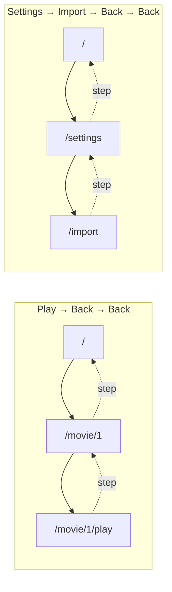

# 20 — Back navigation

> **Initiative:** `back-navigation`
> **PRD:** to follow this log
> **Plan:** to follow the PRD

This log is the `grill-me` session that settled the fix before the PRD was
written, run against the prototype and the code as they stood on 2026-09-22,
the day after the prototype audit that found it. It is an immutable snapshot
of that moment. The session ran alone, with every recommendation accepted in
advance by the maintainer, whose standing instruction is the scope —
_translate the prototype 1:1 into the codebase, in its naming, conventions,
patterns and architecture_.

It exists because the build order in CLAUDE.md names this step 3 of the seven
that are left, ahead of the Electron shell: it is the app's own seams rather
than anything the shell adds, and the shell would ship the bug otherwise.

## Background

The app has one Back rule already. `src/hooks/useGoBack/` (log 04 Q13) is a
**history step** — `navigate(-1)` — with the library as the fallback when
`location.key === 'default'`, the key React Router gives the first entry of a
session, so a deep-linked or reloaded screen never shows a dead button. Five
callers step through it: `GenreLayout`'s Back pill, `MoviePage`'s,
`SettingsHeader`'s, `useDeleteMovie` once the movie is gone, and the Movie
form's Back and Cancel outside the Import context. Its docblock says why a
step and not the prototype's `goBrowse()`: a step returns the shelf the parent
had filtered and scrolled, exactly as they left it; `navigate('/')` is a fresh
entry.

Four places leave a screen by pushing a route instead:

| Leaving                                     | Today                    | Code                              |
| ------------------------------------------- | ------------------------ | --------------------------------- |
| The player's Back pill, and Escape          | `navigate('/movie/:id')` | `Player.tsx` `leave`              |
| The form's _Save changes_ (edit)            | `navigate('/movie/:id')` | `useMovieForm.ts` `afterEdit`     |
| Import's Back                               | `navigate('/settings')`  | `ImportFlow.tsx`                  |
| Resolve's _Save & continue_ / _Skip_ / Back | `navigate('/import')`    | `useMovieForm.ts` `AFTER_RESOLVE` |

Each push leaves a duplicate entry behind, and the next Back walks into it.
Reproduced in the browser on 2026-09-21:

- Play → Back → Back lands in the player, not the library:
  `[/, /movie/1, /movie/1/play, /movie/1]`.
- Settings → Import → Back → Back lands on Import:
  `[/, /settings, /import, /settings]`.
- A Delete after a Play visit lands in the player of a deleted movie — the
  delete's `useGoBack` steps onto the duplicate's neighbour.
- The detail page comes back from the player at the top, because
  `useRestoredScroll` keys its remembered offset on the history entry, and
  the push made a new one.

The prototype (`FamilyFlix.dc.html`) is a stateless screen switcher with no
history, so it cannot say _push_ or _step_ — but it does say where each
leaving lands: `exitPlayer()` → detail, `backFromAdd()` → the screen the
`addContext` came from (`'settings'` for an add, `'detail'` for an edit,
`'import'`'s review for a resolve), `saveMovie()` → the same places except an
add, which is `goBrowse()`, and Import's `onBack` → `goSettings()`, its
`onFinish` → `goBrowse()`. Log 04 Q13 already read the prototype's
`detailReturn` flag as a hand-rolled history stack and translated it to the
router's real one; this log finishes that reading on the four screens that
never got it.

## Problem

One Back rule on every screen: every leaving a history step, so no screen ever
leaves a duplicate entry behind, with each screen's own landing kept for the
no-history case — without a second hook, a second rule, or a prototype
amendment.

## Questions and Answers

1. **What is the rule, in one line?** ✅ **Arriving pushes, leaving steps.**
   Every way _onto_ a screen — a card, Play, _Edit details_, _Resolve_, the
   gear, the Library rows, the logo — is a push, as it is today. Every way
   _off_ it that means "I am done here" — Back, Escape, a save, a Skip, a
   Delete — is a history step. The two exceptions are the prototype's two
   `goBrowse()` calls that survive, Add's save and Import's Finish, which
   mean a _fresh_ home rather than the one behind (Q9). ❌ leave with
   `navigate(to, { replace: true })`: still a fresh entry under a new key,
   so the shelf's filters and `useRestoredScroll`'s offset are both lost —
   it removes the duplicate and keeps the bug.

2. **Where does the rule live?** ✅ `useGoBack` grows one parameter:
   `useGoBack(fallback = '/')`, the screen's own landing for the
   no-history case. The rule stays one hook in `src/hooks/`, used by every
   screen, and the four pushes become four more callers. ❌ a second hook
   (`useLeave`) beside it — two hooks are two rules, the thing the docblock
   forbids. ❌ each screen calling `navigate(-1)` itself — the fallback
   check would exist seven times. ❌ location state carrying a `from` — the
   router's stack already holds it.

3. **When does a fallback fire, and is it a push?** It fires only when
   `location.key === 'default'` — a deep link or a reload, which in the
   packaged app, whose window opens at `/`, is close to never (log 04 Q14).
   ✅ **It stays a push**, as today. ❌ a replace: the landing would get a
   fresh key, so its own Back would be `navigate(-1)` into nothing — a dead
   button, the one thing the fallback exists to prevent. The cost is a
   two-step loop on a deep-linked player (`/movie/1/play` → Back → `/movie/1`
   → Back → the player again), accepted: the parent is never stranded, and
   the case is a dev reload.

4. **The player's landing?** ✅ `useGoBack(moviePath(movieId))` — the
   prototype's `exitPlayer()` → detail. The Back pill and Escape already
   share one `leave`; it changes from a push to the hook's callback and both
   follow. The detail page's scroll comes back for free: the entry is the
   one `useRestoredScroll` remembered.

5. **Import's Back?** ✅ `useGoBack('/settings')` — the prototype's
   `goSettings()`. Back during a run leaves the run where it is, as today:
   it is the server's **Current run**, re-attachable on the next visit.
   Finish stays `navigate('/')` (Q9).

6. **The form — where does each leaving land?** ✅ One landing per
   **Form context**, read off the URL the way the prototype sets
   `addContext` at entry: `/import` when `?problem=` is present (Import
   context), `/movie/<id>` when `?movie=` is (edit), `/settings` otherwise
   (add — the prototype's `goAdd()` sets `addContext:'settings'`). Every
   leaving goes through the one `goBack` this gives: Back, Cancel, _Skip
   this one_ after its dismiss, _Save changes_ after its `PATCH`, _Save &
   continue_ after its resolve. Add's save is the only push left,
   `navigate('/')`. `AFTER_RESOLVE` and `afterEdit` become the landings;
   `AFTER_ADD` stays what it is. ❌ read the landing off the settled
   `editing` / `resolving` state: both are `null` until a fetch lands, so a
   Back pressed early on a deep-linked edit would fall back to Settings.

7. **Does _Save & continue_ landing by a step survive?** ✅ Yes. The
   **Review step** is the Current run's state, not the entry's: `ImportFlow`
   re-attaches on mount through `fetchCurrentImport`, so a step onto the
   `/import` entry draws the review one row shorter, exactly as the push
   did. The comment in `useMovieForm` — _the list is where they go, whatever
   the history says was behind the form_ — is superseded: _Resolve_ is a
   `Link` from the review, so the entry behind the form is always `/import`,
   and a deep link gets the same through the fallback.

8. **The Delete-after-Play case?** ✅ Fixed by the player alone: with the
   player's leave a step, the stack after Play → Back is `[/, /movie/1]`,
   and the delete's `useGoBack` steps onto `/`. `useDeleteMovie` is
   untouched. The deleted movie's page still sits in the forward stack and
   answers `not-found`, as log 12 Q14 decided.

9. **The two `goBrowse()` that survive — push or replace?** ✅ **Push,
   as the prototype.** A fresh home is what they mean: top of the page,
   filters cleared, the film just added on its shelf. The only thing that
   could tell a push from a replace here is browser chrome's Back, and the
   app draws none — Electron will draw none either. ❌ replace: no
   difference a parent can see, and a third shape for one rule.

10. **Does the default `'/'` stay?** ✅ Yes. `GenreLayout`, `MoviePage`,
    `SettingsHeader` and `useDeleteMovie` all mean the library, and the
    prototype agrees (`backFromDetail` → browse, Settings' `onBack` →
    `goBrowse`). Only the three new callers pass a landing.

11. **How is "a step, not a push" asserted?** ✅ `LocationProbe` gains a
    fourth spelling beside `pathname`, `search` and `url`:
    `data-testid="navigationType"` from `useNavigationType()` — `POP` after
    a step, `PUSH` after a push. And the three reproduced journeys become
    tests in the screens' own suites: Play → Back → Back lands on `/`;
    Settings → Import → Back → Back lands on `/`; movie → _Edit details_ →
    _Save changes_ → Back lands on `/`. ❌ the probe's `withBack`: its
    button is named _Back_, which the player, Import and the form already
    have.

12. **Does the prototype need amending?** ✅ No. `exitPlayer`,
    `backFromAdd`, `saveMovie`, `goSettings` and `goBrowse` already say
    where each leaving lands; push versus step is a distinction a
    stateless prototype cannot draw, and log 04 Q13 already settled how
    that distinction is translated.

13. **Anything the Electron shell changes?** ✅ No. `navigate(-1)` and
    `location.key === 'default'` behave the same under `BrowserRouter`,
    `HashRouter` and `MemoryRouter` (log 04 Q14). Series and Enrichment
    inherit the rule when built — their `backFromSeries`, `backFromSeason`
    and `backFromEnrich` are steps with a landing each — which is why this
    is step 3 and they are 5 and 6.

14. **The vocabulary?** ✅ **Back rule** — the one rule; **History step** —
    what a leaving is; **Landing** — a screen's own destination for the
    no-history case; **Fresh home** — the two `goBrowse()` that are not
    steps. Say _leaving_, not _exit_ or _navigate away_.

## Design

### The hook

```ts
// src/hooks/useGoBack/useGoBack.ts
export function useGoBack(fallback: string = '/'): () => void;
```

`navigate(-1)` when there is history behind the screen; `navigate(fallback)`
— a push — when `location.key === 'default'`. The default is the library.
Nothing else changes: same folder, same test file, one more case.

### The callers

| Screen                                                 | Call                                  | Steps on                                                   | Push kept        |
| ------------------------------------------------------ | ------------------------------------- | ---------------------------------------------------------- | ---------------- |
| Player                                                 | `useGoBack(moviePath(movieId))`       | Back pill, Escape                                          | —                |
| ImportFlow                                             | `useGoBack('/settings')`              | Back                                                       | Finish → `/`     |
| Movie form                                             | `useGoBack(landingFor(searchParams))` | Back, Cancel, Skip this one, Save changes, Save & continue | Add's save → `/` |
| GenreLayout, MoviePage, SettingsHeader, useDeleteMovie | `useGoBack()`                         | unchanged                                                  | —                |

`landingFor` is local to `useMovieForm`, over the two query parameters it
already reads: `problem` → `/import`, else `movie` → `/movie/<id>`, else
`/settings`.

### The stacks, after



### The probe

`src/test-support/LocationProbe/` renders `navigationType` beside its three
spellings, so a suite can say `expect(navigationType()).toBe('POP')` after a
leaving. A test-support change, never imported by shipping code.

## Implementation Plan

1. **The hook.** `useGoBack(fallback)` with its default; the test that a
   deep-linked screen lands on its own fallback rather than `/`.
   `LocationProbe.navigationType`. Nothing on screen changes yet.
2. **The player.** `leave` through the hook. Tests: Back is a `POP`; Play →
   Back → Back lands on `/`; a deep-linked player's Back lands on its movie;
   Escape still shares the handler.
3. **Import.** Back through the hook. Tests: a `POP`; Settings → Import →
   Back → Back lands on `/`; deep-linked Import's Back lands on Settings;
   Finish is still a push to `/`.
4. **The form.** `landingFor`, every leaving through the hook, Add's save
   the one push. Tests: _Save changes_ is a `POP` onto the movie; _Save &
   continue_, _Skip this one_ and Back are `POP`s onto the review; the
   three deep-link fallbacks; Add's save still a `PUSH` to `/`.
5. **Docs.** CLAUDE.md and README's feature line, ticked only after the
   refactor closes.

## Trade-offs

- **Easier:** one rule, one hook, one parameter. Every screen that comes
  later (Series, Enrichment) gets Back right by calling the hook with a
  landing. `useRestoredScroll` works on the detail page after the player
  without being touched.
- **Harder:** a landing is a string the screen types; a wrong one is only
  visible on a deep link, which the packaged app almost never sees, so the
  deep-link tests in phases 2–4 are the only thing keeping them honest.
- **Ruled out:** a replace on the fallback (Q3 — a dead button); a replace
  on the two fresh homes (Q9 — nothing to see, a third shape); reading the
  form's landing off fetched state (Q6 — `null` too long); any prototype
  amendment (Q12); browser-chrome Back handling — the app draws none, and
  the shell is step 7.
