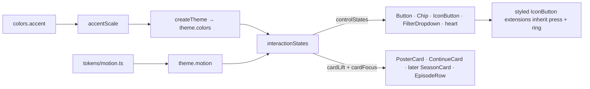

# 21 — Motion & interaction states

> **Initiative:** `motion`
> **PRD:** to follow this log
> **Plan:** to follow the PRD

This log is the `grill-me` session that settled the feature before the PRD was
written, run against the prototype revision of 2026-09-22 (`1a9a656`) and the
code as it stood at `ef1dc27`, the day back navigation's last issue closed. It
is an immutable snapshot of that moment. The session ran alone, with every
recommendation accepted in advance by the maintainer, whose standing
instruction is the scope — _translate the prototype 1:1 into the codebase, in
its naming, conventions, patterns and architecture_.

It exists because CLAUDE.md's build order names it step 4, ahead of Series:
Series draws new cards and rows (`SeasonCard`, `EpisodeRow`) that must be born
on the contract rather than retrofitted to it.

## Background

The revision added COMPONENT-SPEC **§2a, the interaction & motion contract**:
one three-state model (hover, press, keyboard focus) over every interactive
surface, in two disjoint vocabularies — **buttons signal with colour, cards
signal with elevation**. It added four motion tokens to `tokens.css`
(`--dur-fast` 120ms, `--dur-base` 180ms, `--dur-slow` 280ms, `--ease-out`
`cubic-bezier(.2,.7,.3,1)`), two colour tokens (`--color-accent-press`,
`--color-focus-ring`), a global `prefers-reduced-motion: reduce` block, and it
dropped `@keyframes ffSpin`.

Eight prototype files carry the contract as `style-hover` / `style-active` /
`style-focus-visible` attributes: `prim.Button`, `prim.Chip`,
`prim.IconButton`, `mol.FilterDropdown`, `mol.PosterCard` (the tile and its
heart), `mol.ContinueCard`, and the two Series molecules `mol.SeasonCard` and
`mol.EpisodeRow`. Every other file's timings (`prim.Toggle`'s `.18s ease`,
`prim.ProgressBar`'s `.2s ease`, `ffPop .14s ease` on menus, the player's
chrome fade) are unchanged literals.

`FamilyFlix.dc.html` computes the accent's five derivatives at runtime from
its `accentColor` prop — `shade(accent, .18)` for hover, `shade(accent, -.12)`
for press, `rgba(accent, .14)` soft, `rgba(accent, .32)` line,
`rgba(shade(accent, .18), .55)` the focus ring — and sets them on the app
root, overriding `tokens.css`.

The code today: `tokens/colors.ts` holds `accentHover`, `accentSoft` and
`accentLine` as literals and has no press or focus-ring value; there is no
`tokens/motion.ts`; `GlobalStyle` has no reduced-motion block; no component
has a `:focus-visible` rule (the UA's ring shows everywhere) and none has a
press state; `PosterCard`'s lift is `.18s ease` with no accent border;
`ContinueCard` hovers to `opacity: .94`; and `Button`'s hovers are written
`&:hover:enabled`, which an `<a>` never matches — the link face (_Back to
library_ on the not-found movie page) has had no hover since it shipped.

## Problem

Lay one contract over six built surfaces and their extensions without a
per-component variation, compute the accent scale instead of aliasing it,
port the reduced-motion block once, and leave behind the shared pieces Series
will build its two cards on — while matching the prototype file by file, not
the prose that summarises it.

## Questions and Answers

### Scope

1. **Its own initiative?** ✅ **Yes** — `21-motion-interaction-states.md`,
   initiative `motion`, its own PRD, issues, build and refactor.

2. **Which surfaces?** ✅ **The six built ones the prototype put on the
   contract:** `Button`, `Chip`, `IconButton`, `FilterDropdown`, `PosterCard`
   (tile, heart and focusable root) and `ContinueCard`. `SeasonCard` and
   `EpisodeRow` do not exist yet; they are built in step 5 on the shared card
   states this initiative leaves behind (Q12). ❌ Every other hover in the
   code — `Menu` items, `SubtitleRow`, `ActionRow`, `GenreRow`'s _View all_,
   `Modal`'s ✕, `Snackbar`, the `GenreLayout` Back pill, `SettingsHeader` —
   stays as drawn: their prototype files were not revised, and inventing
   their states would be a redesign.

3. **Does "no duration is ever re-typed inline" reach the untouched
   literals?** ❌ **No.** `Toggle`'s `.18s ease`, `ProgressBar`'s `.2s ease`,
   `SubtitleOverlay`'s `.25s ease`, the player chrome's fade and every
   `ffPop .14s ease` are the prototype's literals in files the revision left
   alone, and `ease` is not `--ease-out` — tokenising them would change the
   motion. The rule binds the contract's own values: `120ms`, `180ms`,
   `280ms` and the curve are spelled in `tokens/motion.ts` and nowhere else
   (guarded, Q16).

### Tokens and theme

4. **The motion tokens?** ✅ `src/tokens/motion.ts`, flat, `as const`, named
   off the CSS vars the way `colors.ts` is:
   `motion = { durFast: '120ms', durBase: '180ms', durSlow: '280ms', easeOut:
'cubic-bezier(0.2, 0.7, 0.3, 1)' }`, re-exported from the `tokens/`
   barrel and mounted as `theme.motion`. `durSlow` ships with no caller — the
   Snackbar Q8 rule: the prototype's scale is shipped whole.

5. **The press durations — tokens?** ❌ **No.** The prototype writes them as
   literals on the press rule (`60ms` on every control, `70ms` on every
   card) and `tokens.css` names no var for them. Adding `durPress` would be a
   token the prototype does not have. Each is written **once**, in the shared
   state fragment for its vocabulary (Q11, Q12), so no component re-types it.

6. **Where does the accent derivation live?** ✅ **`src/utils/accentScale/`**
   — `accentScale(accent: string): AccentScale` returning
   `{ accentHover, accentPress, accentSoft, accentLine, focusRing }`, the
   prototype's `shade` and `rgba` as private helpers in the same file. A pure
   helper with a test is exactly what `utils/` is for. ❌ In `tokens/`:
   "no logic — pure values". ❌ In `theme.ts` itself: it would be logic in a
   flat file with no test, and the folder rule says a tested unit gets a
   folder.

7. **The theme factory?** ✅ `src/styles/theme.ts` gains
   `createTheme(accent: string = colors.accent)`, which spreads
   `accentScale(accent)` over `colors`; `export const theme = createTheme()`,
   and `Theme` stays `typeof theme`. `colors.ts` **loses** its
   `accentHover`, `accentSoft` and `accentLine` literals — the one accent is
   the only accent value spelled there — while `theme.colors` keeps all three
   names, so the eighteen files that read them do not change. ❌ A runtime
   accent picker: the app has no `accentColor` tweak; the factory is what
   makes one possible, and CLAUDE.md asks for exactly the factory.

8. **`tokens.css` and the derivation disagree — which wins?** ✅ **The
   derivation.** For the stock `#d97a4e` the formula gives hover `#e0926e`,
   press `#bf6b45` and ring `rgba(224, 146, 110, 0.55)`; `tokens.css`
   ships `#e58e63`, `#c46a41` and `rgba(229, 142, 99, 0.55)`. The whole-app
   prototype renders the derived values (its root overrides `tokens.css`
   unconditionally), §2a says the five are _derived_, and a literal that
   disagrees with its own formula is a stale default. **The prototype is
   amended in this session**: `tokens.css`'s three values become the derived
   ones, so standalone previews and the app agree. Soft and line already
   match.

9. **Reduced motion?** ✅ **Ported once, into `GlobalStyle`**, verbatim:
   `*, *::before, *::after` under `@media (prefers-reduced-motion: reduce)`
   collapsing `animation-duration`, `animation-iteration-count` and
   `transition-duration` with `!important`. It also honours, for free, the
   seven motions log 19 left unhonoured. ❌ Per component.

10. **`ffSpin`, dropped by the revision?** ✅ **Kept.** `PlayerNotice`'s
    buffering spinner still animates on it; removing a keyframe a shipped
    component uses is not this initiative's to do. Recorded as a
    prototype/code gap for the player's next revision.

### The shared fragments

11. **How do controls share the contract without a per-component
    variation?** ✅ **One fragment, `controlStates(press)`,** in
    `src/styles/interactionStates/interactionStates.ts`: the transition list
    (`background`, `border-color`, `color`, `transform`, `box-shadow` at
    `durFast` `easeOut`); `&:active:not(:disabled)` applying the press
    transform at `transition-duration: 60ms`; and
    `&:focus-visible { outline: none; box-shadow: 0 0 0 3px focusRing }`.
    The press transform is the parameter because the prototype's differ —
    `scale(.98)` Button and FilterDropdown, `translateY(0) scale(.97)` Chip,
    `scale(.94)` IconButton, `scale(.92)` the poster heart. The hover stays
    in each component: its colours _are_ the component. Beside
    `visuallyHidden.ts` in `styles/` because it is shared CSS no rung owns;
    in a folder because it has a test (Q16).

12. **And cards?** ✅ **Two fragments beside it:** `cardLift` for the tile —
    base `box-shadow: 0 6px 20px rgba(0,0,0,.35)`, the transition
    (`transform`, `box-shadow`, `border-color` at `durBase` `easeOut`),
    `&:hover` to `translateY(-4px)`, `0 14px 34px rgba(0,0,0,.5)` and
    `accentLine`, `&:active` to `translateY(-1px)` at `70ms`; and
    `cardFocus` for the focusable root — `&:focus-visible { outline: 2px
solid focusRing; outline-offset: 4px }`, the radius left to the caller.
    Split because the prototype puts the lift on the tile and the focus on
    the root: hovering the title under a poster does not lift it.

### The surfaces

13. **Each surface, as its file draws it?** ✅
    - **Button** — hover: primary `accentHover`; secondary `surface2` fill
      and `textFaint` border; ghost `surface`; danger
      `rgba(201,122,106,.12)` fill and `danger` border. Press: primary
      `accentPress`, secondary `surface3`, ghost `surface2`, danger
      `rgba(201,122,106,.2)`, all `scale(.98)`. The two danger tints are the
      prototype's literals, commented, the way the Fab's shadow is. Guards
      move from `:enabled` to `:not(:disabled)`, so the link face gets hover,
      press and ring too (Background). `sm` and `danger` stay, though the
      revision dropped both from `data-props`: `danger` is still drawn in
      `renderVals`, and `sm` is the Review step's Resolve / Skip pair; size
      is dimensional only, so `sm` shares every state with `md`.
    - **Chip** — the `Control` shape only: hover `accentLine` border,
      `surface2` fill unless selected, `translateY(-1px)`; press
      `translateY(0) scale(.97)`. `Tag` is not a control and gets nothing.
    - **IconButton** — hover adds `scale(1.06)`, and `outline` also moves
      its border to `textFaint`; press `scale(.94)`.
    - **FilterDropdown** — trigger hover `accentLine` border and `surface2`
      fill, press `scale(.98)`; option rows hover `surface3` with a
      `durFast` transition on `background` and `color`.
    - **PosterCard** — `Poster` on `cardLift`, `Root` on `cardFocus` with
      the poster radius; the heart hovers to `rgba(18,14,10,.82)`, border
      `rgba(255,255,255,.45)`, `scale(1.08)`, press `scale(.92)`.
    - **ContinueCard** — `Tile` on `cardLift` (so it gains the resting
      shadow it never had), `Root` on `cardFocus`; the `opacity: .94` hover
      goes.

14. **The §2a table says buttons never lift, yet `prim.Chip` hovers up 1px
    and `prim.IconButton` scales 1.06 — which?** ✅ **The files.** A
    component file is the more specific statement and the table its summary;
    both are ported as drawn. Flagged, and COMPONENT-SPEC §2a is corrected at
    the refactor to say what shipped (the snackbar and back-to-top
    precedent). ❌ Dropping them to fit the prose — that is redesigning the
    files to match a sentence.

15. **The `styled(IconButton)` extensions — five faces the revision never
    touched?** ✅ **Press, focus ring and transition are the primitive's
    and every extension inherits them; the hover is the extension's own, as
    its file draws it.** The contract belongs to the primitive, so an
    `IconButton` anywhere is one. The trap is `transform`: the primitive's
    hover `scale(1.06)` and press `scale(.94)` out-rank an extension's plain
    `transform`, so **an extension that positions with `transform` restates
    it in its hover and composes it into its press.** The carousel `Arrow`
    hovers at `translateY(-50%)` and presses at `translateY(-50%)
scale(.94)`; the `Fab` keeps its lift on hover and presses at
    `scale(.94)`. `MoreButton`, `CircleToggle` and `ChromeIconButton`
    restate `transform: none` on hover, since their files draw no scale.
    `IconButton`'s docblock rule 2 widens from "replace `background` and
    `color`" to those two plus `border-color` and `transform`. The Fab's
    lift now eases at `durFast` rather than snapping — log 19's "snaps, as
    the prototype's does" predates the contract, and §2a covers every
    interactive component.

### Tests and guards

16. **How is it proven, when jsdom computes no `:hover`?** ✅ **Three
    ways, none a style snapshot:**
    - `accentScale.test.ts` pins the stock accent to the five exact strings
      (the amended `tokens.css`), proves a second accent derives a different
      scale, and that hover and press never equal the accent — the "never
      aliased" rule as a test.
    - `interactionStates.test.ts` carries the **structural guard** over
      `shippingSources` (the `useGoBack` / `usePlayback` precedent): no
      shipping file but `tokens/motion.ts` spells `120ms`, `180ms`, `280ms`
      or `cubic-bezier(`, and none but `interactionStates.ts` spells a
      `60ms` or `70ms` press.
    - The six surfaces' suites gain nothing they cannot observe; the build's
      own check is the prototype side by side in the running app.
      ❌ Adding `jest-styled-components` for `toHaveStyleRule`: a dependency to
      assert that CSS says what the CSS file says.

17. **Anything else in the slice?** ❌ **Nothing.** No new tokens beyond the
    six; no state on the untouched surfaces; no Series cards; no accent
    picker; no change to `Toggle`, `TextField` or `Textarea` focus (their
    UA ring is a recorded decision of their own logs).

## Design

### The units

| Unit                                                | Rung   | What it is                                                              |
| --------------------------------------------------- | ------ | ----------------------------------------------------------------------- |
| `src/tokens/motion.ts`                              | tokens | `motion` — `durFast`, `durBase`, `durSlow`, `easeOut`, `as const`, flat |
| `src/utils/accentScale/accentScale.ts`              | utils  | `accentScale(accent) → AccentScale`, pure, tested                       |
| `src/styles/theme.ts`                               | styles | `createTheme(accent = colors.accent)`; `theme = createTheme()`          |
| `src/styles/GlobalStyle.ts`                         | styles | + the reduced-motion block                                              |
| `src/styles/interactionStates/interactionStates.ts` | styles | `controlStates(press)`, `cardLift`, `cardFocus`; the guard in its test  |

```ts
// src/utils/accentScale/accentScale.ts
export interface AccentScale {
  accentHover: string; // shade(accent, +0.18)
  accentPress: string; // shade(accent, -0.12)
  accentSoft: string; //  rgba(accent, 0.14)
  accentLine: string; //  rgba(accent, 0.32)
  focusRing: string; //   rgba(accentHover, 0.55)
}
export function accentScale(accent: string): AccentScale;

// src/styles/interactionStates/interactionStates.ts
export const controlStates: (press: string) => RuleSet; // transition, press @60ms, 3px ring
export const cardLift: RuleSet; //  resting shadow, -4px hover, -1px press @70ms
export const cardFocus: RuleSet; // 2px outline, 4px offset
```

### The contract, as code reads it



### Chosen and rejected

- ✅ Derivation over `tokens.css` literals, and the prototype amended to match.
- ✅ Press literals written once per vocabulary. ❌ A `durPress` token.
- ✅ Component files over §2a's prose (Chip lift, IconButton scale).
- ✅ Extensions inherit press, ring, transition; hover stays theirs.
- ✅ `:not(:disabled)` on Button. ❌ `:enabled`, which an anchor never matches.
- ❌ `jest-styled-components`; ❌ per-component reduced motion; ❌ tokenising
  untouched literals; ❌ removing `ffSpin`.

## Implementation Plan

1. **Tokens, scale and theme.** `tokens/motion.ts`, `utils/accentScale/`,
   `createTheme`, `colors.ts` down to the one accent, the reduced-motion
   block. Proven by `accentScale`'s test; typecheck proves the eighteen
   readers still resolve.
2. **The control vocabulary.** `interactionStates` with `controlStates` and
   its guard, then `Button` (with `:not(:disabled)`), `Chip`, `IconButton`
   and `FilterDropdown`, and the five extensions restating `transform`.
3. **The card vocabulary.** `cardLift` and `cardFocus`, then `PosterCard`
   (tile, root, heart) and `ContinueCard`.
4. **The refactor, then the ticks.** `request-refactor-plan` → `refactor`,
   COMPONENT-SPEC §2a corrected to what shipped (Q14), and README and
   CLAUDE.md ticked only then.

## Trade-offs

**Easier.** Series' two cards arrive with their states already written — they
compose `cardLift` and `cardFocus` and add nothing. A keyboard user sees one
ring language everywhere instead of the UA's. Re-theming the accent is one
argument, and no primary button can lose its hover by aliasing. Reduced
motion is honoured app-wide by one block.

**Harder.** Every `styled(IconButton)` that uses `transform` now carries a
rule it did not need before, and a sixth extension must know it. The primary
hover is a shade different from the one the standalone prototype previews
showed until today. The guard forbids `180ms` in any shipping file, which a
future unrelated literal may trip over — it is meant to.

**Ruled out of scope.** States on the unrevised surfaces; `Toggle`,
`TextField`, `Textarea` focus; the Series cards; an accent picker; a press
token; removing `ffSpin`; style-rule assertions.
