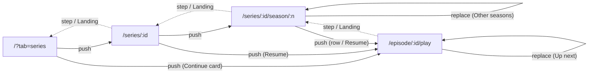

# 22 — Series (TV)

> **Initiative:** `series`
> **PRD:** to follow this log
> **Plan:** to follow the PRD

This log is the `grill-me` session that settled the feature before the PRD was
written, run against the prototype revision of 2026-09-22 (`1a9a656`) and the
code as it stood at `ff9975c`, the day the `motion` refactor closed. It is an
immutable snapshot of that moment. The session ran alone, with every
recommendation accepted in advance by the maintainer, whose standing
instruction is the scope — _translate the prototype 1:1 into the codebase, in
its naming, conventions, patterns and architecture_.

It is step 5 of CLAUDE.md's build order, the largest of the five left, and the
one the `motion` initiative went ahead of so that `SeasonCard` and
`EpisodeRow` would be born on the **Interaction contract** (log 21 Q2, Q12).

## Background

The revision added Series as COMPONENT-SPEC **§5aa**: a separate top-level tab
beside Movies, never mixed into the movie rows, and "everything additive; the
movie flow is untouched". It is drawn across seven files:

| Prototype                       | What it draws                                                                                                                                                                                                            |
| ------------------------------- | ------------------------------------------------------------------------------------------------------------------------------------------------------------------------------------------------------------------------ |
| `page.LibraryPage` (revised)    | a Movies / Series segmented control between the logo and the search; on the Series tab, a _Continue Watching_ row of episode cards over _All series_, a count line and a `LibraryGrid` of `PosterCard`s                  |
| `page.SeriesPage` (new)         | the movie page's hero shape — backdrop, 260px poster, title, `year range • N seasons · M episodes • ★`, genre chips, _Resume S02E04_, a heart, a progress line, the synopsis, _Created by_ / _Starring_ — over _Seasons_ |
| `mol.SeasonCard` (new)          | a 2:3 tile with `S02` in its corner, a watched badge when the season is done, a bar when part-watched; _Season 2_ and "8 episodes" or "3 of 8 watched" under it                                                          |
| `page.SeasonPage` (new)         | Back (_Back to series_), the series as an eyebrow over _Season 2_, _Resume E04_, "8 episodes · 3 watched", _Mark season watched_, the `EpisodeRow` list, and an _Other seasons_ pill row                                 |
| `mol.EpisodeRow` (new)          | a 16:9 thumbnail with a hover play glyph and a resume bar, `S02E04` in mono and the title, the air date, the resume label, and a watched checkbox                                                                        |
| `feat.PlayerControls` (revised) | for an episode, the title `Show · S02E04 · Title`, and an **Up next** card in the last 15s — thumbnail, _Up next · in 12s_, `S02E05`, the title, _Play now_ and _Cancel_                                                 |
| `feat.ImportFlow` (revised)     | a _What the scanner accepts_ panel in setup: the three on-disk shapes, verbatim, and "numbers come from the folder first, then the filename (`S01E03`, `1x03`)"                                                          |

The container (`FamilyFlix.dc.html`) simulates three series with a flat
`epState` map keyed `'<seriesId>-<season>-<episode>'`, and the reference
function `nextEpisodeOf(sid)`: _the part-watched episode, else the first
unwatched, else the first_. §5aa's data note asks for "a `series`, `season`,
`episode` trio plus the same watch-state columns the movie table already
has".

What the code has: one `movies` table (migrations 1–3), a `LibraryStorage`
seam in `server/src/library/`, a browse home whose whole query lives in the URL
(`useLibraryQuery`, every write a `replace`), a `Player` organism keyed on a
`movieId` and wired to `/api/movies/:id/{playback,stream,subtitles,resume,watched}`,
a **Bulk import** whose walker makes _a folder holding a video_ a **Source
folder**, the **Back rule** (`useGoBack`, log 20), and the card fragments
`cardLift` / `cardFocus` (log 21).

## Problem

Series is the first entity that is not a **Movie**. Every decision below is
one of three kinds: what the prototype draws that the code must now hold (a
series, its seasons, its episodes, their watch state); where the prototype's
simulation says something the real app cannot (air dates it cannot know
offline, a _Cancel_ that still auto-plays, a Continue row it describes two
ways); and what the prototype does not draw at all, which is therefore not
built (no series form, no series delete).

## Questions and Answers

### Scope

1. **Its own initiative?** ✅ **Yes** — `22-series.md`, initiative `series`,
   one PRD, its issues, build and refactor. It carries all three 🔜 parts of
   step 5 — **Series (TV)**, **Episode playback** and **Series import** —
   because none is usable alone: a series cannot enter the library except by
   import, and an episode page with nothing to play is a list.

2. **What is not built?** ❌ **Everything the prototype does not draw:** an
   Add / Edit / Delete for a series (there is no series form, no ⋯ menu on
   the series page, no Danger row), a series row in **Export**, season
   posters, specials (season 0), skip-intro and an in-player episode list
   (§5aa rules both out by name), series in the Movies tab's search or its
   **Favorites row**, and anything **Enrichment** will add (step 6). The
   missing series maintenance is flagged for a prototype amendment rather than
   improvised (Trade-offs).

### Data model

3. **Which tables?** ✅ **Two entities and their joins, in migration 4:**
   `series`, `episodes`, `series_genres`, `episode_subtitles`. ❌ **A
   `seasons` table.** A season holds nothing but its number — no title, no
   poster, no date the app can know — so a row for it is a second source of
   truth for counts that the episodes already answer. A season is
   `season_number` on its episodes, and `SeasonCard`'s `label?` is never
   filled. §5aa's "trio" was a data note, not a surface.

4. **`series` columns?** ✅ `id`, `tmdb_id`, `title`, `year`, `end_year`,
   `synopsis`, `creator`, `cast` (JSON, like the movie's), `rating`
   (0–10, the movie's `CHECK`), `is_favorite`, `poster_path`,
   `backdrop_path`, `created_at`, `updated_at`. No watch columns — a
   series' state is derived from its episodes (Q7). `creator` is the
   prototype's _Created by_; a series has no director.

5. **`episodes` columns?** ✅ `id`, `series_id` (`ON DELETE CASCADE`),
   `season_number`, `episode_number`, `title` (nullable), `air_date`
   (nullable ISO date), `runtime_minutes` (nullable), `watched`,
   `resume_position_seconds`, `last_watched_at`, `video_path`, `created_at`,
   `updated_at`, and `UNIQUE (series_id, season_number, episode_number)` —
   the watch trio exactly as `movies` carries it, so the **Watch reporter**'s
   rules transfer untouched. `episode_subtitles` mirrors `subtitles`
   (`episode_id` for `movie_id`). ❌ One `subtitles` table with two nullable
   owners: a row that could belong to either is a `CHECK` nobody reads.

6. **The year range?** ✅ `year` is the first year and `end_year` the last,
   and the prototype's three shapes are the three states: `end_year = year`
   draws `2022`, a later `end_year` draws `2019–2023`, a `null` one draws
   `2021–` (still running). No `year` drops the segment. The **Sheet**'s
   _Year_ cell carries all three — `2022`, `2019–2023` (en dash or hyphen),
   `2021–` — and a lone year reads as a finished run, because nothing offline
   can say a show is still airing and "2022–" would claim it is. A movie row
   with a range keeps the first year, where today it reads `null`.

7. **Watch state above an episode?** ✅ **Derived, never stored.** An
   episode's `WatchStatus` is the movie's derivation. A season is _complete_
   when every episode is watched and _in progress_ when some are; a series is
   watched when every episode is. The `PosterCard` badge, `SeasonCard`'s
   badge and bar, and the series page's progress line all read these.

8. **Rating?** ✅ **Stored like the movie's, drawn read-only.** The series
   page draws `prim.StarRating` with its value, not the **Rating picker** the
   movie page has, so there is nothing to click. It comes from the **Sheet**
   and, later, nowhere else — the household rating is untouched by
   Enrichment (§5a).

9. **Favorites?** ✅ `series.is_favorite`, set from the `PosterCard` heart on
   the Series tab and the heart on the series page — a **Single-signal
   write**, `POST /api/series/:id/favorite { value }`. Series never join the
   Movies tab's **Favorites row**; the Series tab draws none (the prototype
   builds no such row).

10. **Episode title and air date — from where?** ✅ **The title from the
    filename**, the text after the **Episode tag** with dots and underscores
    to spaces and quality tags dropped (`S01E03 - The Long Fare.mkv`,
    `Show.S01E03.The.Long.Fare.1080p.mkv` → _The Long Fare_), else `null`,
    which `EpisodeRow` draws as its own default, _Untitled episode_.
    ✅ **No air date offline:** `air_date` stays `null` until Enrichment, and
    the row's date line is empty — the molecule's own `airDate || ''`. When
    one exists it is drawn `Mar 4, 2019`, the prototype's `epAirDate`
    format. ❌ The file's modified time: it is when the file was copied, not
    when the episode aired.

11. **Episode runtime?** ✅ The **Derived runtime** after the copy,
    best-effort, the movie's exact path — it is what the **Resume label**'s
    "of 48:00" and every progress percent divide by, and a `null` one takes
    the movie's existing fallback.

12. **Where does the server side live?** ✅ **`server/src/library/series/`**,
    one folder per unit like its siblings (`read`, `browse`, `watch`,
    `curation`), and `LibraryStorage` grows the series methods. Series are
    library data in the library's database; ❌ a fifth domain folder would
    split one repository seam in two.

13. **Types?** ✅ `src/types/series.ts` — `Series`, `Episode`,
    `SeasonSummary`, `SeriesDetail`, `SeriesHomePayload`, `EpisodeRead` —
    beside `movie.ts`, both build targets, re-exported from `types/index.ts`.

### Media

14. **Where do episodes live on disk?** ✅ **A Series folder** under the
    **Managed media directory**, reserved by the same `Media.reserveFolder`
    from the series' title and first year (`harbor-and-vine-2019`), one
    namespace with the **Movie folders** so the collision suffix covers both;
    episodes under `season-01/` inside it, each under its `safeFilename`; the
    series' poster and backdrop at its top. ❌ A separate `series/` root:
    two namespaces, and the **Storage report**'s walk would still count both.

### Import

15. **What makes a folder a show?** ✅ **Two rules, over what the walk already
    finds.** `walkLibraryRoot` is untouched — a folder holding a video is
    still a **Source folder** and still not descended. Then, pure over the
    scans: a Source folder named as a **Season folder** (`Season 01`,
    `Season 1`, `S01`) belongs to its parent, the **Show folder**; a Source
    folder whose videos carry an **Episode tag** (`S01E03`, `1x03`) is itself
    a **Show folder** (loose episodes). Everything else is a movie as it is
    today. The two are the prototype's two shapes and nothing more. Units:
    `episodeTag` (a filename → `{ season, episode, title } | null`) in
    `server/src/media/`, the scanner's vocabulary beside `fileKinds`; and
    `groupShows` (scans → shows and movie scans) in
    `server/src/import-export/`, beside `matchRows`.

16. **Season and episode numbers?** ✅ **The folder first, then the filename**
    (§5aa verbatim): a **Season folder**'s number wins over the tag's; the
    episode number only ever comes from the tag. A multi-episode file
    (`S01E01E02`) takes its first number.

17. **An episode's subtitles?** ✅ A subtitle in a season (or show) folder
    belongs to the episode whose video's stem its own name begins with
    (`S01E03.en.srt` → `S01E03.mkv`), its language through
    `detectSubtitleLanguage`. One that begins with no video's stem is a
    **Warning line**, never a **Problem** — the movie's rule for a missing
    subtitle.

18. **Which Sheet row describes a show?** ✅ **The movie's Match rule, over the
    Show folder's name:** its **Title key** (and `yearInName`) against every
    **Sheet row**'s. A row that matches a show supplies the series' title,
    years (Q6), genres, synopsis, rating and cast, and its _Director_ column
    is read as the series' creator. No new column — the reader cannot know a
    row is a show until a folder says so. A row's _Status_ (watched) is not
    applied to episodes; it was written for a film.

19. **A show no row names?** ✅ **Imports anyway**, under `titleGuess` of the
    folder's name, with a **Warning line**. ❌ **A `no-row` Problem**, the
    movie's answer: its **Resolve** opens the **Movie form**, and there is no
    form that can take a series — a Problem with nowhere to go is one the
    maintainer can only skip, which drops a show that was sitting right
    there.

20. **Re-running over a show already imported?** ✅ **It adds the episodes the
    series lacks** — a show whose **Title key** and year match a series
    already held is **Already in library**, and only the episodes it has no
    `(season, episode)` for are copied in; the row's metadata does not
    overwrite what is held, the movie's rule. This is how a new season joins:
    drop it in the folder, run the import again.

21. **What does the Review step list for series?** ✅ **One new hard kind,
    `unplaced`**: an episode video in a show that has no number the rules can
    read, or a second file claiming a number already taken. Its reason says
    what fixes it — _rename it `S01E03` and import again_ — and its row draws
    **Skip** alone. ❌ **Resolve on it:** there is nothing to resolve it _in_;
    renaming and re-running is the fix (Q20 makes that harmless). Two Show
    folders with one key is the existing `ambiguous`; a show whose every
    video is `unplaced` imports nothing and files only those.

22. **How does the run count a show?** ✅ **Each episode is one item** — the
    bar moves per copy, as it does per film, and a 22-episode show is not one
    long stall. The current item reads `Harbor & Vine · S01E03`, and so does
    its `success` **Log line**. The prototype's copy is kept word for word —
    _Importing movies…_, _Found N movies so far_ — ❌ rewording it would be
    redesigning the console.

23. **The setup panel?** ✅ **Built verbatim**: _What the scanner accepts_,
    the three shapes in mono with the prototype's backslashes, and the
    folder-first line. It is new in this revision and describes exactly the
    rules of Q15–Q16, which is why it lands with them. The fixture gains one
    show in both shapes (`Season 01/` and loose) and a row naming it, in
    `library.xlsx` and `library.csv`.

### The Series tab

24. **Where does the tab live?** ✅ **`?tab=series` on `/`**, written by
    `useQueryParamWriter` like every other browse parameter — a `replace`,
    omitted at `movies` — so Back from a series lands on the Series tab,
    filtered and scrolled, for free. ❌ A `/series` route: the prototype
    draws one screen with a switch in its header, and a second route would
    split the header's state.

25. **The segmented control?** ✅ **`features/library/LibraryTabs/`**, first
    in `headerStart` before the search, the prototype's pill track with the
    accent-filled pill: two buttons with `aria-pressed`, in a group labelled
    _Library_. They are **Controls**, so `controlStates` — the prototype file
    spells no hover of its own, and the contract gives every control its
    press and ring. ❌ `role="tablist"`: tabs promise arrow-key roving and a
    `tabpanel`; this is a switch.

26. **What switching does?** ✅ **The prototype's `setTab`:** it clears the
    search and keeps genre, rating and sort. The search placeholder reads
    _Search your series_ on the Series tab.

27. **Do the header's filters apply to series?** ✅ **Yes — all three.** The
    prototype's simulation filters series by search alone, but it draws the
    genre, rating and sort dropdowns on the Series tab, and a control that
    does nothing is a bug, not a design. Genre and minimum rating narrow the
    list; the five **Sort orders** mean what they mean for a film
    (_Unwatched first_: not fully watched). On the Series tab the genre list
    is the genres series carry, counted in series.

28. **The Series tab's body?** ✅ **The prototype's two sections:**
    _Continue Watching_ (episode cards, Q29) when it has any, then _All
    series_, the count line `3 series · 42 episodes` (both counted over what
    the grid shows; `episode` pluralised, `series` invariant), and
    `LibraryGrid` of `PosterCard`s opening `/series/:id`. No Favorites row,
    no genre rows. Its no-results states mirror the movie home's: _Nothing
    here_ with the prototype's _No series match “q”._ for a search, and
    _No series match these filters. Try a different genre or rating._ for a
    filter. A library with no series draws the heading and
    `0 series · 0 episodes`, and nothing else.

29. **Continue Watching on the Series tab?** ✅ **One card per series, for its
    earliest part-watched episode** — `nextEpisodeOf`'s first arm — ordered
    by `last_watched_at`, capped at 15, narrowed by the same query like every
    **Home section**. The prototype's code lists every part-watched episode
    and §5aa says the row "follows `nextEpisodeOf`"; on the prototype's data
    both draw the same row, and this reading honours both. ❌ A card for an
    unstarted next episode after a finished one: the prototype draws no
    such card and no label for it. The card reads `Harbor & Vine · S02E04`
    with the **Resume label**, and **opens the player** — the prototype's
    `playEpisode(e)`; an episode has no page to open.

30. **The series card?** ✅ **`PosterCard` unchanged**, fed a
    `PosterCardMovie` built from the series — title, art (poster, else the
    **Gradient fallback** off the series id), rating, `watched` when every
    episode is, `progress` 0, `favorite` — the prototype's `seriesView`.
    `LibraryGrid` is unchanged too. ❌ Renaming `PosterCardMovie` now: one
    view type across both is what the prototype does; the name is flagged.

31. **The wire?** ✅ `GET /api/series?q&genre&rating&sort` →
    `SeriesHomePayload { continueWatching, series, episodeCount }` and
    `GET /api/series/genres` → `GenreCount[]` with the series total, parsed
    by the existing `parseLibraryQuery` rules.

### The series page

32. **Route and unit?** ✅ **`/series/:id`**, `pages/SeriesPage` composing
    `features/series/SeriesDetail` — the organism owning `useSeriesDetail`,
    with the movie page's **Load state** and not-found face. Its **Landing**
    is `/?tab=series`, the prototype's `backFromSeries`.

33. **One read or two?** ✅ **One:** `GET /api/series/:id` →
    `SeriesDetail { series, seasons: SeasonSummary[], next }`, each
    `SeasonSummary` carrying its episodes and its own `next`. The series
    page and the season page both read it and each derives its view through
    a pure mapper (`seriesView`, `seasonView`), the `detailView` precedent.
    A series is hundreds of rows at most.

34. **`nextEpisodeOf` — where?** ✅ **Once, on the server**:
    `server/src/library/series/nextEpisodeOf/`, pure over an ordered episode
    list — _the first part-watched, else the first unwatched, else the
    first_. The detail read carries its answer for the series and for each
    season; the Series tab's Continue row asks its first arm. ❌ A copy in
    `src/utils/`: the client would then own a rule the server already
    answers, and the two could disagree.

35. **The hero?** ✅ **The prototype's, 1:1:** the fixed glassy Back circle;
    the 260px poster with its genre-and-_Series_ eyebrow and title overlay;
    the 46px title; `yearLabel • countLabel • ★` with `StarRating`
    `showValue` (read-only, Q8) — its own `SeriesMetaLine` in the feature,
    because the movie's `MetaLine` is built around the picker and the
    Watched badge; the genre `Chip`s; _Resume S02E04_ / _Play S01E01_ at
    `lg`; the 58px heart; the progress line (_Not started_ / _5 of 22
    episodes watched_ / _All 22 episodes watched_); `ExpandableText` at 4
    lines; the credits. ✅ **`CreditsRow` graduates to `components/`** with
    the first credit's label as a prop (_Director_ / _Created by_) — the
    second feature to ask for it, the rule `api/` already follows.

36. **The Seasons grid?** ✅ `components/SeasonCard/`, the prototype's props
    (`season { number, label?, episodeCount, watchedCount }`, `onOpen`) plus
    the gradient pair from `gradientFromId(seriesId)` — a **Card** on
    `cardLift` (the tile) and `cardFocus` (the root button), `StatusBadge`
    when complete, `ProgressBar` when part-watched. It opens the season page.

### The season page

37. **Route and unit?** ✅ **`/series/:id/season/:n`**,
    `pages/SeasonPage` composing `features/series/SeasonEpisodes`, reading
    the same `GET /api/series/:id` (Q33). An unknown season number is the
    not-found face. Its **Landing** is the series page.

38. **The episode row?** ✅ `components/EpisodeRow/`, the prototype's props,
    built on **`PosterCard`'s pattern**: a root with `role="button"`, a tab
    stop, a label and a key handler, because the watched checkbox inside it
    is already a button — and the checkbox `stopPropagation`s, so the row
    opens and the box only marks. The row is a **Card**: `cardLift` and
    `cardFocus`, per §2a's table and log 21 Q2. ❌ **The file's own hover**
    (`translateY(-2px)`, the fill to `surface-2`): §2a says a Card never
    recolours its fill and lifts 4px, and log 21 put `EpisodeRow` on the
    shared fragments before it existed. The checkbox is a **Control** —
    `controlStates('scale(.92)')` and the file's 1.08 swell with the accent
    border. The play glyph is hover-only, the row itself its non-hover
    equivalent (§2a). The thumbnail is the series' **Gradient fallback**;
    there are no episode stills offline.

39. **Marking?** ✅ **Two Single-signal writes**, each flipped on screen first
    and put back if the save refuses — the `useOptimisticEdit` precedent:
    `POST /api/episodes/:id/watched { value }` for the box, and
    `POST /api/series/:id/seasons/:n/watched { value }` for _Mark season
    watched_ / _Mark season unwatched_, the label turning on whether every
    episode is watched. Both keep the movie's semantics: watched zeroes the
    resume position; unwatched clears `watched` only.

40. **Moving between seasons?** ✅ **A Sideways move — a `replace`.** The
    _Other seasons_ pills (drawn as the prototype draws them: 44px, the
    surface fill, the accent-line hover, not a primitive) swap the season in
    place, so _Back to series_ still means the series page after the
    maintainer has looked at three seasons. ❌ A push: each pill would put a
    season between the family and the series page, and Back would walk
    through them.

41. **The header?** ✅ The outline `IconButton` Back (_Back to series_), the
    series title as the eyebrow over _Season 2_, _Resume E04_ / _Play E01_
    at `md` off that season's `next`, and the count line `8 episodes · 3
watched`. _Mark season watched_ is the `Button` primitive at `secondary`
    `sm` if that measures the prototype's 38px, else a `styled(Button)`.

### Episode playback

42. **Route?** ✅ **`/episode/:id/play`**, the same `pages/PlayerPage` given
    `kind="episode"` by the route table. The **Landing** is the episode's
    season page.

43. **How does the Player take an episode?** ✅ **A Playable** —
    `{ kind: 'movie' | 'episode'; id }` — in place of `movieId`. Its reads and
    writes run over two parallel wires, `/api/movies/:id/*` and
    `/api/episodes/:id/{playback,stream,subtitles/:sid,resume,watched}`, and
    the server's episode routes share the movie routes' handlers over a
    lookup of the **Stored path**, so the `playback/` domain never learns
    there are episodes. `GET /api/episodes/:id` answers an `EpisodeRead` —
    the episode, its series' title and id, and the next episode's
    `{ id, season, number, title }` or `null`. **Resume**, the **Watch
    reporter**'s ticks and 95% finish, and the **Preferred subtitle
    language** all apply unchanged. ❌ A second player: every rule it holds
    would be written twice.

44. **The title?** ✅ `Harbor & Vine · S02E04 · The Auction`; with no episode
    title, `Harbor & Vine · S02E04`. The prototype's double spaces collapse
    in HTML and are not reproduced.

45. **Up next?** ✅ **`features/player/UpNextCard/`**, drawn 1:1 (372px,
    28px from the right, 150px up, the `ffPop` entrance): shown while there
    is a next episode, the family has not cancelled, and the time left is
    15s or less; its countdown is the time left, rounded up — the end of the
    file, not a timer of its own. _Play now_ marks this episode watched and
    moves on; _Cancel_ hides the card for this episode. At `ended`: a next
    episode not cancelled plays; no next episode is a **Leaving** (the
    prototype returns to the season); a cancelled one stays, as a movie
    does. ❌ **The prototype's Cancel**, which only hides the card — its
    timer still plays the next episode at the end. That is the simulation,
    not the design: a button named _Cancel_ cancels.

46. **Moving on to the next episode?** ✅ **A Sideways move** — `replace` to
    the next episode's route, the same shape as Q40. Back from episode 5,
    after 2, 3 and 4 played through, is the season page it began from. It
    is the **Back rule**'s third shape, and named: arriving pushes, leaving
    steps, and moving _within_ a screen replaces.

### Shared units and names

47. **Routes as utils?** ✅ `utils/seriesPath/`, `utils/seasonPath/` and
    `utils/episodePlayPath/`, one helper per folder, `moviePath`'s
    precedent — each named by two or more screens.

48. **Shared wire?** ✅ Into `src/api/`, because two features ask:
    `saveSeriesFavorite` (the Series tab's grid and the series page) and
    `saveEpisodeWatched` (the season page's box and the player's _Play now_).
    `saveSeasonWatched`, `fetchSeriesDetail`, `fetchSeriesHome` and
    `fetchEpisode` have one caller each and stay in their feature.

49. **Feature folders?** ✅ `features/library/LibraryTabs/`,
    `features/library/series/` (the tab's body: `SeriesHome`,
    `useSeriesHome`, `EpisodeContinueRow`), `features/series/` (the two
    detail screens: `SeriesDetail`, `SeasonEpisodes`, `useSeriesDetail`,
    `seriesView`, `seasonView`, `SeriesMetaLine`, `api/`), and
    `features/player/UpNextCard/`. Which body the browse home draws is read
    off `?tab` inside `features/library/` — a page holds no logic.

## Design

### Units

```
server/src/db/migrations.ts              migration 4: series, episodes, series_genres, episode_subtitles
server/src/library/series/…              read · browse · watch · curation · nextEpisodeOf
server/src/media/episodeTag/             filename → { season, episode, title } | null
server/src/import-export/groupShows/     scans → { shows, movies }  (Season folder / loose episodes)
server/src/routes/                       /series, /series/genres, /series/:id, /series/:id/favorite,
                                         /series/:id/seasons/:n/watched, /episodes/:id(/*)
src/types/series.ts                      Series · Episode · SeasonSummary · SeriesDetail · SeriesHomePayload · EpisodeRead
src/components/SeasonCard/ EpisodeRow/ CreditsRow/ (graduated)
src/features/library/LibraryTabs/ series/
src/features/series/                     SeriesDetail · SeasonEpisodes · SeriesMetaLine · useSeriesDetail · views · api/
src/features/player/UpNextCard/          + Player takes a Playable
src/utils/seriesPath/ seasonPath/ episodePlayPath/
src/api/saveSeriesFavorite/ saveEpisodeWatched/
src/pages/SeriesPage/ SeasonPage/        + PlayerPage kind prop
```

### Shapes

```ts
interface Series {
  id: string;
  tmdbId: number | null;
  title: string;
  year: number | null;
  endYear: number | null;
  synopsis: string | null;
  creator: string | null;
  cast: string[];
  rating: number | null;
  isFavorite: boolean;
  posterPath: string | null;
  backdropPath: string | null;
  genres: Genre[];
  createdAt: string;
  updatedAt: string;
}
interface Episode {
  id: string;
  seriesId: string;
  season: number;
  number: number;
  title: string | null;
  airDate: string | null;
  runtimeMinutes: number | null;
  watched: boolean;
  resumePositionSeconds: number;
  status: WatchStatus;
  videoPath: string;
  subtitles: Subtitle[];
  lastWatchedAt: string | null;
}
interface SeasonSummary {
  number: number;
  episodes: Episode[];
  next: string | null;
}
interface SeriesDetail {
  series: Series;
  seasons: SeasonSummary[];
  next: string | null;
}
type Playable = { kind: 'movie' | 'episode'; id: string };
```

### Navigation



### Chosen and rejected

- ✅ Two tables and two joins · ❌ a `seasons` table (Q3)
- ✅ Derived season and series state · ❌ stored rollups (Q7)
- ✅ Shows grouped after the walk · ❌ a second walker (Q15)
- ✅ A show with no row imports · ❌ `no-row` for a show (Q19)
- ✅ `unplaced`, Skip only · ❌ Resolve with no form behind it (Q21)
- ✅ `?tab=series` · ❌ a `/series` route (Q24)
- ✅ Filters apply to series · ❌ inert dropdowns (Q27)
- ✅ One Continue card per series · ❌ one per part-watched episode, ❌ an unstarted next (Q29)
- ✅ `nextEpisodeOf` on the server · ❌ a client copy (Q34)
- ✅ `EpisodeRow` on the card fragments · ❌ the file's −2px and fill (Q38)
- ✅ A **Playable** · ❌ a second player (Q43)
- ✅ _Cancel_ cancels · ❌ the simulation's auto-play anyway (Q45)
- ✅ A **Sideways move** for seasons and Up next · ❌ a push (Q40, Q46)

## Implementation Plan

1. **Tracer — a show in, a show on the tab.** Migration 4; `episodeTag`;
   `groupShows` for **Season folders**; the importer writes a series and its
   episodes; `GET /api/series`; `LibraryTabs` and the _All series_ grid with
   its count line. The fixture's show proves it end to end.
2. **The series page.** `GET /api/series/:id` with `nextEpisodeOf`;
   `SeriesDetail`, `SeriesMetaLine`, `CreditsRow` graduated, `SeasonCard`,
   the favorite write from the page and the grid.
3. **The season page.** `SeasonEpisodes`, `EpisodeRow`, the two watched
   writes, _Other seasons_ as a **Sideways move**.
4. **Episode playback.** The **Playable**, the episode wire and routes, the
   title line, the season page as **Landing**; the Series tab's _Continue
   Watching_ row.
5. **Up next.** `UpNextCard`, _Play now_, _Cancel_, the end-of-file rules.
6. **Import, complete.** Loose episodes, episode subtitles, **Already in
   library** merging, `unplaced`, the Sheet's year ranges, the _What the
   scanner accepts_ panel; the filters and the series genre list on the tab.

## Trade-offs

**Easier.** Everything is additive: no `movies` column changes, the walker
and the `playback/` domain are untouched, and the player and **Watch
reporter** gain an episode without a second copy of any rule. Re-running an
import is how a season is added, which makes the importer the one door in
and keeps it harmless. `nextEpisodeOf` exists once. Enrichment (step 6)
inherits empty `air_date`, `title` and `tmdb_id` columns to fill.

**Harder.** Without a series form, a series is only as good as its folder and
its row: a wrong title is fixed in the sheet and re-imported, and there is
no way to delete a series from the app — the **Library root** and the
database are the only recourse. Both are real gaps, and both are the
prototype's to draw first: **flagged for a prototype amendment** (an Edit
details and Delete for a series, most likely the movie page's ⋯ menu on the
series page). An `unplaced` episode needs a rename on disk. The **Sideways
move** is a third navigation shape the **Back rule** said it would not have;
it is named so it stays one rule with three verbs rather than a screen's own
exception.

**Ruled out.** Season posters, specials, air dates and episode stills
(offline has no source for any); a series in **Export** (the eight **Export
columns** describe a film, and the round trip would have to learn episodes);
the Storage report's title count, which stays `movieCount`; skip-intro and
an in-player episode list (§5aa).
