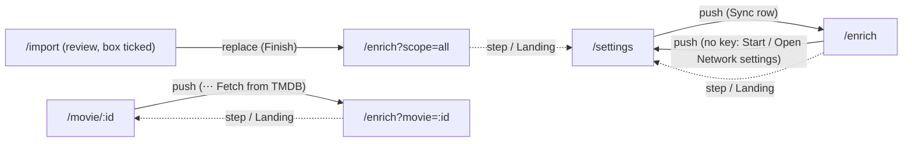

# 23 — Enrichment (TMDB)

> **Initiative:** `enrichment`
> **PRD:** to follow this log
> **Plan:** to follow the PRD

This log is the `grill-me` session that settled the feature before the PRD was
written, run against the prototype revision of 2026-09-22 and the code as it
stood at `024c9eb`, the day after the `series` refactor closed. It is an
immutable snapshot of that moment. The session ran alone, with every
recommendation accepted in advance by the maintainer, whose standing
instruction is the scope — _translate the prototype 1:1 into the codebase, in
its naming, conventions, patterns and architecture_.

It is step 6 of CLAUDE.md's build order, the last one that needs nothing of
Electron, and it went after Series so that it enriches series too.

## Background

COMPONENT-SPEC **§5a** adds Enrichment: "the first and only feature that
touches the network". It is drawn across five files:

| Prototype                      | What it draws                                                                                                                                                                                                                                                                  |
| ------------------------------ | ------------------------------------------------------------------------------------------------------------------------------------------------------------------------------------------------------------------------------------------------------------------------------ |
| `feat.EnrichmentFlow` (new)    | _Sync with TMDB_: Back, the heading, a key badge and the lede; then one of three steps — **setup** (an offline banner, a key banner, _What to sync_ scope cards, _Fields to fill_ chips, _Where it is saved_ with two toggles, Start and an estimate), **running**, **review** |
| `page.SettingsPage` (revised)  | a **Network** group between Playback and Storage: _The Movie Database (TMDB)_ with a status pill, the lede, a masked mono key field with _Test connection_, a hint, a divider, and the _Sync metadata & posters_ row with its line                                             |
| `feat.ImportFlow` (revised)    | an _Also fetch metadata and posters from TMDB_ checkbox card over _Start import_, its hint depending on whether a key is set                                                                                                                                                   |
| `page.MoviePage` (revised)     | a third item in the ⋯ menu, _⟳ Fetch from TMDB_, between _Edit details_ and the Danger row                                                                                                                                                                                     |
| `FamilyFlix.dc.html` (revised) | the simulation: `enrichFieldDefs`, `startEnrich`, `seedEnrichPending`, the running tick's log lines, six snackbars, and the `enrichModel` / `settingsModel.net` builders                                                                                                       |

§5a's own table records eight decisions "settled with the user before design"
(where it lives, storage, fields, rating, conflicts, matching, API key,
offline) and a server-side note: the run is a pass over the already-imported
library keyed by title + year, not a second scanner; `tmdb_id` finally gets a
value; the poster and sheet writes "are the only place the app writes back into
the source folders, so they need their own permission check and a dry-run log
line".

What the code has: `movies.tmdb_id`, `synopsis`, `director`, `cast`,
`runtime_minutes`, `poster_path`, `backdrop_path` (migration 1) and
`series.tmdb_id`, `episodes.title`, `air_date` (migration 4) — all waiting,
most null. No `original_title`, no TMDB score, no episode still. A `settings`
key/value table (migration 3). A **Bulk import** whose **Current run** lives in
memory, is polled every 500 ms and re-attached (`createImporter`,
`useImportRun`), whose **Problems** are settled one route at a time. The
**Snackbar stack**, mounted and still without a caller. And a **Library root**
the glossary says is "never written to", whose path the app does **not**
remember after the run that walked it.

## Problem

Build §5a — the three entry points, the Network group, the three-step flow and
the TMDB pass behind it — 1:1 against the prototype, in the codebase's own
units and vocabulary, and settle what the simulation leaves open: what a
"missing" title is, what counts as a match and a conflict, where a key lives
and what "connected" and "offline" mean when they have to be true, what a
series gets, and how an app that forgot its **Library root** writes a sheet
into it.

## Questions and Answers

### Scope

1. **Its own initiative?** ✅ **Yes** — `23-enrichment.md`, initiative
   `enrichment`, one PRD, its issues, build and refactor. It carries both 🔜
   parts of step 6: **Enrichment (TMDB)** and the **Network group**. Neither
   ships alone — a key with nothing to sync is a field, a sync with no key
   cannot start.

2. **Movies only, or series too?** ✅ **Both.** The setup draws it ("Series
   get the same fields at show level, plus episode titles, air dates, and
   stills for every season found on disk"), and CLAUDE.md ordered this step
   after Series for exactly that. A **Title** in this feature's copy is a
   movie or a series; every count on the screen counts both.

3. **What is not built?** ❌ Everything the prototype does not draw: a place
   the TMDB score or the original title is shown (both are stored, Q12), a
   _Fetch from TMDB_ for a series (the series page has no ⋯ menu — log 22's
   amendment flag stands), a language picker for TMDB's answers (Q17),
   scheduled or background syncs, and enrichment of anything but the three
   write targets. **Rating is untouched, always** (§5a).

### Key and connection

4. **Where does the key live?** ✅ **The `settings` table, key
   `tmdb-api-key`**, read and written through `library/settings/` beside the
   subtitle language. It never leaves the server except to the settings read
   of Q6. ❌ An env var (the maintainer pastes it in the app, per the
   prototype) and ❌ a file beside the database (the table exists for exactly
   this).

5. **What does _Test connection_ do?** ✅ **Test and save are one write:**
   `POST /api/tmdb/key { key }` asks TMDB's `/3/authentication` with it and
   **stores it only if TMDB accepts it**. `200 { key }` accepted; `400` empty;
   `422` refused by TMDB; `503` TMDB unreachable. The prototype has no Save
   button — the test is the save. The pill reads _Connected_ when a key is
   stored and the field still holds it; typing flips it to _Not set up_
   (the prototype's `onTmdbKey`), and the label reads _Testing…_ / _Test
   again_ / _Test connection_ exactly as `testLabel` does.

6. **What reads the key back?** ✅ `GET /api/tmdb/key` → `{ key: string |
null }`, so the field shows the stored key masked (`type="password"`, the
   prototype binds `value`). ❌ Folding it into `GET /api/settings` — the
   player's `fetchSettings` would carry a secret it never uses.

7. **Which key shapes?** ✅ **Both that themoviedb.org → Settings → API
   hands out:** a v3 _API key_ (sent as `api_key`) and a v4 _Read Access
   Token_ (a JWT, sent as `Authorization: Bearer`), told apart by shape in one
   pure unit, `tmdbAuth`. The page shows both side by side; refusing the
   longer, more prominent one would be the first thing to go wrong.

8. **What is "offline"?** ✅ **Whether TMDB answered, asked by the server** —
   the setup's read (Q20) includes `online`, a short-timeout request to TMDB
   made on every visit and on _Retry_. ❌ `navigator.onLine`, which is true
   on a network with no route out. The banner, the estimate line
   (_Waiting for a connection_) and Start's readiness all read it. Mid-run
   loss is Q30.

9. **Snackbars?** ✅ **Yes — the prototype draws six, and this feature is the
   stack's first caller.** Six logs refused one because the prototype drew
   none on their paths; this one draws them, so 1:1 raises them, and
   CLAUDE.md's "the first caller is the Update offer" becomes history:
   - _Paste a key first._ — warning, Test with an empty field
   - _Connected to TMDB._ — success, the key accepted
   - _Add your TMDB key here first._ — info, Start with no key (Q22)
   - _Match saved._ — success, a candidate picked
   - _Details updated._ — success, a conflict applied
   - _Searching TMDB…_ — info, a search sent
     Two the simulation cannot need, because its test never fails, are added
     in the same vocabulary: _TMDB didn't accept that key._ (error, `422`) and
     _Couldn't reach TMDB._ (error, `503`). All are plain notices, gone at 5 s —
     the stack has no `duration`, so the prototype's per-snack durations drop.

### Data model

10. **Which new columns?** ✅ **Migration 5:** `movies.original_title TEXT`,
    `movies.tmdb_score REAL`, `movies.source_folder TEXT`;
    `series.original_title TEXT`, `series.tmdb_score REAL`,
    `series.source_folder TEXT`; `episodes.still_path TEXT`. Nothing seeded,
    nothing backfilled by the migration.

11. **`tmdb_id`?** ✅ Written on every movie and series a run settles —
    confident, picked, or applied. It is what _Everything_ re-uses next time
    (Q26) so a title once placed is never searched for again.

12. **TMDB score and original title — drawn?** ✅ **Stored, not drawn.** They
    are two of the ten chips, so the run fills them; no prototype screen shows
    either, so none does. `tmdb_score` is TMDB's `vote_average` (0–10, one
    decimal) and never touches `rating` (§5a, and the setup's ★ line).

13. **Where do downloaded images go?** ✅ **Into the title's own Movie folder
    in the Managed media directory** — `poster.jpg`, `backdrop.jpg`, and for
    an episode `<episode file stem>.still.jpg` in its season folder — through
    a new `Media` member that stores a stream under a name, the way
    `storeUpload` does for a request part. The stored path is relative, like
    every other. ❌ Hot-linking `image.tmdb.org` from the library: the app is
    offline-first, and a poster must draw with the cable out.

14. **Episode stills — drawn?** ✅ **Yes, in `EpisodeRow`'s thumbnail,** real
    art over the gradient fallback, `PosterCard`'s precedent: the prototype's
    gradient stands for art there exactly as it does on a poster, and the
    setup names stills as something the sync fetches. The row's props gain
    `stillUrl?`; nothing else in it moves.

### What the run fetches

15. **The ten fields, mapped.** ✅

    | Chip           | Movie column      | Series column      | Episode (Q16)     |
    | -------------- | ----------------- | ------------------ | ----------------- |
    | Synopsis       | `synopsis`        | `synopsis`         | —                 |
    | Poster         | `poster_path`     | `poster_path`      | `still_path`      |
    | Backdrop       | `backdrop_path`   | `backdrop_path`    | —                 |
    | Runtime        | `runtime_minutes` | —                  | `runtime_minutes` |
    | Year           | `year`            | `year`, `end_year` | —                 |
    | Genres         | `movie_genres`    | `series_genres`    | —                 |
    | Director       | `director`        | `creator`          | —                 |
    | Cast           | `cast` (top 10)   | `cast` (top 10)    | —                 |
    | Original title | `original_title`  | `original_title`   | —                 |
    | TMDB score     | `tmdb_score`      | `tmdb_score`       | —                 |

    Director is the credits' first `Director` job; a series' creator is
    `created_by` joined with `, `. A chip switched off is a column never
    written this run.

16. **What does an episode get?** ✅ **Its title and air date, always, when
    empty; its still under the Poster chip; its runtime under Runtime** — for
    every season number the series has on disk, one `/tv/{id}/season/{n}`
    each, matched by episode number. Episodes never raise a conflict or a
    **Decision** (a review of 200 episode titles is a list nobody reads —
    log 13 Q16's argument). Specials (season 0) are not asked for; there are
    none on disk (log 22 Q2).

17. **Which language?** ✅ **`en-US`, fixed.** The prototype has no control
    for it, and the household's subtitle preference is not a statement about
    which language a synopsis should be in. Roadmap if asked.

18. **Genres?** ✅ **Mapped onto the Genre pool, the rest dropped,** by a pure
    unit `tmdbGenres`: TMDB's name when the pool has it, `Science Fiction` →
    `Sci-Fi`, the TV compounds split (`Action & Adventure` → Action,
    Adventure; `Sci-Fi & Fantasy` → Sci-Fi), everything else (`Fantasy`,
    `History`, `War`, `TV Movie`, …) dropped. ❌ Growing the pool: it is the
    vocabulary every chip row and filter draws from, and twelve is a design.

### Scope and matching

19. **What is "Only what's missing"?** ✅ **A title with no synopsis or no
    poster** — the prototype's own line, "have no synopsis or artwork". Its
    complement is a title with **Full details**, the number the Settings row
    reports ("N of M titles have full details"). In this scope a run **fills
    empty fields only and never raises a conflict**: the maintainer asked for
    gaps to be filled, not for their typing to be questioned.

20. **What does the setup read?** ✅ One call, `GET /api/enrichment` →
    `EnrichmentSummary { total, complete, lastSyncedAt, keySet, online,
libraryRoot }` — the scope cards' counts (_missing_ = `total −
complete`), the estimate, both banners, the badge, and the two mono paths
    under _Where it is saved_. The Settings row reads the same route for its
    line. `null` until it lands, nothing drawn while so — the Settings hub's
    rule.

21. **_Everything_ and _Just this movie_?** ✅ Both **fill empty fields and
    raise a conflict** for a filled one that differs (Q24). _Everything_ is
    every movie and series; _Just this movie_ is the one `?movie=<id>` names,
    and replaces the other two cards, as `scopeDefs` does.

22. **Is Start inert?** ✅ **The prototype's behaviour, not §5a's word:**
    Start is `secondary` until ready and `primary` once `keySet && online`;
    pressed with no key it pushes `/settings` and raises _Add your TMDB key
    here first._; pressed offline it does nothing. `startEnrich` does exactly
    this — the button is never `disabled`, only quiet.

23. **What is a match?** ✅ **A Candidate list scored by a pure unit,
    `matchScore`:** 70 points for the title (the **Title key** equal → 70,
    otherwise word overlap × 70), 30 for the year (equal → 30, one off → 15,
    unknown → 0), rounded to the _% match_ the picker draws. A title is
    **Confident** when exactly one candidate has an equal **Title key** and,
    when the title has a year, an equal year; then it is written without a
    look. More than one → `ambiguous` with the top three candidates; none at
    all → `missing`. `titleKey` is imported from `import-export/`, the way
    the importer imports `episodeTag` from `media/`. A title with a `tmdb_id`
    skips the search (Q11).

24. **What is a conflict?** ✅ **A filled field TMDB answers differently,**
    compared after trimming and ignoring case (genres and cast as sets), in
    five columns only: Synopsis, Year, Genres, Director (a series' creator)
    and Cast. The rest never conflict: **Poster, Backdrop and Runtime** are
    filled when empty and otherwise left (a picture cannot be diffed in the
    prototype's text columns, and the runtime off the bytes is truer than
    TMDB's); **Original title and TMDB score** are TMDB's own and always
    written. A conflicting title's empty fields are filled at once and only
    the differing ones wait; it counts under _need your decision_ until
    settled.

25. **What are the review rows called?** ✅ **Decision** — the tile's own
    words, "need your decision" — with three kinds, `ambiguous`, `conflict`,
    `missing`, and the molecule `DecisionRow`. ❌ **Problem** is the import's
    (its kinds and Resolve belong to the form), and ❌ `PendingRow`, the
    prototype's prop type, names a state rather than a thing.

26. **_Search by title_ and the missing row's search?** ✅ **One search, two
    faces.** `POST …/decisions/:id/search { query }` answers candidates;
    the row then draws the poster picker (an `ambiguous` face) with them.
    _Search by title_ on an ambiguous row swaps its picker for the search box
    prefilled with the title. A search with no results keeps the box and sets
    the reason to _Nothing on TMDB matched “{query}”._ Each search raises
    _Searching TMDB…_.

27. **The missing row's reason?** ✅ **Amended:** _Nothing on TMDB matched
    this title._ The prototype's "…this folder name" is untrue — the run
    searches titles, never folders — and a false sentence is the one thing
    1:1 must not carry. Recorded as a prototype amendment. The other two
    reasons stay verbatim: _Three releases share this title — pick the right
    one._ becomes _{n} releases share this title — pick the right one._ with
    the count spelled out, and _TMDB has different values for fields you
    already filled in._ is unchanged.

### The run

28. **Server shape?** ✅ **A fifth domain, `server/src/enrichment/`** —
    nothing in `library/`, `media/`, `import-export/` or `playback/` is a
    network client, which is the rule `playback/` was born by. Injected as
    `createApiRouter(…, enrichment)` so the routes never learn there is a
    TMDB. Units:

    - `tmdbClient/` — the injected seam: `createTmdbClient(fetch)` →
      `authenticate(key)`, `searchMovie`, `movie` (with `credits`),
      `searchTv`, `tv` (with `credits`), `season`, `image(path)` → stream.
      `fetch` injected, so no test goes online.
    - `tmdbAuth/`, `tmdbGenres/`, `matchScore/` — pure.
    - `fetchedFields/` — pure: a TMDB detail → our columns, by chip.
    - `planFields/` — pure: a title × its fetched fields × the chips × the
      scope → `{ fill, conflicts }`.
    - `writeBack/` — the two **Write targets** into the **Library root**
      (Q33–Q36).
    - `createEnrichment/` — the domain: `summary`, `start`, `current`,
      `cancel`, `search`, `pick`, `apply`, `dismiss`. One **Current
      enrichment run** in memory, its state machine as closures,
      `createImporter`'s shape and log 13's argument for it.

29. **Routes?** ✅ Mirroring the import's:

    | Route                                                                        | Answer                                                                  |
    | ---------------------------------------------------------------------------- | ----------------------------------------------------------------------- |
    | `GET /api/tmdb/key`                                                          | `{ key }`                                                               |
    | `POST /api/tmdb/key { key }`                                                 | `200 { key }` · `400` · `422` · `503`                                   |
    | `GET /api/enrichment`                                                        | `EnrichmentSummary`                                                     |
    | `POST /api/enrichment { scope, movieId?, fields, writeSheet, writePosters }` | `201 EnrichmentRun` · `400` · `409` busy · `412` no key · `503` offline |
    | `GET /api/enrichment/current`                                                | `EnrichmentRun` · `404`                                                 |
    | `POST /api/enrichment/current/cancel`                                        | `204`                                                                   |
    | `POST /api/enrichment/current/decisions/:id/search { query }`                | `200 Decision` (the row redrawn)                                        |
    | `POST /api/enrichment/current/decisions/:id/pick { tmdbId }`                 | `204`                                                                   |
    | `POST /api/enrichment/current/decisions/:id/apply { choices }`               | `204`                                                                   |
    | `DELETE /api/enrichment/current/decisions/:id`                               | `204` · `404`                                                           |

30. **How does it run?** ✅ **One title at a time, polled at 500 ms,
    re-attachable** — the import's cadence and its hook shape
    (`useEnrichmentRun`). Every settled title is written **during the run**:
    columns, `tmdb_id`, images into the Movie folder, then the two write
    targets. A network failure mid-run **ends the run into review** with the
    log line _Lost the connection — stopped. Anything already fetched is
    kept._; a `401` ends it the same way with _TMDB refused the key._ The
    bar is determinate: `done / total` is known before the first request.

31. **_Stop_?** ✅ **The prototype's `cancelEnrich`:** the run is dropped,
    the screen returns to setup, and what was written stays written — the
    line beside the button says so. Undecided rows of a stopped run go with
    it.

32. **The Activity log's lines?** ✅ The simulation's, kept verbatim where
    they are true — `Contacting api.themoviedb.org …` (info), `Looking up N
titles by name and year.` (info), `✓ Matched   Title (Year)` (success),
    `⚠ Title — several possible matches` (warning), `⚠ Title — no result on
TMDB` (warning), `↓ poster.jpg  →  <path>` (scan), and `✓ Sync complete —
X enriched, Y need a decision.` (success) — plus the ones the real run
    needs: `⚠ Title — differs from what you filled in` (warning), the two
    stops (Q30), and the write-back lines (Q35). The last 80, `LogConsole`,
    exactly as the import's.

### Writing into the Library root

33. **The app forgot the Library root. Now what?** ✅ **Remember it.** The
    importer writes `library-root` to `settings` on Start, and each movie and
    series it adds or finds **Already in library** gets `source_folder` —
    **relative to that root**, so no absolute path from the source machine
    lands in a library row (CLAUDE.md's rule). The one absolute path is the
    setting, the maintainer's own typing, like `FAMILYFLIX_MEDIA_PATH`. A
    re-run of an import over the existing library therefore backfills every
    title it recognises — the fix for a library imported before this ships.
    The review rows' mono `path` line is `root + source_folder`, and is not
    drawn when there is none.

34. **The "never written to" invariant?** ✅ **Narrowed, not dropped:** the
    **Library root** is still never written by a **Delete**, an edit or an
    import — **only by the two Write targets, never overwriting a file that
    exists**. §5a says so in terms, and the glossary is amended.

35. **The permission check and the dry-run line?** ✅ **At start, before the
    first request:** `fs.access(root, W_OK)` for each target switched on,
    and one log line per target saying what will happen —
    `Will write familyflix-metadata.csv to E:\Movies` or
    `Can't write to E:\Movies — the sheet and posters will be skipped`
    (warning). A title with no `source_folder`, or one whose folder is gone,
    is one line, `– Title — no source folder on record, poster skipped`, and
    no Decision. A `poster.jpg` already there is `– poster.jpg exists,
left alone`. Nothing else is ever written there.

36. **What is `familyflix-metadata.csv`?** ✅ **The Export file, CSV, written
    by `writeSheet`** — the eight **Export columns**, every movie A–Z, once,
    at the run's end — so the sheet in the collection root is one the
    importer can read back, the round trip log 14 proved. Series are not in
    it (log 22's ruling on Export). Written only when absent (§5a); a
    later sync logs `– familyflix-metadata.csv exists, left alone`.

37. **No Library root at all?** ✅ **The two toggle rows are not drawn,** and
    _Where it is saved_ is _Your library_ alone — the Settings hub's rule for
    a control whose mechanism does not exist (log 15). A run started then
    sends both flags `false`.

### The screens

38. **Route and page?** ✅ `/enrich`, `pages/EnrichmentPage` —
    `MaintainerLayout` around `EnrichmentFlow`, `ImportPage`'s shape. With
    `?movie=<id>` it is _Just this movie_; `?scope=all` preselects
    _Everything_. The **Landing** is `moviePath(id)` with a movie, else
    `/settings`; Back and _Done_ / _Back to the movie_ are both the **Back
    rule** (`backFromEnrich` is one function for both). _Sync again_ dismisses
    the run and shows setup.

39. **The three ways in?** ✅
    - **Settings → Network → _Sync metadata & posters_** — a push to
      `/enrich`.
    - **Import _Finish_ with the box ticked** — a **replace** of `/import` by
      `/enrich?scope=all`, landing on **setup** with _Everything_ selected
      (the prototype's `goEnrich` with `enScope:'all'`, not a run started
      behind the maintainer's back); Back then steps to Settings, where
      `backFromEnrich` sends the simulation. The box travels on the run —
      `POST /api/import { …, enrich }`, `ImportRun.enrich` — so a
      re-attached run still knows it.
    - **The movie's ⋯ menu → _⟳ Fetch from TMDB_** — a push to
      `/enrich?movie=<id>`.

40. **Units, frontend?** ✅ `features/enrichment/`, `import-export/`'s
    shape:

    | Unit                    | From the prototype                                                                                       |
    | ----------------------- | -------------------------------------------------------------------------------------------------------- |
    | `EnrichmentFlow/`       | the organism: header row, owns `useEnrichmentRun`, renders one step                                      |
    | `EnrichmentSetup/`      | banners, scope cards, chips, _Where it is saved_, Start + estimate                                       |
    | `EnrichmentProgress/`   | the running card: headline, elapsed, stat line, bar, current item, ETA, log, Stop                        |
    | `EnrichmentReview/`     | two tiles, _All done_, the Decision list, _Done_ / _Sync again_                                          |
    | `SetupBanner/`          | one molecule, two tones: offline (danger tint, glyph, _Retry_) and key (accent, _Open Network settings_) |
    | `ScopeCard/`            | the radio card — dot left, 15px label, indented line                                                     |
    | `WriteTargetRow/`       | glyph tile, title, mono line, a Toggle or the _Required_ pill                                            |
    | `DecisionRow/`          | the card: dot by kind, title, reason, path, _Skip_, and one face                                         |
    | `CandidatePicker/`      | the horizontal candidates and the dashed _Search by title_ card                                          |
    | `TitleSearch/`          | the input and _Search_                                                                                   |
    | `FieldDiff/`            | the _Yours \| TMDB_ rows, _Apply choices_ / _Keep all mine_                                              |
    | `useEnrichmentRun/`     | start, poll at 500 ms, cancel, search, pick, apply, dismiss                                              |
    | `useEnrichmentSummary/` | the setup's read and _Retry_                                                                             |
    | `enrichmentView/`       | pure: a run → headline, stat line, percent, elapsed, ETA; the estimate                                   |
    | `api/`                  | the enrichment calls, one caller each                                                                    |

    ❌ Reusing `FormatCard` and `StatTile`: the scope card puts its dot on the
    left at 15px, the tiles print 30px numbers, not 40px — different pixels,
    so different molecules, and the shared one would carry a mode prop for
    no one. Settings gains `NetworkSection/` and `useTmdbKey/`
    (`{ key, connected, testing, onKey, test }`); the sync row reads
    `fetchEnrichmentSummary`, which is thus called by two features and lives
    in `src/api/`.

41. **The candidate posters?** ✅ **Straight from `image.tmdb.org`, `w185`,
    over the gradient fallback.** They exist only while the review is open,
    need no key, and proxying them would be a route for nothing; the library
    itself never hot-links (Q13).

42. **The conflict face's default?** ✅ **TMDB, per field** — `choiceOf`
    defaults to `'tmdb'`. _Apply choices_ writes the chosen sides and raises
    _Details updated._; _Keep all mine_ is **Dismiss**, as `onKeepAll` is.
    A row settled by pick or apply counts into _movies enriched_ and leaves
    the list.

43. **The estimate?** ✅ `About {n × 0.4 s}s for N titles`, the simulation's
    constant, rounded up to 1; it says _About_. The two other faces —
    _Waiting for a connection_, _A key is needed before this can run_ —
    verbatim.

44. **The Settings row's line?** ✅ `Last synced {relative} · N of M titles
have full details.` when `lastSyncedAt` is set, else the second half
    alone. `lastSyncedAt` is `settings.enrichment-last-synced-at`, an ISO
    stamp written when a run reaches review. `{relative}` is _just now_,
    _N minutes ago_, _yesterday_, or the date.

45. **The Import checkbox's hint?** ✅ The prototype's two lines, chosen by
    `GET /api/tmdb/key`: _Runs straight after the import, over everything it
    brings in. Needs the internet._ with a key, _Needs a TMDB key — add one
    under Settings → Network first._ without. The box is a `role="checkbox"`
    over the clipped input, `visuallyHidden`, drawn as the prototype's 22px
    box.

## Design

### Units

```
server/src/db/migrations.ts                 migration 5: original_title, tmdb_score, source_folder ×2; episodes.still_path
server/src/library/settings/                + tmdbKey / setTmdbKey, libraryRoot / setLibraryRoot, lastSyncedAt
server/src/library/…                        enrich writes for a movie, a series, an episode; the summary counts
server/src/media/createMedia/               + a member storing a stream under a name in a folder
server/src/import-export/createImporter/    library-root on start; source_folder on add and on Already in library; run.enrich
server/src/enrichment/                      tmdbClient · tmdbAuth · tmdbGenres · matchScore · fetchedFields · planFields · writeBack · createEnrichment
server/src/routes/                          /tmdb/key, /enrichment, /enrichment/current(/cancel, /decisions/:id/…)
src/types/enrichment.ts                     EnrichField · EnrichScope · EnrichmentSummary · EnrichmentRun · Decision · Candidate · FieldConflict
src/features/enrichment/                    EnrichmentFlow · the three steps · SetupBanner · ScopeCard · WriteTargetRow · DecisionRow · CandidatePicker · TitleSearch · FieldDiff · hooks · enrichmentView · api/
src/features/settings/NetworkSection/       + useTmdbKey
src/features/movie-detail/EditMenu/         + _⟳ Fetch from TMDB_
src/features/import-export/ImportSetup/     + the checkbox card
src/components/EpisodeRow/                  + stillUrl
src/api/fetchEnrichmentSummary/             Settings row + Enrichment setup
src/pages/EnrichmentPage/
```

### Shapes

```ts
type EnrichField =
  | 'synopsis'
  | 'poster'
  | 'backdrop'
  | 'runtime'
  | 'year'
  | 'genres'
  | 'director'
  | 'cast'
  | 'originalTitle'
  | 'tmdbScore';
type EnrichScope = 'missing' | 'all' | 'single';

interface EnrichmentSummary {
  total: number; // movies + series
  complete: number; // Full details: a synopsis and a poster
  lastSyncedAt: string | null;
  keySet: boolean;
  online: boolean;
  libraryRoot: string | null;
}

interface Candidate {
  tmdbId: number;
  title: string;
  year: number | null;
  genre: string | null; // the first of genre_ids on the pool
  language: string | null; // original_language, upper-cased — a search result
  // carries no country, so `1963 · Drama · EN`
  // stands where the simulation drew `Drama · US`
  posterUrl: string | null;
  score: number; // 0–100, matchScore
}

interface FieldConflict {
  field: 'synopsis' | 'year' | 'genres' | 'director' | 'cast';
  label: string;
  mine: string;
  tmdb: string;
}

type Decision = {
  id: string;
  title: string;
  reason: string;
  path: string | null; // root + source_folder
} & (
  | { kind: 'ambiguous'; query: string; candidates: Candidate[] }
  | { kind: 'missing'; query: string }
  | { kind: 'conflict'; fields: FieldConflict[] }
);

interface EnrichmentRun {
  id: string;
  phase: 'running' | 'review';
  scope: EnrichScope;
  startedAt: string;
  total: number;
  done: number;
  enriched: number; // "movies enriched"
  currentItem: string;
  log: LogLine[];
  decisions: Decision[];
  written: { sheet: boolean; posters: boolean }; // "Saved to …"
}
```

### Navigation



### Chosen and rejected

- ✅ Movies and series · ❌ movies first, series later (Q2)
- ✅ Test is the save · ❌ a separate Save (Q5)
- ✅ Offline asked of TMDB by the server · ❌ `navigator.onLine` (Q8)
- ✅ The prototype's snackbars · ❌ refusing them by precedent (Q9)
- ✅ Images copied into the Movie folder · ❌ hot-linked (Q13)
- ✅ Genres onto the pool · ❌ growing the pool (Q18)
- ✅ _Missing_ fills gaps only · ❌ conflicts in every scope (Q19)
- ✅ Start quiet but pressable · ❌ `disabled` (Q22)
- ✅ Five conflictable fields · ❌ diffing pictures and TMDB's own values (Q24)
- ✅ **Decision** · ❌ **Problem**, `PendingRow` (Q25)
- ✅ A fifth domain, `enrichment/` · ❌ inside `import-export/` (Q28)
- ✅ Remember the root, rows relative to it · ❌ absolute source paths on rows, ❌ dropping the write targets (Q33)
- ✅ The sheet is the Export file · ❌ a new column set with no reader (Q36)
- ✅ Finish lands on setup · ❌ a run started unasked (Q39)

## Implementation Plan

1. **Tracer — a key and one movie.** Migration 5; the key in `settings`;
   `tmdbAuth`, `tmdbClient` over an injected `fetch`; `/tmdb/key`; the
   **Network group** with the pill, the field, _Test connection_ and its
   snackbars; `/enrich?movie=<id>` from the ⋯ menu running _Just this movie_
   for a **Confident** title into the library — columns, `tmdb_id`, poster
   and backdrop into the Movie folder — and review's _All done_.
2. **The whole library.** `GET /api/enrichment`; the scope cards, the chips,
   the estimate, both banners, the key badge; _Missing_ and _Everything_;
   `EnrichmentProgress` with the log, ETA and _Stop_; the Settings sync row
   and its line; `lastSyncedAt`.
3. **Decisions.** `matchScore`, `planFields`; `ambiguous`, `missing` and
   `conflict`; `DecisionRow` and its three faces, search, pick, apply,
   dismiss; the review's tiles and _Sync again_.
4. **Series.** The series pass, the season reads, episode titles, air dates,
   runtimes and stills; `EpisodeRow`'s `stillUrl`.
5. **Write targets.** `library-root` and `source_folder` from the importer
   (and the backfill on a re-run); `writeBack` with its check, its dry-run
   lines and its never-overwrite; _Where it is saved_ and its rows' absence
   with no root; _Saved to …_.
6. **From the import.** The checkbox card, `ImportRun.enrich`, _Finish_'s
   replace onto `/enrich?scope=all`.

## Trade-offs

**Easier.** Every column Enrichment fills already existed except four, and the
movie flow is untouched outside one menu item. The run is the importer's shape
— in memory, polled, re-attachable, Decisions settled one route at a time — so
the screen and the hook are siblings of ones already built, as §5a asked.
`tmdb_id` makes the second sync cheap and exact. Remembering the **Library
root** gives the review its paths and, later, the Electron shell's _Change…_
something to be about.

**Harder.** The app now has a network client, a secret and an outbound request
on a Settings visit; every one is injected and tested offline, but a TMDB
outage is a failure mode the app did not have. The **Library root** is no
longer untouchable: two files, never overwritten, behind a check and a log
line. `source_folder` is only as good as the last import — a library added
through the form, or imported before this ships, gets no poster in its source
folder until an import is re-run over it. The sheet is written once and never
refreshed, because §5a forbids overwriting it.

**Ruled out.** A place the TMDB score or original title is drawn, a series
_Fetch from TMDB_, language choice, specials, a scheduled sync, and a TMDB
seed for the household **Rating** (§5a — untouched). **Prototype amendments
flagged:** the missing row's reason (Q27); the series page's ⋯ menu, still
owed from log 22.
