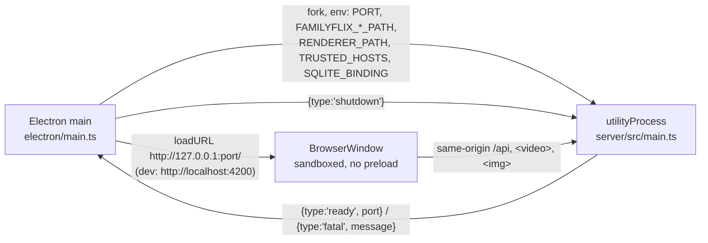
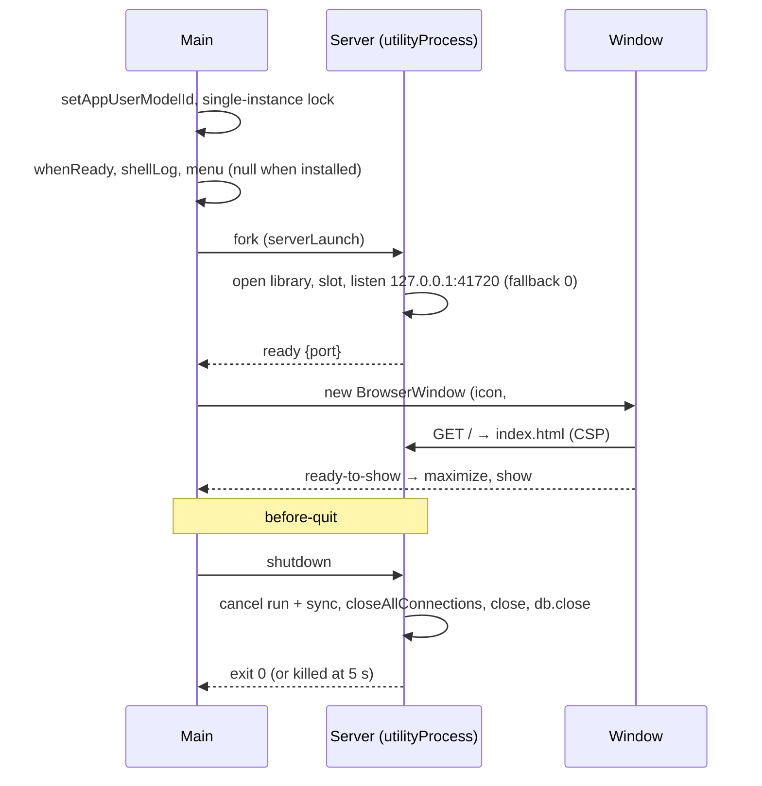

# 24 — Electron desktop shell

> **Initiative:** `electron-shell`
> **PRD:** to follow this log
> **Plan:** to follow the PRD

This log is the `grill-me` session that settled the shell before the PRD was
written, run against the code as it stood at `375dbee`, the day the
`enrichment` refactor closed. It is an immutable snapshot of that moment. The
session ran alone, with every recommendation accepted in advance by the
maintainer, who named two references: **Horizon's shell** as the precedent for
how an Electron shell is built here, and **the prototype** as the source of the
app's icons.

It is step 7 of CLAUDE.md's build order, the first step that needs Electron.
Step 8 (packaging) and step 9 (Software update, `17-software-update.md`) are
gated on it.

## Background

`electron/` holds a `.gitkeep` and nothing else. There is no `electron`
dependency, no main process, no preload and no installer. What the code
already assumes about the shell:

- **One origin.** Every wire call is a relative `/api/...` path (47 call sites
  in `src/`), and so are the `<video>` and `` sources. `vite.config.mts`
  says why: _"the packaged Electron app serves both from one origin"_. In dev,
  Vite's proxy stands in for that.
- **Environment-driven paths.** `server/src/main.ts` reads `PORT`,
  `FAMILYFLIX_DB_PATH`, `FAMILYFLIX_MEDIA_PATH` and `FAMILYFLIX_COMPONENT_PATH`,
  each documented as "Electron main sets this to `app.getPath('userData')/…`".
  It shuts down on `SIGINT`/`SIGTERM` by closing the listener and the database.
- **`app.listen(PORT)`** with no host: today the server binds every interface.
- **`BrowserRouter`**, which `04-movie-detail` Q14 flagged for this grill:
  it breaks on a `file://` reload.
- **`localStorage`**: `volumePreference/` today, and the **Seen version**
  (`17-software-update` Q25) tomorrow. Both bet on storage surviving between
  launches, and storage is per origin.
- **Google Fonts from a CDN** in `index.html`: Source Serif 4, Hanken Grotesk,
  JetBrains Mono. An offline machine falls back to Georgia and the system sans.
- **`public/favicon.ico`**, the Nx scaffold's default.
- **Hotlinked TMDB images**: a **Candidate**'s poster is
  `https://image.tmdb.org/t/p/w185/…` (`decisionFace`), the one image the app
  shows straight from TMDB.
- **An export that lands in Downloads** (`14-export`). Log 14 ruled out a
  save-location dialog and deferred it to "the Electron shell's, when it
  ships".
- **Two controls CLAUDE.md files as waiting on this step:** _Change…_ in the
  Storage group, and "folder-path autofill in the **Movie form**".

What Horizon's shell is (`Horizon/docs/design-logs/10-electron-desktop-shell.md`,
its refactor plan 09, and `Horizon/electron/` as shipped): Express in a
`utilityProcess` with a `ready`/`fatal`/`shutdown` handshake, bound to
`127.0.0.1` on an ephemeral port. The renderer loads from `file://` and learns
the API URL through a preload argument, which means `HashRouter` and CORS
`*`. Main is split into small tested units (`serverHandle`,
`awaitExitOrKill`, `resolveServerEntry`, `appIdentity`, …). An `.ico` is built
from a brand SVG by `scripts/build-icon.mjs` with `sharp`. Its refactor plan
records what hurt: a CJS preload duplicating ESM code, two `FORCE_*` env flags,
eight fix commits to get `electron:start` running, and
`electron-rebuild`/`npm rebuild` toggling `better-sqlite3` between Electron's
ABI and Node's, which left the test suite red after every Electron run.

What the prototype draws for a brand: **no square mark**. The only brand
asset in `docs/handoff/` is the **wordmark**: _Family_ in `--color-text` and
_Flix_ in `--color-accent`, Source Serif 4 at 700 (`page.LibraryPage` at
25px, the About card's brand row at 18px), on `--color-bg` `#14110d`.

## Problem

Wrap the existing React app and Express server into one Windows desktop
application that the family double-clicks and that works with no internet.
Settle the process model, how the window reaches the server, where the data
lives, how the app starts, fails and stops, what the window lets a page do,
and what the app looks like in the taskbar. Change as little as possible in
`src/` and `server/`, and take from Horizon what worked, not what it later
refactored away.

## Questions and Answers

### Scope

1. **Its own initiative?** ✅ **Yes**: `24-electron-shell.md`, initiative
   `electron-shell`, one PRD, its issues, build and refactor. It carries the
   process model, the window, the **App mark**, the data paths, offline fonts
   and the window's policy. ❌ Folding packaging in (Horizon kept them apart
   too): the installer, `electron-builder`, bundling FFmpeg and the release
   workflow are step 8's and step 9's.

2. **Does it build _Change…_?** ✅ **No.** `15-settings-hub` Q19 is still the
   reason: _Change…_ is a **move** of the **Managed media directory**, a
   storage model of its own with "a bug in it deletes my parents' films"
   stakes. A folder dialog is the easy half of it. It becomes a 🧭 Roadmap item,
   **Move the media folder**, and stays undrawn. CLAUDE.md's step 7 line is
   amended.

3. **And "folder-path autofill in the Movie form"?** ✅ **Not built. The line
   is wrong.** CLAUDE.md's own _Movie Import_ section says autofill "belongs to
   bulk import … Do not build it into this form", and Import setup's two path
   fields are typed in the prototype, with no Browse button. The prototype draws
   no native picker anywhere, so the shell adds none. The line is struck from
   CLAUDE.md's step 7 entry.

4. **A preload and `window.familyflix`?** ✅ **Not in this initiative.** With
   one origin (Q10) the renderer needs nothing from main: no URL, no menu
   events, no pickers. A global with no reader is ceremony. Step 9 creates
   `electron/preload.ts` and the global together, with `updates` as its first
   member. This supersedes the parenthetical in `17-software-update` Q13 (_"it
   will carry the API base URL before it carries anything else"_): it never
   carries one. The window's `webPreferences` are set now (Q21), so the preload
   step 9 adds is born sandboxed.

### The server process

5. **How does main run Express?** ✅ **`utilityProcess.fork()`**, Horizon Q1.
   It uses Electron's own Node, so no second runtime ships, and it gives a
   message port for the handshake. ❌ `child_process.spawn('node')` ships a
   second binary. ❌ Importing the server into main tangles `better-sqlite3`
   and FFmpeg children with the window's process.

6. **The handshake?** ✅ Three messages, typed once in `src/types/shell.ts`
   (the `update.ts` precedent: the file both sides import rather than
   redefine):

   ```ts
   export type ServerMessage =
     | { type: 'ready'; port: number }
     | { type: 'fatal'; message: string };
   export type ShellCommand = { type: 'shutdown' };
   ```

   The server's half is `server/src/shell/shellHandshake/`. It posts `ready`
   with the **bound** port once listening, posts `fatal` when opening the
   library or listening throws, and runs the shutdown on `shutdown`. With no
   `process.parentPort` it does nothing, so `npm run dev:server` is unchanged
   and keeps its `SIGINT`/`SIGTERM` handlers. `shell/` is infrastructure, like
   `db/`: the server's half of a seam, not a domain. ❌ Horizon's
   `integrity | unknown` kinds: FamilyFlix has no `StorageIntegrityError`, and
   every fatal gets the same dialog (Q27).

7. **How long does main wait for `ready`?** ✅ **15 s**, then the fatal dialog.
   Horizon's 10 s plus margin, because FamilyFlix's startup also runs
   migrations and sweeps the **Component slot**.

8. **Shutdown?** ✅ On `before-quit`, main sends `shutdown` and waits **5 s**
   for the exit, then kills (Horizon Q12, `awaitExitOrKill`). The server:
   1. cancels a **Current run** (whose cancel already rolls back the folder in
      flight) and stops a **Current enrichment run**;
   2. calls `server.closeAllConnections()` **before** `server.close()`, because
      a playing film holds a streaming connection open and `close()` alone
      would wait for it past the 5 s budget;
   3. closes the database (the WAL checkpoint), and exits `0`.

   The same ordered shutdown replaces today's `shutdown()` for the signals too,
   so one path exists.

9. **The server dies after `ready`?** ✅ A dialog, _"FamilyFlix stopped
   unexpectedly."_, with **Restart** (`app.relaunch()` then exit) and **Quit**.
   ❌ Horizon's silence: a blank library with nothing to press is the worst face
   for the family.

### One origin

10. **How does the window reach the API?** ✅ **The server serves the renderer,
    and the window loads `http://127.0.0.1:<port>/`.** The 47 relative calls,
    every `<video>`/`` source and **`BrowserRouter`** all stay as they are,
    because a reload of `/movie/12` is a GET the server answers with
    `index.html`. There is no CORS because there is no second origin. This
    settles `04-movie-detail` Q14. ❌ Horizon's `file://` with
    `window.horizon.apiBaseUrl`: 47 call sites rewritten, `HashRouter`, and
    CORS `*`. ❌ A custom `familyflix://` protocol proxying `/api`: `<video>`
    Range requests through `protocol.handle` need privileged-scheme streaming,
    which is a second transport to debug for no gain.

11. **Which port?** ✅ A **Shell port**, `41720`, in the installed app. Storage
    is per origin and an origin includes its port, so Horizon's ephemeral port
    would wipe the volume and the **Seen version** on every launch. If `41720`
    is taken, the server **under the shell** falls back to an ephemeral port and
    reports it in `ready`. That launch starts with empty storage (default
    volume, no _updated_ snackbar, the fresh-install face), which is harmless.
    Standalone (`npm run dev:server`) still fails loudly on a taken port. In
    `electron:dev` the server takes `3001`, the port Vite's proxy expects.

12. **Bind address?** ✅ **`127.0.0.1`, always**, standalone included. Today
    the server answers on every interface, so anyone on the family's Wi-Fi can
    reach the library's write routes. Vite's proxy target becomes
    `http://127.0.0.1:3001`, because Node resolves `localhost` to `::1` first
    and would miss an IPv4-only listener.

13. **Can a web page in the family's browser reach the server?** ✅ **No: the
    Loopback guard.** Middleware in front of everything,
    `server/src/routes/loopbackGuard/`, answers `403` when the `Host` header is
    not a **trusted host** (this defeats DNS rebinding), or when an `Origin`
    header is present and is not a trusted origin (this stops a page's simple
    `POST`). The trusted hosts are `127.0.0.1:<bound>` and `localhost:<bound>`,
    plus `FAMILYFLIX_TRUSTED_HOSTS` (comma-separated), which defaults to
    `localhost:4200` so Vite's proxy keeps working. The installed app sets it
    empty. ❌ Relying on CORS: `DELETE` is preflighted but a text/plain `POST`
    is not, and the library is the family's films.

14. **A Content Security Policy?** ✅ Yes, as a response header on the served
    renderer only (Vite's HMR needs inline script in dev):
    `default-src 'self'; script-src 'self'; style-src 'self' 'unsafe-inline';
img-src 'self' data: blob: https://image.tmdb.org; media-src 'self' blob:;
font-src 'self'; connect-src 'self'; object-src 'none'; base-uri 'self'`.
    `'unsafe-inline'` for styles because styled-components injects `<style>`.
    `image.tmdb.org` for the **Candidate** posters.

### The renderer

15. **Dev and installed renderer?** ✅ `electron:dev` loads Vite at
    `http://localhost:4200`, retried until it answers because both start
    together. The installed app loads the server's own origin. The server mounts
    the renderer only when `FAMILYFLIX_RENDERER_PATH` is set (to
    `dist/familyflix`): `server/src/routes/rendererRouter/`, which serves
    static files, sends the CSP, and answers `index.html` for any non-`/api` GET.
    Unset, nothing is mounted and `npm run dev` is exactly today's.

16. **Fonts offline?** ✅ **Self-hosted**, through the `@fontsource` packages
    for the three families. They are imported once in `src/main.tsx`, Vite
    bundles the woff2 files, and the Google Fonts `<link>`s and `preconnect`s
    leave `index.html`. The typefaces are the prototype's own tokens, unchanged.
    ❌ Hand-copied font files: unversioned. ❌ Keeping the CDN: the parents'
    library would render in Georgia whenever the router is down. `index.html`'s
    `<title>` also becomes **FamilyFlix**; it reads _Familyflix_ today.

### Data and paths

17. **Where does the installed app keep its data?** ✅ Under `userData`,
    `%APPDATA%\FamilyFlix\`: `familyflix.db`, `media\`, `playback-component\`
    and `logs\`. Main sets the three existing variables. `package.json` gains
    `"productName": "FamilyFlix"` so the folder has that name rather than
    `@familyflix/source`. ❌ Next to the `.exe`: Program Files is not writable.

18. **And an unpackaged run?** ✅ **The repo's own library.** `electron:dev`
    and `electron:start` set none of the three path variables, so they open
    `./familyflix.db`, `./media` and `./playback-component`, the same library
    `npm run dev` fills from the importer's fixture. Their `userData` is
    redirected to `FamilyFlix (dev)`, so a dev window never shares a
    single-instance lock, a Chromium profile or `localStorage` with an installed
    copy on the same machine.

19. **`better-sqlite3` under Electron's ABI?** ⚠️ **The last sentence is
    superseded by `25-desktop-packaging` Q10** — nothing is rebuilt; the
    Installer carries the Electron-ABI binding. ✅ **A second binding beside the
    first, never a rebuild in place.** `openDatabase` passes better-sqlite3's
    own `nativeBinding` option when `FAMILYFLIX_SQLITE_BINDING` is set.
    `scripts/electron-sqlite.mjs` (`npm run electron:native`) fetches the
    Electron-ABI prebuild into `electron/.native/` (gitignored), and unpackaged
    Electron runs point the variable at it. Vitest keeps Node's binding and is
    never red after an Electron run. The installed app needs none of it, because
    packaging rebuilds for Electron. ❌ Horizon's `electron-rebuild` followed by
    `npm rebuild`: its most-repeated papercut.

20. **FFmpeg?** ✅ **Untouched here.** `FAMILYFLIX_FFMPEG_PATH` stays unset,
    so the resolver falls back to `PATH`, then to absent. Bundling FFmpeg and
    pointing the variable at it is packaging's job (CLAUDE.md: "bundled by the
    installer"). The **Component slot** gets its `userData` path now (Q17).

### The window

21. **What window?** ✅ **One `BrowserWindow`**: titled FamilyFlix,
    `backgroundColor: '#14110d'` (the prototype's `--color-bg`, so there is no
    white flash), `show: false` until `ready-to-show`, then **maximized**. It
    has a minimum of 1024×640 and the default Windows frame, and remembers no
    bounds. `webPreferences`: `contextIsolation`, `sandbox`, `webSecurity` on,
    `nodeIntegration` off, and no preload yet (Q4). The player's `useFullscreen`
    uses the HTML Fullscreen API, which Electron honours as is. ❌ Remembered
    bounds: the parents want it big every time. ❌ Frameless: the prototype
    draws no title bar of its own.

22. **A menu bar?** ✅ **None in the installed app**
    (`Menu.setApplicationMenu(null)`): the prototype draws none, and File / Edit
    / View is noise to the family. Unpackaged runs keep Electron's default menu
    and open DevTools. ❌ Horizon's File / Edit / View / Window / Help: its items
    earned their place there (backup, restore); here there are none.

23. **Two launches?** ✅ `requestSingleInstanceLock()`. The second launch
    restores and focuses the first window and exits.

24. **What may a page do?** ✅ **Only be FamilyFlix.** This is
    `electron/windowPolicy/`, pure:
    - A navigation off the app's origin is prevented.
    - `window.open` is denied. An `https:` URL goes to the default browser
      through `shell.openExternal`, and anything else is dropped.
    - Permission requests: `fullscreen` only. Media devices, notifications and
      geolocation are refused.

25. **Downloads?** ✅ **Straight to Downloads, no dialog**: what log 14
    promised. `will-download` sets the save path to
    `app.getPath('downloads')` under the export's filename, deduplicated the way
    Chromium does it (`family-library (1).csv`). `electron/downloadPath/`,
    pure. ❌ Electron's default _Save As_ dialog: log 14 ruled it out.

26. **The renderer crashes?** ✅ `render-process-gone` reloads the window
    once. The server holds all state, so a reload loses only what was on screen.

### Failure and logs

27. **The server cannot start?** ✅ One dialog: _"FamilyFlix couldn't start."_,
    the error as its detail, and **Quit** / **Show data folder** (opens
    `userData`). Every `fatal`, a timeout (Q7) and a crash before `ready` land
    here. The copy is for the maintainer, who is the one called.

28. **A log file?** ✅ **Yes, in the installed app.** Main and the server's
    stdout/stderr append to `logs\familyflix.log`, tagged `[main]` and
    `[server]`. At startup, a file over 5 MB is renamed to `familyflix.old.log`,
    replacing the previous one. Unpackaged runs print the same tagged lines to
    the terminal. `electron/shellLog/`. ❌ Horizon's _no log file_, which its own
    trade-offs regretted: the maintainer debugs the parents' machine remotely,
    and a terminal is not an option there.

### The icons

29. **Which icon? The prototype has none.** ✅ **The App mark, derived from the
    wordmark.** It is the wordmark's two initials in its two colours, **F** in
    `--color-text` `#f3ece0` and **F** in `--color-accent` `#d97a4e`, Source
    Serif 4 at 700, on a `--color-bg` `#14110d` square with 22% corner radius. The
    glyphs are outlined to paths, so the file renders without the font
    installed. It is a **prototype amendment** (the `07-ratings` precedent,
    where the amendment lands before the build):
    `docs/handoff/brand/familyflix-mark.svg`, registered in COMPONENT-SPEC as
    a brand asset. ❌ A single **F**: it loses the two-tone split that _is_ the
    brand. ❌ Inventing a glyph (a film strip, a house): the prototype is the
    spec.

30. **Where does it go?** ✅ Everywhere the OS draws the app:
    - `electron/assets/icon.ico` at 16, 24, 32, 48, 64, 128 and 256. It is the
      `BrowserWindow` icon in **every** run, not only dev as in Horizon: an
      unpackaged `electron:start` has no stamped `.exe` either. Packaging stamps
      the `.exe` and the installer from the same file.
    - The taskbar: `app.setAppUserModelId('io.github.carlosrezai.familyflix')`
      before the window, `electron/appIdentity/` (Horizon's lesson: without it
      a pinned shortcut shows the stock icon). Packaging's `appId` test pins to
      it.
    - `public/favicon.ico`, replacing the Nx default, so a browser tab in
      `npm run dev` wears it too.
    - Preview PNGs at 256, 512 and 1024 beside the SVG.

    `scripts/build-icon.mjs` renders all of them with `sharp` (a devDependency),
    as Horizon's does. It is run by hand when the mark changes, and its outputs
    are committed. `electron/assets/iconSizes.test.ts` guards the `.ico`: it
    must hold the seven sizes. The outlining is a one-time step of the build
    (from `@fontsource`'s `.woff` with `opentype.js` in a scratch directory),
    not a dependency.

### Build and tooling

31. **How is the TypeScript built?** ✅ **`esbuild`**, an explicit
    devDependency, driven by `scripts/build-electron.mjs` through its API (no
    `npx`, no shell). It builds two bundles:
    - `electron/main.ts` → `electron/dist/main.cjs`, with `electron` external;
    - `server/src/main.ts` → `server/dist/server.cjs`, with `better-sqlite3`
      external (a native module).

    The output is CJS because `package.json` has no `"type": "module"`.
    `package.json` gains `"main": "electron/dist/main.cjs"`. The server bundles
    cleanly: no shipping file reads `import.meta` or a file beside its source.
    ❌ Horizon's `tsc` for main plus a separate CJS preload config: the
    duplication its refactor spent a commit undoing.

32. **Scripts?** ✅ Three new ones. `npm run dev` stays exactly as it is.
    - `electron:dev`: `concurrently` Vite (`nx serve`), `esbuild` watching main,
      and `electron .`. Main forks the server **from source**
      (`--import tsx`) on `3001`. A server or main change means restarting the
      script; `npm run dev` stays the fast loop for renderer work.
    - `electron:start`: `nx build`, `build-electron`, then `electron .` with
      **`FAMILYFLIX_SHELL_PROD=1`**, which means the served renderer, the bundled
      server and the **Shell port**, over the repo's own library. This is the
      installed app's shape without an installer. One flag, not Horizon's two.
    - `electron:native`: Q19.

    Every tool is called by path (CLAUDE.md _never use `npx`_), and
    `useDaemonProcess: false` stays.

33. **Typecheck and lint?** ✅ A fourth project, **`tsconfig.electron.json`**:
    `electron/**/*.ts` without tests, types `node` and `electron`, in the
    solution file. Electron's tests go in `tsconfig.spec.json` like every
    other test. `.husky/commitTypecheck/`'s `test:` narrowing builds the
    **three** shipping projects (app, server, electron), and its tests say so.
    Vitest's `include` gains `electron/**`, and those suites declare
    `// @vitest-environment node`. ESLint covers `electron/`.

34. **How is main tested without launching Electron?** ✅ `main.ts` is a
    composition root with no logic, the router's rule: it wires Electron's
    events to units that take their world as arguments. Those units are
    `serverLaunch/` (pure: packaged, prod flag, `userData`, cwd → entry,
    `execArgv`, env), `serverHandle/` (a fork injected; ready, fatal, timeout,
    unexpected exit, shutdown), `awaitExitOrKill/`, `rendererUrl/`,
    `windowPolicy/`, `downloadPath/`, `shellLog/` (a file system injected) and
    `appIdentity/`. Electron itself is only ever run in the manual smoke of
    each phase.

35. **What gets ticked, and when?** ✅ **Electron desktop shell** ✅ in README
    and CLAUDE.md **after the refactor**, not when the build issues close.

## Design

### Processes





### Files

```
electron/
├── main.ts                ← composition root: events → units, no logic
├── appIdentity/           ← APP_USER_MODEL_ID = 'io.github.carlosrezai.familyflix'
├── serverLaunch/          ← pure: (isPackaged, prodFlag, userData, cwd) → { entry, execArgv, env }
├── serverHandle/          ← fork injected: start() → { port }, shutdown(ms), onExit
├── awaitExitOrKill/
├── rendererUrl/           ← pure: dev → localhost:4200, else 127.0.0.1:<port>
├── windowPolicy/          ← pure: isAppUrl, openExternalAllowed, permissionAllowed
├── downloadPath/          ← pure: (dir, filename, exists) → a free path, "name (1).ext"
├── shellLog/              ← the tagged log, its 5 MB roll at startup
├── assets/
│   ├── icon.ico           ← 16 · 24 · 32 · 48 · 64 · 128 · 256
│   └── iconSizes.test.ts
├── .native/               ← gitignored: the Electron-ABI better-sqlite3 binding
└── dist/                  ← gitignored: main.cjs

server/src/
├── main.ts                ← 127.0.0.1, the handshake, the ordered shutdown, the renderer mount
├── shell/shellHandshake/  ← ready / fatal / shutdown over process.parentPort; inert without one
├── routes/loopbackGuard/  ← 403 off a trusted Host / Origin
└── routes/rendererRouter/ ← static dist, CSP header, index.html fallback

src/types/shell.ts         ← ServerMessage, ShellCommand: both sides import it
src/main.tsx               ← @fontsource imports; BrowserRouter unchanged
index.html                 ← no CDN fonts; <title>FamilyFlix</title>
public/favicon.ico         ← the App mark
docs/handoff/brand/        ← familyflix-mark.svg (+ 256/512/1024 PNGs): prototype amendment
scripts/build-electron.mjs ← esbuild: main.cjs, server.cjs
scripts/build-icon.mjs     ← sharp: the .ico files and the PNGs
scripts/electron-sqlite.mjs← the Electron-ABI binding into electron/.native/
tsconfig.electron.json
```

### Environment (additions)

| Variable                    | Set by                                        | Meaning                                                                       |
| --------------------------- | --------------------------------------------- | ----------------------------------------------------------------------------- |
| `PORT`                      | main: `41720` (prod), `3001` (dev)            | Unchanged meaning. Under the shell, a taken port falls back to ephemeral.     |
| `FAMILYFLIX_RENDERER_PATH`  | main when `FAMILYFLIX_SHELL_PROD` or packaged | The built renderer the server serves; unset mounts nothing.                   |
| `FAMILYFLIX_TRUSTED_HOSTS`  | main: empty when installed                    | Extra trusted hosts for the **Loopback guard**; default `localhost:4200`.     |
| `FAMILYFLIX_SQLITE_BINDING` | main when unpackaged                          | Path to the Electron-ABI `better_sqlite3.node`; unset uses the package's own. |
| `FAMILYFLIX_SHELL_PROD`     | `electron:start`                              | Main only: run the installed shape unpackaged.                                |

`FAMILYFLIX_DB_PATH`, `FAMILYFLIX_MEDIA_PATH` and `FAMILYFLIX_COMPONENT_PATH`
are set to `userData` paths **only when packaged** (Q17, Q18).

## Implementation Plan

1. **The window over the server.** `shellHandshake`, the `127.0.0.1` bind
   and the Vite proxy target. `serverLaunch`, `serverHandle`,
   `awaitExitOrKill`, `rendererUrl`, and `main.ts` forking the source server
   on `3001` with the window over Vite, the single-instance lock and the
   ordered shutdown. `electron`, `concurrently` (present) and `esbuild` wired,
   plus `electron:native` and `electron:dev`. Smoke: the library opens in a
   window, a film plays, closing the window during playback exits inside 5 s
   and leaves no `-wal`.
2. **The App mark.** The prototype amendment first (`familyflix-mark.svg`,
   COMPONENT-SPEC), then `build-icon.mjs`, `icon.ico`, the favicon, the window
   icon and `appIdentity`. Smoke: the taskbar, Alt+Tab and the title bar show
   the mark.
3. **The installed shape.** `rendererRouter` with its CSP,
   `build-electron.mjs`, the **Shell port** with its fallback, `userData`
   paths when packaged, `productName`, and `electron:start`. Smoke: a reload on
   `/series/3/season/2` stays there; the volume survives a relaunch.
4. **Offline.** `@fontsource`, the CDN links out, the `<title>`. Smoke: with
   the network adapter off, the wordmark is Source Serif.
5. **The window's rules and failures.** `loopbackGuard`, `windowPolicy`,
   `downloadPath`, the menu, `render-process-gone`, the three dialogs and
   `shellLog`. Smoke: an export lands in Downloads with no dialog; killing the
   server process offers Restart.
6. **Docs.** CLAUDE.md: environment variables, the folder map, the commit
   gate's three shipping projects, step 7's line (Q2, Q3), and the Roadmap's
   **Move the media folder**. The README's scripts. The tick waits for the
   refactor (Q35).

## Trade-offs

**Easier.** The renderer is untouched: no call site, router or media URL
learns it is in Electron, so `npm run dev` in a browser remains a faithful
copy. Storage survives launches, which the volume and the **Seen version**
depend on. Tests never meet Electron's ABI. The parents' machine keeps a log
the maintainer can ask for. Step 9 inherits a sandboxed window it only has to
add a preload to.

**Harder.** A fixed port can collide. The fallback keeps the app working but
forgets that launch's storage, and a machine where `41720` is always taken
forgets every time. The CSP and the **Loopback guard** each list hosts that
must be kept in step with Vite's port and TMDB's image host. In
`electron:dev`, server changes need a restart. The **App mark** is designed
in this session rather than drawn by Claude Design; it is the prototype's
own wordmark reduced, and it lands as an amendment before any code uses it.

**Ruled out of scope.** The installer, `electron-builder`, signing, bundling
FFmpeg and the release workflow (step 8); the preload, `window.familyflix`
and the updater (step 9); _Change…_ (Roadmap: **Move the media folder**);
native file or folder pickers anywhere; a tray icon, custom title bar or
application menu; remembered window bounds; macOS and Linux; backups and
restore (Horizon's Desktop Ops); auto-launch at login.
