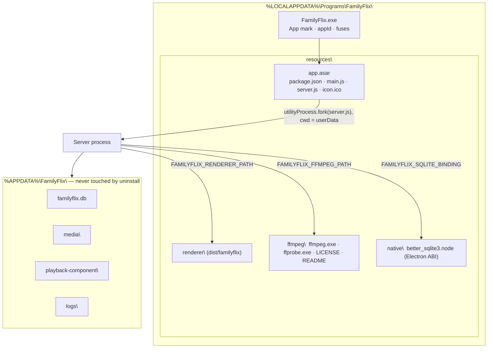

# 25 — Desktop packaging

> **Initiative:** `desktop-packaging`
> **PRD:** to follow this log
> **Plan:** to follow the PRD

This log is the `grill-me` session that settled packaging before the PRD was
written. It ran against the code as it stood at `62d8faf`, the day the
`electron-shell` refactor closed (#226), and it is an immutable snapshot of that
moment. The session ran alone, and the maintainer accepted every
recommendation in advance. They gave one explicit instruction: _the logo for
the installer and for the app itself, in the taskbar and so on_. Q18–Q20 are
where that instruction is answered surface by surface.

It is step 8 of CLAUDE.md's build order. It needs step 7 (the shell, log 24),
which is done. Step 9 (Software update, `17-software-update.md`) is gated on
it.

## Background

The shell runs in three **Shell modes**, and only two of them have ever run.
The third, `installed`, is a branch in `shellMode` that nothing has taken yet,
because there is no installer. What the code already assumes about packaging:

- **`process.cwd()` is the repo.** `electron/main.ts` builds the window's
  `ICON`, and `serverLaunch` builds the server's `entry`
  (`electron/dist/server.js`) and `FAMILYFLIX_RENDERER_PATH`
  (`dist/familyflix`), from `cwd`. In an installed app, `cwd` is wherever the
  shortcut started, and those files sit inside `resources\`.
- **The SQLite binding.** Log 24 Q19 says _"the installed app needs none of it,
  because packaging rebuilds for Electron"_. `serverLaunch`'s `installed`
  branch therefore sets no `FAMILYFLIX_SQLITE_BINDING`. `electron-builder`'s
  default `npmRebuild` rebuilds `better-sqlite3` **in place** in the repo's
  `node_modules`. That is exactly Horizon's papercut, the one Q19 was written
  to end: Vitest goes red after every package.
- **The bundles.** `buildElectron.mjs` writes `main.js` and `server.js`, both
  CJS. `better-sqlite3` is the server bundle's one external.
- **`dependencies`** lists eleven packages: React, styled-components, Express,
  exceljs, busboy, the three `@fontsource` families, `react-router-dom` and
  `better-sqlite3`. Vite or esbuild bundles every one of them except the last.
- **FFmpeg.** CLAUDE.md says FFmpeg is _"bundled by the installer, behind
  `server/src/playback/`"_, and the glossary calls the installer's build the
  **Default component**. `ffmpegBinary` reads `FAMILYFLIX_FFMPEG_PATH`, then
  `PATH`, then absent. Nothing sets the variable yet. `choosePlaybackPath`'s
  software encoder is **`libx264`**, and `ffmpegComponent` probes
  `h264_nvenc` / `_qsv` / `_amf`.
- **The App mark** (log 24 Q29–Q30): `docs/handoff/brand/familyflix-mark.svg`,
  rendered by `electron:icon` into `electron/assets/icon.ico` at
  16·24·32·48·64·128·256 and guarded by `iconSizes.test.ts`.
  `APP_USER_MODEL_ID = 'io.github.carlosrezai.familyflix'`, and log 24 said
  _"packaging's `appId` test pins to it"_.
- **`package.json`**: `"version": "0.0.0"`, `"productName": "FamilyFlix"`, no
  `author`, no `electron-builder`. `.gitignore` already ignores `release/` and
  code-signing certificates (`*.pfx`, …).
- **What log 17 left to packaging:** NSIS and `electron-updater` against GitHub
  Releases (Q4); signing (Q11, _"a self-signed certificate in Trusted Root is
  packaging's call"_); the **App version** reading `0.0.0` _"until the
  packaging initiative sets one"_. What it kept for itself: the `publish`
  block, `repository`, `release.yml` and `npm version` (Q26, Q27).

## Problem

Turn the repo into one Windows installer that the maintainer double-clicks on
the parents' machine. After that, FamilyFlix sits in the Start menu and on the
desktop wearing the **App mark**, opens on the parents' library under
`%APPDATA%\FamilyFlix\`, plays an `.mkv` with no FFmpeg installed, and
survives an uninstall without losing a film. Do it without rebuilding anything
in the repo's `node_modules`, without a certificate bill, and with the shape
step 9's updater expects.

## Questions and Answers

### Scope

1. **Its own initiative?** ✅ **Yes**: `25-desktop-packaging.md`, initiative
   `desktop-packaging`. It covers the `electron-builder` config, the installer,
   the packaged layout, the FFmpeg the installer carries, the Electron-ABI
   binding the installer carries, and the first real version. ❌ The release
   feed (`publish`, `repository`, `release.yml`, `npm version`): log 17
   Q3/Q26/Q27 kept those, and they stay there. Packaging builds locally,
   publishes nothing, and writes no workflow.

2. **Windows only?** ✅ **Windows x64 only**, as CLAUDE.md's _Desktop Build_
   says. ❌ arm64, macOS, Linux: the family's machine is a Windows x64 PC.

### The tool and the installer

3. **Which packager?** ✅ **`electron-builder`** (a devDependency), driven
   through its JS API from a script, never through its CLI shim (CLAUDE.md:
   _never use `npx`_). Log 17 already bets on its NSIS target and its
   `latest.yml` for `electron-updater`. ❌ Electron Forge with Squirrel:
   `electron-updater` does not read Squirrel feeds, and step 9 is designed on
   `electron-updater`.

4. **Which installer?** ✅ **NSIS, one-click, per-user.** `oneClick: true`,
   `perMachine: false`. It installs to `%LOCALAPPDATA%\Programs\FamilyFlix\`
   with no UAC prompt and no wizard pages. It creates a desktop shortcut and a
   Start-menu shortcut, both named **FamilyFlix**, and launches the app when it
   finishes (`runAfterFinish`). One-click is also the shape `electron-updater`
   reinstalls over silently, which is what log 17 Q8's `autoInstallOnAppQuit`
   assumes. ❌ An assisted wizard (directory picker, licence page): five
   screens of decisions nobody in the household should make. ❌ Per-machine:
   UAC on every update, and Program Files is not writable anyway.

5. **The uninstaller and the library?** ✅ **The library survives.**
   `deleteAppDataOnUninstall: false` is stated in the config, even though it is
   the default, and guarded by a test. `%APPDATA%\FamilyFlix\` (database,
   managed media, **Component slot**, **Shell log**) is never touched by
   uninstall, so a reinstall opens on the same films. The managed media is the
   only copy of the parents' films the app owns (CLAUDE.md, _Media storage_).
   An uninstaller that can delete it is a bug in waiting, so a test pins the
   flag rather than trusting the default.

6. **What is the installer called?** ✅
   `artifactName: 'FamilyFlix-Setup-${version}.${ext}'`, written to `release/`
   (already gitignored). The app's own name throughout is `productName`,
   **FamilyFlix**.

### The packaged layout

7. **What goes inside `app.asar`?** ✅ **Only what main `require`s**:
   `package.json`, `electron/dist/main.js`, `electron/dist/server.js` and
   `electron/assets/icon.ico`. No `node_modules` (Q9). `utilityProcess.fork`
   and `nativeImage` both read from an asar path.

8. **And what goes beside it, in `resources\`?** ✅ **Everything the server
   _serves_, _spawns_ or `dlopen`s**, as `extraResources`, outside the asar:

   | `resources\…`                                                   | from                      | read by                                              |
   | --------------------------------------------------------------- | ------------------------- | ---------------------------------------------------- |
   | `renderer\`                                                     | `dist/familyflix/`        | `rendererRouter`, through `FAMILYFLIX_RENDERER_PATH` |
   | `ffmpeg\ffmpeg.exe`, `ffprobe.exe`, `LICENSE.txt`, `README.txt` | `electron/.ffmpeg/` (Q13) | `ffmpegBinary`, through `FAMILYFLIX_FFMPEG_PATH`     |
   | `native\better_sqlite3.node`                                    | `electron/.native/` (Q10) | `openDatabase`, through `FAMILYFLIX_SQLITE_BINDING`  |

   A binary cannot be spawned from inside an asar at all. A `.node` is only
   `dlopen`ed after Electron copies it out. Keeping the renderer and its Range
   requests off the asar shim means the one hot static path reads plain files.
   ❌ `asarUnpack` globs: they work, but they leave one layout split between
   two places, where `extraResources` gives each consumer one directory named
   for it.

9. **`dependencies`?** ✅ **Empty.** Every package moves to
   `devDependencies`, because nothing loads from `node_modules` at runtime once
   Vite bundles the renderer and esbuild bundles the server.
   `buildElectron.mjs` stops treating `better-sqlite3` as external. Its JS is
   bundled into `server.js`. The `require('bindings')` it would use without a
   binding is lazy, and it never runs, because every **Shell mode** now passes
   `nativeBinding` (Q10). `electron-builder` then packs no `node_modules`, and
   the installer carries no `prebuild-install` tree. A test guards it:
   `package.json`'s `dependencies` is `{}`. ❌ Leaving them in `dependencies`
   and filtering with `files`: the next added dependency would silently ship.

10. **The SQLite binding?** ✅ **The same seam in every mode. Nothing is ever
    rebuilt in place.** `npmRebuild: false`. The package script runs
    `electron:native` (which fetches the Electron-ABI prebuild for the
    installed `electron` version into `electron/.native/`) and ships that one
    file as `resources\native\better_sqlite3.node`. `serverLaunch`'s
    `installed` branch now sets `FAMILYFLIX_SQLITE_BINDING` to it. **This
    supersedes log 24 Q19's last sentence** (_"the installed app needs none of
    it, because packaging rebuilds for Electron"_). The repo's
    `node_modules/better-sqlite3` keeps Node's ABI forever, and Vitest is never
    red after a package. ❌ `electron-builder`'s rebuild: Horizon's
    most-repeated papercut, the one log 24 Q19 exists to end.

11. **How does main find all this?** ✅ **A new pure unit,
    `electron/shellPaths/`**, read once beside `shellMode`:

    ```ts
    export interface ShellPaths {
      /** `package.json`'s directory: the repo, or `resources\app.asar`. */
      app: string;
      /** The App mark, for the window. */
      icon: string;
      /** The bundled **Server process**. */
      serverEntry: string;
      /** The built renderer, for **One origin**. */
      renderer: string;
      /** The Electron-ABI `better_sqlite3.node`. */
      sqliteBinding: string;
      /** The installer's `ffmpeg.exe`; `null` unpackaged, where PATH stands in. */
      ffmpeg: string | null;
      /** The working directory the server is forked in. */
      serverCwd: string;
    }
    export function shellPaths(
      mode: ShellMode,
      where: { appPath: string; resourcesPath: string; userData: string }
    ): ShellPaths;
    ```

    Unpackaged, `appPath` is the repo (`electron .`), and every path is the one
    used today. Installed, the bundles and the icon come from `appPath`
    (`resources\app.asar`), the renderer, the binding and FFmpeg come from
    `resourcesPath`, and `serverCwd` is `userData`, because a fork's working
    directory cannot be inside an asar. `serverLaunch(mode, userData, cwd)`
    becomes `serverLaunch(mode, userData, paths)`, and `main.ts`'s
    `process.cwd()` and `ICON` constant go. ❌ Keeping `cwd`: in the installed
    app it is whatever the shortcut says, which is the bug this unit removes.

12. **The installed server's environment, in full?** ✅ Log 24's, plus two:
    `FAMILYFLIX_SQLITE_BINDING` (Q10) and `FAMILYFLIX_FFMPEG_PATH` (Q13), both
    set **only** in `installed`. `start` keeps the repo's `.native` binding and
    `PATH`'s FFmpeg, as today.

### FFmpeg, the Default component

13. **Which FFmpeg does the installer carry?** ✅ **A pinned GPL build with
    `libx264`**: gyan.dev's _release essentials_ for Windows x64, one exact
    version. `choosePlaybackPath`'s software fallback is `libx264`, and an
    LGPL build has none, so every transcode on a machine without NVENC, QSV
    or AMF would fail. The essentials build also carries the three hardware
    encoders `ffmpegComponent` probes. The pin lives in
    `electron/packaging/ffmpegPin.json`
    (`{ version, url, sha256 }`). `electron/scripts/fetchFfmpeg.mjs`
    (`npm run electron:ffmpeg`) downloads it, **refuses on a SHA-256
    mismatch**, and extracts only `ffmpeg.exe`, `ffprobe.exe` and the licence
    into the gitignored `electron/.ffmpeg/`. `ffplay.exe` is never shipped.
    ❌ Committing the binaries: about 200 MB in git history per version.
    ❌ An unpinned "latest" URL: the installer would change under a rebuild of
    the same tag. ❌ An LGPL build: no `libx264`.

14. **The GPL?** ✅ FFmpeg ships as a **separate program** FamilyFlix spawns,
    not a library it links, so the MIT app is an aggregate beside it. Beside
    the binaries go the build's `LICENSE.txt` and a `README.txt` naming the
    build, its version and where its source is published. That is the
    licence's ask for a redistributed binary.

15. **Does the Component slot change?** ✅ **No.** The installer's FFmpeg is
    exactly the **Default component** the glossary already describes: what
    `ffmpegBinary` resolves when nothing is uploaded, read after the slot's
    `current/`, not removable, pill **Default**. Log 16's precedence (slot,
    then `FAMILYFLIX_FFMPEG_PATH`, then `PATH`) holds unchanged, and an
    uploaded pair still overrides it on the next Play.

### Electron itself

16. **Fuses?** ✅ **Yes, the ones that close the "run as Node" doors**, through
    `electron-builder`'s `electronFuses`: `runAsNode: false`,
    `enableNodeOptionsEnvironmentVariable: false`,
    `enableNodeCliInspectArguments: false`, `onlyLoadAppFromAsar: true`. None
    of them is read by `utilityProcess`, so the server is unaffected. Each
    stops a script on the machine from turning `FamilyFlix.exe` into a Node
    interpreter. ❌ `enableEmbeddedAsarIntegrityValidation`: on Windows it
    rests on a signed executable, and Q21 signs nothing.

17. **The Electron version?** ✅ Whatever `node_modules/electron` holds when
    the script runs. `electron:native` reads the same `package.json`, so the
    binding and the runtime cannot disagree. Pinning `electron` exactly is not
    this initiative's business. A mismatch would fail the package smoke on
    `openDatabase`, loudly.

### The App mark, everywhere Windows draws it

18. **Which surfaces carry the mark?** ✅ **All of them, from the one
    `electron/assets/icon.ico`.** Nothing is redrawn, and the SVG stays the
    single source (log 24 Q29):

    | Surface                                                            | Set by                                                                    |
    | ------------------------------------------------------------------ | ------------------------------------------------------------------------- |
    | `FamilyFlix.exe` (Explorer, a pinned taskbar button, Task Manager) | `win.icon` → stamped into the exe's resources by rcedit                   |
    | The window's title bar, taskbar button and Alt+Tab                 | `BrowserWindow({ icon })`, now `shellPaths().icon` (Q11)                  |
    | Taskbar grouping and a pin keeping the mark                        | `appId` = `APP_USER_MODEL_ID` (Q19)                                       |
    | `FamilyFlix-Setup-<v>.exe` in Downloads                            | `nsis.installerIcon`                                                      |
    | The one-click installer's progress window                          | `nsis.installerHeaderIcon`                                                |
    | The uninstaller, and _Settings → Apps_ / Add or Remove Programs    | `nsis.uninstallerIcon`, and the uninstall entry's `DisplayIcon` (the exe) |
    | The desktop and Start-menu shortcuts, Start's tile                 | the exe's own icon, at 256 for Start                                      |
    | A browser tab under `npm run dev`                                  | `public/favicon.ico` (log 24, unchanged)                                  |

    `signAndEditExecutable` stays at its default (`true`). It is the rcedit
    step that stamps the icon and the version into the exe even with no
    certificate. Turning it off to "skip signing" would ship Electron's atom
    icon. ❌ A separate installer artwork (an NSIS sidebar BMP): a one-click
    installer has no sidebar, and the prototype draws no installer.

19. **The App User Model ID?** ✅ `appId: 'io.github.carlosrezai.familyflix'`,
    the same string as `APP_USER_MODEL_ID`, guarded by a test that imports the
    constant and reads the config. NSIS writes the `appId` into the shortcuts it
    creates, and main sets the same ID on the process (log 24 Q30), so the
    shortcut, the running window and a pin all group as one taskbar button
    wearing the mark. A mismatch is the Horizon bug: a pin showing Electron's
    stock icon.

20. **Does COMPONENT-SPEC change?** ✅ **One row.** The **App mark**'s
    _consumers_ column gains _the packaged exe, the installer and the
    uninstaller, through `electron/packaging/`_. It is a registration, not an
    amendment: no pixel changes.

### Trust and identity

21. **Code signing?** ✅ **Unsigned.** The first install meets SmartScreen
    once, on the parents' machine, and the maintainer clicks _More info → Run
    anyway_. Updates installed by `electron-updater` afterwards are not
    re-prompted (log 17 Q11 already sets `verifyUpdateCodeSignature: false`).
    ❌ An OV/EV certificate: a yearly bill in a zero-cost project. ❌ A
    self-signed certificate imported into Trusted Root (the option log 17 Q11
    left open): it buys nothing SmartScreen honours, and it plants a root
    certificate on the parents' machine whose private key lives on the
    maintainer's.

22. **What does Windows call the publisher?** ✅ `package.json` gains
    `"author": "Carlos Rezai"`. `electron-builder` writes it as the uninstall
    entry's publisher, and `copyright` reads
    `Copyright © 2026 Carlos Rezai`. The exe's _FileDescription_ is
    `productName`, so Task Manager says **FamilyFlix**, not _Electron_.

### Version and build

23. **The first version?** ✅ **`0.1.0`**, set by hand in `package.json` in
    this initiative. The **App version** stops reading `0.0.0`. The installer's
    file name, the exe's file version, the About card and log 17's proof cycle
    (_"0.1.0 launches, offers 0.1.1"_) all read the same field. `npm version`
    as the release ritual is step 9's.

24. **One command to build the installer?** ✅
    **`npm run electron:package`** → `node electron/scripts/packageApp.mjs`.
    Every step is called by path with no shell:
    1. `nx build` (the renderer into `dist/familyflix`);
    2. `buildElectron.mjs` (the two bundles);
    3. `fetchNative.mjs` (the binding for this Electron);
    4. `fetchFfmpeg.mjs` (skipped when `electron/.ffmpeg/` already matches the
       pin's hash);
    5. `electron-builder`'s `build()` with `electron/packaging/builderConfig.json`,
       `win: nsis x64`, `publish: 'never'`.

    `--dir` builds `release/win-unpacked/` only, for a fast look at the layout
    without the installer. ❌ Running the typecheck or tests inside it: that is
    the commit gate's job, and step 9's CI.

25. **Where does the config live?** ✅ **`electron/packaging/`**, a folder
    beside `assets/` and `scripts/` holding `builderConfig.json`,
    `ffmpegPin.json`, and `packagingConfig.test.ts`, the guard over both:
    - `appId` equals `APP_USER_MODEL_ID` (Q19);
    - `win.icon`, `installerIcon`, `installerHeaderIcon` and `uninstallerIcon`
      all name `electron/assets/icon.ico` (Q18);
    - `oneClick: true`, `perMachine: false`,
      `deleteAppDataOnUninstall: false`, `npmRebuild: false` (Q4, Q5, Q10);
    - each `extraResources` target is a directory `shellPaths` reads (Q8,
      Q11);
    - `package.json`'s `dependencies` is `{}` (Q9);
    - the pin's `sha256` is 64 hex characters and its `url` is `https:`.

    JSON rather than YAML, so the guard reads it with no parser dependency.
    Step 9 adds `publish` to the same file. ❌ A `build` key in `package.json`:
    the manifest every tool reads gets 60 lines it is not about.

### Proof

26. **How is a package proven?** ✅ By **unit tests** (`shellPaths`,
    `serverLaunch`'s two new variables, the config guard, `fetchFfmpeg`'s
    hash refusal as a pure `verifyDigest`), and by **a manual smoke in Windows
    Sandbox**. Sandbox is a clean Windows 11 user with no Node, no FFmpeg on
    `PATH` and no `%APPDATA%\FamilyFlix`, built into Windows 11 Pro. That is
    the parents' machine, minus the parents:
    1. Run the setup: SmartScreen, then the one-click progress window wearing
       the mark, then the app opens maximized.
    2. Desktop and Start shortcuts, the taskbar button, Alt+Tab, a pin and
       _Settings → Apps_ all show the mark. Task Manager says FamilyFlix.
    3. Import the fixture library. An `.mkv` remuxes and plays. Settings →
       Codecs shows the **Default component**, and About reads `0.1.0`.
    4. Quit, uninstall, and check that `%APPDATA%\FamilyFlix\` is still there.
       Reinstall, and the library is still there.
    5. Back on the dev machine, `node_modules/.bin/vitest run` is green straight
       after a package.

27. **What gets ticked?** ✅ **Desktop packaging** ✅ in README and CLAUDE.md
    after the refactor, not when the build issues close.

## Design

### The packaged app



### `shellPaths` by mode

| field           | `dev` / `start` (repo = `appPath`)            | `installed`                              |
| --------------- | --------------------------------------------- | ---------------------------------------- |
| `icon`          | `<repo>\electron\assets\icon.ico`             | `<appPath>\electron\assets\icon.ico`     |
| `serverEntry`   | `<repo>\electron\dist\server.js`              | `<appPath>\electron\dist\server.js`      |
| `renderer`      | `<repo>\dist\familyflix`                      | `<resources>\renderer`                   |
| `sqliteBinding` | `<repo>\electron\.native\better_sqlite3.node` | `<resources>\native\better_sqlite3.node` |
| `ffmpeg`        | `null` (PATH)                                 | `<resources>\ffmpeg\ffmpeg.exe`          |
| `serverCwd`     | `<repo>`                                      | `userData`                               |

### `builderConfig.json` (shape)

```json
{
  "appId": "io.github.carlosrezai.familyflix",
  "productName": "FamilyFlix",
  "copyright": "Copyright © 2026 Carlos Rezai",
  "directories": { "output": "release" },
  "files": [
    "package.json",
    "electron/dist/main.js",
    "electron/dist/server.js",
    "electron/assets/icon.ico"
  ],
  "extraResources": [
    { "from": "dist/familyflix", "to": "renderer" },
    { "from": "electron/.ffmpeg", "to": "ffmpeg" },
    { "from": "electron/.native", "to": "native" }
  ],
  "npmRebuild": false,
  "asar": true,
  "electronFuses": {
    "runAsNode": false,
    "enableNodeOptionsEnvironmentVariable": false,
    "enableNodeCliInspectArguments": false,
    "onlyLoadAppFromAsar": true
  },
  "win": {
    "target": [{ "target": "nsis", "arch": ["x64"] }],
    "icon": "electron/assets/icon.ico",
    "signAndEditExecutable": true
  },
  "nsis": {
    "oneClick": true,
    "perMachine": false,
    "runAfterFinish": true,
    "createDesktopShortcut": true,
    "createStartMenuShortcut": true,
    "shortcutName": "FamilyFlix",
    "deleteAppDataOnUninstall": false,
    "installerIcon": "electron/assets/icon.ico",
    "installerHeaderIcon": "electron/assets/icon.ico",
    "uninstallerIcon": "electron/assets/icon.ico",
    "artifactName": "FamilyFlix-Setup-${version}.${ext}"
  }
}
```

### Files

```
electron/
├── shellPaths/            ← new, pure: (mode, { appPath, resourcesPath, userData }) → ShellPaths
├── serverLaunch/          ← takes ShellPaths; installed adds SQLITE_BINDING and FFMPEG_PATH
├── main.ts                ← no process.cwd(), no ICON constant: shellPaths once, beside shellMode
├── packaging/             ← new
│   ├── builderConfig.json
│   ├── ffmpegPin.json     ← { version, url, sha256 }
│   └── packagingConfig.test.ts
├── scripts/
│   ├── buildElectron.mjs  ← better-sqlite3 no longer external
│   ├── fetchFfmpeg.mjs    ← new: download, verifyDigest, extract three files
│   └── packageApp.mjs     ← new: nx build → bundles → native → ffmpeg → electron-builder
├── .ffmpeg/               ← gitignored: the pinned build's two binaries and licence
└── .native/               ← gitignored, unchanged: now also shipped
package.json               ← 0.1.0, author, dependencies {} , electron-builder,
                             scripts electron:package and electron:ffmpeg
docs/handoff/COMPONENT-SPEC.md ← the App mark's consumers row
```

## Implementation Plan

1. **The installed shape, unpackaged.** `shellPaths`, `serverLaunch` on it,
   `main.ts` off `cwd`, and `better-sqlite3` bundled with `dependencies`
   emptied. `electron:dev` and `electron:start` behave exactly as before. That
   is the slice's proof, together with a green Vitest.
2. **The first installer.** `electron-builder`, `builderConfig.json` with its
   guard, the App mark on the exe, installer and uninstaller, `packageApp.mjs`
   with `--dir`, the binding in `resources\native`, `0.1.0`, `author`. Smoke:
   Sandbox steps 1, 2 and 4, plus a direct-played MP4.
3. **FFmpeg on board.** `ffmpegPin.json`, `fetchFfmpeg.mjs` with
   `verifyDigest`, `resources\ffmpeg`, `FAMILYFLIX_FFMPEG_PATH` when
   installed. Smoke: Sandbox step 3. An `.mkv` plays and the Codec report says
   **Default**.
4. **Hardening.** The four fuses. Smoke: Sandbox steps 1–4 again, plus
   `set ELECTRON_RUN_AS_NODE=1 && FamilyFlix.exe -e "1"` opening the app
   rather than a Node prompt.
5. **Docs.** CLAUDE.md (environment variables, the folder map, _Desktop
   Build_'s packaging line, step 8's entry), README (`electron:package`,
   installing on a new machine, the SmartScreen click), and COMPONENT-SPEC's
   App mark row. The tick waits for the refactor (Q27).

## Trade-offs

**Easier.** The repo's `node_modules` is never rebuilt, so tests stay green
after a package, the way log 24 promised for an Electron run. The installer
ships no `node_modules` tree at all, and an added dependency cannot ship by
accident. One SQLite seam serves all three modes. The parents' films survive
an uninstall by a guarded flag rather than a default. Every icon surface comes
from one file, rendered from one SVG. Step 9 inherits an NSIS one-click
install, an `appId`, a version and a config file that it only has to add
`publish` to.

**Harder.** An unsigned installer means SmartScreen on the first install.
Every Electron upgrade needs `electron:native` re-fetched, which
`packageApp.mjs` does every time anyway. The FFmpeg pin is a manual bump, with
a hash to update, whenever a newer build is wanted. A GPL build obliges the
licence and source pointer to travel with it. The real installed path is only
ever exercised by hand, in Sandbox: no unit test runs an NSIS install. Bundling
`better-sqlite3`'s JS rests on its `bindings` require staying lazy, and a
future `better-sqlite3` that loads eagerly would fail the first smoke rather
than a test.

**Ruled out of scope.** The release feed, `release.yml`, `npm version` and the
`publish` block (step 9, log 17); code signing of any kind; arm64, macOS and
Linux; an assisted installer, a directory picker or installer artwork; a
portable or MSI build; auto-launch at login; a tray icon; backup or migration
of an existing library on install (the maintainer imports it once, as
CLAUDE.md's _Bulk Import_ says); asar integrity validation.
