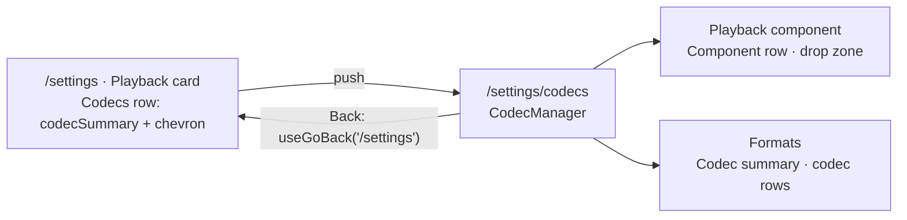

# 26 — Codecs page

> **Initiative:** `codecs-page`
> **PRD:** to follow this log
> **Plan:** to follow the PRD

This log is the `grill-me` session that settled the feature before the PRD was
written. It ran against the prototype and the code as they stood on
2026-10-06, the day after v0.2.0 shipped and step 10 was put first in the
build order. It is an immutable snapshot of that moment. The session ran
alone, and the maintainer approved every recommendation in advance. Their
brief was one sentence: _the list is too long — either a codec overview page
that handles the imports and shows the list, or the list in an accordion._

## Background

The Playback card on `/settings` opens with _Codecs_ and its lede. Under them
sits the whole **Codec report** (`15-settings-hub`, `16-component-upload`):
the **Codec summary**, one **Codec row** per **Format catalogue** entry the
report holds (up to nineteen with a full component), the **Component row**,
and the **Component drop zone**. Each row is 66px tall with an 8px gap, so a
machine with the **Default component** puts roughly 1,400px of codec rows
between the Playback heading and _Subtitles_. The Network, Storage and About
groups sit under it.

The prototype (`feat.CodecManager.dc.html`) drew six sample rows, so the
problem doesn't show there. It appeared once the report became true.

## Problem

Where does the Codec report live so that Settings reads as a hub again, and
the maintainer can still see every format and swap the component?

## Questions and Answers

### Scope

1. **Is this its own initiative?** ✅ **Yes.** It is `26-codecs-page.md`,
   initiative `codecs-page`, step 10 of the build order. It is renderer-only:
   no route on the server changes, and no type changes.

2. **Accordion or its own page?** ✅ **Its own page, a Settings sub-page.**
   ❌ **Accordion**, for four reasons:
   - Opening it makes the page exactly as long again, so the problem is
     deferred rather than solved.
   - The drop zone's _busy_ and _refused_ faces, and the echo that redraws
     the rows, would sit inside something the maintainer can collapse while
     they are happening.
   - Whether it stays open has no honest home. It would be a per-viewer
     convenience in `localStorage`, or a reset on every visit.
   - The prototype has no accordion molecule, and COMPONENT-SPEC already
     rejects one for seasons. It would be a new pattern added for one card.

   ❌ **The first N rows and a _Show all_** (`ExpandableText`'s shape) is the
   same deferral with a smaller first screen.

   For the page, Settings already has the pattern three times: the Library
   group's **Action rows** and the Network group's _Sync metadata & posters_
   row each lead off the hub to a screen of their own. The parents never
   visit the codecs, and the maintainer visits rarely, so one extra click
   costs nothing.

### The page

3. **Which route?** ✅ **`/settings/codecs`.** This is the first nested
   Settings route. The build order calls it "its own Settings sub-page", and
   it has exactly one way in. ❌ **`/codecs`**: `/import`, `/enrich` and
   `/add` are flat because each is a flow with more than one way in. The path
   is a literal in the route table and in the row, the way `/settings` and
   `/import` are. ❌ **A `codecsPath` util**: the path utils exist for routes
   that carry a parameter or have several callers.

4. **Page and layout?** ✅ **`pages/CodecsPage/`**
   (`CodecsPage.tsx`, `CodecsPage.test.tsx`) is `MaintainerLayout width={780}`
   around `CodecManager`. The 780 is the Settings hub's own column, so the
   sub-page reads as part of it. The page does composition only, following
   `ImportPage` and `EnrichmentPage`.

5. **Who draws the header?** ✅ **`CodecManager`**, on
   `features/maintainer.styles.ts`'s `HeaderRow`, `Heading` and lede.
   `ImportFlow` and `EnrichmentFlow` are the precedent: the organism owns its
   screen's header, the page owns none. The organism stays the one owner of
   `useCapabilities` on this screen.

6. **Back?** ✅ **`useGoBack('/settings')`**. The **Landing** is Settings, and
   **History step** is used when there is one. The Codecs row pushes, so
   **Leaving** is a step, and Settings' own Back still steps past it to where
   Settings came from.

7. **The header's words?** ✅ The Back pill, the heading **Codecs**, and the
   card's lede moved verbatim under it: _These decide which video files
   FamilyFlix can play. Common formats work out of the box — add a pack only
   if a movie won't play._ ❌ **No action in the header.** The drop zone is
   the action, and it has a group of its own (Q8).

8. **In what order?** ✅ **Two Settings groups on the page, drawn with
   Settings' own furniture** (`GroupHeading` and `Card` from
   `section.styles.ts`):
   1. **Playback component**: the **Component row** over the **Component drop
      zone**. These are the two inverses, together and first, because they
      are the only things on the screen that change anything. With no
      component at all, the group is the zone alone, and the row is absent as
      it is today.
   2. **Formats**: the **Codec summary** over the codec rows, in catalogue
      order, unchanged.

   ❌ **The prototype's order** (rows, then the component, then the zone)
   puts the one action under up to nineteen rows. That was the complaint,
   moved to a new screen. ❌ **Summary above both groups**: the summary
   counts formats and never the component (log 16), so it heads the group it
   counts.

9. **Split Formats into Video and Audio?** ❌ **No.** The catalogue already
   orders video before audio. Two subheadings and a rule add nothing the
   maintainer asked for. Out of scope.

10. **Do the molecules change?** ❌ **None of them.** `CodecRow`,
    `ComponentDropZone`, `zoneFace` and `codecView`, `codecSummary` included,
    are untouched. So are `useCapabilities` and its two writes, the ✕ rule,
    and the refusal drawn in the zone and nowhere else.

### The Settings card

11. **What replaces the report in the Playback card?** ✅ **A Codecs row**
    with the _Sync metadata & posters_ row's shape: a tile holding
    `MicrochipIcon` (the Codec row's own glyph), the label **Codecs**, one
    line under it, and a chevron. The whole row is one button that pushes
    `/settings/codecs`. Under it come the divider and _Subtitles_, as now.
    The card's _Codecs_ `ItemTitle` and `ItemDesc` go, and the lede moves to
    the page (Q7). ❌ **`ActionRow`**: its tile takes a glyph character in
    the accent tile, and this row's tile is the microchip.

12. **The row's line?** ✅ **The Codec summary**, `codecSummary(capabilities)`,
    e.g. _19 formats enabled · 13 from the playback component_. It stays
    blank until the read lands, following `syncLine`'s precedent.
    `PlaybackSection` calls `useCapabilities` and uses only the read.
    ❌ **The static lede**: it tells the maintainer nothing new. The summary
    answers _will our films play_ at a glance, and _no playback component_
    is the one state worth seeing without a click.

13. **Two reads of the same report?** ✅ **Accepted.** Settings reads on
    mount for the line, and the Codecs page reads on mount for the report.
    Back re-mounts Settings, which reads again, so an upload made on the page
    shows in the line on return. ❌ **A context or a cache**: two mounts of
    one cheap `GET` don't justify one.

14. **Two bespoke navigation rows in `features/settings/`?** ✅ **Build the
    Codecs row in `PlaybackSection.styles.ts` on the Sync row's geometry,
    then let the refactor step decide.** If the two match character for
    character, they graduate into one feature molecule there, following
    `maintainer.styles.ts`'s rule of written twice, extracted once. The build
    doesn't pre-empt it.

### Prototype, glossary, closing

15. **Does the prototype need amending first?** ✅ **Yes, by hand, as phase
    1's first commit**, following log 17's precedent. It is a rearrangement
    of pieces the prototype already draws, with no new visual, so there is no
    Claude Design round-trip. The amendments are listed under Design.

16. **Glossary?** ✅ Two new terms, **Codecs page** and **Codecs row**. The
    **Codec report** entry and its invariant are updated: it lives on the
    Codecs page, the Component row and drop zone come first, and the Formats
    group follows.

17. **What gets ticked, and when?** ✅ **Codecs page** ✅ in README and
    CLAUDE.md only after its refactor closes, following the standing rule.
    The build order's step 10 line is rewritten then, naming the sub-page and
    not the choice.

## Design

### Chosen and rejected

- ✅ A Settings sub-page at `/settings/codecs`, reached by a Codecs row in the
  Playback card
- ❌ An accordion in the Playback card: it defers the length, risks collapse
  mid-upload, has no home for its open state, and is a new pattern (Q2)
- ❌ First N rows plus _Show all_: the same deferral (Q2)
- ✅ Component first, Formats second (Q8). ❌ The prototype's rows-first order
- ❌ A Video/Audio split (Q9); a cache shared between the two reads (Q13)

### The units

```
src/pages/CodecsPage/                  ← new: MaintainerLayout width={780} around CodecManager
├── CodecsPage.tsx
└── CodecsPage.test.tsx
src/App/App.tsx                         ← + <Route path="/settings/codecs" element={<CodecsPage />} />
src/features/settings/
├── CodecManager/                       ← now the screen: header (Back, Codecs, lede) +
│                                          group "Playback component" (Component row, drop zone) +
│                                          group "Formats" (Codec summary, codec rows)
├── PlaybackSection/                    ← the Codecs row replaces the Codecs header + CodecManager;
│                                          calls useCapabilities for the line; pushes /settings/codecs
└── CodecRow/ ComponentDropZone/ zoneFace/ codecView/ useCapabilities/   ← unchanged
```

### The flow



### The page, top to bottom

```
[‹ Back]  Codecs
These decide which video files FamilyFlix can play. Common formats work out of
the box — add a pack only if a movie won't play.

PLAYBACK COMPONENT
┌───────────────────────────────────────────────────────────┐
│ [chip] Playback component  ffmpeg.exe ffprobe.exe  98 MB  Default │
│ ┌ ─ ─ ─ ─ ─ ─ ─ ─ Add a codec pack ─ ─ ─ ─ ─ ─ ─ ─ ┐      │
└───────────────────────────────────────────────────────────┘

FORMATS
┌───────────────────────────────────────────────────────────┐
│ 19 formats enabled · 13 from the playback component       │
│ [chip] H.264 / AVC   .mp4 .mov .m4v        —   Built-in    │
│ …                                                         │
└───────────────────────────────────────────────────────────┘
```

### Prototype amendments (phase 1's first commit)

1. **`page.SettingsPage.dc.html`, Playback card.** The _Codecs_ header and the
   `feat.CodecManager` mount are replaced by a Codecs row. It is a copy of the
   _Sync metadata & posters_ row's markup with the microchip glyph in its
   tile, bound to `settings.codecRow.summary` and `settings.codecRow.onOpen`.
   The divider and _Subtitles_ are unchanged.
2. **`feat.CodecManager.dc.html`.** It becomes the screen: the maintainer
   header (back pill, _Codecs_, the lede) over two Settings groups,
   _Playback component_ (the component row, then the dashed zone) and
   _Formats_ (`summaryLabel`, then the rows). Row and zone markup is
   unchanged. It gains `onBack`.
3. **`page.CodecsPage.dc.html`, new.** The maintainer sheet at 780 around
   `feat.CodecManager`.
4. **`FamilyFlix.dc.html`.** It gains `screen==='codecs'`, `goCodecs()` from
   the Settings row, and Back to `settings`. The codec model is handed to the
   new page and not to Settings, except the summary line.
5. **`COMPONENT-SPEC.md`.** The SettingsPage and CodecManager entries are
   updated, and a CodecsPage entry is added.

### Not built

An accordion, or any collapse; a Video/Audio split; search or filter over the
formats; a codec's own details page; a shared cache of the report; a header
action; **Move the media folder** (still the Roadmap's); any server change.

## Implementation Plan

1. **The page, end to end.** The prototype amendments first. Then
   `CodecsPage`, the `/settings/codecs` route, and `CodecManager` restructured
   into the header and the two groups, with Back. The page is reachable by
   URL, and the Settings card still draws the old report. This is the
   thinnest slice that proves the new screen.
2. **The Settings card.** The Codecs row replaces the Codecs header and the
   report in `PlaybackSection`. Its line is `codecSummary`, blank until the
   read lands, and it pushes `/settings/codecs`. Settings is short again.
3. **Docs and refactor.** The glossary terms (Q16), CLAUDE.md's folder tree
   (`pages/CodecsPage`, the `PlaybackSection` and `CodecManager` lines) and
   the Settings Hub section. Decide whether the Sync row and the Codecs row
   graduate into one molecule (Q14). Tick ✅ only after the refactor (Q17).

## Trade-offs

- **Easier:** Settings reads as a hub of five short groups. The component
  swap sits at the top of its own screen. The report keeps every molecule and
  every rule it had, and the change is mostly a move.
- **Harder:** one more route and one more click to see a format. The report
  is read twice on a round trip (Q13). This adds the first nested route under
  `/settings`, which a future sub-page will follow.
- **Ruled out:** an accordion and a _Show all_ (Q2), because each hides the
  length rather than placing it; a Video/Audio split (Q9), which nobody asked
  for; any server or type change, because the report was already true and
  only its position was wrong.
