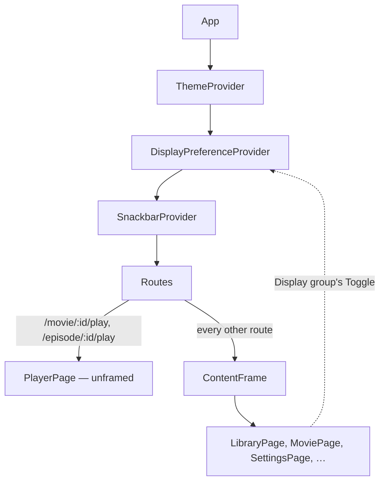

# 27 — Ultrawide margins

> **Initiative:** `ultrawide-margins`
> **PRD:** `docs/PRDs/27-ultrawide-margins.md` (#248)
> **Plan:** `docs/PRDs/27-ultrawide-margins-plan.md`

This log is the `grill-me` session that settled step 11 of the build order
before the PRD was written. It ran against the prototype and the code as they
stood on 2026-10-07, the day after the Codecs page's refactor closed. It is an
immutable snapshot of that moment. The session ran alone, and the maintainer
approved every recommendation in advance. Their brief: _an option/toggle in
the settings to add margins left/right for all of FF content. I have an
ultrawide monitor; the margins would help me keep the movie rows in view
without turning my head. On my laptop it is perfect without the margins._

## Background

Every screen fills the window edge to edge. `chrome.styles.ts`'s `Root` is
`height: 100vh` at full width, and `MainLayout` and `GenreLayout` extend it.
`MoviePage`, `SeriesPage` and `SeasonPage` own their scrollers. Their content
is already capped (`MovieDetail` at 1000px, `SeriesDetail` at 1100px,
`SeasonEpisodes` at 980px), but their backdrops and Back pills are not.
`MaintainerLayout` centres a 760/780px column. `LibraryGrid` deliberately has
no max-width (its styles say so), so on a 3440px monitor the home screen's
genre rows, header logo and gear span the full width.

The household keeps one preference today, `subtitle-language`, stored in the
`settings` table (`server/src/library/settings/`). It is read through
`GET /api/settings` → `Settings` and written by a Single-signal write
(`15-settings-hub`). The Settings hub has five groups: Library, Playback,
Network, Storage, About. `Toggle` exists as a primitive and is drawn today
only by the disabled _Turn on automatically_.

## Problem

How does the maintainer keep FamilyFlix in the middle of an ultrawide monitor
without changing anything on a laptop-width screen?

## Questions and Answers

### The shape

1. **A fixed margin, or a width cap?** ✅ **A cap.** With the preference on,
   everything sits in a centred **Content frame** no wider than the **Content
   measure**, and the leftover width becomes the margins. On any window
   narrower than the measure the cap does nothing, so the laptop looks the same
   whether the toggle is on or off. This also covers the case where one
   install is used on both screens (a laptop docked to the ultrawide): one
   stored value is right on both. ❌ **A fixed margin in px or %**: it narrows
   the laptop too, which is exactly what the brief said not to do.

2. **One toggle, or a choice of widths?** ✅ **One toggle, one measure.** The
   brief asks for a toggle. ❌ **A width picker (S/M/L, or a slider)**: a
   second control for a household with one ultrawide, plus a value to
   validate on the wire. If the measure is ever wrong, it is one token to
   change.

3. **What is the measure?** ✅ **1920px**, the width of a full-HD screen. On a
   3440px ultrawide that leaves about 760px each side. At laptop widths
   (1280–1920 CSS px after Windows scaling) it is a no-op. It is spelled once,
   as a token. ❌ **2560px** (the 16:9 share of a 1440px-tall screen): still
   74% of the ultrawide, so you still turn your head for the ends of a row.

4. **Is it a media query?** ✅ **No.** `max-width` plus `margin: 0 auto` is
   the whole rule, and below the measure it is already inert. ❌ A breakpoint
   in `breakpoints.ts`: the measure isn't a threshold the layout changes at,
   and a query would duplicate what the cap already does.

### Storage and the wire

5. **Where is it stored?** ✅ **The library database's `settings` table**,
   beside `subtitle-language`, as the build order says ("a household
   preference beside the subtitle language"). Key `ultrawide-margins`, stored
   as `'1'` / `'0'`. It travels with a database backup like the language does.
   ❌ **`localStorage`** (`volumePreference`'s home): it lives in one
   browser profile, gets lost with cleared site data, and Claude Code can't
   read it back. Because of Q1, a per-display value isn't needed.

6. **How is it read?** ✅ `Settings` gains `ultrawideMargins: boolean`, and
   `GET /api/settings` answers it with the default **off** applied when the
   row is absent. A fresh install has no margins.

7. **How is it written?** ✅ `POST /api/settings/ultrawide-margins
{ value: boolean }` → `{ value }`, a Single-signal write on the subtitle
   language's precedent. `400` for a missing or non-boolean value (a string
   `"true"` included). The repository gains `setUltrawideMargins(on: boolean)`.

### What the frame holds

8. **What gets framed: the body only, or the whole screen?** ✅ **The whole
   screen, header included.** If only the body were framed, the logo and the
   gear would stay at the window's far edges, which means turning your head
   again. The movie and series backdrops are clipped to the frame too: the
   art is `inset: 0` inside the page's own scroller, so it follows the frame
   with no change.

9. **Which screens?** ✅ **Every route except the player** (`/movie/:id/play`,
   `/episode/:id/play`). A 2.39:1 film nearly fills an ultrawide, which is the
   one thing the wide screen is good for, and fullscreen ignores the frame
   anyway. The maintainer screens (760/780 columns) are narrower than the
   measure, so the frame changes nothing visible on them. They are framed
   regardless, so the rule has one seam and no list of screens.

10. **What fills the margins?** ✅ **The page's `bg`, with no border and no
    letterbox shade**, so it reads as the content staying in the middle rather
    than a box drawn on the screen. The chrome's radial glow is computed
    against the frame, so it stays where it was relative to the content.
    ❌ **A black letterbox**: it makes the frame look like a window inside the
    window. Whether the glow's edge shows at the frame's top-right corner is
    for the prototype revision to judge.

11. **Scrollbars and the wheel?** ✅ Each screen's scroller is inside the
    frame, so its scrollbar sits at the frame's right edge. The wheel over an
    empty margin scrolls nothing, and that is accepted: the margins hold
    nothing, and the pointer lives over the content.

### The seam

12. **Where is the cap applied?** ✅ **Once, in `App/`**: a `ContentFrame`
    around the route table. The player's two routes render outside it. No
    layout, page or feature learns the preference exists. ❌ **Each layout
    reading it**: three layouts plus three page-owned scrollers is six call
    sites for one rule.

13. **How does a flip on Settings reach the frame?** ✅ **An app-level
    provider owns the preference**, `SnackbarProvider`'s precedent: it reads
    `fetchSettings` once on launch and exposes `{ ultrawideMargins,
setUltrawideMargins }`. The setter shows the change at once, posts, keeps
    the echo, and puts the previous value back on refusal without rejecting.
    The Display group's Toggle and the frame both read the same context, so
    the change applies everywhere at once, with no reload. `useSettings` keeps
    the subtitle language and nothing else.

14. **Before the read lands?** ✅ **Uncapped**, which is the default. On
    launch the frame may snap in a few milliseconds after the first paint, on
    a loopback read. That is accepted, because the library is loading its own
    data in the same moment. ❌ **A `localStorage` mirror to avoid the snap**:
    two stores for one value, and one of them can disagree.

15. **Motion?** ✅ **None.** The frame changes width instantly, both on
    launch and when toggled. No duration token is spent, and Reduced motion has
    nothing to cover.

### Floating surfaces

16. **The Snackbar stack?** ✅ **It moves to the frame's bottom-right corner**,
    or a notice raised on the ultrawide lands 760px from the content. Its
    `right` becomes `max(s5, (100vw − measure) / 2 + s5)` while the preference
    is on. This is `SnackbarProvider`'s own style, reading the same context.
    `bottom` is unchanged.

17. **Modal, the FAB, dropdown menus?** ✅ **Unchanged.** A Modal's scrim
    covers the whole window and its card is centred on the window, which is
    also the frame's centre. The FAB is `absolute` inside `MainLayout`'s
    `Root` (`position: relative`), so it already rides the frame's corner. The
    `FilterDropdown` menus open against their triggers.

### Settings

18. **Where does the toggle live?** ✅ **A new sixth Settings group,
    _Display_**, between Playback and Network, on a Section card holding one
    row. ❌ **Under Playback**: Playback is about the player, and the player is
    the one screen the frame never touches. ❌ **Under About**: About is the
    app's identity, not a preference.

19. **The row's copy?** ✅ Title **Ultrawide margins**. Line: _Keep everything
    in the middle of a very wide screen, so the rows fit without turning your
    head. Smaller screens look the same either way._ The `Toggle` primitive
    sits on the right, `label="Ultrawide margins"`. While the provider's read
    is `null` the Toggle is not drawn: the hub's _blank until it lands_ rule.

20. **The row's furniture?** ✅ It uses the same title/line/control row as
    _Preferred language_. `PlaybackSection.styles.ts`'s `Row`, `RowTitle` and
    `RowDesc` get a second caller, so they move up into `section.styles.ts`
    (the "written twice, extracted once" rule `NavigationRow` followed).

### Prototype, glossary, closing

21. **Prototype first?** ✅ **Yes**, per _The prototype is the spec_. Phase 1's
    first commit amends `page.SettingsPage.dc.html` with the Display group and
    its row (the Toggle on, with `settings.ultrawideMargins` as its state), and
    `COMPONENT-SPEC.md` with a note on the Content frame: what it caps, what
    it leaves out (the player) and where the Snackbar stack sits under it.
    There is no new `prim.*` or `mol.*`.

22. **Is it in the Export file?** ✅ **No.** The Export columns are a movie
    list, and a household preference is not a column.

23. **Glossary?** ✅ **Ultrawide margins** (the preference), **Content frame**
    (the capped, centred region every screen but the player sits in),
    **Content measure** (its 1920px cap) and **Display group** (the sixth
    Settings group).

## Design

### Chosen and rejected

- ✅ A width cap at the **Content measure** (1920px), centred, inert below it
- ❌ A fixed margin, which narrows the laptop too
- ❌ A width picker, which is a second control for one user
- ✅ Stored in `settings` beside `subtitle-language`, default off
- ❌ `localStorage`, which is per-profile, can be lost, and is invisible to the server
- ✅ One `ContentFrame` in `App/` driven by an app-level provider
- ❌ Each layout reading the preference: six call sites
- ✅ The player outside the frame
- ✅ A new **Display group** with one Toggle row

### The units

| Unit                                                 | Where                                                                 | What changes                                                                                                               |
| ---------------------------------------------------- | --------------------------------------------------------------------- | -------------------------------------------------------------------------------------------------------------------------- |
| `contentMeasure`                                     | `src/tokens/layout.ts` (new, flat)                                    | `export const layout = { contentMeasure: '1920px' } as const`, mounted on the theme                                        |
| `Settings`                                           | `src/types/settings.ts`                                               | `+ ultrawideMargins: boolean`; `DEFAULT_ULTRAWIDE_MARGINS = false`                                                         |
| settings repository                                  | `server/src/library/settings/`                                        | `ULTRAWIDE_MARGINS_KEY = 'ultrawide-margins'`; `settings()` reads it; `setUltrawideMargins(on: boolean)`                   |
| route                                                | `server/src/routes/`                                                  | `POST /api/settings/ultrawide-margins { value: boolean }` → `{ value }`; `400` otherwise                                   |
| `saveUltrawideMargins`                               | `src/App/…` or `src/features/settings/api/`                           | the wire call. One caller (the provider), so it stays beside it                                                            |
| `DisplayPreferenceProvider` / `useDisplayPreference` | `src/App/DisplayPreferenceProvider/`, `src/App/useDisplayPreference/` | the read on launch, the optimistic setter, `{ ultrawideMargins: boolean \| null, setUltrawideMargins(on): Promise<void> }` |
| `ContentFrame`                                       | `src/App/ContentFrame/`                                               | `max-width: contentMeasure; margin: 0 auto` when on, nothing when off or `null`                                            |
| Snackbar stack                                       | `src/App/SnackbarProvider/`                                           | `right` follows the frame's corner when on                                                                                 |
| `DisplaySection`                                     | `src/features/settings/DisplaySection/`                               | the Group heading, the Section card, the one Toggle row                                                                    |
| row furniture                                        | `src/features/settings/section.styles.ts`                             | `Row`, `RowTitle`, `RowDesc` move up from `PlaybackSection.styles.ts`                                                      |

### The tree



The route-table split is structural: the player's routes are elements without
the frame, and every other route's element is wrapped (a layout route with an
`<Outlet />` in it).

### Wire

```ts
// GET /api/settings
interface Settings {
  subtitleLanguage: string;
  ultrawideMargins: boolean; // false when the row is absent
}

// POST /api/settings/ultrawide-margins
// body: { value: boolean }  →  200 { value: boolean } | 400
```

### Not built

- A width picker or a custom measure
- Wheel scrolling forwarded from the margins
- A `localStorage` mirror for the first paint
- Any change to the player, fullscreen, or the Modal

## Implementation Plan

1. **The thinnest path end to end.** Prototype amendment (Display group,
   COMPONENT-SPEC's Content frame). Server: key, `settings()` field, setter,
   route, with suites. Client: the type, the token, the provider over
   `fetchSettings`, `ContentFrame` around every route but the player's, and
   `DisplaySection`'s Toggle writing through the provider. On the ultrawide,
   flipping the Toggle and going Back shows the library centred.
2. **The Snackbar stack at the frame's corner.** The provider's value read by
   the stack's style, and a test of the `right` offset both ways.
3. **The furniture extraction.** `Row` / `RowTitle` / `RowDesc` move into
   `section.styles.ts` with both callers on it. This happens in the refactor
   if phase 1 wrote it twice.

## Trade-offs

- **Easier:** one seam decides the whole app, so a new screen is framed by
  existing. The laptop needs no thought, because the cap is inert below 1920px.
  The value is in the database, so it survives a cleared browser profile and
  travels with a backup.
- **Harder:** the player is the one route outside the frame, so the route
  table now has a shape (framed / unframed) a new full-window screen has to
  choose between. The Snackbar stack's `right` now depends on a preference.
- **Accepted:** a possible few-millisecond snap on launch before the read
  lands. Wheel scrolling is dead over the empty margins. The glow's edge may
  show at the frame's top-right, which the prototype revision judges.
- **Ruled out:** a choice of widths, per-display storage, and framing the
  player. A tall-screen equivalent (a top/bottom cap) was never asked for.
