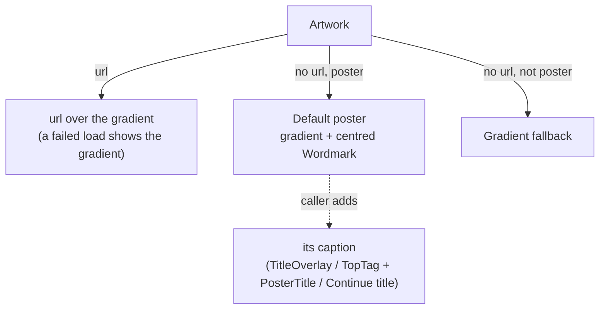

# 28 — Default poster

> **Initiative:** `default-poster`
> **PRD:** `docs/PRDs/28-default-poster.md` (#253)
> **Plan:** `docs/PRDs/28-default-poster-plan.md` (to be written)

This log is the `grill-me` session that settled step 12 of the build order
before the PRD was written. It ran against the prototype and the code as they
stood on 2026-10-07, the day the Ultrawide margins refactor closed. It is an
immutable snapshot of that moment. The session ran alone, and the maintainer
approved every recommendation in advance. Their brief: _default-poster. Also
add the movie poster to be shown in the "continue watching" card. Keep the
codebase consistent with our naming and code conventions, patterns and
architecture._

## Background

A title with no **Poster** draws the **Gradient fallback**: the `Artwork`
primitive paints a 155° gradient whose two stops `gradientFromId` hashes from
the id, so the colours are the same on every surface. Over that, the `PosterCard`
draws its `TitleOverlay`, and the movie and series detail pages draw a `TopTag`
(genre · year) and a `PosterTitle`. Nothing on it says FamilyFlix.

The build order calls this an "empty tile". Two things in the code explain why:

- `Artwork` paints a url **or** the gradient, never both. A `posterPath` whose
  file is gone or unreadable paints nothing, and the tile shows the page through
  it, which really is empty.
- `detailView` and `seriesView` set `hasArtwork` to poster **or** backdrop, and
  the poster frame's caption is drawn only when `hasArtwork` is false. A title
  with a backdrop and no poster gets a bare gradient poster with no caption.

The **Continue card** has drawn the gradient alone since log 03 Q6: the
prototype's `mol.ContinueCard` has no image slot, and log 03 flagged real
artwork there as a prototype amendment for later. The maintainer's installed
library shows the cost. _Solo_ is in progress and has a poster, and its Continue
card is a plain gradient while its **Poster card** further down shows the
poster. The **Episode continue card** (`episodeContinueView`) is the same, and it
hashes its gradient from the **episode** id, so it doesn't even match its own
series' colours. `EpisodeContinueEntry.series` carries `{ id, title }` and no
poster.

Where artwork is drawn today:

| Surface                      | Art                                     | No-art face                   |
| ---------------------------- | --------------------------------------- | ----------------------------- |
| `PosterCard` (movie, series) | poster                                  | gradient + `TitleOverlay`     |
| `MovieDetail` poster frame   | poster                                  | gradient + `TopTag` + title\* |
| `SeriesDetail` poster frame  | poster                                  | gradient + `TopTag` + title\* |
| detail backdrops (both)      | backdrop                                | gradient                      |
| `ContinueCard`               | none, ever                              | gradient                      |
| `SeasonCard`                 | none (series gradient + `S02`)          | —                             |
| `EpisodeRow`, `UpNextCard`   | **Still** / none                        | gradient                      |
| `Player` art layer           | the poster, as a backdrop under a scrim | gradient                      |
| `CandidatePicker`            | TMDB's poster                           | gradient                      |

\* only when there is no backdrop either.

`/api/images/` is spelled as a local `IMAGE_ROUTE` constant in six files:
`view`, `seriesCardView`, `detailView`, `seriesView`, `seasonView` and `Player`.
The **Wordmark** (_Family_ in text, _Flix_ in accent, serif 700) is spelled
twice, once in `MainLayout.styles.ts` and once in `AboutSection.styles.ts`. The
`Button` primitive imports the `PlayIcon` primitive, so one primitive composing
another already has a precedent.

## Problem

What does a title with no poster look like on every surface a poster appears,
so that it reads as a FamilyFlix default and not as a hole? And how does the
Continue card show the poster the family already recognises from the rows?

## Questions and Answers

### What the Default poster is

1. **One image for every title, or something per title?** ✅ **Per title: the
   Gradient fallback, branded.** The **Default poster** is the title's own
   gradient with the **Wordmark** set in it, plus the caption the surface
   already draws (the title, and on the detail page the genre · year tag).
   `gradientFromId` exists so that a grid "doesn't collapse onto one color"
   (its own doc comment). A row of eight hand-added films in one identical image
   would bring back exactly what it prevents. ❌ **A single static image** (an
   SVG in `brand/`, the same for every title): branded, but every no-poster tile
   in a row looks identical, and the title overlay is all that tells them apart.

2. **An image asset, or drawn in CSS?** ✅ **Drawn.** The gradient is already
   CSS, and the Wordmark is two spans in Source Serif 4, which is served
   offline. It stays sharp at any size, it follows the theme's colours, and
   there is no new file to ship, cache or route. ❌ A rendered PNG/SVG per
   size: one more asset to keep in step with the brand.

3. **The App mark, or the Wordmark?** ✅ **The Wordmark.** The glossary already
   rules that "the **App mark** never appears inside the app's own screens,
   where the **Wordmark** is drawn". The Default poster is inside the screens.

4. **Where in the tile?** ✅ **Centred, horizontally and vertically.** Every
   corner and edge is taken already: the heart is top-left and the watched badge
   top-right on the Poster card, the play badge top-right on the Continue card,
   the `TopTag` along the top of the detail poster, and the title along the
   bottom on all of them. The middle is the one place free on every surface.

5. **How big?** ✅ **It scales with the tile.** `Artwork` becomes a size
   container (`container-type: size`), and the Wordmark's font size is a
   fraction of the tile's shorter side (`cqmin`). That gives about 20px on a
   card, 25px on a Continue card and 35px on the detail poster from one rule,
   with no prop and no per-surface number. The exact fraction, the Wordmark's
   opacity and its shadow (the `TitleOverlay`'s `0 1px 8px rgba(0,0,0,.55)` is
   the starting point) are for the prototype revision to judge. ❌ A `size`
   prop from each caller: three call sites guessing at one proportion.

6. **Is it announced?** ✅ **No.** It is decoration, like the rest of
   `Artwork`. The Wordmark inside it is `aria-hidden`, so a screen reader in
   browse mode doesn't read "FamilyFlix" inside every no-poster card. The
   card's accessible name stays the title.

7. **Is the Default poster ever stored, exported or written back?** ✅ **No.**
   It is drawn, never a file. `poster_path` stays `NULL`, the title is still
   not **Full details**, _Only what's missing_ still syncs it, and no **Write
   target** ever writes it as a `poster.jpg`.

### Where it appears

8. **Which surfaces?** ✅ **Every surface that shows a title's poster**: the
   Poster card (movies and series), the movie and series detail poster frames,
   and the Continue card (Q13). ❌ **Not a backdrop.** The detail backdrops and
   the player's art layer stay the plain Gradient fallback under their scrims,
   because a Wordmark behind the page or behind the film is noise. ❌ **Not the
   Season card**: its tile has no poster slot in `mol.SeasonCard`, and its `S02`
   numeral is its identity. ❌ **Not `EpisodeRow` or `UpNextCard`**: those are
   frames of an episode (**Still**s), not posters. ❌ **Not `CandidatePicker`**:
   a TMDB result is not a title in the library, and branding it FamilyFlix
   would be a lie.

9. **A poster path whose file is missing or unreadable?** ✅ **The gradient
   shows through.** `Artwork` paints the url **over** the gradient as two
   background layers (`url(…), linear-gradient(…)`). An image that fails to
   load paints nothing, so the layer under it shows, with no JavaScript and no
   `onError`. This is the literal "empty tile" fixed for every `Artwork`
   caller, backdrops included. A broken link draws the gradient without the
   Wordmark or caption, because the view still holds a url. That is accepted:
   it is a repair case, and the maintainer fixes it with Edit.

10. **The detail page's caption: poster alone, or poster-or-backdrop?** ✅
    **Poster alone.** The `TopTag` and `PosterTitle` caption the Default
    poster, so they follow whether there is a poster, not whether there is any
    art. `MovieDetailModel.hasArtwork` and `SeriesPageModel.hasArtwork` become
    **`hasPoster`** (`posterPath !== null`), and `toTopTag` takes it. A title
    with a backdrop and no poster now gets a captioned Default poster in front
    of its backdrop instead of a bare gradient. "Artwork is not decorated"
    still holds: real poster art is never captioned.

### The seam

11. **How does a caller ask for the Default poster?** ✅ **One optional prop on
    the `Artwork` primitive, `poster`.** `poster` set and no url draws the
    Default poster, meaning the gradient plus the centred Wordmark. Unset, it
    is today's Gradient fallback. Poster surfaces pass it, and backdrops, the
    Season card and the thumbnails don't. The callers' captions stay theirs,
    because their sizes and positions differ per surface (21px on the card,
    27px on the detail page) and they already exist. ❌ **A `DefaultPoster`
    molecule** that the Poster card and Continue card compose: a molecule
    inside a molecule, plus a url-or-default branch repeated at every call
    site. ❌ **`kind: 'poster' | 'backdrop'`**: the Season card and the
    thumbnails are neither kind.

12. **Where does the Wordmark come from?** ✅ **A new `Wordmark` primitive**,
    `primitives/Wordmark/`, three files. _Family_ in `colors.text` and _Flix_
    in `colors.accent`, serif 700, its size taken from the parent's `font-size`
    so each caller sets it. `Artwork` imports it (the `Button` → `PlayIcon`
    precedent), and `MainLayout`'s `Logo` and `AboutSection`'s brand row adopt
    it. This is the third caller of a twice-written thing, so it is extracted
    once. The Logo's button and its 25px stay `MainLayout`'s.

### The Continue card

13. **What art does the Continue card draw?** ✅ **The title's poster, else
    the Default poster.** The family finds a film by the poster they see in the
    rows below, so the resume tile shows that same image. ❌ **The backdrop
    first** (log 03 Q6's suggestion, since a 16:10 tile fits landscape art
    better): only **Bulk import**'s `fanart.*` or a **Sync** fills a backdrop,
    so most titles have none, and a film still would be a second image for the
    same title. The brief asked for the poster.

14. **A 2:3 poster in a 16:10 tile: how is it cropped?** ✅ **`cover`,
    anchored a quarter of the way down** (`background-position: center 25%`).
    That shows the key art in a poster's upper half rather than the billing
    block at its foot, and the scrim already darkens the bottom for the title
    and Resume label. It is the Continue card's own `styled(Artwork)`, which is
    the extension point `Artwork`'s `className` documents. ❌ **A letterboxed
    poster** (`contain` over a blurred copy of itself): a new face the
    prototype doesn't draw, for one tile.

15. **What does an Episode continue card draw?** ✅ **Its series' poster, else
    the Default poster in the series' gradient.** The card stands for the show,
    so `episodeContinueView` hashes `gradientFromId(series.id)`, the same
    colours as the series' Poster card and Season cards, instead of the
    episode id. ❌ **The episode's Still**: most episodes have none until a
    **Sync**, and the show is what the family recognises.

16. **How does the series' poster reach the client?** ✅
    **`EpisodeContinueEntry.series` gains `posterPath`**, so it becomes
    `{ id; title; posterPath }`, and `browse.ts`'s continue query selects
    `s.poster_path` beside `series_title`. ❌ **Joining against the payload's
    `series` list on the client**: it works today only because both reads share
    one `where`, and it would couple the mapper to that coincidence.

17. **The view model?** ✅ **`ContinueCardMovie` gains `posterUrl: string |
null`**, the same name and type as `PosterCardMovie.posterUrl`. The
    `ContinueCard` passes it to `Artwork` with `poster`. Its doc comment ("the
    tile carries no artwork") and the card's "no url, ever" comment are
    retired.

### Consistency

18. **`/api/images/` is about to be spelled an eighth time.** ✅ **Extract
    `imageUrl`** to `src/utils/imageUrl/` (helper and test, re-exported from
    the utils barrel): `imageUrl(storedPath: string | null): string | null`,
    `null` in and `null` out. All six copies and the two continue mappers use
    it, which is the rule that put `moviePath` and `seriesPath` there. The
    route constant then lives in that one file.

19. **Glossary?** ✅ **Default poster** is new. **Gradient fallback** is
    updated to "the ground the Default poster is drawn on, and on its own the
    no-art face of every non-poster surface". **Continue card** is updated:
    poster, else Default poster, and "no image slot" is retracted. **Wordmark**
    is updated to name its primitive. **Poster URL** is updated: built by
    `imageUrl`.

### Prototype

20. **Prototype first?** ✅ **Yes**, per _The prototype is the spec_. Phase 1's
    first commit amends `mol.PosterCard.dc.html` with a no-poster state that
    shows the centred Wordmark, `mol.ContinueCard.dc.html` with a `posterUrl`
    in its `data-props` and the art layer at `center 25%`, `page.MoviePage` and
    `page.SeriesPage` with the Default poster in the poster frame, and
    `COMPONENT-SPEC.md` with a note on the Default poster: where it appears,
    where it doesn't (Q8), and the layered url. There is no new `prim.*` file
    for `Artwork` or `Wordmark`, because neither has a prototype file of its
    own today. The Wordmark's markup is the header's.

## Design

### Chosen and rejected

- ✅ The **Default poster**: the title's own gradient, the centred Wordmark, the surface's own caption
- ❌ One static image for every title, which collapses a row onto one picture
- ❌ The App mark inside a screen
- ✅ `Artwork` paints the url over the gradient, so a broken image shows the gradient
- ✅ The detail caption follows the poster alone (`hasPoster`)
- ✅ `Artwork`'s `poster` prop, with a `Wordmark` primitive extracted from its two copies
- ❌ A `DefaultPoster` molecule, or `kind: 'poster' | 'backdrop'`
- ✅ The Continue card draws the poster, else the Default poster, cropped `center 25%`
- ❌ The backdrop or the Still on the Continue card
- ✅ An Episode continue card draws its series' poster and its series' gradient
- ✅ `imageUrl` extracted to `utils/`

### The units

| Unit                          | Where                                                            | What changes                                                                                                                       |
| ----------------------------- | ---------------------------------------------------------------- | ---------------------------------------------------------------------------------------------------------------------------------- |
| `Wordmark`                    | `src/primitives/Wordmark/` (new)                                 | _Family_ + _Flix_, serif 700, sized by the parent's `font-size`; in the primitives barrel                                          |
| `Artwork`                     | `src/primitives/Artwork/`                                        | `+ poster?: boolean`; a size container; url layered over the gradient; the `aria-hidden` Wordmark centred when `poster` and no url |
| `MainLayout`, `AboutSection`  | `src/layouts/MainLayout/`, `src/features/settings/AboutSection/` | draw `Wordmark` instead of their own spans                                                                                         |
| `imageUrl`                    | `src/utils/imageUrl/` (new)                                      | `/api/images/` + a **Stored path**, or `null`; replaces six `IMAGE_ROUTE` copies                                                   |
| `PosterCard`                  | `src/components/PosterCard/`                                     | `<Artwork poster …>`                                                                                                               |
| `detailView`, `seriesView`    | `src/features/movie-detail/…`, `src/features/series/…`           | `hasArtwork` → `hasPoster`                                                                                                         |
| `MovieDetail`, `SeriesDetail` | the same features                                                | the poster frame's `Artwork` gets `poster`; the caption reads `hasPoster`                                                          |
| `ContinueCardMovie`           | `src/types/viewModels.ts`                                        | `+ posterUrl: string \| null`                                                                                                      |
| `EpisodeContinueEntry`        | `src/types/series.ts`                                            | `series: { id; title; posterPath: string \| null }`                                                                                |
| series browse                 | `server/src/library/series/browse/`                              | the continue query selects `s.poster_path`                                                                                         |
| `continueView`                | `src/features/library/home/continueView/`                        | `posterUrl: imageUrl(movie.posterPath)`                                                                                            |
| `episodeContinueView`         | `src/features/library/series/episodeContinueView/`               | `posterUrl: imageUrl(series.posterPath)`; gradient from `series.id`                                                                |
| `ContinueCard`                | `src/components/ContinueCard/`                                   | `<Art url={movie.posterUrl} poster …>`, `Art = styled(Artwork)` at `center 25%`                                                    |

### `Artwork`

```tsx
export interface ArtworkProps {
  url?: string | null;
  g1: string;
  g2: string;
  /** A poster surface: with no url, draw the **Default poster**. */
  poster?: boolean;
  className?: string;
}

// background, with a url:  center / cover no-repeat url(<url>),
//                          linear-gradient(155deg, g1 0%, g2 100%)
// background, without:     linear-gradient(155deg, g1 0%, g2 100%)
// children:                poster && !url → <Mark aria-hidden><Wordmark /></Mark>
```

### Which face



### Wire

```ts
// GET /api/series → SeriesHomePayload.continueWatching[]
interface EpisodeContinueEntry {
  series: { id: string; title: string; posterPath: string | null }; // + posterPath
  episode: Episode;
}
```

### Not built

- Art on the Season card, the episode thumbnails or the Up next card
- A Wordmark on a backdrop or behind the player
- An `` with `onError` (the layered background covers the broken link)
- A per-title generated image file, or any write of the Default poster
- The backdrop or the Still on the Continue card

## Implementation Plan

1. **The Default poster on the Poster card, end to end.** The prototype
   amendment (Q20). The `Wordmark` primitive with `MainLayout` and
   `AboutSection` adopting it. `Artwork`'s `poster` prop, its size container
   and the layered url. `PosterCard` passes `poster`. A hand-added film with no
   poster shows its gradient, the centred Wordmark and its title in every row
   and on the Series tab.
2. **The detail pages.** `hasArtwork` → `hasPoster` in `detailView` and
   `seriesView`. Both poster frames pass `poster`. A film with a backdrop and no
   poster shows a captioned Default poster.
3. **The poster on the Continue card.** `imageUrl` extracted, with all six
   copies replaced. `ContinueCardMovie.posterUrl`. `continueView`. The server's
   `EpisodeContinueEntry.series.posterPath` with its suite. `episodeContinueView`
   on the series' poster and gradient. The `ContinueCard`'s `Art` at
   `center 25%`. _Solo_'s Continue card shows _Solo_'s poster.

## Trade-offs

- **Easier:** every poster surface has one rule, and a new one asks `Artwork`
  for `poster` and gets the brand for free. A broken poster file can no longer
  leave a hole on any surface. The Continue card is now recognisable at a
  glance, and an Episode continue card matches its series' colours. The image
  route is spelled once.
- **Harder:** `Artwork` is now a size container, so the Wordmark's size depends
  on the box the caller gives it. A caller that gives it no height (impossible
  today, since every frame sets an aspect ratio) would get a zero-sized mark.
  jsdom does no layout, so the scaling is checked in the prototype and the
  running app, not in a suite.
- **Accepted:** a broken poster link draws the gradient without the Wordmark or
  caption. The poster's crop on the Continue card cuts the top and bottom of
  every poster, and `center 25%` will sometimes miss a face.
- **Ruled out:** a single uniform default image, branding backdrops or
  thumbnails, and the backdrop or Still as Continue art.
