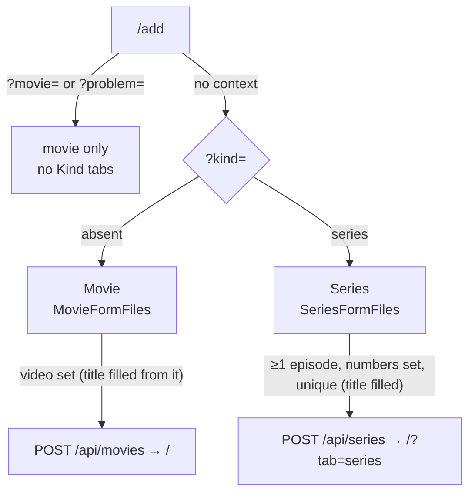

# 29 — Add a series

> **Initiative:** `add-series`
> **PRD:** `docs/PRDs/29-add-series.md` (to be written)
> **Plan:** `docs/PRDs/29-add-series-plan.md` (to be written)

This log is the `grill-me` session that settled step 13 of the build order
before the PRD was written. It ran against the prototype and the code as they
stood on 2026-10-07, the day the Default poster refactor closed (`e342873`). It
is an immutable snapshot of that moment. The session ran alone, and the
maintainer approved every recommendation in advance. Their brief: _add-series.
We want to be able to also add series (atm we can only add movies). Using the
toggle switch we have in the header would be good. Also, want to be able to
save a movie/series only if there is a path set (movie only allows after path
and poster is set, we need to change this)._

## Background

The **Movie form** (`/add`, log 11) is one screen with three jobs: the add, the
**Edit job** (`?movie=`) and the **Import context** (`?problem=`). It writes a
**Movie** whole: title, year, director, cast, description, genres, rating, and
three kinds of **File slot** (video, poster, any number of subtitles), sent as
one `busboy`-streamed multipart request.

A **Series** can enter the library only through **Bulk import** (log 22 Q1).
Log 22 Q2 ruled out "an Add / Edit / Delete for a series" because the prototype
drew no series form, and flagged series maintenance for a later prototype
amendment. Log 22 Q19 and Q21 (no `no-row` Problem for a show, Skip-only
`unplaced`) were both answered "there is no form that can take a series".

The storage half is already in place. `SeriesWrite` has `addSeries` and
`addEpisode` (`server/src/library/series/write/`). `Media` reserves a
**Series folder** in the **Movie folder** namespace and has `seasonFolder`
(`season-NN/`). `episodeTag` reads `S01E03` / `1x03` and the title after it.
`readSheet`'s private `cellYears` reads `2019`, `2019–2023` and `2021–`. And
`derivedRuntime` reads an episode's runtime off its bytes.

**"The toggle switch in the header"** is the **Library tabs**: the Movies /
Series pill track (`features/library/LibraryTabs/`), two `aria-pressed`
buttons writing `tab` as a `replace`. Its pill track (`Track` / `Tab`) is
drawn in `LibraryTabs.styles.ts` and nowhere else.

**The Save gate the brief describes is not the one in the code.** The form's
gate is _a title and a filled video slot_ (`useMovieForm`'s `canSave`), and the
poster has been "no part of the gate at all" since log 11. What the code does
let through is on the server. `POST /api/movies` accepts a body with no video
part and writes `videoPath: ''` (the route's own comment: "a row that says it
has no film behind it"). The resolve route already refuses that case with
`400 Body must carry a video`. So "only if there is a path" comes down to two
things. The **video** has to be the gate at both ends, and the title, which is
`NOT NULL`, should not ask the maintainer to type what the filename already
says.

## Problem

How does the maintainer add a series, with its seasons and episodes, from the
same screen that adds a movie, switched with the control the library header
already uses? And how does Save become "a video is set" for both kinds?

## Questions and Answers

### Scope

1. **Its own initiative?** ✅ **Yes**: `29-add-series.md`, initiative
   `add-series`, one PRD, its issues, build and refactor. It is step 13, and it
   carries the brief's gate change, because the gate is one rule over both
   kinds.

2. **Add only, or the whole maintenance set?** ✅ **Add only**: a new series
   with its episodes, in one save. ❌ **Edit a series, Delete a series, and
   adding episodes to a series already held.** Each needs an **Edit menu** on
   the series page, which the prototype doesn't draw, and the build order names
   only the add. A new season of a show already held joins the way log 22 Q20
   says: drop it in the folder and run **Bulk import** again. These are listed
   under Trade-offs as the next maintenance step.

3. **Does the Import context learn series?** ❌ **No.** `unplaced` stays
   Skip-only and a show with no row still imports under `titleGuess` (log 22
   Q19, Q21). A series form now exists, but resolving into it is a second job
   for it, which belongs to the series-edit step above.

### The screen

4. **A second screen, or the same one?** ✅ **The same screen, `/add`, one
   organism.** Log 11's principle is one URL, one component, and a heading and
   a button that say which job is in front of you. A series is a second
   **kind** of add, not a second screen. ❌ **`/add-series` with a `SeriesForm`
   organism**: two screens whose metadata fields are the same seven, drifting
   apart.

5. **How is the kind chosen?** ✅ **The Library tabs' pill track, as Kind
   tabs.** _Movie_ / _Series_ sit in the form's header row after the heading,
   pushed to the row's end. It is the control the brief names, so the
   maintainer meets the same switch for the same split in two places. ❌ **The
   `Toggle` primitive**: that is an on/off `role="switch"`, and a kind is a
   choice between two named things. ❌ **A radio pair or a dropdown**: not what
   the brief asked for.

6. **One molecule for both callers?** ✅ **Yes. The pill track is extracted to
   `components/PillTabs/`**: `{ label, options: { value, label }[], value,
onChange }`, two or more `aria-pressed` buttons in a labelled `group`, drawn
   exactly as `LibraryTabs.styles.ts` draws them today. `LibraryTabs` keeps its
   URL write and composes it. This is the second caller of a once-written
   thing, so it is extracted now (the `Wordmark` precedent, log 28 Q12). It
   stays presentational, with no URL and no query param.

7. **Where is the kind held?** ✅ **In the URL, `?kind=series`, written as a
   `replace` and omitted at `movie`**: the Library tabs' own rule. A deep link
   opens the right kind, a reload keeps it, and switching adds no **History
   step**, so Back still leaves the screen in one press. ❌ **Component state**:
   lost on reload, and not linkable from an entrance (Q22).

8. **When are the Kind tabs drawn?** ✅ **Only on the add with no context.**
   The **Edit job** (`?movie=`) and the **Import context** (`?problem=`) are
   movie-only and draw no tabs, and `?kind=` beside either is ignored.
   Otherwise an edit could switch to a kind that can't hold the record it
   loaded.

9. **What does a switch keep?** ✅ **Everything.** The shared fields (title,
   year, the director/creator line, cast, description, genres, rating, poster)
   are one record that both kinds draw. Each kind's own files (the movie's
   video and subtitles, the series' episode list) are held side by side, so
   switching back finds them as left. **Save sends only the active kind's.**
   ❌ **Clearing on switch**: one mis-click would wipe a dozen picked episodes.

10. **What changes with the kind?** ✅ **The words and the Files card, nothing
    else.**

    | Thing             | Movie                                                                                                       | Series                                                                                                                |
    | ----------------- | ----------------------------------------------------------------------------------------------------------- | --------------------------------------------------------------------------------------------------------------------- |
    | Heading           | Add a movie                                                                                                 | Add a series                                                                                                          |
    | Lede              | Pick the video, poster, and any subtitle files for this movie. To add many at once, use **Import library**. | Pick the poster and every episode's video and subtitles for this series. To add many at once, use **Import library**. |
    | Title placeholder | Movie title                                                                                                 | Series title                                                                                                          |
    | Year placeholder  | 2019                                                                                                        | 2019–2023                                                                                                             |
    | Director field    | Director / _Director name_                                                                                  | Created by / _Creator name_                                                                                           |
    | Description       | A short synopsis of the movie                                                                               | A short synopsis of the series                                                                                        |
    | Files card        | `MovieFormFiles` (video, poster, subtitles)                                                                 | `SeriesFormFiles` (poster, episodes)                                                                                  |
    | Save / in flight  | Add to library / Adding…                                                                                    | Add to library / Adding…                                                                                              |

    Genres draw on the same **Genre pool** (`series_genres` joins the same
    `genres` table). The rating uses the same **Rating picker**: the series
    page draws it read-only (log 22 Q8), and the form is the second place it is
    written, after the **Sheet**.

11. **The series' year?** ✅ **One field that reads the Sheet's three shapes**:
    `2019` (a finished one-year run), `2019–2023`, and `2021–` (still running).
    The hyphen is also accepted, and the field holds digits and one dash, at
    most nine characters. The server reads it through the same rule as the
    Sheet. `readSheet`'s private `cellYears` is extracted to
    `server/src/library/series/yearSpan/` (pure, with its suite) and both
    callers read it. An unreadable year is `null`, which is the Sheet's answer
    too, never a refusal. ❌ **Two fields, First year and Last year**: a second
    vocabulary for one thing the Sheet already spells.

### Episodes

12. **How do episodes get onto the form?** ✅ **One multiple-file picker,
    _＋ Add episode files_**, that turns each picked video into an **Episode file
    row**. A season of twelve files is one dialog, not twelve. It can be pressed
    again to add more, from another season folder for example. ❌ **A Season
    card per season, each with its own picker**: a structure the data model
    doesn't have, since a season is a number (log 22 Q3).

13. **Where do the season and episode numbers come from?** ✅ **The filename's
    Episode tag, prefilled and editable.** `S01E03 - The Long Fare.mkv` lands
    as season 1, episode 3, title _The Long Fare_. A file with no tag lands in
    season 1 as the next free episode number. Both numbers are small text
    fields that hold digits only (season at most 2, episode at most 3). The
    prefill is a convenience: the save sends the numbers on screen, and the
    server stores them as sent.

14. **Who reads the tag on the client?** ✅ **A feature-local mirror,
    `features/movie-form/readEpisodeTag/`**: the server `episodeTag`'s cases
    (`S01E03`, `s1e3`, `1x03`, a multi-episode file's first number, the title
    after the tag with dots, underscores and quality tags cleaned). It is pure,
    with its suite. A **guard test** in the spec project runs both readers over
    one shared table of filenames, so the two cannot drift apart unnoticed.
    ❌ **Moving `episodeTag` into `src/`** for the server to import: the server
    imports only `src/types/` today, and a pure function crossing the build
    targets is a structural change bigger than this feature. ❌ **Asking the
    server** (an endpoint per pick): a network round trip for a string
    function. The client already keeps its own `formatEpisodeTag` beside the
    server's `spellEpisodeTag`, so two spellings guarded by one table follow
    precedent.

15. **What is an Episode file row?** ✅ **A molecule, `components/EpisodeFileRow/`**,
    drawn in the **File field**'s filled-row furniture
    (`components/fileRow.styles.ts`). From left to right: the `S` and `E`
    number fields, the episode title field (placeholder _Untitled episode_,
    `EpisodeRow`'s own default), and the ✕ (`RemoveButton`). Under them is the
    filename in mono. Under that are the row's **Subtitle rows** and its own
    _＋ Add subtitle_ **File picker** (Q17). It is presentational, like
    `SubtitleRow`. It knows how an episode row looks, and `SeriesFormFiles`
    knows what an episode is.

16. **In what order are the rows?** ✅ **Each pick's files are inserted in tag
    order, and never re-sorted while the maintainer types.** Re-sorting on a
    number edit would move the row out from under the cursor. The order on
    screen is not stored: the numbers decide.

17. **An episode's subtitles?** ✅ **Per row, explicitly.** Each Episode file row has
    its own _＋ Add subtitle_ picker and **Subtitle rows**, each in English by
    default and changeable on the row: the movie's exact rule (log 11, story
    27). ❌ **One bulk subtitle picker matched by stem** (the importer's rule,
    log 22 Q17): a file that matches no episode would need an error surface the
    prototype doesn't draw, and a silent drop would lose a track.

18. **What does the series' Files card hold?** ✅ **`SeriesFormFiles`**
    (feature sibling, `MovieFormFiles`' shape): the _Files_ caption, the
    **Poster** **File field**, an _Episodes_ label beside the Episode file rows, and
    _＋ Add episode files_ under them. There is no backdrop, as the movie has
    none.

### The Save gate

19. **What is the gate now?** ✅ **A video, for both kinds.**
    - **Movie:** a filled video slot. The title is still required, because it
      is `NOT NULL`, but **picking a video into an empty title fills it** with
      the filename's title guess (`The.Long.Fare.2019.1080p.mkv` → _The Long
      Fare_). So in practice the video is all the maintainer must supply. A
      title already typed is never overwritten, and clearing the title closes
      the gate again. The poster is not part of the gate, as it never has been.
    - **Series:** at least one Episode file row, every row with both numbers filled
      (season ≥ 1, since specials are out per log 22 Q2), no two rows with the
      same season and episode (the schema's `UNIQUE` would refuse the write),
      and a title. **The first episode files picked into an empty title fill
      it** with the guess from the text before the tag
      (`Harbor.and.Vine.S01E01.mkv` → _Harbor and Vine_). Each Episode file row
      exists only because a video was picked, so "every episode has a path"
      holds by construction.

    The gate stays a disabled button, never a message (log 11). A duplicate
    number is drawn as nothing more than a closed gate, because the prototype
    designs no error face. ❌ **Dropping the title from the gate** (a server
    fallback to the filename): a hidden rule at the wire, where the form can
    show the guess and let it be corrected.

20. **The title guess on the client?** ✅ **`features/movie-form/titleFromFilename/`**:
    the extension dropped, dots and underscores turned into spaces, and
    everything from the first year or quality tag on dropped. It is pure, with
    its suite, the client's prefill counterpart of the importer's `titleGuess`.
    Because it is only a prefill the maintainer sees and can correct, it gets
    no drift guard.

21. **Does the server enforce the gate?** ✅ **Yes, at both movie routes and
    the new one.** `POST /api/movies` refuses a body with no video part with
    `400 Body must carry a video` (the resolve route's own sentence), after the
    title check and before any write, and rolls back what landed. `PATCH
/api/movies/:id` refuses a body whose video is neither a part nor a
    non-empty `videoPath` with the same sentence. `POST /api/series` refuses a
    body with no episode. The form's gate makes all three unreachable from the
    app, like the title check. A route that writes a row with no film behind it
    is the bug the brief describes.

### The wire and the write

22. **What are the entrances?** ✅ **They stay where they are and are renamed
    _Add a title_.** The Settings header's ＋ and the Library group's row both
    open `/add` (movie kind). The row's description becomes _A movie or a
    series, with its files._ "Title" is the app's word for either kind (_N
    titles_, _titles have full details_). ❌ **A second row or button for
    series**: two doors to one screen that has its own switch.

23. **One request, or one per episode?** ✅ **One multipart request,
    `POST /api/series`, atomic.** The client sends the series fields first
    (`title`, `year`, `creator`, `cast`×n, `description`, `genre`×n,
    `rating`), then the `poster` part, then for each Episode file row: an `episode`
    field holding `{ season, number, title, subtitleLanguages }` as JSON,
    followed by its `episodeVideo` part and its `episodeSubtitle` parts.
    `busboy` reads in order, so the k-th `episodeVideo` belongs to the k-th
    `episode` field (the `subtitleRows` pairing-by-order precedent). The series
    title and year arrive before any bytes, so the **Series folder** can be
    reserved the moment the first part needs it (the movie's `ResolveFolder`).
    Each video lands in its `seasonFolder`. Any refusal or failure rolls back
    the whole Series folder, and **no row is written until every byte has
    landed**. ❌ **A series request then one request per episode**: a failure
    halfway leaves a half-added series and no Delete to remove it.

24. **Where is the body read?** ✅ **`server/src/routes/seriesFormBody/`**,
    `movieFormBody`'s precedent: `collectEpisodeUploads` (the file half, with
    the `fileKinds` checks on poster, video and subtitles) and
    `readSeriesFields` (the field half, refusals as sentences). It refuses a
    missing title, an `episode` field that isn't
    `{ season ≥ 1, number ≥ 1 }`, a duplicate `S01E03` (`400 Duplicate
episode: S01E03`, spelled by `spellEpisodeTag`), an `episode` with no
    video after it, a stray `episodeVideo`, and an unknown genre.

25. **Which write?** ✅ **`SeriesWrite.addSeries(input, episodes?)`**: the
    series, its genres, its episodes and their subtitle tracks in one
    transaction, so a refused insert commits nothing. The importer keeps
    calling `addSeries(input)` then `addEpisode` per new episode (a re-run adds
    to a held series, log 22 Q20). Each episode's runtime is the **Derived
    runtime** after its copy, as on import. `201` answers the assembled
    `Series`.

26. **Where does a finished add land?** ✅ **The kind's Fresh home**: a movie
    on `/`, a series on `/?tab=series`, both a push and both unfiltered. The
    Series tab is where the new show is visible. A refused save stays put with
    everything still in it (log 11).

27. **Progress?** ✅ **The movie form's label, _Adding…_, and nothing new.** A
    series is several large files in one request, and CLAUDE.md asks for
    "a visible progress indicator, not a spinner" on both large-file
    operations. The movie form doesn't have one either. A shared upload
    progress bar is a debt both kinds carry, logged under Trade-offs rather
    than built for one kind.

### Structure and names

28. **How is the code split?** ✅ - `MovieForm` stays the one organism. It draws the Kind tabs, the shared
    fields with the kind's words (Q10), and one of the two Files cards. - `useMovieForm` gains `kind` and `setKind` (the URL write), the
    title-prefill rule (Q19), and the series save. The doc comment's own
    rule is that the hook earns a test file if a branch appears that no press
    can reach. The series branch is reachable, so `MovieForm.test.tsx` keeps
    covering it. - **`useEpisodeList`** (new, with its own suite): the keyed Episode file rows,
    `addEpisodeFiles(files)`, `setSeason`, `setNumber`, `setEpisodeTitle`,
    `removeEpisode`, the per-row subtitle trio, and `episodesComplete` (the
    series half of the gate). It is a hook over a list with its own rules,
    not a `MovieForm` detail. - `features/movie-form/api/` gains `createSeries`. - `src/types/` gains `EpisodeFormRow { key; file: MovieFormFile; season:
string; number: string; title: string; subtitles: MovieFormSubtitle[] }`
    and `FormKind = 'movie' | 'series'`.

29. **Rename the Movie form?** ❌ **No.** The feature, the organism, the hook
    and the page (`AddMoviePage`) keep their names. A rename would touch more
    than a hundred tests for no behaviour, and "Movie form" is the glossary's
    word for this screen. The glossary entry is updated: the **Movie form**
    adds a movie or a series, and edits and resolves a movie.

### Prototype

30. **Prototype first?** ✅ **Yes**, per _The prototype is the spec_. Before
    phase 2 is built, `feat.MovieForm.dc.html` is amended with the Kind tabs in
    the header row, the series' words (Q10), and the series' Files card. A new
    `mol.EpisodeFileRow.dc.html` is added with its `data-props`. A new
    `mol.PillTabs.dc.html` is added, extracted from `page.LibraryPage`'s track,
    which then imports it. `COMPONENT-SPEC.md` gets the two new molecules and
    the gate rule. `feat.SettingsHub` gets the entrances' new copy (Q22).

## Design

### Chosen and rejected

- ✅ One screen, `/add`, a second **kind**, chosen with **Kind tabs** (the
  Library tabs' pill track), held in `?kind=series`
- ❌ A second screen or organism; the `Toggle` primitive; component state for the kind
- ✅ `PillTabs` extracted to `components/`, with `LibraryTabs` its first caller
- ✅ Shared fields kept across a switch, each kind's files held side by side, only the active kind saved
- ✅ Episode file rows from one multi-file picker, numbers prefilled from the **Episode tag**, editable
- ❌ Season cards; a bulk subtitle picker matched by stem
- ✅ **Save gate** = a video for both kinds, with the title filled from the filename
- ✅ The server refuses a body with no video on both movie routes and the series route
- ✅ `POST /api/series`: one atomic multipart request, rolled back whole
- ❌ One request per episode
- ❌ Edit / Delete a series, adding episodes to a held series, series in the Import context

### The units

| Unit                               | Where                                              | What changes                                                                      |
| ---------------------------------- | -------------------------------------------------- | --------------------------------------------------------------------------------- |
| `PillTabs`                         | `src/components/PillTabs/` (new)                   | the pill track, presentational: `{ label, options, value, onChange }`             |
| `LibraryTabs`                      | `src/features/library/LibraryTabs/`                | composes `PillTabs`; its styles file goes                                         |
| `EpisodeFileRow`                   | `src/components/EpisodeFileRow/` (new)             | S / E fields, title field, ✕, filename in mono, a children slot for its subtitles |
| `MovieForm`                        | `src/features/movie-form/MovieForm/`               | Kind tabs in the header row; the kind's words; one of two Files cards             |
| `SeriesFormFiles`                  | `src/features/movie-form/SeriesFormFiles/` (new)   | poster, Episode file rows, _＋ Add episode files_                                 |
| `useMovieForm`                     | `src/features/movie-form/useMovieForm/`            | `kind` / `setKind` (URL), title prefill, the series save and landing              |
| `useEpisodeList`                   | `src/features/movie-form/useEpisodeList/` (new)    | the rows, their edits, `episodesComplete`                                         |
| `readEpisodeTag`                   | `src/features/movie-form/readEpisodeTag/` (new)    | the client mirror of `episodeTag`, with the drift guard over one table            |
| `titleFromFilename`                | `src/features/movie-form/titleFromFilename/` (new) | the prefill title                                                                 |
| `api.createSeries`                 | `src/features/movie-form/api/`                     | the multipart body in Q23's order                                                 |
| types                              | `src/types/`                                       | `FormKind`, `EpisodeFormRow`                                                      |
| `yearSpan`                         | `server/src/library/series/yearSpan/` (new)        | `cellYears` extracted: text → `{ year, endYear }`                                 |
| `readSheet`                        | `server/src/import-export/readSheet/`              | reads years through `yearSpan`                                                    |
| `seriesFormBody`                   | `server/src/routes/seriesFormBody/` (new)          | `collectEpisodeUploads`, `readSeriesFields`                                       |
| `SeriesWrite.addSeries`            | `server/src/library/series/write/`                 | `+ episodes?: NewEpisode[]`, one transaction                                      |
| routes                             | `server/src/routes/index.ts`                       | `POST /api/series`; `POST`/`PATCH /api/movies` refuse a body with no video        |
| `SettingsHeader`, `LibrarySection` | `src/features/settings/…`                          | _Add a title_; the row's line _A movie or a series, with its files._              |

### The form



### Wire

```ts
// POST /api/series — multipart/form-data, parts in this order:
//   title, year ("2019" | "2019–2023" | "2021–"), creator?, cast×n,
//   description?, genre×n, rating?
//   poster?                               (file)
//   for each episode:
//     episode = JSON { season: number; number: number; title: string;
//                      subtitleLanguages: string[] }
//     episodeVideo                         (file, exactly one)
//     episodeSubtitle × subtitleLanguages.length (files)
// → 201 Series
// → 400 a sentence (no title, no episode, bad/duplicate numbers, a file
//       fileKinds refuses, an episode with no video, unknown genre)

interface EpisodeFormRow {
  key: string;
  file: MovieFormFile;
  season: string; // digits, as typed
  number: string; // digits, as typed
  title: string;
  subtitles: MovieFormSubtitle[];
}
type FormKind = 'movie' | 'series';
```

### Not built

- Edit, Delete, or _Add episodes_ for a series already held
- Series in the **Import context** (`unplaced` stays Skip-only)
- A backdrop slot, a still slot, an air-date field
- A bulk subtitle picker matched by stem
- An upload progress bar (debt shared with the movie kind)
- A duplicate-series check (the movie form has no duplicate-movie check either)

## Implementation Plan

1. **The video gate, for movies.** `titleFromFilename`, and picking a video
   into an empty title fills it. `POST /api/movies` and `PATCH /api/movies/:id`
   refuse a body with no video, with their suites. No surface changes. A
   maintainer picks only a video and Save opens with the title filled in.
2. **A series with its episodes, end to end.** The prototype amendment (Q30).
   `PillTabs` extracted, with `LibraryTabs` adopting it. The Kind tabs and
   `?kind=series`. The series' words. `SeriesFormFiles`, `EpisodeFileRow`,
   `useEpisodeList`, and `readEpisodeTag` with its drift guard. `yearSpan`
   extracted. `seriesFormBody`, `addSeries(input, episodes)`, and
   `POST /api/series` with rollback. `createSeries` and the landing on the
   Series tab. The entrances renamed _Add a title_. A maintainer picks a
   season's twelve files, saves, and finds the show on the Series tab with its
   season and episodes in order.
3. **Episode subtitles.** Each Episode file row's own _＋ Add subtitle_ and
   **Subtitle rows**, sent as `episodeSubtitle` parts and stored in
   `episode_subtitles`. An episode added with an `.srt` plays with it.

## Trade-offs

- **Easier:** a series no longer needs a folder tree and a spreadsheet to enter
  the library. The form's one switch matches the library's, so the maintainer
  has one picture of the Movies / Series split. Every save in the app, movie or
  series, form or import, now refuses a title with no film behind it. Typing a
  title is optional in practice.
- **Harder:** `useMovieForm` grows a second save and a URL-held kind, and the
  screen's name now undersells it. The client and server each read the
  Episode tag, held together by a guard over one table rather than by one
  function. A large series is one long request with nothing on screen but
  _Adding…_.
- **Accepted:** a series added twice is two series, and adding a new season to
  a held show still goes through Bulk import. A cancelled or failed series save
  loses nothing on screen but re-sends every byte on the retry.
- **Ruled out:** a second screen, one request per episode, stem-matched bulk
  subtitles, and editing or deleting series in this step. The series-edit step
  (an **Edit menu** on the series page, edit and delete, add episodes, and
  series in the Import context) is the follow-up the brief did not ask for.
