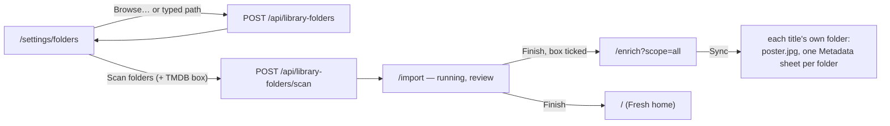
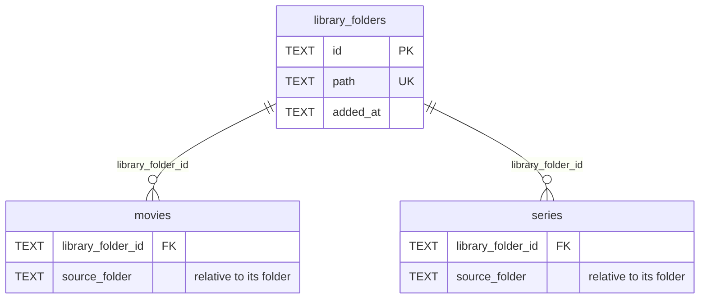

# 30 — Library folders

> **Initiative:** `library-folders`
> **PRD:** `docs/PRDs/30-library-folders.md` (to be written)
> **Plan:** `docs/PRDs/30-library-folders-plan.md` (to be written)

This log is the `grill-me` session that settled step 14 of the build order
before the PRD was written. It ran against the prototype and the code as they
stood on 2026-10-08, the day the Add a series refactor closed (`d1f215f`). It
is an immutable snapshot of that moment. The session ran alone, and the
maintainer approved every recommendation in advance. Their brief:
_library-folders. Keep in mind, we want to be able to add multiple folders
which contain movies/series. The idea is, I link a few folders and can update
all the information with our TMDB sync. Make sure our codebase stays
consistent with our naming and code conventions/patterns/architecture._

## Background

CLAUDE.md's step 14: _one or more top folders that hold movies, added at once.
It needs a real path, so it lives where folder-path autofill already does (bulk
import's scanner, Electron's native dialog over the preload bridge), not in the
Movie form's file pickers._ No prototype draws it yet.

What exists:

- **Bulk import** (log 13) takes **one Sheet and one Library root**, both
  typed. A film folder no **Sheet row** names becomes a `no-row` **Problem**; a
  show no row names imports anyway under `titleGuess` (log 22 Q19). So without
  a spreadsheet, a whole collection of films is a Review list of `no-row`
  Problems, one Resolve each.
- **The app remembers one Library root** (log 23 Q33): the importer writes
  `settings.library-root` on Start, and `movies.source_folder` /
  `series.source_folder` hold each title's **Source folder** relative to it. A
  second import over a different root overwrites the setting, and every
  `source_folder` recorded against the first root now resolves against the
  wrong folder.
- **A Sync** (log 23) reads `libraryRoot()` for both **Write targets**: one
  **Metadata sheet** at the root, a `poster.jpg` per Source folder, and the
  review rows' mono path line `root + source_folder`. `EnrichmentSummary`
  carries `libraryRoot: string | null`, and the setup draws the two write rows
  only when it is set (log 23 Q37).
- **The preload exists** (log 17): `window.familyflix.updates`, its channels
  typed once in `src/types/update.ts`, read in the renderer through one
  `updateBridge()` that answers `null` in a browser. Log 24 Q3 ruled that the
  prototype draws no native picker, so the shell adds none, and step 14 is the
  first feature that asks for one.
- **Media storage copies** (CLAUDE.md _Desktop Build_): every file the app plays
  sits in the **Managed media directory**; the source folder stops being the
  source of truth after import.

## Problem

How does the maintainer keep a list of the family's top folders, several of
them, each holding movies and series in the shapes Bulk import already reads,
and bring everything in them into the library without a spreadsheet, so that a
**Sync** can fill in the rest? And what replaces the one remembered Library
root that the Sync's Write targets are built on?

## Questions and Answers

### Scope

1. **Its own initiative?** ✅ **Yes**: `30-library-folders.md`, initiative
   `library-folders`, one PRD, its issues, build and refactor. It is step 14.

2. **Link in place, or copy in?** ✅ **Copy in, as Bulk import does.** A
   **Library folder** is a remembered _source_: a scan copies each new title's
   files into the Managed media directory, and the app owns that copy.
   ❌ **Playing files where they lie.** That is a storage model of its own
   (the Roadmap's **Move the media folder** is flagged the same way): every
   **Stored path** is relative to the media root and resolved by one
   `mediaFilePath` check; `/api/images` is `express.static(mediaPath)`; a
   **Delete** removes the **Movie folder**; a Sync stores `poster.jpg` beside a
   Stored path. Referencing in place would change all four, and make a
   Delete or a Sync a write into the family's own folders. The word "link" in
   the brief is honoured at the level the maintainer sees it: a folder is
   linked once, stays listed, and is scanned again for whatever is new. The
   cost — the collection's bytes twice on disk — is recorded under Trade-offs
   and becomes the argument for the Roadmap item, not for this step.

3. **What is not built?** ❌ Watching folders for changes, or scanning on
   launch (a scan is always the maintainer's press); a scan of one folder
   alone (Q16); loose video files at a folder's top level (the walk's rule,
   Q15); a sheet read from inside a Library folder; a Browse button on Import
   setup's own fields; per-folder TMDB settings.

### The folder list

4. **Where are the folders kept?** ✅ **A table, migration 6:**

   ```sql
   CREATE TABLE library_folders (
     id TEXT PRIMARY KEY,           -- a UUID, as every other id
     path TEXT NOT NULL UNIQUE,     -- absolute, resolved, the maintainer's own
     added_at TEXT NOT NULL         -- ISO
   );
   ALTER TABLE movies ADD COLUMN library_folder_id TEXT
     REFERENCES library_folders(id) ON DELETE SET NULL;
   ALTER TABLE series ADD COLUMN library_folder_id TEXT
     REFERENCES library_folders(id) ON DELETE SET NULL;
   ```

   `source_folder` stays, now **relative to the title's own Library folder**.
   ❌ **A JSON list under one `settings` key**: a title has to point at its
   folder, and a key can't be joined.

5. **What happens to `settings.library-root`?** ✅ **Migration 6 carries it
   over and drops it.** When the key is set, the migration inserts it as the
   first Library folder and sets `library_folder_id` on every movie and series
   whose `source_folder` is not null; then it deletes the key. The settings
   slice loses `libraryRoot` / `setLibraryRoot`. One place remembers folders.

6. **Absolute paths in the database?** ✅ **Only in `library_folders.path`.**
   It is the maintainer's own choice of folder, like `library-root` was and
   like `FAMILYFLIX_MEDIA_PATH` is. Every title row stays relative: a
   folder id plus `source_folder`. CLAUDE.md's rule ("never absolute paths
   from the source machine") is about what a title stores, and still holds.

7. **Can two folders overlap?** ❌ **No.** A path equal to, inside, or
   containing a listed folder is refused: the walk would find the same Source
   folder twice and record it against two folders. Compared on resolved paths,
   case-insensitively on Windows, by a pure unit,
   `server/src/library/folders/folderOverlap/` →
   `'same' | 'inside' | 'contains' | null`.

8. **What does a folder have to be?** ✅ **An absolute path to an existing,
   readable directory**, checked at add time. The importer's private
   `checkRoot` is extracted to `server/src/media/readableFolder/` (only
   `media/` reads the disk for a domain) and both the add and the spreadsheet
   import read it. A folder that later disappears (an unplugged drive) stays
   listed, drawn as unreachable (Q11), and is skipped by a scan with a warning
   line (Q17).

9. **Removing a folder?** ✅ **The folder goes, its titles stay.** The app owns
   its copies, so a title in the library does not depend on the folder it came
   from. `removeLibraryFolder(id)` sets `library_folder_id` and
   `source_folder` to null on its titles and deletes the row, in one
   transaction. Those titles lose only their Write targets. No confirm dialog:
   nothing is lost, and adding the folder back and scanning restores the link
   (Q14's second rule). ❌ **Removing the titles too**: that is a Delete, and
   a Delete is per title, behind the Danger row.

### Routes

10. **The wire?** ✅

    | Route                                       | Answer                                                                                                       |
    | ------------------------------------------- | ------------------------------------------------------------------------------------------------------------ |
    | `GET /api/library-folders`                  | `LibraryFolder[]`, in the order added                                                                        |
    | `POST /api/library-folders { path }`        | `201 LibraryFolder` · `400` empty, not absolute, not a readable directory · `409` same, inside or containing |
    | `DELETE /api/library-folders/:id`           | `204` · `404`                                                                                                |
    | `POST /api/library-folders/scan { enrich }` | `201 ImportRun` · `400` no folders · `409` a **Current run** exists                                          |

    Every refusal is a sentence, as every route's is: _That folder is already
    in your library folders._, _That folder is inside E:\Movies, which is
    already a library folder._, _That folder holds E:\Movies\Kids, which is
    already a library folder._, _No folder at that path._ One path per add:
    a dialog's several picks are posted one after the other (Q21), so each
    refusal names its own path. ❌ **`{ paths: [] }` in one request**: one
    refusal would have to say which of five it was about.

11. **What is a `LibraryFolder`?** ✅ In `src/types/libraryFolders.ts`, both
    build targets:

    ```ts
    export interface LibraryFolder {
      id: string;
      path: string;
      /** Movies and series whose Source folder is under this one. */
      titleCount: number;
      /** Whether the path is a readable directory right now. */
      reachable: boolean;
    }
    ```

    `reachable` is read afresh on every GET (the Storage report's rule: a walk
    or a stat is read when asked, never cached).

### The scan

12. **Who scans?** ✅ **The importer.** A **Folder scan** is a second way to
    start the **Current run**: `Importer.scan(folders, enrich)` beside
    `start(sheet, root, enrich)`, the same state machine, the same polling,
    the same Review step, the same 409 for a run in flight. ❌ **A second
    domain or a second run**: two runs copying into the same Managed media
    directory at once is a race the one-run rule exists to prevent.

13. **No sheet: what is a title's name?** ✅ **The folder's, as an unnamed show
    already gets.** In a Folder scan every film folder is imported under
    `titleGuess(name)` and `yearInName(name)`, exactly as log 22 Q19 imports a
    show no row names. So a scan raises no `no-row` and no `missing-meta`
    (every title would have one, and a Sync is what fills genres). What it
    can still raise is `failed` (a copy that broke) and `unplaced` (an episode
    no rule can number). The spreadsheet import keeps `no-row`: there, a
    folder the sheet doesn't name is news.

14. **What is Already in library on a rescan?** ✅ **Two rules, in order:**
    - **The Source folder is on record**: a title whose `library_folder_id`
      and `source_folder` equal this folder's is already held, whatever its
      title now says. A Sync may have changed the year, and the maintainer may
      have retitled it; neither must make a rescan add it twice.
    - **Otherwise, the title key and year**, the existing rule: a held title
      it matches gets `library_folder_id` and `source_folder` set (the
      backfill log 23 Q33 made for one root, now for any).

    Both are skipped with the existing `– Already in library …` info line. A
    show already held still adds its new episodes (log 22 Q20), so a new
    season dropped into a Library folder arrives with the next scan.

15. **Does the walk change?** ❌ **No.** `walkLibraryRoot` keeps its rule — a
    folder holding a video is a Source folder, the root is always descended —
    and is renamed `walkLibraryFolder` (Q27). A video lying loose at a Library
    folder's top level is therefore not a film, as today; a library of loose
    files is out of scope (Q3). `groupShows` is untouched, so the same Library
    folder can hold films and shows side by side.

16. **One folder or all?** ✅ **All, one press.** _Scan folders_ walks every
    listed folder in the order added. A rescan of held folders costs a walk and
    copies nothing (Q14), so a per-folder scan is a button that saves a few
    seconds. ❌ **A Scan on each row.**

17. **An unreachable folder in a scan?** ✅ **Skipped with a warning line**,
    `⚠ Can't reach E:\Movies — skipped`, and the scan goes on with the rest.
    If none is reachable, the run still reaches review with nothing imported
    (the walk's own "what was found is what there is" rule). ❌ **Refusing the
    scan**: one unplugged drive shouldn't stop the other three folders.

18. **Where does each title record its folder?** ✅ The importer tags each
    `MovieFolderScan` with the Library folder its walk began at, and writes
    `library_folder_id` with `source_folder` (`relative(folder.path,
scan.dir)`) through one storage call,
    `setSourceFolder(id, folderId, sourceFolder)`. `resolve`'s path check
    becomes "under one of the run's folders" (`isUnder` over the list).

19. **And the spreadsheet import?** ✅ **Its root becomes a Library folder.**
    On Start, the typed root is looked up against the list: **the same** →
    that folder; **inside one** → the containing folder, with `source_folder`
    relative to it; **neither** → added to the list. **A root that contains a
    listed folder** is refused, `400 { field: 'root' }`: _That folder holds
    E:\Movies\Kids, which is already a library folder. Import from E:\Movies\Kids,
    or remove it from your library folders first._ This replaces
    `setLibraryRoot`. A sheet import is how a collection first arrives with its
    genres and ratings; Library folders is how it stays current after.

20. **Which runs, and how do they read?** ✅ `ImportRun` gains
    `source: 'sheet' | 'folders'`. A Folder scan's log opens with one
    `Scanning   E:\Movies` scan line per folder instead of the sheet's
    `Reading library.xlsx` line; the completion line is unchanged. The running
    and review steps on `/import` read `source` for two strings only (Q24).

### The native picker

21. **How does a real path get picked?** ✅ **Through the preload, as a second
    member: `window.familyflix.folders`.**

        ```ts
        // src/types/libraryFolders.ts
        export const FOLDER_CHANNELS = { pick: 'familyflix:folders:pick' } as const;
        export interface FolderBridge {
          /** The folders picked, absolute; empty when the dialog is cancelled. */
          pick(): Promise<string[]>;
        }
        ```

        Main answers the channel with `dialog.showOpenDialog(window, { title:

    'Add library folders', properties: ['openDirectory', 'multiSelections'] })`,
    so several folders are **added at once**, the build order's own words. A
    pure unit `electron/pickFolders/` maps the dialog's answer
    (`canceled`→`[]`); `main.ts`only wires it.`preload.ts`exposes
   `{ updates, folders }`, and `src/types/familyflix.d.ts` declares both.

22. **Who reads the bridge?** ✅ **`features/import-export/folderBridge/`**,
    `updateBridge`'s twin: the one place `window.familyflix?.folders` is read,
    `null` in a browser. A `fakeFolderBridge` joins `src/test-support/`.

23. **In a browser, then?** ✅ **The typed field is the control; _Browse…_
    is drawn only when the bridge exists.** The add row is a mono `TextField`
    with the folder glyph and _Add_. That works under `npm run dev`, where
    every feature is checked by looking, and in the Installed app. Beside it,
    _Browse…_ opens the dialog, and each picked path is posted as if typed.
    That is the Settings hub's rule (a control whose mechanism is absent is
    not drawn) applied to a button rather than to the whole page. ❌ **Dialog
    only**: the page would be empty in development.

### The screen

24. **Where does it live?** ✅ **A Settings sub-page, `/settings/folders`**,
    the Codecs page's precedent: `pages/LibraryFoldersPage` is
    `MaintainerLayout` at 780 around the organism `LibraryFolders`. Its
    **Landing** is the Settings hub. The entrance is a new **Action row** in
    the Library group, second, after _Add a title_: 📁 _Library folders_, line
    _The folders your movies and series are kept in._ ❌ **Growing Import
    setup into the list**: the list is configuration you come back to; the
    import is a one-off migration.

25. **What does the page draw?** ✅ Top to bottom, on the Settings furniture
    (`section.styles.ts`, the Codecs page's `maintainer.styles.ts` header):
    - The maintainer header: Back, **Library folders**, the lede _FamilyFlix
      looks in these folders for movies and series. Scanning copies anything
      new into your library — your folders are never changed._
    - Group **Folders**, one Section card: one **Folder row** per folder, then
      the divider, then the add row (Q23) with its refusal as one 13px
      `danger` line under the field (Import setup's line, log 13 Q7). With no
      folders, the card holds only the add row and the line _No folders yet._
      above it.
    - Group **Scan**, one Section card: the accepted shapes, the block Import
      setup already draws (`Movie Name (2019)\ movie.mkv`,
      `Show Name\ Season 01\ S01E03.mkv`, `Show Name\ S01E03.mkv`), the _Also
      fetch metadata and posters from TMDB_ card, and **Scan folders**
      (`primary`, `lg`), `disabled` with no folders.

26. **What is a Folder row?** ✅ **A feature molecule,
    `features/import-export/FolderRow/`**, `CodecRow`'s shape: the 40px accent
    tile with the folder glyph, the path in mono, the line _N titles_ (or _Can't
    be reached right now_ in `danger` when `reachable` is false), and the
    `RemoveButton` labelled _Remove E:\Movies_. Presentational.

27. **Which feature?** ✅ **`features/import-export/`.** Library folders are
    the importer's sources, a scan is an import run, and the run is drawn by
    the feature's own `ImportProgress` and `ImportReview`. Keeping it here
    means `startImport`'s sibling `startFolderScan` stays in the feature's
    `api/` with one caller, and nothing crosses a feature line. New units:
    `LibraryFolders/` (the organism), `FolderRow/`, `useLibraryFolders/`
    (`{ folders, add, remove, adding, refusal }`; `null` until the read lands,
    the hub's rule), `folderBridge/`.

28. **The TMDB card and the shapes block, drawn twice?** ✅ **Extracted on the
    second caller, inside the feature**: `EnrichCheckCard/` (the `<label>`
    over the clipped checkbox, the 22px box, the label and the hint chosen by
    whether a key is stored) and `FolderShapes/` (the three mono shapes and the
    sentence under them). `ImportSetup` composes both. The `Wordmark` /
    `PillTabs` precedent, but feature-local, because both know the domain.

29. **Pressing Scan?** ✅ **`POST /api/library-folders/scan`, then a push to
    `/import`**, which re-attaches to the Current run as it always has, so
    Back steps to the folders page. A `409` means a run already exists, and
    the same push shows it. On `/import`, the heading and lede read the run's
    `source`: **Scan library folders** / _Finding new movies and series in your
    library folders._ for a scan, the existing _Import library_ copy for a
    sheet. _Finish_ is unchanged: the **Fresh home**, or, with the box ticked,
    a replace by `/enrich?scope=all` (log 23 Q39). That is the brief's whole
    loop in three presses: _Browse…_, _Scan folders_, _Finish_ into a Sync.

### The Sync, over several folders

30. **What replaces `libraryRoot()` in a Sync?** ✅ **Each title's own
    folder.** `sourcePath(id)` joins `library_folders.path` with
    `source_folder` (one query, `library/enrich/`'s `sourcePath`). A title
    with no folder, or whose folder is unreachable, is the existing line
    `– Title — no source folder on record, poster skipped`.

31. **The write check and the dry-run lines?** ✅ **Once per reachable
    folder** at start: `Will write familyflix-metadata.csv to E:\Movies` or
    `Can't write to E:\Movies — the sheet and posters will be skipped`. A
    folder that can't be written loses its own targets, not the others'.

32. **One Metadata sheet, or one per folder?** ✅ **One per folder, holding
    that folder's films.** A sheet in `E:\Movies` describes `E:\Movies`, so a
    spreadsheet import of that folder with its own sheet is the round trip
    log 14 proved. Written only when absent, as before. Series still not in
    it (log 22).

33. **The summary and the setup?** ✅ `EnrichmentSummary.libraryRoot` becomes
    `libraryFolders: string[]` (the reachable ones' paths). The setup draws
    the two Write target rows when the list is non-empty (log 23 Q37's rule).
    Their mono lines: with one folder, today's
    `E:\Movies\familyflix-metadata.csv` and `E:\Movies\<movie folder>\poster.jpg`;
    with several, `familyflix-metadata.csv in each library folder` and
    `<movie folder>\poster.jpg in each library folder`. `EnrichmentFlow` sends
    both flags `false` with an empty list, as with no root today.

### Names

34. **Library root or Library folder?** ✅ **Library folder**, the build
    order's word and the brief's. A **Library folder** is one of the listed
    top folders; there is no single root any more. The glossary's **Library
    root** is retired in its favour, and the code follows: `walkLibraryRoot`
    → `walkLibraryFolder`, `settings.libraryRoot` gone, `EnrichmentSummary
.libraryFolders`. Import setup's field keeps its drawn caption, _Movies
    root folder_, because the prototype draws it and the field is still one
    path. The rename is mechanical and lands in the refactor.

35. **The new terms?** ✅ **Library folder**, **Folder scan**, **Folder row**,
    and **Already in library** amended for the Source-folder rule (Q14).

### Prototype

36. **Prototype first?** ✅ **Yes**, per _The prototype is the spec_. Before
    phase 1 is built: a new `page.LibraryFoldersPage.dc.html` drawing Q25
    (the empty card, two folders one unreachable, a refusal line, with and
    without _Browse…_), a new `mol.FolderRow.dc.html` with its `data-props`,
    `page.SettingsPage` gains the Library group's row, `feat.ImportFlow` its
    scan heading and lede, and `feat.EnrichmentFlow` the several-folders lines
    of Q33. `COMPONENT-SPEC.md` gets the route, the molecule and the bridge.

## Design

### Chosen and rejected

- ✅ A list of **Library folders** in a table; titles point at their folder; `source_folder` relative to it
- ❌ Playing files in place — a storage model of its own
- ❌ A JSON list in `settings`
- ✅ `settings.library-root` carried into the table by migration 6, then dropped
- ✅ Overlapping folders refused; a missing folder kept and drawn unreachable
- ✅ Removing a folder keeps its titles
- ✅ A **Folder scan** is the importer's second start, sheetless, titles named off their folders
- ✅ Already in library by Source folder first, then by title key and year
- ✅ The spreadsheet import's root joins the list
- ✅ `window.familyflix.folders.pick()` over `showOpenDialog`, several at once; the typed field always drawn
- ✅ `/settings/folders` in `features/import-export/`, runs shown on `/import`
- ✅ Each folder its own Write targets and its own Metadata sheet
- ❌ A per-folder Scan; watching folders; scanning on launch; loose top-level videos

### The units

| Unit                              | Where                                                                                | What changes                                                                             |
| --------------------------------- | ------------------------------------------------------------------------------------ | ---------------------------------------------------------------------------------------- |
| migration 6                       | `server/src/db/migrations.ts`                                                        | `library_folders`; `library_folder_id` ×2; `library-root` carried over, dropped          |
| `folders`                         | `server/src/library/folders/` (new)                                                  | `libraryFolders()`, `addLibraryFolder`, `removeLibraryFolder`, title counts              |
| `folderOverlap`                   | `server/src/library/folders/folderOverlap/` (new)                                    | pure: `'same' \| 'inside' \| 'contains' \| null`                                         |
| `settings`                        | `server/src/library/settings/`                                                       | `libraryRoot` / `setLibraryRoot` removed                                                 |
| `enrich`                          | `server/src/library/enrich/`                                                         | `setSourceFolder(id, folderId, folder)`; `sourcePath(id)` joined                         |
| `readableFolder`                  | `server/src/media/readableFolder/` (new)                                             | extracted from the importer's `checkRoot`                                                |
| `walkLibraryFolder`               | `server/src/media/walkLibraryRoot/` → renamed                                        | refactor only                                                                            |
| `createImporter`                  | `server/src/import-export/createImporter/`                                           | `scan(folders, enrich)`; `source`; the Source-folder rule; the root joins the list       |
| `createEnrichment`                | `server/src/enrichment/createEnrichment/`                                            | per-folder check, poster and sheet; `libraryFolders` on the summary                      |
| routes                            | `server/src/routes/index.ts`                                                         | the four of Q10; `POST /api/import`'s new `root` refusal                                 |
| `pickFolders`                     | `electron/pickFolders/` (new)                                                        | pure: the dialog's answer → `string[]`                                                   |
| `main.ts`, `preload.ts`           | `electron/`                                                                          | the channel wired; `folders` exposed                                                     |
| types                             | `src/types/libraryFolders.ts` (new), `import.ts`, `enrichment.ts`, `familyflix.d.ts` | `LibraryFolder`, `FolderBridge`, `FOLDER_CHANNELS`; `ImportRun.source`; `libraryFolders` |
| `LibraryFolders`                  | `src/features/import-export/LibraryFolders/` (new)                                   | the organism of Q25                                                                      |
| `FolderRow`                       | `src/features/import-export/FolderRow/` (new)                                        | the molecule of Q26                                                                      |
| `useLibraryFolders`               | `src/features/import-export/useLibraryFolders/` (new)                                | the read, add (one path at a time), remove                                               |
| `folderBridge`                    | `src/features/import-export/folderBridge/` (new)                                     | `window.familyflix?.folders`, `null` in a browser                                        |
| `EnrichCheckCard`, `FolderShapes` | `src/features/import-export/` (new, extracted)                                       | from `ImportSetup`                                                                       |
| `ImportFlow`                      | `src/features/import-export/ImportFlow/`                                             | heading and lede by `run.source`                                                         |
| `api`                             | `src/features/import-export/api/`                                                    | `fetchLibraryFolders`, `addLibraryFolder`, `removeLibraryFolder`, `startFolderScan`      |
| `LibrarySection`                  | `src/features/settings/LibrarySection/`                                              | the _Library folders_ row                                                                |
| `EnrichmentSetup`                 | `src/features/enrichment/EnrichmentSetup/`                                           | the Write target lines of Q33                                                            |
| `LibraryFoldersPage`              | `src/pages/LibraryFoldersPage/` (new), `App.tsx`                                     | `/settings/folders`                                                                      |
| `fakeFolderBridge`                | `src/test-support/fakeFolderBridge/` (new)                                           | a controllable `folders`                                                                 |

### The loop



### Data



```ts
// Importer — the second start
scan(folders: LibraryFolder[], enrich?: boolean): Promise<ImportRun>;

// ImportRun
source: 'sheet' | 'folders';

// EnrichmentSummary
libraryFolders: string[]; // was libraryRoot: string | null
```

### Not built

- Playing media in place (Roadmap, beside **Move the media folder**)
- Watching folders, scanning on launch, a per-folder scan
- Loose videos at a Library folder's top level
- A Browse button on Import setup's fields
- Reading a sheet found inside a Library folder

## Implementation Plan

1. **A remembered list, end to end.** The prototype amendment (Q36).
   Migration 6 with the carry-over, `library/folders/`, `folderOverlap`,
   `readableFolder`, the three list routes, the types, `useLibraryFolders`,
   `FolderRow`, `LibraryFolders` with the typed add and remove, the page, the
   route and the Settings row. A maintainer types two folders, sees their
   counts (zero), removes one.
2. **The Folder scan.** `Importer.scan`, `ImportRun.source`, titles named off
   their folders, the Source-folder rule for Already in library,
   `setSourceFolder` with the folder id, unreachable folders skipped, the scan
   route, _Scan folders_ with the extracted `FolderShapes`, the `/import`
   heading by source, and the spreadsheet import's root joining the list. A
   maintainer scans two folders of films and shows, sees them on both tabs,
   scans again and nothing is added.
3. **The Sync over folders.** `sourcePath` joined, the per-folder check,
   posters and Metadata sheets, `libraryFolders` on the summary, the setup's
   lines, and `EnrichCheckCard` on the folders page with _Finish_ into
   `/enrich?scope=all`. A scan with the box ticked ends in a Sync that writes
   a sheet into each folder.
4. **The native picker.** `FOLDER_CHANNELS`, `pickFolders`, the wiring in
   `main.ts` and `preload.ts`, `folderBridge`, `fakeFolderBridge`, and
   _Browse…_ posting each picked folder. Checked in an Unpackaged run by
   picking three folders in one dialog.

## Trade-offs

- **Easier:** a collection enters the library without a spreadsheet, from as
  many drives as it lives on, and stays current with one press. TMDB fills
  what folder names can't. The Sync's write-back stops depending on whichever
  root was imported last, and each folder carries its own sheet. The shell
  gains a native picker the same way it gained the updater.
- **Harder:** the importer has two starts and one more identity rule. Every
  title's on-disk origin is a join rather than a setting plus a column. The
  preload has a second member to keep sandboxed.
- **Accepted:** the collection is on disk twice — once in the family's
  folders and once in the Managed media directory, which lives on the system
  drive in the Installed app. A scan of a large collection can fill that
  drive; a copy that fails is a `failed` Problem, not a crash. This is the
  standing argument for the Roadmap's **Move the media folder**, and for
  playing in place after it. A title named off its folder is only as good as
  the folder's name until a Sync runs; a folder name TMDB can't place
  becomes a `missing` Decision in the Sync's review.
- **Ruled out:** referencing files in place, a folder list in `settings`,
  overlapping folders, a scan per row, automatic scans, and a sheet read out
  of a Library folder.
