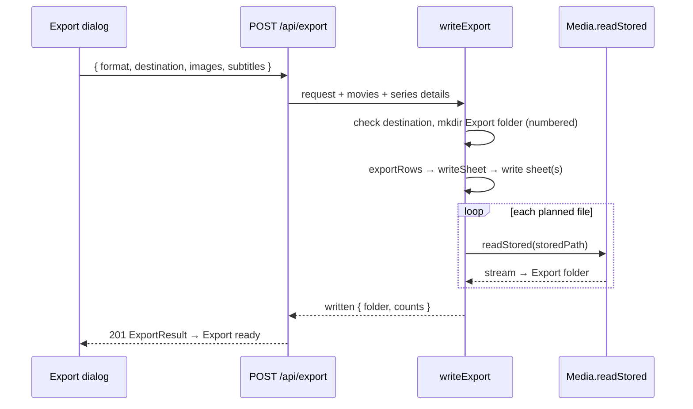

# 31 — Export options

> **Initiative:** `export-options`
> **PRD:** `docs/PRDs/31-export-options.md` (#275)
> **Plan:** `docs/PRDs/31-export-options-plan.md` (to be written)

This log is the `grill-me` session that settled step 15 of the build order
before the PRD was written. It ran against the prototype and the code as they
stood on 2026-10-08, the day the Library folders refactor closed (`1a48d82`).
It is an immutable snapshot of that moment. The session ran alone, and the
maintainer approved every recommendation in advance. Their brief:
_export-options. We want to set a path where to export; the default is the
root folder of the movie/series collection, with the naming format
`familyflix-collection_DD-MM-YYYY`. We also need to extend the header in the
files: all the info we see on a movie/series overview page, image included.
Images could be saved in the files or in the respective folder with paths to
the image in the files (Excel/CSV), whatever is best architecturally._

## Background

CLAUDE.md's step 15: _choose where the **Export file** is saved, rather than
Downloads alone, and what travels with it: today the eight Export columns and
nothing else; optionally posters, subtitles and the rest of a title's files
beside the sheet._ It has no prototype yet, so it goes through a prototype
revision before it is built.

What exists (log 14, as built):

- **The Export dialog** (`features/import-export/ExportModal`) has two
  **Format cards**, a filename row (`family-library.csv` and the **Export
  summary**'s `N movies`), the eight **Export columns** as pills, and
  _Export as CSV / Excel_. **Export ready** says _Saved … to your computer_.
- **The wire** is a read: `GET /api/export/:format` answers the bytes;
  `fetchExportFile` takes a `Blob` and **Save to computer** hands it to the
  browser, which drops it in Downloads with no dialog (log 24 Q25).
- **The Sheet writer** (`writeSheet(movies, format)`) writes films only, eight
  columns, one worksheet called `Library`. No series, no synopsis, no images.
  It is also what a **Sync** writes each **Metadata sheet** with.
- **The Sheet reader** reads the first worksheet's title, year (a **Year
  range** too), genres, director (a series' creator, log 22), cast, synopsis,
  rating and watched/status columns; unknown columns are ignored.
- **Library folders** (log 30): a list of absolute top folders, in the order
  added, each `reachable` or not. The **Write targets** are, so far, the only
  code that writes into one, and only ever add a file that is not there.
- `folderBridge` reads `window.familyflix.folders`, whose one member,
  `pick()`, opens a multi-select folder dialog titled _Add library folders_.
- `Media.readStored(path)` answers a **Stored file** as a stream: the one way
  code outside `media/` reads managed storage.
- What the two overview pages draw: the **movie page** — poster, backdrop,
  title, year, runtime, rating, genres, synopsis, director, cast, the watched
  state (Play / _Resume · 52:00_), the heart. The **series page** — poster,
  backdrop, title, **Year range**, season and episode counts, rating, genres,
  synopsis, _Created by_, cast, the progress line, the heart; and below it, on
  the **Season page**, each episode's still, `S02E04`, title, air date and
  watched state. Neither draws `originalTitle`, `tmdbScore` or `tmdbId`.

## Problem

An export that always lands in Downloads, as one flat sheet of films with
eight columns. The maintainer wants it written to a folder they choose, by
default the collection's own folder, under a dated name; carrying series as
well as films; with every field the overview pages show, artwork included.
The questions are where the bytes are written now that the destination is a
real path, what the export _is_ on disk once it carries images, how films,
series and episodes share a sheet format that the reader can still read back,
and what is optional.

## Questions and Answers

### Scope

1. **Its own initiative?** ✅ **Yes**: `31-export-options.md`, initiative
   `export-options`, one PRD, its issues, build and refactor. It is step 15,
   the last in the chain. It amends the **Export** of log 14 rather than
   adding a second one: one row, one dialog, one route family.

2. **What is not built?** ❌ **Video files.** A copy of every film is a full
   backup — hundreds of gigabytes, a run with progress and cancel, and a
   duplicate of what the Library folders already hold. It joins the Roadmap
   as 🧭 **Back up the library**, not this step. ❌ A column picker (log 14:
   the pills are a list, not controls). ❌ Remembering the last destination
   (Q8). ❌ A _Show in folder_ button on the done face (a third bridge member
   for one press; the path is printed instead, Q22). ❌ Reading the new
   columns back on import — posters, favorites and runtime from a sheet are a
   later import feature (Q20).

### Where the bytes are written

3. **Who writes the export now?** ✅ **The server, straight to the
   destination.** A chosen folder is a real path, and the server is the side
   that can write to one (the **Write targets** already do). The request
   becomes `POST /api/export { format, destination, images, subtitles }`; the
   server writes the folder and answers what it wrote. ❌ **Keep the browser
   download and add a save dialog**: Chromium's download path is a
   _Save as_ dialog over one file, which cannot write a folder of images, and
   would only work under the shell. ❌ **A second bridge member that writes
   files from main**: main would become a second writer of the library's art,
   and the dev page in a browser could not export at all.

4. **So what retires?** ✅ `GET /api/export/:format`, `fetchExportFile` and
   **Save to computer** — the whole browser-download path, which nothing else
   uses. Their removal is this initiative's **refactor pass**, after the new
   path is green, on log 14 Q16's precedent.

### What the export is on disk

5. **One file, or a folder?** ✅ **Always a folder: the Export folder.**
   `familyflix-collection_08-10-2026\` in the destination, holding the sheet
   and, when images or subtitles travel, one folder per title beside it. One
   shape whatever the options, so the done face, the refusal rules and the
   tests read one way. ❌ A bare sheet when nothing else travels: two shapes
   for one action.

6. **Images in the file, or beside it?** ✅ **Beside it, as files, with their
   relative paths in the sheet.** Reasons, in order of weight:
   - **CSV cannot carry an image.** Embedding would work for one of the two
     **Export formats** only, and the two would stop being one export in two
     serialisations.
   - **An embedded image is not a cell.** `exceljs` anchors pictures over the
     grid; the **Sheet reader** reads cell values. A path in a cell is
     something the reader can learn to follow (Q20); a floating picture is
     not.
   - **Size and reuse.** A thousand posters and backdrops are well over a
     gigabyte; inside one `.xlsx` that is a file Excel opens slowly, and the
     art can be used by nothing else. As files they are the **Source folder**
     shape the family already keeps: a `poster.jpg` in a folder named
     `Title (Year)`.

   In the `.xlsx`, each image cell is a **hyperlink** whose text is the
   relative path, so a click in Excel opens the picture; the reader already
   reads a hyperlink cell as its text. ❌ Embedded pictures in Excel and paths
   in CSV: two exports.

7. **The name?** ✅ **`familyflix-collection_DD-MM-YYYY`**, the brief's own,
   in the server's local date on the day of the export:
   `familyflix-collection_08-10-2026`. It names the **Export folder** and the
   sheet inside it (`familyflix-collection_08-10-2026.csv` or `.xlsx`), so a
   sheet copied out on its own still says what it is. A pure unit,
   `server/src/import-export/exportName/`, owns the spelling, with the clock
   injected. A name already taken in the destination is numbered as Chromium
   numbers a download — `familyflix-collection_08-10-2026 (1)` — and the
   folder is created exclusively, so an export **never writes into or over
   anything that exists**, the **Write targets**' rule. ❌ ISO `2026-10-08`:
   sorts better, but the brief spelled the format.

### The destination

8. **What is the default?** ✅ **The first reachable Library folder**, in the
   order added — "the root folder of the collection" now that there are
   several. With none listed or none reachable: the user's **Downloads**
   folder (`os.homedir()\Downloads`), which is today's behaviour. Worked out
   on the server and answered in the **Export summary** as
   `defaultDestination`. Not remembered between opens: every open starts from
   the default, as every open starts on CSV (log 14 Q14). ❌ A `settings` key
   for the last destination: a preference with no screen of its own, for a
   dialog opened a few times a year.

9. **How is it changed?** ✅ **The Library folders page's add row, again**: a
   mono `TextField` with the folder glyph, holding the default on open and
   editable, and _Browse…_ beside it **only when the folder bridge exists**
   (log 30 Q23's rule). Typed works under `npm run dev`; _Browse…_ is the
   shell's convenience.

10. **Browse… needs one folder, and `pick()` answers several.** ✅ The
    **folder bridge** gains a second member, `pickOne(): Promise<string |
null>`, on a second channel `FOLDER_CHANNELS.pickOne`
    (`'familyflix:folders:pick-one'`): `dialog.showOpenDialog(window,
{ title: 'Choose a folder', properties: ['openDirectory',
'createDirectory'] })`, `null` for a cancel. `electron/pickFolders/` gains
    the mapping beside `pickFolders`; `main.ts` wires the channel;
    `preload.ts` exposes it; `fakeFolderBridge` learns it. Named for what it
    does, not for its one caller, because the bridge is generic. ❌ A
    parameter on `pick`: the renderer would choose the dialog's options.

11. **What may the destination be?** ✅ **An absolute path to an existing,
    writable directory.** `readableFolder` answers reach; a write check
    (`access(W_OK)`, the **Write targets**' own) answers the rest. Refused
    with `400 { error }` and one sentence, drawn as the 13px `danger` line
    under the field, the typed path kept: _No folder at that path._,
    _Type the full path, starting with a drive letter._, _FamilyFlix can't
    write to that folder._ Any folder at all is allowed — inside a Library
    folder, the media root's parent, a USB stick. ❌ Refusing the **Managed
    media directory**: the export creates a new folder of its own and touches
    nothing there.

12. **Writing into a Library folder — is that allowed now?** ✅ **Yes, as the
    second writer, by the same rule.** Log 30 records the **Write targets** as
    "the only code that writes into a Library folder". An export into the
    default destination writes there too, but only ever **creates its own
    new folder** and never touches a file that exists. The rule is amended to
    say so. A **Folder scan** walks past it harmlessly: an Export folder holds
    no video, so neither it nor its title folders is a **Source folder**
    (`walkLibraryFolder`'s rule), and a still named `S01E03.jpg` is not an
    episode.

### What travels

13. **Films only, or series too?** ✅ **Both.** The collection is films and
    series (log 22), and the brief names both overview pages. Rows are **A–Z
    by title across both kinds**, the way a sheet is read; a `Type` column
    says which.

14. **And episodes?** ✅ **A second table, Episodes**, one row per episode,
    ordered by series (A–Z), season, number. A season page's row is part of
    what the series overview opens onto, and a still is an image the brief
    asks for. In `.xlsx` it is the **second worksheet**, `Episodes`, after
    `Titles`; in CSV it is a second file beside the first,
    `familyflix-collection_08-10-2026-episodes.csv`. The titles stay first in
    both, so the reader's _first worksheet_ rule keeps reading the titles and
    never mistakes an episode for a film. ❌ **Episode rows in the titles
    sheet**: the reader would import each as a title. ❌ One CSV with the
    union of every column: half of every row empty.

15. **The Titles columns?** ✅ **Every field the two overview pages draw, plus
    the eight log 14 shipped, in one header for both kinds:**

    | Column      | Movie                                   | Series                                   |
    | ----------- | --------------------------------------- | ---------------------------------------- |
    | `Type`      | `Movie`                                 | `Series`                                 |
    | `Title`     | as stored                               | as stored                                |
    | `Year`      | the year                                | the **Year range**: `2019–2023`, `2021–` |
    | `Runtime`   | minutes                                 | blank                                    |
    | `Genres`    | joined `, `                             | joined `, `                              |
    | `Director`  | the director                            | the creator — the reader's rule (log 22) |
    | `Cast`      | joined `, `                             | joined `, `                              |
    | `Synopsis`  | as stored                               | as stored                                |
    | `Rating`    | stored 0–10                             | stored 0–10                              |
    | `Status`    | `Watched` / `In progress` / `Unwatched` | the same, over its episodes (Q16)        |
    | `Favorite`  | `Yes` or blank                          | `Yes` or blank                           |
    | `Seasons`   | blank                                   | the count                                |
    | `Episodes`  | blank                                   | the count                                |
    | `Subtitles` | languages in track order                | blank                                    |
    | `Poster`    | relative path or blank                  | relative path or blank                   |
    | `Backdrop`  | relative path or blank                  | relative path or blank                   |

    The original eight keep their relative order and their cell rules, so an
    untouched export still round-trips (Q20). `Director` keeps its header for
    a series' creator because that is the header the reader maps onto the
    creator; the page's label _Created by_ is the page's. ❌ `Original title`,
    `TMDB score`, `TMDB ID`: stored, but drawn on neither page — the brief's
    line is _what we see_. ❌ A `Created by` column: a second header for one
    cell the reader already reads.

16. **A series' Status?** ✅ **Off its episodes**, the series page's progress
    line in one word: `Watched` when every episode is, `Unwatched` when none
    is watched or part-watched, `In progress` otherwise. A pure rule in the
    row mapper, not a new field on `Series`.

17. **The Episodes columns?** ✅ `Series`, `Season`, `Episode`, `Title`,
    `Air date` (the ISO date), `Runtime`, `Status`, `Subtitles` (languages),
    `Still` (relative path or blank). What an **Episode row** draws, plus
    runtime and subtitles as the film's row carries them.

18. **Which images?** ✅ **The poster and the backdrop of every title, and the
    still of every episode** — every picture the overview pages draw. The
    **Default poster** and the **Gradient fallback** are drawn in CSS, never
    stored, so a title without art exports a blank cell, not a picture.

19. **Where in the Export folder?** ✅ **One folder per title, named as a
    Movie folder is** (`movieFolder(title, year)` → `Heat (1995)`), numbered
    on a clash: `poster<ext>` and `backdrop<ext>` in it, the extension the
    stored file's own; a series' stills in `stills\S01E03<ext>` under its
    folder (`spellEpisodeTag`). Subtitles, when they travel, sit beside the
    art: `Heat (1995)\English.srt`, and for an episode
    `stills`' sibling `subtitles\S01E03 English.srt`. Cells hold the path
    relative to the sheet, **forward slashes** (`Heat (1995)/poster.jpg`),
    which Excel and Windows both follow. Every file is read through
    `Media.readStored` and piped out: `media/` stays the only reader of
    managed storage.

20. **Does the export still round-trip?** ✅ **Yes, unchanged.** The reader
    ignores columns it does not know, so `Type`, `Runtime`, `Favorite`,
    `Seasons`, `Episodes`, `Poster` and `Backdrop` pass by, and the titles it
    reads are the ones it read before — plus `Synopsis`, which it already
    reads and now finds. An untouched export imports nothing new; the
    round-trip test grows a series row and a synopsis. ❌ **Teaching the
    reader the new columns now** — posters off a path relative to the sheet,
    favorites, runtime: a real feature (an import that restores art), and a
    change to **Bulk import**'s contract. Recorded as a follow-up, not built.

21. **What is optional?** ✅ **Two toggles, under _Include_:**
    - **Images** — _Posters, backdrops and episode stills, in a folder per
      title._ **On** by default: the brief asks for them.
    - **Subtitles** — _Every subtitle file, beside its title's images._
      **Off** by default: the languages are already a column, and the files
      are only wanted for a copy that travels.

    With both off the Export folder holds the sheet (or the two CSVs) alone;
    the `Poster`, `Backdrop` and `Still` cells are blank, because a path to a
    file not written would be a lie. Every column is still written: the
    header never changes with the options (log 14's _no column is optional_).

### The wire and the domain

22. **The routes?** ✅

    | Route                                                         | Answer                                                                                                                                           |
    | ------------------------------------------------------------- | ------------------------------------------------------------------------------------------------------------------------------------------------ |
    | `GET /api/export`                                             | `ExportSummary { movieCount, seriesCount, episodeCount, defaultDestination, folderName }`                                                        |
    | `POST /api/export { format, destination, images, subtitles }` | `201 ExportResult { folder, movieCount, seriesCount }` · `400` a body that is not one, or a destination refused (Q11) · `500` a write that broke |

    `folderName` is the name today would take before numbering, for the
    dialog's row. `folder` in the answer is the absolute path actually
    written, numbered or not, for the done copy. A write that breaks partway
    removes the Export folder it created (best-effort, the Movie folder's
    rollback rule) and answers `500 { error }` with one sentence:
    _The export stopped partway: <reason>. Nothing was left behind._

23. **One request, or a run?** ✅ **One request.** Without videos (Q2) the
    largest export is the art of the whole collection: local copies of a
    gigabyte or two, seconds to tens of seconds. _Exporting…_ on the disabled
    button is the progress, as for _Adding…_. ❌ **A Current run with polling
    and cancel**: `createImporter`'s machinery for a wait of seconds. If
    video ever travels (**Back up the library**), that is when a run is
    earned.

24. **Which units?** ✅ In `server/src/import-export/`, each in its folder
    with its suite:
    - `exportName/` — pure: a date → `familyflix-collection_DD-MM-YYYY`.
    - `exportRows/` — pure: movies and series details → the **Titles** and
      **Episodes** tables as rows of cells, image and subtitle paths filled
      from a plan of where each file will go; the cell rules move here from
      `writeSheet`, spelled once.
    - `writeSheet/` — now `writeSheet(tables, format)` → `{ name, bytes }[]`:
      one workbook of two worksheets for `xlsx`, two BOM'd CSVs for `csv`,
      hyperlinks on the path cells in `xlsx`. Still pure and still the
      **Sheet reader**'s mirror.
    - `writeExport/` — the injected writer: check the destination, create the
      **Export folder** exclusively, write the sheets, pipe each file out of
      `Media.readStored`, roll back on failure. Composed in the route as
      `createApiRouter` already composes storage and media; no new parameter.

    The **Metadata sheet** a **Sync** writes is `writeSheet` over that
    folder's films alone: it gains the new header, image cells blank, so
    every sheet the app writes reads one way.

### The dialog

25. **What does the dialog draw?** ✅ The idle face, top to bottom, on log 14's
    Modal:
    - The header: the download tile, _Export library_, _Save your whole
      collection — details, artwork and all._, ✕.
    - **Format**: the two Format cards, unchanged.
    - **Save to**: the destination field (mono, folder glyph) with _Browse…_
      when the bridge exists, the refusal line under it.
    - The name row: the folder glyph, `familyflix-collection_08-10-2026` in
      mono, and on the right `142 titles` in accent (movies and series
      together; `1 title`).
    - **Include**: two rows on the Settings `Row` furniture, each a label,
      its line and a **Toggle**: Images (on), Subtitles (off).
    - **Columns included**: the sixteen Titles columns as pills.
    - _Export as CSV / Excel_ (`primary`, _Exporting…_ while in flight) and
      _Cancel_.

26. **And Export ready?** ✅ The same **Bare modal**, the copy now the place:
    "Saved `familyflix-collection_08-10-2026` to `E:\Movies` with 142
    titles." — the folder name and the destination each in mono, the count
    clause dropped when the summary never landed (log 14's rule). _Done_.

27. **State?** ✅ `useExport(open)` grows `destination`, `setDestination`,
    `images`, `subtitles`, their setters, `browse` (`null` without the
    bridge) and `refusal`; on open it resets all of them and fills
    `destination` from the summary's `defaultDestination` once it lands —
    never over a path typed first (`useTmdbKey`'s rule). A `400` keeps the
    idle face and shows the refusal; any other failure leaves the dialog as
    it was, as today.

28. **The Settings row?** ✅ **Unchanged**: _Export to CSV_, _Save your whole
    library out as a spreadsheet backup._ (log 14 Q15).

### Prototype and names

29. **Prototype first?** ✅ **Yes.** Before phase 1 is built,
    `feat.ExportModal.dc.html` is revised to Q25 and Q26: the Save to field
    with and without _Browse…_ and with a refusal, the name row, the Include
    toggles, the sixteen pills, and the new done copy.
    `COMPONENT-SPEC.md`'s ExportModal row gets its new props, and the folder
    bridge its second member.

30. **The new and changed terms?** ✅ **Export folder**, **Export name**,
    **Export destination**, **Titles sheet**, **Episodes sheet**, **Include
    toggles**; **Export**, **Export file**, **Export columns**, **Export
    summary**, **Export ready**, **Sheet writer**, **Metadata sheet**,
    **Write target** and the folder bridge updated; **Save to computer**
    retired with the refactor.

## Design

### Chosen and rejected

- ✅ Server writes an **Export folder** to a chosen destination —
  ❌ browser download with a save dialog — ❌ main writes files.
- ✅ Images as files beside the sheet, relative paths in cells, hyperlinks in
  `xlsx` — ❌ embedded pictures — ❌ embedded in Excel only.
- ✅ Films and series in one **Titles sheet**, episodes in an **Episodes
  sheet** — ❌ episode rows among titles — ❌ one union CSV.
- ✅ Default destination: first reachable Library folder, else Downloads, not
  remembered — ❌ a stored preference.
- ✅ One request — ❌ a Current run.
- ✅ Images on, subtitles off — ❌ videos (🧭 **Back up the library**).

### Types — `src/types/export.ts`

```ts
export const EXPORT_FORMATS = ['csv', 'xlsx'] as const;
export type ExportFormat = (typeof EXPORT_FORMATS)[number];

/** The Titles sheet's header, both kinds, in order. */
export const EXPORT_COLUMNS = [
  'Type',
  'Title',
  'Year',
  'Runtime',
  'Genres',
  'Director',
  'Cast',
  'Synopsis',
  'Rating',
  'Status',
  'Favorite',
  'Seasons',
  'Episodes',
  'Subtitles',
  'Poster',
  'Backdrop',
] as const;
export type ExportColumn = (typeof EXPORT_COLUMNS)[number];

/** The Episodes sheet's header, in order. */
export const EXPORT_EPISODE_COLUMNS = [
  'Series',
  'Season',
  'Episode',
  'Title',
  'Air date',
  'Runtime',
  'Status',
  'Subtitles',
  'Still',
] as const;
export type ExportEpisodeColumn = (typeof EXPORT_EPISODE_COLUMNS)[number];

/** `familyflix-collection_` + the date — the Export name's prefix. */
export const EXPORT_NAME_PREFIX = 'familyflix-collection_';

/** `GET /api/export`. */
export interface ExportSummary {
  movieCount: number;
  seriesCount: number;
  episodeCount: number;
  /** First reachable Library folder, else the user's Downloads. */
  defaultDestination: string;
  /** Today's Export name, before any numbering. */
  folderName: string;
}

/** `POST /api/export`. */
export interface StartExport {
  format: ExportFormat;
  destination: string;
  images: boolean;
  subtitles: boolean;
}

/** `201` — what was written. */
export interface ExportResult {
  /** The absolute Export folder, numbered if the name was taken. */
  folder: string;
  movieCount: number;
  seriesCount: number;
}
```

`EXPORT_FILENAME` retires with the refactor.

### On disk

```
E:\Movies\familyflix-collection_08-10-2026\
├── familyflix-collection_08-10-2026.xlsx          ← Titles, then Episodes
│   (or familyflix-collection_08-10-2026.csv
│     + familyflix-collection_08-10-2026-episodes.csv)
├── Heat (1995)\
│   ├── poster.jpg
│   ├── backdrop.jpg
│   └── English.srt                                 ← Subtitles on
└── Severance (2022–)\
    ├── poster.jpg
    ├── backdrop.jpg
    ├── stills\S01E01.jpg
    └── subtitles\S01E01 English.srt               ← Subtitles on
```

The Titles row for Heat reads `Heat (1995)/poster.jpg` under `Poster`.

### Backend — `server/src/import-export/`

```ts
// exportName/
export function exportName(now: Date): string; // familyflix-collection_08-10-2026

// exportRows/
export interface ExportTables {
  titles: Cell[][]; // header first
  episodes: Cell[][]; // header first
}
export interface ExportFilePlan {
  storedPath: string; // under the media root
  exportPath: string; // relative to the Export folder, forward slashes
}
export function exportRows(
  movies: Movie[],
  series: SeriesDetail[],
  include: { images: boolean; subtitles: boolean }
): { tables: ExportTables; files: ExportFilePlan[] };

// writeSheet/
export function writeSheet(
  tables: ExportTables,
  format: ExportFormat,
  name: string
): Promise<{ filename: string; bytes: Buffer }[]>;

// writeExport/
export type ExportOutcome =
  | { kind: 'written'; result: ExportResult }
  | { kind: 'refused'; error: string }
  | { kind: 'failed'; error: string };
export function writeExport(
  media: Pick<Media, 'readStored'>,
  request: StartExport,
  content: { movies: Movie[]; series: SeriesDetail[] },
  now: () => Date
): Promise<ExportOutcome>; // never throws
```

`routes/` gains `exportBody` (the body read into a `StartExport`, each `400` a
sentence, `movieFormBody`'s precedent). The summary's `defaultDestination`
reads `listLibraryFolders()` and `readableFolder`.

### Shell — `electron/`

```ts
// src/types/libraryFolders.ts
export const FOLDER_CHANNELS = {
  pick: 'familyflix:folders:pick',
  pickOne: 'familyflix:folders:pick-one',
} as const;
export interface FolderBridge {
  pick(): Promise<string[]>;
  /** One folder, or `null` for a cancel. */
  pickOne(): Promise<string | null>;
}
```

### Frontend — `src/features/import-export/`

```
ExportModal/      ← Save to, the name row, Include, sixteen pills, new done copy
useExport/        ← + destination, images, subtitles, browse, refusal; POST
api/              ← startExport (replaces fetchExportFile); fetchExportSummary
folderBridge/     ← unchanged reader; the bridge it reads has pickOne
```

```ts
export interface ExportState {
  format: ExportFormat;
  summary: ExportSummary | null;
  destination: string;
  images: boolean;
  subtitles: boolean;
  browse: (() => Promise<void>) | null; // null without the bridge
  refusal: string | null;
  exporting: boolean;
  result: ExportResult | null; // non-null is Export ready
  chooseFormat(format: ExportFormat): void;
  setDestination(path: string): void;
  setImages(on: boolean): void;
  setSubtitles(on: boolean): void;
  exportLibrary(): Promise<void>;
}
```



## Implementation Plan

0. **The prototype.** `feat.ExportModal.dc.html` revised (Q29),
   `COMPONENT-SPEC.md` updated.
1. **The tracer — a dated folder lands where you typed.** `exportName`;
   `exportRows` for films with the sixteen columns; `writeSheet(tables, 'csv',
name)`; `writeExport` with the destination check and the exclusive,
   numbered folder; `POST /api/export`; the summary's `defaultDestination`
   and `folderName`; the dialog's Save to field (typed), name row and new done
   copy. Press _Export as CSV_ and `familyflix-collection_08-10-2026\` is in
   the first Library folder with the films' sheet.
2. **Series and episodes.** Series rows in Titles, the Episodes table, the
   second CSV and the second worksheet; the round-trip test with a series row
   and a synopsis.
3. **Images.** The per-title folders, posters, backdrops and stills through
   `readStored`, the path cells, the `xlsx` hyperlinks, the Images toggle.
4. **Subtitles.** The Subtitles toggle and the subtitle files.
5. **Browse….** `pickOne` through main, preload and the bridge; the button
   drawn only with it.
6. **The edges.** Each refusal sentence; a taken name numbered; a write that
   breaks rolls back; a missing stored file skipped with its cell left blank;
   zero titles; the Metadata sheet on the new header.
7. **Docs, glossary and the refactor filing** — the refactor retires
   `GET /api/export/:format`, `fetchExportFile`, **Save to computer** and
   `EXPORT_FILENAME`; the feature table ticks only after it.

## Trade-offs

**Easier:** one export shape on disk whatever the options; images usable by
anything (Explorer, another app, a later import) and the sheet still a plain
sheet in both formats; the server as the one writer, so the dev page in a
browser exports exactly as the Installed app does; the default destination is
where the maintainer already looks for the collection.

**Harder:** an export is no longer a single file to attach to an email — it
is a folder; the dialog grew from one choice to four; the export now writes
into a **Library folder** by default, so "only the Write targets write there"
became "only the Write targets and the Export, and only ever new files"; a big
art export is a wait behind a disabled button with no bar, which CLAUDE.md
would normally ask for — accepted because without video it is seconds.

**Ruled out:** video files (🧭 **Back up the library**); embedded images;
remembering the destination; a _Show in folder_ button; the reader learning
the new columns (a follow-up: restore art and favorites from a sheet);
`originalTitle`, `tmdbScore` and `tmdbId` columns (not drawn on an overview
page); a run with cancel.
