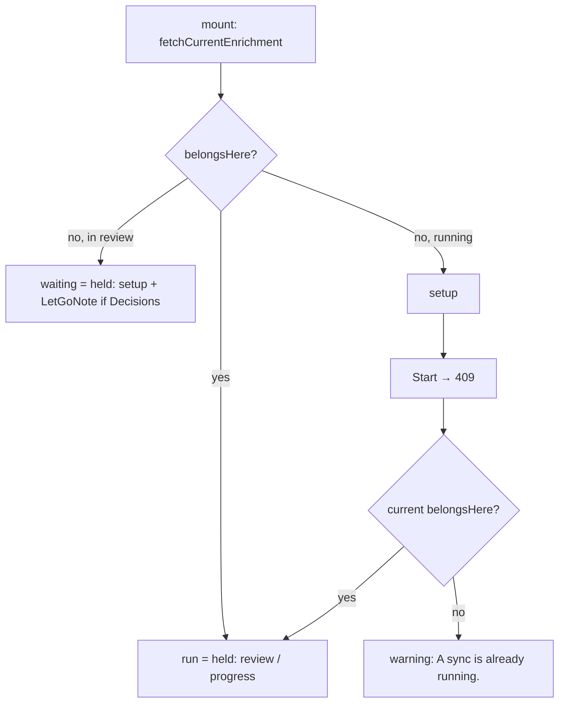

# 33 — Single-title Sync

> **Initiative:** `single-title-sync`
> **PRD:** `docs/PRDs/33-single-title-sync.md` (to be written)
> **Plan:** `docs/PRDs/33-single-title-sync-plan.md` (to be written)

This log is the `grill-me` session that settled step 16 of the build order,
the first of the third chain (`32-third-chain.md`, §4), before the PRD was
written. It ran against the code as it stood on 2026-10-09, the day log 32
landed (`6e9b879`), and it is an immutable snapshot of that moment. The
session ran alone, and the maintainer approved every recommendation in
advance. Their brief: _single-title-sync. do this one alone, you have my
approval for all your recommendations. keep in mind, we want to keep our
codebase consistent with our naming and code conventions/patterns/
architecture._

## Background

Log 32 Q4a–Q4b already settled the rule. This session works out where it
lands. Here is what the code does today:

- The movie page's ⋯ menu pushes `enrichPath({ movie: id })`, which is
  `/enrich?movie=<id>`, the `single` **Enrichment scope**. `EnrichmentFlow`
  reads `movie` off the search params, names the film under _Just this
  movie_ and sends `StartEnrichment { scope: 'single', movieId, … }`.
- On the server, `enrichmentBody` already requires a `movieId` for `single`
  and refuses one for any other scope. `createEnrichment.titlesFor` answers
  `no-movie` for a film the library does not hold. `start` refuses with
  `busy` only while a run is `running`. A run in `review` is replaced by
  any start.
- `EnrichmentRun` carries `scope` and no movie id (`src/types/enrichment.ts`).
- `useEnrichmentRun` takes no argument. On mount it holds _whatever_
  `fetchCurrentEnrichment` answers. On a `409` from `start` it does the same:
  it holds whatever run is current.

## Problem

A library-wide Sync left in review is still the **Current enrichment run**.
When the ⋯ menu opens the flow for one film, the mount re-attaches to that run
and draws the whole library's review. A `single` start while a library Sync
is _running_ hits the same bug a second way: the `409` is answered by holding
the library run. The client cannot tell whose run it is holding.

## Questions and Answers

**Q1. Where does the re-attach rule live?**
✅ In `useEnrichmentRun`, which takes `movieId: string | null`. A
module-local `belongsHere(run, movieId)` sits beside `settled`:

- with no movie, every run belongs (today's rule)
- with a movie, only a `single` run whose `movieId` matches belongs

It is tested through the hook, as `settled` is. It is not in its own folder,
because it has one caller and no surface of its own.
❌ Filtering in `EnrichmentFlow`. The organism would then hold a run it must
not draw, and the poll would keep reading it.
❌ A server query (`GET …/current?movie=`). The server holds one run, and
whose it is belongs on the snapshot, not in a second read.

**Q2. Does the `409` path need the rule too?**
✅ Yes, or the bug moves there. After a `409`, `start` reads the current run
and holds it only when `belongsHere`. Otherwise it rethrows
`EnrichmentBusyError`. `EnrichmentFlow.onStart` answers that error with a
`warning` notice, _A sync is already running._, following `useTmdbKey`'s
_Paste a key first._ It is a refusal the user can wait out, not an error.
Any other rejection is still swallowed as it is today.

**Q3. How does setup learn that a run is waiting in review?**
✅ The hook also returns `waiting: EnrichmentRun | null`. This is the current
run it read on mount and did not re-attach to, and only when that run's
`phase` is `review`. It is cleared once the screen holds a run of its own: a
successful start, or a `409` it does hold.
❌ `waiting` for a `running` run as well. Log 32 answers that case at Start,
with the notice. A warning ahead of time would be a second surface for the
same fact.

**Q4. When is the line drawn, and with which words?**
✅ The line is drawn only when `waiting.decisions.length > 0`. A review with
nothing left to settle loses nothing by being let go, so the line would only
alarm. The words come from a pure `letGoLine(waiting)` in
`features/enrichment/enrichmentView/`, where the setup's words already live
(`scopeDescription`, `enrichmentEstimate`):

- `missing` / `all`: _Starting lets go of the library sync waiting for
  review._ (log 32's copy)
- `single`, another film: _Starting lets go of another movie's sync waiting
  for review._
- no run, or no Decisions: `null`

`EnrichmentSetup` gains `letGo: string | null` and draws it under the
`StartRow` as a `LetGoNote`, styled like `SourceNote` in
`EnrichmentSetup.styles.ts`. No prototype revision is needed, as log 32 said:
the line uses the setup's existing note furniture.

**Q5. What changes on the server?**
✅ Only `createEnrichment.start`, which spreads
`...(options.scope === 'single' ? { movieId: options.movieId } : {})` onto
the run it builds. `current()`'s `structuredClone` carries it unchanged.
`enrichmentBody`, `titlesFor`, the route and its status codes are untouched.

**Q6. What stays as it is?**
✅ The following are unchanged:

- Opened without a movie, the flow re-attaches to any run, a single one
  included, as today.
- A single run's finished review re-attaches the next time the same film's ⋯
  menu opens the flow, until _Sync again_ drops it. That is the run belonging
  where it was started.
- Back, Finish and _Back to the movie_ keep the **Back rule**, with the movie
  as the **Landing**.
- There is still no single-title Sync for a **Series** (log 32 Trade-offs).
  The field stays `movieId`, not a title id.

**Q7. How is it shipped?**
✅ As one vertical slice and one issue, a `fix:`
(`fix: [single-title-sync] issue #<n> …`). The slice is the type, the server
record, the hook, the view, the setup line and the notice.

## Design

### Types — `src/types/enrichment.ts`

```ts
export interface EnrichmentRun {
  /* … */
  /** The film a `single` run is for; absent on a library run. */
  movieId?: string;
}
```

### Backend — `server/src/enrichment/createEnrichment/`

`start` records `movieId` on a `single` run (Q5). It is tested in
`createEnrichment.test.ts`: a single start's snapshot and `current()` carry
the id, and a library start carries none.

### Frontend — `src/features/enrichment/`

```ts
// useEnrichmentRun/useEnrichmentRun.ts
function belongsHere(run: EnrichmentRun, movieId: string | null): boolean;

export interface EnrichmentRunState {
  run: EnrichmentRun | null;
  /** The run in review this screen did not re-attach to — Start lets it go. */
  waiting: EnrichmentRun | null;
  start: (options: StartEnrichment) => Promise<void>; // rethrows EnrichmentBusyError for a run not its own
  /* cancel, search, pick, apply, dismiss — unchanged */
}
export function useEnrichmentRun(movieId: string | null): EnrichmentRunState;

// enrichmentView/enrichmentView.ts
export function letGoLine(waiting: EnrichmentRun | null): string | null;

// EnrichmentSetup/EnrichmentSetup.tsx
interface EnrichmentSetupProps {
  /* … */ letGo: string | null;
}
```



Tests: `useEnrichmentRun.test.ts` (mount and `409` with a matching run, with
another film's run and with a library run, and `waiting`),
`enrichmentView.test.ts` (`letGoLine`'s four cases) and
`EnrichmentFlow.test.tsx` (the `?movie=` paths end to end: setup over a
library review, the line, the notice). `makeEnrichmentRun` takes `movieId`
as an override like any other field.

## Implementation Plan

1. **The whole fix, one slice.** `movieId` on the type and recorded by
   `start`; `useEnrichmentRun(movieId)` with `belongsHere` on mount and on
   `409`, and `waiting`; `letGoLine`; `EnrichmentSetup`'s `LetGoNote`;
   `EnrichmentFlow` passing the movie, the line and the notice.

## Trade-offs

- **Easier:** whose run it is now sits on the snapshot, so any later surface
  (a single-series Sync, a backgrounded Sync) can ask the same question
  without another read.
- **Harder:** the hook's mount no longer just holds whatever it reads. It
  now has two outcomes, `run` and `waiting`, kept apart by the generation
  guard it already has.
- **Out of scope:** a server-side refusal to replace another scope's review
  (log 32 chose the line instead); warning ahead of time about a _running_
  Sync; a single-title Sync for a series; re-attaching a library flow only to
  library runs.
