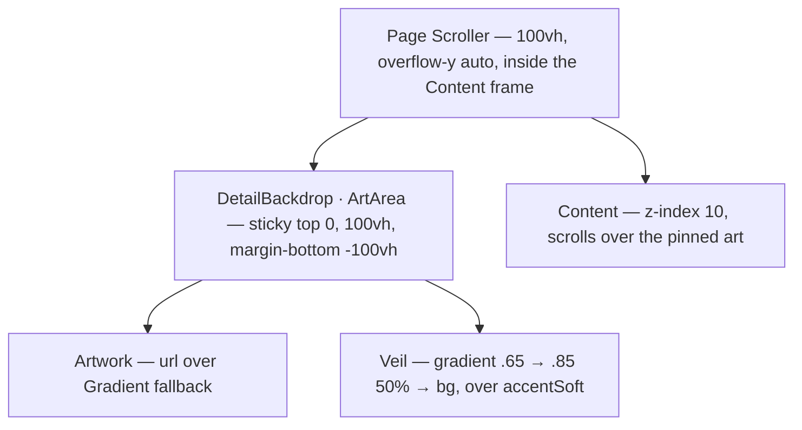

# 34 — Backdrop veil

> **Initiative:** `backdrop-veil`
> **PRD:** `docs/PRDs/34-backdrop-veil.md` (to be written)
> **Plan:** `docs/PRDs/34-backdrop-veil-plan.md` (to be written)

This log is the `grill-me` session that settled step 17 of the build order,
the second of the third chain (`32-third-chain.md`, §2), before the PRD was
written. It ran against the code as it stood on 2026-10-09, after step 16's
refactor (`32466a6`), and it is an immutable snapshot of that moment. The
session ran alone, and the maintainer approved every recommendation in
advance. Their brief: _backdrop-veil. do this one alone, i approve all your
recommendations. keep in mind, we want to keep the codebase consistent with
our naming and code conventions/patterns/architecture._

## Background

Log 32 Q2a–Q2b already settled the rule: the art fills the viewport and
stays put, and the **Backdrop veil** (an `accentSoft` wash under a darker
gradient) replaces the scrim. No blur. This session works out where it lands.
Here is what the code does today:

- The movie page draws `ArtArea` and `Scrim` from
  `features/movie-detail/MovieDetail/MovieDetail.styles.ts`: `absolute`,
  `inset: 0`, `height: 62%`, under a three-stop gradient
  `rgba(20,17,13,.45) 0% → .82 55% → bg 100%` (`page.MoviePage.dc.html`).
- The series page draws its own twins from
  `features/series/SeriesDetail/SeriesDetail.styles.ts`: `absolute`,
  `height: 520px`, stops `.35 → .80 → bg` (`page.SeriesPage.dc.html`).
- Both are placed against the page's own `Scroller` (`MoviePage.styles.ts`,
  `SeriesPage.styles.ts`): `position: relative; height: 100vh;
overflow-y: auto`. Because the art is `absolute`, it scrolls away with the
  content, and below 62% (or 520px) the page is bare `bg`. That is the black
  bottom half in the brief.
- The art sits inside the **Content frame**. Log 27 Q8 relies on that: with
  **Ultrawide margins** on, the backdrops are clipped to the frame because
  they are placed inside the scroller, not against the viewport.
- `accentSoft` is the **Accent scale**'s 14% accent, derived by
  `createTheme(accent)` (`utils/accentScale/`).
- Three other scrims exist and are not this one: `Modal`'s, the
  `ContinueCard`'s and the player's art layer.

## Problem

The detail pages' art covers only the top of the screen and scrolls away.
The title, the actions and the synopsis sit over a pale `.35`–`.45` top stop
that does not darken enough for the circles and the text to read over a
bright backdrop. Two features draw the same thing in two copies whose stops
have already drifted apart.

## Questions and Answers

**Q1. One unit or two?**
✅ One molecule, `components/DetailBackdrop/`, drawn by both pages. It
graduates the same way `CreditsRow` did when the series page drew it too: it
is composed from the `Artwork` primitive, it is presentational, and it knows
no domain. `MovieDetail` and `SeriesDetail` drop their `ArtArea` and `Scrim`
and render `<DetailBackdrop url={…backdropUrl} g1={…} g2={…} />`.
❌ A `BackdropVeil` styled twin in each feature's styles (log 32's table
names `MovieDetail.styles.ts`). The series page draws it too, and twins are
what the dev journal's first entry was written to stop.
❌ One feature importing the other's styles. No feature reads another's
furniture.

**Q2. What is it called?**
✅ `DetailBackdrop` for the molecule: the **Backdrop** as a detail page draws
it. Inside it, two styled parts: `ArtArea` keeps its name, and `Veil` is the
**Backdrop veil**. The molecule is not called `Backdrop`, because that word
is the image (the glossary's **Backdrop**). It is not called `BackdropVeil`
either, because the veil is only one of its two layers.

**Q3. How does the art stay put without leaving the Content frame?**
✅ `position: sticky; top: 0; height: 100vh; margin-bottom: -100vh` on
`ArtArea`, as the scroller's first child. Sticky pins it to the scroller's
visible box. The negative margin gives its height back so the content starts
at the top as it does today. It stays inside the scroller, so log 27 Q8
holds without changes: the frame still clips it. `100vh` is the scroller's
own height on both pages, and a comment says so.
❌ `position: fixed`. It is placed against the viewport, so it escapes the
Content frame and would paint the ultrawide margins.
❌ A scroll listener moving the art, or a transform. That is work on every
scroll frame for something CSS does on the compositor.
❌ Re-gridding the page `Scroller`s. Pages are composition, and the fix
belongs to the thing that draws the art.

**Q4. What are the veil's layers and stops?**
✅ One `Veil` element with two background layers, the gradient on top of the
wash:

```css
background:
  linear-gradient(
    180deg,
    rgba(20, 17, 13, 0.65) 0%,
    rgba(20, 17, 13, 0.85) 50%,
    ${bg} 100%
  ),
  ${accentSoft};
```

`.65` at the top, where the actions sit, replaces `.45`/`.35` (log 32 Q2b).
The middle stop moves to 50% because the art is now a full viewport tall
rather than 62%. The last stop is `bg`, so the art has no bottom edge
against the page or the frame's margins. `rgba(20, 17, 13, …)` is `bg`
spelled with an alpha, which is how both prototypes and both styles files
already write it.
❌ The wash over the gradient. It would tint the last stop, and the art would
gain an edge against `bg`.
❌ A second element for the wash. Two layers of one background is one node
less and the same paint.
❌ Different stops per page. One molecule means one veil, and the series
page's `.35` was drift, not intent.

**Q5. Which accent?**
✅ `theme.colors.accentSoft`, never a literal, so the veil follows
`createTheme(accent)` the way every other accent derivative does.

**Q6. What does the prototype say?**
✅ The prototype is revised in the same issue, before the code: the art div
and its gradient in `page.MoviePage.dc.html` and `page.SeriesPage.dc.html`
are rewritten to Q3–Q4 (sticky, `100vh`, the two layers, `.65 / .85 50% /
bg`, the wash as `var(--color-accent-soft)`). `FamilyFlix.dc.html` composes
both pages, so it follows with no edit of its own. No `mol.DetailBackdrop`
file is added, following `CreditsRow`, which graduated without one.
`COMPONENT-SPEC.md` gains the molecule's row.

**Q7. What stays as it is?**
✅ The following are unchanged:

- `LoadingDetail` and `LoadingSeries` draw no art, as today.
- The failure screens (`DetailMessage`, `z-index: 10`) still paint over it.
- `Content`'s `z-index: 10` and its `130px` top padding; the poster frame;
  the Back pill and the Back circle.
- `Modal`'s, the `ContinueCard`'s and the player's scrims.
- No motion is added, so the **Reduced motion** block has nothing new to
  stop. No blur (log 32 Q2b).

**Q8. How is it tested?**
✅ `components/DetailBackdrop/DetailBackdrop.test.tsx`, through
`getComputedStyle` as `ContinueCard`'s and the Content frame's suites read
style:

- the root is `aria-hidden`, `sticky` at `top: 0`, `100vh` tall
- the `Artwork` paints the url over the **Gradient fallback**, and paints the
  gradient alone for `null`
- the veil reads the theme's `accentSoft`: rendered under
  `createTheme('#3a7bd5')`, its background carries that accent's 14% and not
  the default's

`MovieDetail.test.tsx` and `SeriesDetail.test.tsx` keep their own
assertions. Neither tests the art's geometry any more, because that belongs
to the molecule.

**Q9. How is it shipped?**
✅ As one vertical slice and one issue, a `feat:`
(`feat: [backdrop-veil] issue #<n> …`). The slice is the prototype revision,
the molecule and its suite, the barrel line, and both features drawing it
with their twins deleted.

## Design

### Molecule — `src/components/DetailBackdrop/`

```ts
// DetailBackdrop.tsx
interface DetailBackdropProps {
  /** The Backdrop's url, or `null` for the Gradient fallback alone. */
  url: string | null;
  g1: string;
  g2: string;
}
export function DetailBackdrop(props: DetailBackdropProps): JSX.Element;
// <ArtArea aria-hidden="true"><Artwork url g1 g2 /><Veil /></ArtArea>

// DetailBackdrop.styles.ts
export const ArtArea; // sticky, top 0, 100vh, margin-bottom -100vh, overflow hidden
export const Veil; // absolute, inset 0, the gradient over accentSoft
```

`components/index.ts` re-exports it:
`export { DetailBackdrop } from './DetailBackdrop/DetailBackdrop'`.

### Callers

| File                                            | Change                                               |
| ----------------------------------------------- | ---------------------------------------------------- |
| `features/movie-detail/MovieDetail/*.tsx`       | `<DetailBackdrop … />` in place of `ArtArea`+`Scrim` |
| `features/movie-detail/MovieDetail/*.styles.ts` | `ArtArea`, `Scrim` deleted                           |
| `features/series/SeriesDetail/*.tsx`            | the same                                             |
| `features/series/SeriesDetail/*.styles.ts`      | the same                                             |
| `pages/MoviePage/`, `pages/SeriesPage/`         | none; the `Scroller` comments name the molecule      |



## Implementation Plan

1. **The whole change, one slice.** Revise `page.MoviePage.dc.html` and
   `page.SeriesPage.dc.html`, then build `DetailBackdrop` and its suite and add
   the barrel line. Swap both features onto it, delete the two twins, and add
   the molecule's row to `COMPONENT-SPEC.md`.

## Trade-offs

- **Easier:** one veil, one set of stops and one place to tune them; a
  third detail surface (a season hero, if it is ever drawn) gets the art for
  one line.
- **Harder:** the art's height is tied to the scroller's `100vh` by
  convention, not by the cascade. A page whose scroller is not the full
  viewport would have to pass its own height. Both are today, and the
  comment names the coupling.
- **Out of scope:** a blur (log 32); parallax or any motion of the art; a
  veil on the Season page, which draws no backdrop; tuning the stops per
  image brightness. A fixed `.65` is the floor for every backdrop, and a
  bright one reads by the gradient, not by measuring it.
