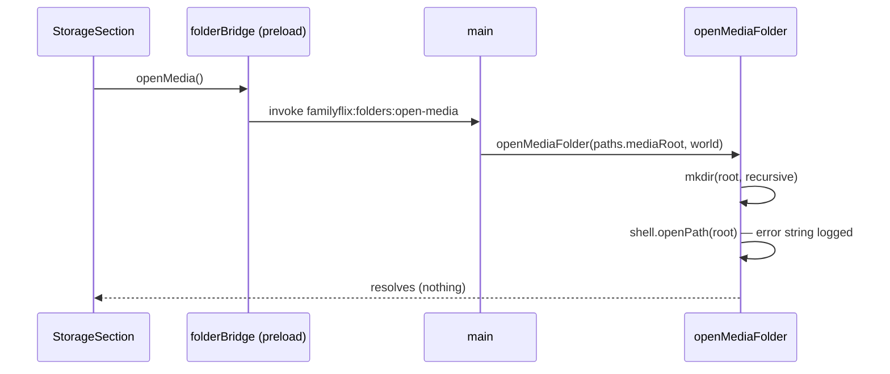

# 35 — Open the media folder

> **Initiative:** `open-media-folder`
> **PRD:** `docs/PRDs/35-open-media-folder.md` (to be written)
> **Plan:** `docs/PRDs/35-open-media-folder-plan.md` (to be written)

This log is the `grill-me` session that settled step 18 of the build order,
the third step of the third chain (`32-third-chain.md`, §5). It was held
before the PRD was written, against the code as it stood on 2026-10-09 after
step 17's refactor (`e88891c`), and it is an immutable snapshot of that
moment. The session ran alone, and the maintainer approved every
recommendation in advance. Their brief: _open-media-folder-from-settings. do
this one alone, i approve all your recommendations. keep in mind, we want to
keep the codebase consistent with our naming and code
conventions/patterns/architecture._

## Background

Log 32 Q5a already settled the rule. _Open folder_ is a `secondary` `sm`
Button on the Storage card's path row. It calls a third **Folder bridge**
member, `openMedia()`, over `FOLDER_CHANNELS.openMedia`, which takes **no
argument**. Main opens a new `mediaRoot` on **Shell paths** with
`shell.openPath`, and makes the directory first if it does not exist yet. The
button is not drawn in a browser. ❌ `openPath(path)` from the renderer.

This session works out where each part lands. Here is what the code does
today:

- `electron/shellPaths/` answers six paths (`icon`, `serverEntry`,
  `renderer`, `sqliteBinding`, `ffmpeg`, `serverCwd`). It has no media root.
- `electron/serverLaunch/` spells the installed media path itself:
  `FAMILYFLIX_MEDIA_PATH: join(userData, 'media')`. Unpackaged it sets none,
  so the server falls back to `./media` under `serverCwd`, which is the repo
  (`server/src/main.ts:33`). The glossary says every path main hands the
  **Server process** comes from Shell paths (Relationships). This one does
  not.
- `main.ts` is wiring only. Each IPC answer is a unit's (`pickFolders`,
  `pickOneFolder`). The failure dialogs already inject `shell.openPath`
  (`shellDialogs`' `DialogWorld.openPath`). `shell.openPath` resolves to an
  error string, which is `''` on success, and never rejects.
- `src/types/libraryFolders.ts` holds `FOLDER_CHANNELS` (`pick`, `pickOne`)
  and `FolderBridge`. The preload passes each member through to its channel.
- `folderBridge()`, the one reader of `window.familyflix?.folders`, lives in
  `features/import-export/`. Its two callers, `LibraryFolders` and
  `useExport`, are both in that feature. `StorageSection` is in
  `features/settings/`.
- `StorageSection` draws the title and the mono path in `FolderText`, inside
  `Folder`, a `space-between` row. Its comment says _No Change…_. The
  prototype (`page.SettingsPage.dc.html:725`) draws _Change…_ in that slot:
  40px tall, `0 18px`, 14px/600, `surface-3` on `border`. That is exactly
  `Button`'s `secondary` at `sm`.
- `fakeFolderBridge` fakes `pick` and `pickOne` and counts both.

## Problem

The maintainer can read the **Managed media directory**'s path on the Storage
card, but cannot get to it without typing `%APPDATA%\FamilyFlix\media` into
Explorer. The parts are known. What is left to decide is where each one sits
so that nothing new bends a rule the codebase already keeps.

## Questions and Answers

**Q1. Where does main learn the media root?**
✅ `ShellPaths.mediaRoot`. When installed it is `join(userData, 'media')`.
Unpackaged it is `join(appPath, 'media')`, which is the same directory the
server's `./media` resolves to under `serverCwd`. `serverLaunch` stops
spelling the path and hands the fork `FAMILYFLIX_MEDIA_PATH:
paths.mediaRoot` when installed. Unpackaged it still sets nothing, as today.
The server and the button therefore read one spelling, and the glossary's
"every path main hands the Server process comes from Shell paths" holds
again.
❌ `mediaRoot` computed in `main.ts`. Main is wiring, and the path would then
be spelled twice, in two places that could drift.
❌ Setting `FAMILYFLIX_MEDIA_PATH` in every mode. That would override a
developer's own variable under `electron:dev`, which the server honours
today.

**Q2. What answers the channel in main?**
✅ A unit of its own, `electron/openMediaFolder/`, with the shellDialogs
shape: Electron and the **Shell log** are injected.

```ts
export interface MediaFolderWorld {
  /** `mkdirSync(path, { recursive: true })`. */
  mkdir(path: string): void;
  /** `shell.openPath`: `''` on success, else the error. */
  openPath(path: string): Promise<string>;
  /** The Shell log's `main`. */
  log(text: string): void;
}
export function openMediaFolder(
  root: string,
  world: MediaFolderWorld
): Promise<void>;
```

It makes the root, then opens it. A non-empty answer from `openPath` is
logged as `Couldn’t open the media folder: <error>`. A `mkdir` that throws is
logged the same way, and nothing is opened. It never rejects. `main.ts` adds
one `ipcMain.handle(FOLDER_CHANNELS.openMedia, () => openMediaFolder(
paths.mediaRoot, world))`, beside the two pickers.
❌ Inline in `main.ts`. "Make it, open it, log a failure" is a decision, and
main hands every decision to a unit below it.
❌ Inside `pickFolders/`. That unit is pure and only about a dialog's answer.

**Q3. The channel and the bridge?**
✅ `FOLDER_CHANNELS.openMedia: 'familyflix:folders:open-media'`, an
`invoke` that resolves to nothing once main is done.
`FolderBridge.openMedia(): Promise<void>`, with the preload's third member
as one line. It is named for what it opens, not for a path. ❌ `send`
(fire-and-forget): `invoke` is what the other two members use, and it gives a
test something to await.

**Q4. Where does the Storage card read the bridge?**
✅ `folderBridge` graduates to `src/api/folderBridge/` (source and test
moved, imported by path). Settings is the second feature to ask for it, and
the rule that created `api/` is that no feature imports another's wire. The
preload is the shell's wire: the bridge carries main's answers just as
`fetch` carries the server's. `familyflix.d.ts`'s comment and CLAUDE.md's
`api/` list name it. `updateBridge` stays in `software-update/`, because it
has one feature.
❌ `StorageSection` importing `@/features/import-export/folderBridge/…`.
Settings composes another feature's _organism_ (`ExportModal`,
`SoftwareUpdateRow`). It does not reach into another feature's plumbing.
❌ A second reader in `settings/`. There is one reader of
`window.familyflix?.folders`.

**Q5. What does the button look like, and when is it drawn?**
✅ The primitive `Button`, `variant="secondary"` and `size="sm"`, labelled
_Open folder_, in the `Folder` row after `FolderText`. It is placed through
`styled(Button)` as `OpenFolder` with `flex: 0 0 auto`, so a long path takes
the ellipsis and the button keeps its width. It has no glyph, because the
prototype's button has none. The section reads the bridge once, with
`useState(folderBridge)`, `LibraryFolders`' precedent. The button is drawn
whenever the bridge is not `null`, whether or not the **Storage report** has
landed. Its mechanism is main's root, not the report, and **Blank until it
lands** governs reads, not controls. In a browser it is not drawn, and the
row is as it is today.

**Q6. What does a press do, and what does a failure look like?**
✅ `void bridge.openMedia()`. There is no busy state, no snackbar and no
error face. Explorer opening is the confirmation. A failure is a line in the
Shell log, which is where the maintainer reads the parents' machine (log 24
Q28). The six logs that refused a snackbar refused it on the same ground:
the prototype draws none on this path.
❌ A _Couldn't open the folder._ snackbar. `openPath` almost never fails on a
directory main has just made, and the prototype draws no notice for it.

**Q7. What does the prototype say?**
✅ The prototype is revised in the same issue, before the code. In
`page.SettingsPage.dc.html`, the Storage card's _Change…_ button is relabelled
_Open folder_, with the same element and the same styles. _Change…_ remains
the Roadmap's **Move the media folder**. When that ships, where it sits will
be a decision of its own. `FamilyFlix.dc.html` composes the page, so it
follows with no edit of its own.

**Q8. How is it tested?**
✅ Every unit gets a suite in its own folder:

- `shellPaths.test.ts`: `mediaRoot` is `userData\media` when installed and
  `<appPath>\media` in `dev` and `start`.
- `serverLaunch.test.ts`: when installed, `FAMILYFLIX_MEDIA_PATH` is
  `paths.mediaRoot` (a fake `ShellPaths` with a distinct root proves it is
  read, not rebuilt). Unpackaged sets none.
- `openMediaFolder.test.ts`: the root is made before it is opened. `''` logs
  nothing. An error string is logged with the root and the error. A `mkdir`
  that throws is logged and opens nothing. It never rejects.
- `src/api/folderBridge/folderBridge.test.ts`: moved unchanged.
- `fakeFolderBridge`: gains `openMedia`, counted as `openMedias()`.
- `StorageSection.test.tsx`: in a browser there is no _Open folder_. Under
  the bridge, the button is drawn before the report lands and comes after the
  path (`comesBefore`). A press opens the folder once.

`preload.ts` and `main.ts` stay untested wiring, as today. The **Package
smoke** (`docs/release-checklist.md`) gains one check: _Settings → Storage →
Open folder_ opens `%APPDATA%\FamilyFlix\media` in Explorer, on a fresh
install too, before anything has been imported.

**Q9. How is it shipped?**
✅ As one issue with two commits. A `refactor:` commit moves `folderBridge`
into `api/` with no change in behaviour. Then the `feat:` slice adds the
prototype revision, `mediaRoot`, `openMediaFolder`, the channel, the
preload, the button and the checklist line.

## Design

### Types — `src/types/libraryFolders.ts`

```ts
export const FOLDER_CHANNELS = {
  pick: 'familyflix:folders:pick',
  pickOne: 'familyflix:folders:pick-one',
  /** invoke → nothing; main opens the Managed media directory */
  openMedia: 'familyflix:folders:open-media',
} as const;

export interface FolderBridge {
  pick(): Promise<string[]>;
  pickOne(): Promise<string | null>;
  /** Open the Managed media directory in the system file manager. */
  openMedia(): Promise<void>;
}
```

### Where things live

| Layer    | File                                        | Change                                               |
| -------- | ------------------------------------------- | ---------------------------------------------------- |
| Shell    | `electron/shellPaths/`                      | `mediaRoot` in both branches                         |
| Shell    | `electron/serverLaunch/`                    | `FAMILYFLIX_MEDIA_PATH: paths.mediaRoot` (installed) |
| Shell    | `electron/openMediaFolder/` (new)           | make, open, log; never rejects                       |
| Shell    | `electron/main.ts`                          | one `ipcMain.handle` beside the pickers              |
| Shell    | `electron/preload.ts`                       | `openMedia` on `folders`                             |
| Types    | `src/types/libraryFolders.ts`               | the channel, the member                              |
| Frontend | `src/api/folderBridge/` (moved)             | from `features/import-export/folderBridge/`          |
| Frontend | `features/settings/StorageSection/`         | `OpenFolder` in the `Folder` row, under the bridge   |
| Tests    | `src/test-support/fakeFolderBridge/`        | `openMedia`, `openMedias()`                          |
| Docs     | `page.SettingsPage.dc.html`, release checks | _Open folder_; one Package smoke check               |



## Implementation Plan

1. **Move `folderBridge` to `src/api/`.** A `refactor:` commit with no change
   in behaviour. The two import-export callers import it by its new path.
2. **The whole slice.** Revise the prototype first. Then add `mediaRoot` and
   `serverLaunch` reading it, `openMediaFolder` and its suite, the channel,
   the preload and main lines, the fake's member, the button and its tests,
   and the Package smoke check.

## Trade-offs

- **Easier:** the maintainer reaches the media from the app, on a fresh
  install too. The media root has one spelling in the shell. A second
  shell-opened folder (a Library folder, an Export folder) would follow the
  same unit shape, though each is its own decision (log 32).
- **Harder:** unpackaged, a developer who sets `FAMILYFLIX_MEDIA_PATH`
  themselves moves the server but not the button, because main does not read
  the server's environment. The **Shell mode** stays the one reader of the
  environment, and the installed app, where the button matters, cannot
  diverge.
- **Out of scope:** opening any other folder; revealing a single file
  (`showItemInFolder`); _Change…_ (**Move the media folder**, Roadmap); a
  notice for a failed open.
