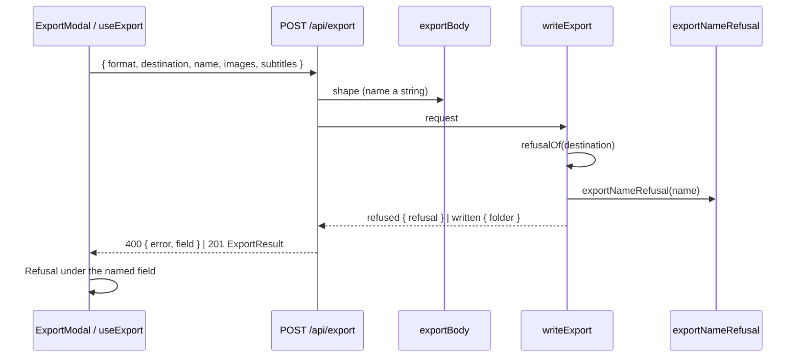

# 36 — Export name

> **Initiative:** `export-name`
> **PRD:** `docs/PRDs/36-export-name.md` (#294)
> **Plan:** `docs/PRDs/36-export-name-plan.md` (to be written)

This log is the `grill-me` session that settled step 19 of the build order,
the fourth step of the third chain (`32-third-chain.md`, Q6a). It was held
before the PRD was written, against the code as it stood on 2026-10-10 after
step 18's refactor (`a49dbed`), and it is an immutable snapshot of that
moment. The session ran alone, and the maintainer approved every
recommendation in advance. Their brief: _export-name. do this one alone, i
approve all your recommendations. keep in mind, we want to keep the codebase
consistent with our naming and code conventions/patterns/architecture._

## Background

Log 32 Q6a settled the rule. The name row's text becomes a mono `TextField`,
prefilled with today's `familyflix-collection_DD-MM-YYYY` and never
overwritten once edited (the _Save to_ rule). `StartExport` gains `name`. The
route refuses an empty name, or one a folder cannot be called, each with a
sentence. It never silently strips characters. A name already taken is still
numbered.

Here is what the code does today:

- `ExportModal` draws the name row as `NameRow`, a `bg2` card holding
  `NameLead` (the folder glyph and `ExportName`, a mono span of
  `summary?.folderName`) and `Count` (`N titles` in the accent), at
  `space-between`. The prototype draws the same (`feat.ExportModal.dc.html`,
  around line 258).
- `useExport` fills _Save to_ from `summary.defaultDestination` unless
  `edited.current`, and holds one `refusal: string | null`, drawn under
  _Save to_. It is kept until the next press.
- `startExport` turns any `400` with an `error` into
  `{ kind: 'refused', sentence }`.
- `exportBody` checks the body's shape: an object, a known format, a string
  destination, two booleans. Whether the destination is usable is
  `writeExport`'s question.
- `writeExport` checks the destination with `refusalOf` (`relative`,
  `missing`, `read-only`), then names the folder `exportName(now)`.
  `makeFolder` numbers a taken name `name (1)`, and `writeSheet` names the
  sheet after the same `name`. The route words each `ExportRefusal` through
  `EXPORT_REFUSALS: Record<ExportRefusal, { status, error }>`.
- `exportName(now)` in `import-export/exportName/` is the one spelling of the
  dated name. `exportSummary` hands it out as `ExportSummary.folderName`.
- There is a precedent for a refusal that names its field. `POST /api/import`
  answers `400 { error, field: 'sheet' | 'root' }`, `ImportField` is typed in
  `src/types/import.ts`, and the screen draws the sentence under that field.
- `safeFilename` in `media/` is the other check between a typed string and a
  `join`. It _strips_, because a picked file's name came off another machine.
  Log 32 rules that out for a name the maintainer typed.

## Problem

The maintainer cannot name the Export folder. Every export is called
`familyflix-collection_DD-MM-YYYY`, so two exports on one day become `… (1)`,
and a copy made for a relative reads as a dated backup. Making the name a
field means deciding where it sits, what fills it, which names are refused,
who refuses them, and how a refusal finds its field. None of that may bend a
rule the Export already keeps.

## Questions and Answers

**Q1. Where does the name sit in the dialog?**
✅ A _Folder name_ section, in the shape of _Save to_. Its heading is a
`SectionLabel` in a `LabelRow` at `space-between`, with the `Count` (`142
titles`) at its right end, absent until the summary lands as today. Under it
is the `TextField` primitive: the folder glyph, `mono`, `rounded={false}`,
`aria-label="Folder name"`, `placeholder` `EXPORT_NAME_PREFIX`. Under that is
the name's refusal. `NameRow`, `NameLead` and `ExportName` retire.
❌ An inline input inside the old `NameRow` card. That is a one-off styled
input where a primitive exists.
❌ The count dropped. It is the one place the dialog says how much is about
to be written.

**Q2. What fills the field?**
✅ `summary.defaultName`, once it lands, unless the field was edited first.
This is _Save to_'s rule, with its own `nameEdited` ref beside `edited`
(renamed `destinationEdited`). Every open resets both fields. The summary's
`folderName` is renamed `defaultName`, so the summary carries its two
defaults as `defaultDestination` and `defaultName`.
❌ Keeping `folderName`. Once the name can be changed, the summary's value
is a default, and the two defaults should read alike.

**Q3. What does the wire carry?**
✅ `StartExport.name: string`. `exportBody` checks only that it is a string,
just as it checks `destination`. A non-string is a malformed body: a `400`
with a sentence and no field, which a client of ours never sends.
❌ Validating the name in `exportBody`. That unit reads a body's shape, and
what a folder may be called is the domain's rule (its comment already hands
the destination's checks to `writeExport`).

**Q4. Which names are refused, and where is that rule?**
✅ `exportNameRefusal(name)` in `import-export/exportName/`, beside the
writer `exportName(now)`. This is `yearSpan` and `episodeTag`'s precedent of
reader beside writer. It is pure and answers `null` or an
`ExportNameRefusal`, checked in this order:

| Kind            | When                                                                                     |
| --------------- | ---------------------------------------------------------------------------------------- |
| `unnamed`       | empty, or whitespace only                                                                |
| `too-long`      | over 200 characters                                                                      |
| `bad-character` | any of `< > : " / \ \| ? *`, or a control character                                      |
| `bad-ending`    | ends in a space or a dot (`.` and `..` among them)                                       |
| `reserved`      | `CON`, `PRN`, `AUX`, `NUL`, `COM1`–`COM9`, `LPT1`–`LPT9`, any case, before any extension |

Windows' rules apply on every platform. The app ships on Windows only, and one
rule keeps the suites deterministic. 200 characters leaves room under the 255
a name may have for ` (999)` and the sheet's `-episodes.csv`. Nothing is
stripped or trimmed. The check is the only thing between a typed string and a
`join` under the destination: a separator is `bad-character` and `..` is
`bad-ending`, so the folder can only ever be made directly inside the
destination.
❌ Sanitising with `safeFilename`. It strips silently, which log 32 rules out,
and it guards a file inside a Movie folder, not a folder a person named.
❌ Trimming. `Movies ` is refused as `bad-ending`, not quietly made into
`Movies`.

**Q5. In what order, and how is each worded?**
✅ `writeExport` checks the destination first and the name second, top to
bottom as the dialog draws them, so a body wrong in both earns _Save to_'s
sentence (`exportBody`'s rule of the first sentence). `ExportRefusal` grows by
the five name kinds, and `EXPORT_REFUSALS` gains a `field` on every entry:

| Refusal         | Field         | Sentence                                            |
| --------------- | ------------- | --------------------------------------------------- |
| `relative`      | `destination` | Type the full path, starting with a drive letter.   |
| `missing`       | `destination` | No folder at that path.                             |
| `read-only`     | `destination` | FamilyFlix can't write to that folder.              |
| `unnamed`       | `name`        | Give the export folder a name.                      |
| `too-long`      | `name`        | Keep the name under 200 characters.                 |
| `bad-character` | `name`        | A folder name can't use < > : " / \ \| ? or \*.     |
| `bad-ending`    | `name`        | A folder name can't end in a space or a dot.        |
| `reserved`      | `name`        | Windows keeps that name for itself. Choose another. |

The route answers `400 { error, field }`, `/api/import`'s shape.
`ExportField = 'destination' | 'name'` is typed in `src/types/export.ts`, as
`ImportField` is in `import.ts`.

**Q6. How does the dialog draw a refusal?**
✅ `startExport` answers `{ kind: 'refused'; field: ExportField; sentence }`
for a `400` that names a known field. A `400` without one is treated like any
other failure: the dialog is left as it was. `useExport` holds one
`refusal: { field: ExportField; sentence: string } | null`, because the route
names one field at a time. It is kept until the next press, which is today's
rule, unchanged. `ExportModal` draws `Refusal` under the field it names.
❌ Checking the name in the client too. The rule would be spelled twice and
could drift. The route is the one place a name is refused.
❌ Clearing a refusal on the next edit (ImportFlow's rule). The Export's own
rule is the nearer precedent, and changing it is not this step's job.

**Q7. What do numbering, the sheet and Export ready do?**
✅ Nothing new. `makeFolder(destination, request.name)` still numbers a
taken name `name (1)`. `writeSheet` names the sheet after the name asked for,
as it does with the dated one today. _Export ready_ still shows the folder
actually made, through `folderNameOf(result.folder)`. `exportName(now)` keeps
its one caller, `exportSummary`. `writeExport` stops reading the clock and
loses its `now` parameter.

**Q8. What does the prototype say?**
✅ It is revised in the same issue, before the code. In
`feat.ExportModal.dc.html`, the name row becomes the _Folder name_ section:
the label row with the count, the `prim.TextField` import (`icon="folder"`,
mono, not rounded, `on-input="{{ data.onName }}"`), and an `sc-if` on
`data.nameRefused` over the danger sentence. _Save to_'s `sc-if` reads
`data.destinationRefused`. `COMPONENT-SPEC.md`'s ExportModal entry and its
`folderName` become `name` and `defaultName`. `FamilyFlix.dc.html` composes
the dialog, so it follows with no edit of its own.

**Q9. How is it tested?**
✅ Every unit gets a suite in its own folder:

- `exportName.test.ts`: each kind at its edge (200 passes and 201 is
  `too-long`; `con.txt` and `Lpt9` are `reserved`, `CONSOLE` is not; `..` is
  `bad-ending`; `a/b`, `a\b` and a tab are `bad-character`), and the dated
  name and `Heat (1995) – kopia` both `null`.
- `exportBody.test.ts`: `name` carried, and a non-string refused.
- `writeExport` suites: the folder and the sheet take `request.name`; a taken
  name is numbered; a bad name makes nothing; a destination refusal wins over
  a name refusal.
- `routes.export.test.ts`: `400 { error, field }` for one refusal of each
  field, and the summary's `defaultName`.
- `api.test.ts`: `field` read off a `400`, and a `400` without one rejecting.
- `useExport` suites: the prefill, `defaultName` never over a typed name, the
  name sent, the refusal's field.
- `ExportModal` suites: the field after _Save to_ (`comesBefore`), the count
  in its label row, each refusal under its own field.

**Q10. How is it shipped?**
✅ As one issue with two commits. First, a `refactor:` commit renames
`ExportSummary.folderName` to `defaultName` with no change in behaviour. Then
the `feat:` slice adds the prototype revision, `exportNameRefusal`, the body,
the writer, the route's fields, the client and the dialog.

## Design

### Types — `src/types/export.ts`

```ts
/** The two fields of the Export dialog a refusal can name. */
export type ExportField = 'destination' | 'name';

export interface ExportSummary {
  movieCount: number;
  seriesCount: number;
  episodeCount: number;
  defaultDestination: string;
  /** Today's Export name — what the name field starts at. */
  defaultName: string; // was folderName
}

export interface StartExport {
  format: ExportFormat;
  destination: string;
  /** The Export name asked for; numbered by the server when taken. */
  name: string;
  images: boolean;
  subtitles: boolean;
}
```

### Server

```ts
// import-export/exportName/exportName.ts
export type ExportNameRefusal =
  | 'unnamed'
  | 'too-long'
  | 'bad-character'
  | 'bad-ending'
  | 'reserved';
export function exportName(now: Date): string; // unchanged
export function exportNameRefusal(name: string): ExportNameRefusal | null;

// import-export/writeExport/writeExport.ts
export type ExportRefusal =
  | 'relative'
  | 'missing'
  | 'read-only'
  | ExportNameRefusal;
export function writeExport(
  media: Media,
  request: StartExport,
  content: ExportContent
): Promise<ExportOutcome>; // `now` gone

// routes/index.ts
const EXPORT_REFUSALS: Record<
  ExportRefusal,
  { status: number; field: ExportField; error: string }
>;
```

### Client

```ts
// features/import-export/api/api.ts
export type StartExportOutcome =
  | { kind: 'written'; result: ExportResult }
  | { kind: 'refused'; field: ExportField; sentence: string };

// features/import-export/useExport/useExport.ts — ExportState gains
name: string;
setName: (name: string) => void; // marks the name edited
refusal: { field: ExportField; sentence: string } | null; // was string | null
```

### Where things live

| Layer    | File                                         | Change                                                 |
| -------- | -------------------------------------------- | ------------------------------------------------------ |
| Types    | `src/types/export.ts`                        | `ExportField`, `StartExport.name`, `defaultName`       |
| Server   | `import-export/exportName/`                  | `exportNameRefusal` beside `exportName`                |
| Server   | `import-export/exportSummary/`               | `defaultName`                                          |
| Server   | `routes/exportBody/`                         | `name` read as a string                                |
| Server   | `import-export/writeExport/`                 | the name checked after the destination, used, no `now` |
| Server   | `routes/index.ts`                            | `field` on `EXPORT_REFUSALS`, `400 { error, field }`   |
| Frontend | `features/import-export/api/`                | `startExport` reads `field`                            |
| Frontend | `features/import-export/useExport/`          | `name`, `setName`, `nameEdited`, the fielded refusal   |
| Frontend | `features/import-export/ExportModal/`        | the _Folder name_ section; `NameRow` & co. retire      |
| Docs     | `feat.ExportModal.dc.html`, `COMPONENT-SPEC` | the section, `onName`, the two refusals                |



## Implementation Plan

1. **Rename `folderName` to `defaultName`.** A `refactor:` commit with no
   change in behaviour, through the type, `exportSummary`, the dialog, the
   hook and their suites.
2. **The whole slice.** Revise the prototype first. Then add
   `exportNameRefusal` and its suite, `name` on the wire and through
   `writeExport`, the fielded `EXPORT_REFUSALS`, `startExport`'s field, the
   hook's name and refusal, and the _Folder name_ section.

## Trade-offs

- **Easier:** an export can be named for whoever it is for, two exports in a
  day can be told apart without `(1)`, and the route now tells the dialog
  which field a refusal is about, so a third field would cost one entry.
- **Harder:** the name is a security boundary in its own right. The `join`
  under the destination is safe only because `exportNameRefusal` refuses every
  separator and every dot-only name, so that check must never relax into
  stripping. Windows' rules refuse a few names other platforms allow, which
  costs nothing on a Windows-only app.
- **Out of scope:** remembering a name between opens (_Save to_ is not
  remembered either); a name template or date tokens; renaming an Export
  folder after it is written; checking the name as it is typed; a name for
  the sheet that differs from the folder's.
