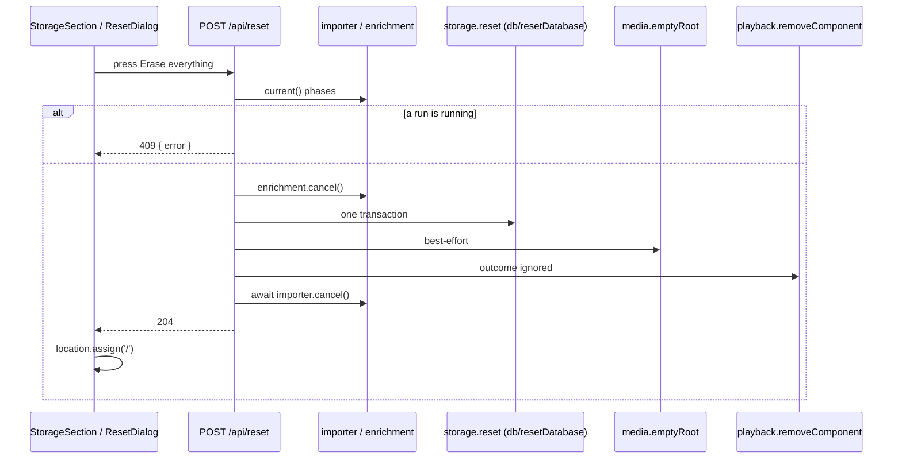

# 37 — Factory reset

> **Initiative:** `factory-reset`
> **PRD:** `docs/PRDs/37-factory-reset.md` (to be written)
> **Plan:** `docs/PRDs/37-factory-reset-plan.md` (to be written)

This log is the `grill-me` session that settled step 20 of the build order,
the fifth step of the third chain (`32-third-chain.md`, §3). It was held
before the PRD was written, against the code as it stood on 2026-10-10 after
step 19's refactor (`6d0a749`), and it is an immutable snapshot of that
moment. The session ran alone, and the maintainer approved every
recommendation in advance. Their brief: _factory-reset. do this one alone, i
approve all your recommendations. keep in mind, we want to keep the codebase
consistent with our naming and code conventions/patterns/architecture._

## Background

Log 32 Q3a–Q3e settled the rule:

- **What goes:** every row of every table, the **Library folders** list and
  every setting (the TMDB key included); the managed media directory's
  contents; an uploaded **Playback component**. **What stays:** the Library
  folders on disk and everything in them, every Export folder, the Shell log,
  the installed app.
- The last row of the Storage card, under a divider, with a `danger` `sm`
  Button, opening the **Reset dialog** (the Delete dialog's precedent).
- `POST /api/reset` → `204`, or `409` with a sentence while an import or a
  Sync is running; a run waiting in review is let go. The database in one
  transaction first, then the media root emptied best-effort, then the slot.
- Then a full reload onto `/`, a **Fresh home**.

Here is what the code does today:

- `db/index.ts` opens the database and runs `migrations.ts`. Ten tables:
  `movies`, `genres`, `movie_genres`, `subtitles`, `settings`, `series`,
  `episodes`, `series_genres`, `episode_subtitles`, `library_folders`. Only
  migration 1 ever writes `genres` (the twelve-name pool, `randomUUID()` ids).
  Every id is a UUID; no table is `AUTOINCREMENT`.
- The router never sees `db/`. It reaches SQLite through `LibraryStorage`
  (`library/index.ts`), whose `close()` is a member over the raw handle.
- `createMedia` has three removals: `removeFolder` (a rollback, throws),
  `removeFile` and `removeMovieFolder` (best-effort, swallow). All check
  containment on the resolved path through `containedFolder` /
  `mediaFilePath`.
- `Playback.removeComponent()` is `slot.remove()`: `{ ok: true }` or a
  `RemoveRefusal` — `nothing-uploaded`, `in-use`, `failed`. Never throws.
- `Importer.current()` carries `phase: 'scanning' | 'importing' | 'review'`;
  `cancel()` is async and awaits any rollback. `Enrichment.current()` carries
  `phase: 'running' | 'review'`; `cancel()` is sync. `orderedShutdown` calls
  both.
- `DELETE /api/movies/:id` composes two domains in the route:
  `storage.deleteMovie`, then `media.removeMovieFolder`.
- `Modal` focuses the card itself on open, "to no button, so a reflexive
  Enter does nothing". `DeleteMovieDialog` draws confirm first, then Cancel,
  and swallows a refused delete.
- `StorageSection` draws the folder line (with _Open folder_ when the bridge
  exists) and the space line. `section.styles.ts` has `Divider`, `Row`,
  `RowTitle`, `RowDesc`.
- `features/settings/api/` holds the Settings calls; `saveTmdbKey` answers a
  discriminated outcome.
- `localStorage` holds two per-device keys: the player's volume and
  `seenVersion` (Software update).
- The glossary's **Fresh home** is "two exceptions, named, and nothing else"
  — _Add to library_ and Import's _Finish_.
- The prototype draws no reset. `page.SettingsPage.dc.html`'s Storage card
  ends at the space line.

## Problem

The maintainer cannot start over without finding `%APPDATA%\FamilyFlix\`
and deleting it by hand. Log 32 settled what a reset is. What is left is
where each half lives, what the erase does at its edges (the genre pool, a
future table, a locked file, a run in flight), how the dialog keeps to the
codebase's existing dialog, and how the app comes back afterwards.

## Questions and Answers

**Q1. What does `resetDatabase` erase, and is the genre pool re-seeded?**
✅ Every row of every table but `genres`, in one transaction, in
`server/src/db/resetDatabase/` with its suite (the `seriesSeed/` precedent
of a unit under `db/`). The pool is **kept, not re-seeded**: nothing has
written `genres` since migration 1, so a delete and re-insert would only mint
new ids for the same twelve names. The database that results is a fresh one
by content. Two lists spell the rule: `ERASED_TABLES` in child-first order
(`movie_genres`, `subtitles`, `series_genres`, `episode_subtitles`,
`episodes`, `movies`, `series`, `library_folders`, `settings`) and
`KEPT_TABLES` (`genres`). A guard in the suite reads `sqlite_master` after
every migration and fails when a table is in neither, so a future migration's
table cannot be forgotten. `user_version` is untouched.
❌ Re-seeding the pool as log 32 Q3a worded it: the same result with churned
ids. ❌ Reading the table list off `sqlite_master` at run time: a new table
would be erased without anyone deciding it should be. ❌ `VACUUM`: it cannot
run in the transaction, and nothing in the app shows the file's size.

**Q2. How does the route reach it?**
✅ `LibraryStorage` gains `reset(): void`, which hands over to
`resetDatabase(db)` — the seam `close()` already is. The router keeps never
touching `db/`.

**Q3. How is the media root emptied?**
✅ `Media.emptyRoot(): void`, a fourth removal. It removes each entry
directly inside the root, each best-effort on its own (`rmSync`, recursive,
swallowed), so one locked video does not keep the rest. The root itself
stays: the Storage card shows it and _Open folder_ opens it. A missing root
is nothing to do. `rmSync` removes a symlink as a link and never follows it,
so nothing outside the root can go.

**Q4. The route: its refusals and its order?**
✅ `POST /api/reset`:

1. `409 { error }` when `importer.current()?.phase` is `scanning` or
   `importing`: _An import is running. Stop it before erasing everything._
2. `409 { error }` when `enrichment.current()?.phase` is `running`: _A sync
   is running. Stop it before erasing everything._
3. `enrichment.cancel()` — a Sync in review is let go.
4. `storage.reset()` — the transaction.
5. `media.emptyRoot()` — best-effort.
6. `playback.removeComponent()` — its outcome ignored: `nothing-uploaded`
   is the usual answer, and `in-use` or `failed` leaves an uploaded pair the
   Codecs page still shows with its ✕.
7. `await importer.cancel()` — an import in review is let go.
8. `204`.

Steps 1–6 are synchronous, so no request can land between the check and the
erase. The one `await` comes last, over a run that is only waiting. The route
composes the domains itself, `DELETE /movies/:id`'s precedent.
❌ A `factoryReset(world)` unit beside `orderedShutdown`: `shell/` is the
process lifecycle, no domain owns all five calls, and a unit would be a
`services/` by another name.

**Q5. The Storage card's row?**
✅ A `Divider` after the space line, then a `Row $last`: `RowTitle`
_Factory reset_ over `RowDesc` _Erase every title, watch history and
setting, and empty the media folder. Your own folders are not touched._ (log
32 Q3b's line), and a `danger` `sm` Button _Reset…_ — the ellipsis that says
a dialog follows (_Browse…_). It is a control, not a read: drawn before the
report lands and in a browser too (_Open folder_'s rule, without its
bridge). `StorageSection` owns the dialog's `open` state.

**Q6. The Reset dialog?**
✅ `features/settings/ResetDialog/`, three files, on `Modal`:

- `title` _Erase everything?_, `subtitle` _This can't be undone._, `icon`
  `BangTriangleIcon` (decorative, as every Modal icon is).
- Two lists, each a small heading over a `ul`:
  - **What goes** — _Every title, with its watch history, ratings and
    hearts_ · _The library folders list_ · _Every setting, the TMDB key
    included_ · _Everything in the media folder_ · _An uploaded playback
    component_
  - **What stays** — _Your library folders and every file in them_ · _Your
    exports_ · _FamilyFlix itself_
- The refusal sentence, danger ink, above the buttons, when there is one.
- _Erase everything_ (`danger`, _Erasing…_ and disabled in flight), then
  _Cancel_ (`secondary`).

Two refinements of log 32 Q3c, for consistency with the code: **focus stays
on the card** — `Modal`'s rule already makes a stray Enter do nothing, which
is what Q3c wanted from focusing _Cancel_ — and **confirm comes first**, the
Delete dialog's order.
❌ An `initialFocus` prop on `Modal`: a second focus rule for one caller.
❌ Type-to-confirm (log 32).

**Q7. The client wire and the hook?**
✅ `factoryReset()` in `features/settings/api/` (one caller):
`{ kind: 'reset' }` for a `204`, `{ kind: 'refused'; sentence }` for a `409`
with an `error`, and a rejection for anything else. `useFactoryReset()` in
`features/settings/useFactoryReset/` answers `{ resetting, refusal, reset }`.
A refusal is held until the next press (the Export's rule). A rejection
leaves the dialog as it was, with the button live again (the Delete dialog's
rule).

**Q8. What happens after?**
✅ `window.location.assign('/')`: a push and a full reload, so every provider
— the display preference, the Snackbar stack — starts from nothing, and the
library reads _Your library is empty_. It is the **third Fresh home**.
`will-navigate` allows it: `/` is on the app's own origin (`isAppUrl`). The
two `localStorage` keys stay; volume and the last-seen version belong to the
device, not the library. Tests stub it through a new
`src/test-support/stubLocation/`, the `stubScrollTo` precedent for a browser
call jsdom does not perform.
❌ `location.replace('/')`: a Fresh home is a push (glossary). ❌ A
`navigate('/')` without reload: every provider would keep what it read
before the erase.

**Q9. Prototype, tests and shipping?**
✅ The prototype first: `page.SettingsPage.dc.html` gains the divider, the
row and the dialog in an `sc-if`; `COMPONENT-SPEC.md` gains a ResetDialog
entry. Suites, each beside its unit:

- `resetDatabase.test.ts`: every erased table empty, `genres` holding the
  same twelve ids; the table guard; atomicity — a `RAISE(ABORT)` trigger on
  the last table leaves every row in place.
- `createMedia.test.ts`: `emptyRoot` empties and keeps the root; a missing
  root is nothing; a symlink's target survives.
- `routes.reset.test.ts`: `204` over a filled library, media and an uploaded
  component, then `/api/home` empty, the root empty, the component gone; each
  `409` (a held copy, a held TMDB call); a review run of each kind let go.
- `api.test.ts`, `useFactoryReset.test.tsx`, `ResetDialog.test.tsx`,
  `StorageSection.test.tsx`: the outcomes; the reload; the copy, the lists,
  the refusal, _Erasing…_; the row after the divider (`comesBefore`) opening
  the dialog.

One PRD, two issues: the wire (`resetDatabase`, `emptyRoot`, the route),
then the surface (the prototype revision, the row, the dialog, the reload).

## Design

### Server

```ts
// db/resetDatabase/resetDatabase.ts
export const ERASED_TABLES: readonly string[]; // child-first
export const KEPT_TABLES: readonly string[]; // ['genres']
export function resetDatabase(db: SqliteDatabase): void; // one transaction

// library/index.ts — LibraryStorage gains
/** Erase every row FamilyFlix wrote; the Genre pool stays. */
reset(): void;

// media/createMedia/createMedia.ts — Media gains
/** Remove everything inside the media root, best-effort; the root stays. */
emptyRoot(): void;

// routes/index.ts
router.post('/reset', async (_req, res) => { /* Q4's eight steps */ });
```

### Client

```ts
// features/settings/api/api.ts
export type FactoryResetOutcome =
  | { kind: 'reset' }
  | { kind: 'refused'; sentence: string };
export function factoryReset(): Promise<FactoryResetOutcome>;

// features/settings/useFactoryReset/useFactoryReset.ts
export interface FactoryReset {
  resetting: boolean;
  refusal: string | null;
  reset: () => Promise<void>; // reloads onto '/' on success
}
```



### Where things live

| Layer        | File                                          | Change                                         |
| ------------ | --------------------------------------------- | ---------------------------------------------- |
| Server       | `db/resetDatabase/`                           | new: the two lists, the transaction, the guard |
| Server       | `library/index.ts`                            | `reset()`                                      |
| Server       | `media/createMedia/`                          | `emptyRoot()`                                  |
| Server       | `routes/index.ts`                             | `POST /reset`                                  |
| Frontend     | `features/settings/api/`                      | `factoryReset`                                 |
| Frontend     | `features/settings/useFactoryReset/`          | new hook                                       |
| Frontend     | `features/settings/ResetDialog/`              | new organism                                   |
| Frontend     | `features/settings/StorageSection/`           | the divider, the row, the dialog's state       |
| Test support | `src/test-support/stubLocation/`              | new, if jsdom needs it                         |
| Docs         | `page.SettingsPage.dc.html`, `COMPONENT-SPEC` | the row and the dialog                         |

## Implementation Plan

1. **The wire.** `resetDatabase` and its guard, `storage.reset()`,
   `media.emptyRoot()`, `POST /api/reset` with both `409`s. Verifiable with a
   request alone.
2. **The surface.** The prototype revision first; then `factoryReset`,
   `useFactoryReset`, `ResetDialog`, the Storage card's row and the reload.

## Trade-offs

- **Easier:** a maintainer can start over from Settings without knowing
  where `%APPDATA%` is; a future table cannot slip past the reset unnoticed.
- **Harder:** every migration that adds a table now also decides whether a
  reset erases it — that is the guard's point. The reset is the one route
  that reaches four domains at once, and its order is load-bearing: database
  first, so a failure leaves at worst stranded files Space used will show,
  never rows pointing at nothing.
- **Out of scope:** resetting part of the library; clearing the device's
  `localStorage`; a backup before erasing (the Roadmap's **Back up the
  library**); touching any Library folder, Export folder or the Shell log;
  shrinking the database file.
